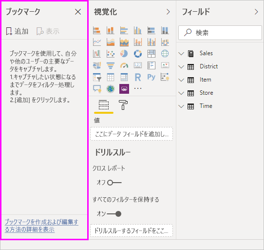
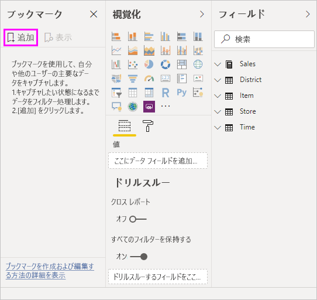
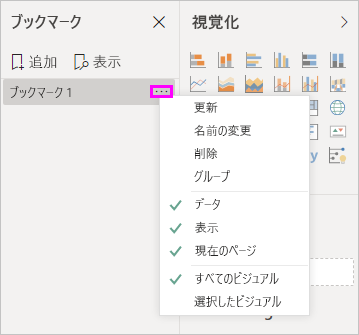
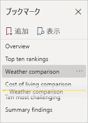
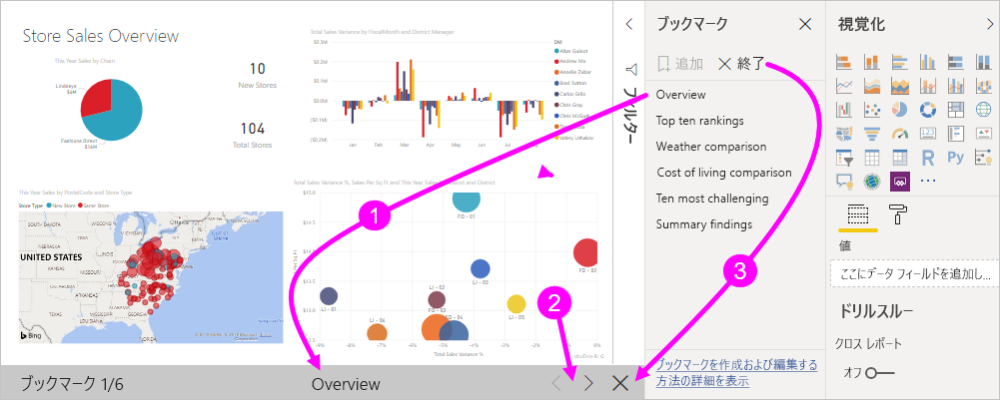
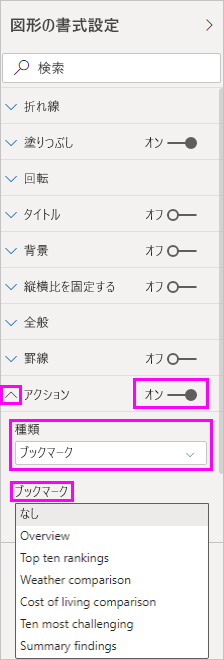
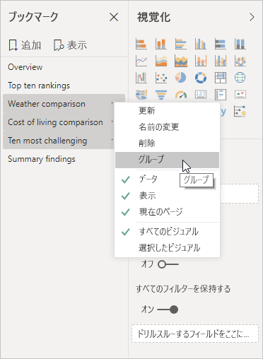
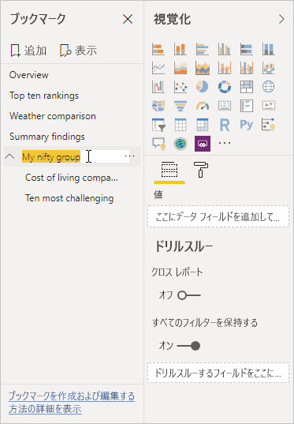

# Power BI Desktop でブックマークを作成して分析情報を共有し、ストーリーを作成する
Power BI Desktop で "*ブックマーク*" を使用して、フィルター処理やビジュアルの状態など、レポート ページの現在構成されているビューをキャプチャします。 その後、保存したブックマークを選択することで、その状態に戻ることができます。 

また、ブックマークのコレクションを作成して適切な順序に並べ替えた後、プレゼンテーションで各ブックマークを順番に表示することで、一連の詳細情報や、ビジュアルとレポートを使って伝えたいストーリーを強調することができます。 

ブックマークには多くの用途があります。 たとえば、ブックマークを使ってレポート作成の進行状況を追跡したり (ブックマークは簡単に追加、削除、名前変更できます)、ブックマークを順番に表示する PowerPoint のようなプレゼンテーションを作成し、レポートでストーリーを伝えたりすることができます。 

> [!TIP]
> Power BI サービスでの個人用ブックマークの使用については、「[Power BI サービスでの個人用ブックマークのお知らせ](https://powerbi.microsoft.com/blog/announcing-personal-bookmarks-in-the-power-bi-service/)」をご覧ください。 

## ブックマークの使用
ブックマークを使うには、Power BI Desktop のリボンで **[表示]** タブを選択し、 **[ブックマーク ウィンドウ]** をオンにします。 

![[ブックマーク] ペインを表示する](media/desktop-bookmarks/bookmarks_03.png)

ブックマークを作成すると、次の要素がブックマークと共に保存されます。

* 現在のページ
* フィルター
* スライサー、スライサーの種類 (たとえば、ドロップダウンまたはリスト) とスライサーの状態を含みます
* ビジュアルの選択状態 (クロス強調表示フィルターなど)
* 並べ替え順序
* ドリルの場所
* オブジェクトの表示 ( **[選択]** ペインを使用)
* 表示されているオブジェクトのフォーカスまたは **Spotlight** モード

ブックマークで表示するレポート ページを構成します。 意図したとおりにレポート ページとビジュアルを配置できたら、 **[ブックマーク]** ペインの **[追加]** を選択して、ブックマークを追加します。 

Power BI Desktop により、ブックマークが作成されて、一般的な名前が付けられます。 ブックマークの名前の横にある省略記号を選択し、表示されるメニューでアクションを選択することにより、ブックマークの **名前の変更**、**削除**、**更新** を簡単に行うことができます。

ブックマークを作成した後は、 **[ブックマーク]** ペインでブックマークを選択して表示します。 

フィルターやスライサーなどの **[データ]** プロパティ、スポットライトとその可視性などの **[ディスプレイ]** プロパティ、およびブックマークを追加したときに表示されていたページを提供する **[現在のページ]** の変更を、各ブックマークを適用するかどうかを選択することもできます。 これらの機能は、ブックマークを使用してレポートのビューやビジュアルの選択を切り替えるときに便利です。このような場合、ユーザーがブックマークを選択してビューを切り替えるときにフィルターがリセットされないように、データ プロパティをオフにしたいことがあります。 

このような変更を行うには、ブックマークの名前の横にある省略記号を選択し、 **[データ]** 、 **[ディスプレイ]** 、その他のコントロールの横にあるチェックマークをオンまたはオフにします。 

## ブックマークの並べ替え
ブックマークを作成した順序が、対象ユーザーに表示したい順序と異なっていることがあります。 問題ありません。ブックマークの順序は簡単に変更できます。

- **[ブックマーク]** ペインで、ブックマークをドラッグ アンド ドロップして順序を変更します。 

   ブックマークの間の黄色のバーは、ドラッグしたブックマークが配置される位置を示します。

   

次のセクションで説明するように、ブックマークの順序はブックマークの **[ビュー]** 機能を使うときに重要になります。

## スライド ショーとしてのブックマーク
順番に表示したいブックマークのコレクションがあるときは、 **[ブックマーク]** ウィンドウの **[表示]** を選んでスライド ショーを始めることができます。

**ビュー** モードのときに注意する機能がいくつかあります。

   

1. ブックマークの名前は、キャンバスの下部にあるブックマークのタイトル バーに表示されます。

2. ブックマークのタイトル バーにある矢印を使って、次または前のブックマークに移動できます。

3. **ビュー** モードを終了するには、 **[ブックマーク]** ペインの **[終了]** を選択するか、ブックマークのタイトル バーにある **[X]** を選択します。 

**ビュー** モードのときは、 **[ブックマーク]** ペインの **[X]** を選択してペインを閉じ、プレゼンテーション用のスペースを大きくすることができます。 また、**ビュー** モードのときは、すべてのビジュアルが対話形式になり、直接操作するのと同様に、クロス強調表示に使用できます。 

## 表示: [選択項目] ペインの使用
**[ブックマーク]** ペイント関連して、 **[選択項目]** ペインでは、現在のページにあるすべてのオブジェクトの一覧が表示され、オブジェクトを選択したり、オブジェクトを表示するかどうかを指定したりできます。 

![[選択] ウィンドウを有効にする](media/desktop-bookmarks/bookmarks_08.png)

**[選択項目]** ペインで、オブジェクトを選択し、オブジェクトの右側にある目のアイコンを選択して、オブジェクトを現在表示するかどうかを切り替えます。 

ブックマークを追加すると、 **[選択項目]** ウィンドウでの設定に基づく各オブジェクトの表示状態も保存されます。 

注意すべき重要な点は、オブジェクトの表示状態に関係なく、レポート ページは引き続きスライサーによってフィルター処理されるということです。 そのため、スライサーの設定を変えて異なるブックマークを作成し、さまざまなブックマークを使って 1 つのレポート ページの表示を変化させる (および、異なる詳細情報を強調表示する) ことができます。

> [!NOTE]
> **[選択項目]** ペインをブックマークと組み合わせて使用している場合、選択項目の表示を変更すると、表示が既定の設定に戻ります。 このような変更を行った後は、ブックマークを右クリックして *[更新]* を選択すると表示を更新できます。

## 図形と画像のブックマーク
図形や画像をブックマークにリンクすることもできます。 この機能を使うと、オブジェクトを選択すると、そのオブジェクトに関連付けられているブックマークが表示されます。 この機能は、ボタンを操作するときに特に便利です。 詳しくは、「[Power BI でボタンの使用](desktop-buttons.md)」をご覧ください。 

ブックマークをオブジェクトに割り当てるには: 

1. レポート キャンバスで、オブジェクトを選択します。 次に、表示される **[図形の書式設定]** ペインで、 **[アクション]** スライダーを **[オン]** にします。

2. **[アクション]** セクションを展開します。 **[種類]** で **[ブックマーク]** を選択します。

3. **[ブックマーク]** で、ブックマークを選択します。

   

オブジェクトにリンクされたブックマークではいろいろ面白いことができます。 レポート ページ上のコンテンツのビジュアル テーブルを作成したり、同じ情報の異なる表示 (ビジュアルの種類など) を提供したりすることができます。

編集モードになっている場合は、**Ctrl** キーを押して、それをフォローするためのリンクを選択します。 編集モードになっていない場合は、リンクをフォローするオブジェクトを選択します。 

## ブックマーク グループ

Power BI Desktop の 2018 年 8 月以降では、ブックマーク グループを作成して使用できます。 ブックマーク グループは、指定したブックマークのコレクションです。これはグループとして表示して整理できます。 

ブックマーク グループを作成するには: 
1. **Ctrl** キーを押しながら、グループに含めるブックマークを選択します。 

2. 選択したブックマークの横にある省略記号を選択し、表示されるメニューから **[グループ]** を選択します。

   

Power BI Desktop によって、グループに *Group 1* という名前が自動的に付けられます。 この名前の横にある省略記号を選択し、 **[名前の変更]** を選択して、名前を任意の名前に変更できます。

他のブックマーク グループと同様、ブックマーク グループの名前を展開すると、ブックマークのグループが展開されるか、折りたたまれるだけで、ブックマーク自体が表示されることはありません。 

ブックマークの **[ビュー]** 機能を使用するときは、以下の詳細が適用されます。

* ブックマークから **[表示]** を選択しているときに選択したブックマークがグループ内にある場合、*そのグループ内* のブックマークのみが表示中のセッションに示されます。 

* 選択したブックマークがグループに含まれていない場合、またはトップ レベル (ブックマーク グループの名前など) にある場合、すべてのグループ内のブックマークを含む、レポート全体のブックマークがすべて表示されます。 

ブックマークのグループ化を解除するには: 
1. グループ内の任意のブックマークを選択し、省略記号を選択します。 

2. 表示されたメニューから、 **[グループ化解除]** を選択します。

   

   グループの任意のブックマークに対して **[グループ化解除]** を選択すると、グループからすべてのブックマークが除外されます。グループは削除されますが、ブックマーク自体は削除されません。 

グループから 1 つのブックマークを削除するには: 
1. そのグループからいずれかのメンバーの **グループ化を解除する** と、グループ全体が削除されます。 

2. **Ctrl** キーを押しながら各ブックマークを選択して、新しいグループで必要なメンバーを選択し、 **[グループ]** をもう一度選択します。 

## スポットライトを使用する
ブックマークと共にリリースされたもう 1 つの機能は "*スポットライト*" です。 スポットライトを使用すると、たとえば **ビュー** モードでブックマークを提供するときに、特定のグラフに注目させることができます。

スポットライトとフォーカス モードの違いを比較しましょう。

1. フォーカス モードでは、ビジュアルの **[フォーカス モード]** アイコンを選択すると、ビジュアルがキャンバス全体に表示されます。

2. スポットライトでは、ビジュアルの省略記号から **[Spotlight]** を選択して、元のサイズで 1 つのビジュアルを強調表示すると、ページ上の他のすべてのビジュアルが透明近くまでフェードされます。 

前の図でビジュアルの **[フォーカス モード]** アイコンを選択すると、ページは次のように表示されます。

これに対し、ビジュアルの省略記号メニューで **[Spotlight]** を選択すると、ページは次のように表示されます。

ブックマークを追加するときに、フォーカス モードまたはスポットライト モードが選択されていた場合、ブックマークでそのモードが保持されます。

## Power BI サービスでのブックマーク
ブックマークを含むレポートを Power BI サービスに発行すると、Power BI サービスでブックマークを表示および操作できます。 レポートでブックマークを使用できるときは、 **[ビュー]**  >  **[選択ウィンドウ]** または **[ビュー]**  >  **[ブックマーク ウィンドウ]** を選択して、 **[選択]** ペインおよび **[ブックマーク]** ペインを表示します。 

![Power BI サービスで [ブックマーク] ウィンドウと [選択] ウィンドウを表示する](media/desktop-bookmarks/bookmarks_14.png)

Power BI サービスの **[ブックマーク]** ペインは Power BI Desktop と同じように動作するので、 **[ビュー]** をせんたくしてスライド ショーのようにブックマークを順番に表示できます。

ブックマーク間を移動するには、黒い矢印ではなく、グレーのブックマークのタイトル バーを使用します。 (黒い矢印は、ブックマークではなく、レポート ページ間を移動します)。

## ブックマークのプレビューを有効にする (2018 年 3 月より前のバージョン)
Power BI Desktop の 2018 年 3 月バージョン以降では、ブックマークが一般公開されています。 

常に最新のリリースにアップグレードすることをお勧めします。 ただし、お使いの Power BI Desktop がそのリリースより前のものであっても、ブックマーク機能は Power BI Desktop の 2017 年 10 月リリースから試すことができ、Power BI サービスでもブックマーク対応のサポートを使うことができます。 

ブックマークのプレビュー機能を有効にするには: 

1. **[ファイル]**  >  **[オプションと設定]**  >  **[オプション]**  >  **[プレビュー機能]** の順に選択し、 **[ブックマーク]** を選択します。 

   ![[オプション] ウィンドウでブックマークを有効にする](media/desktop-bookmarks/bookmarks_02.png)

2. ブックマークのプレビュー バージョンを有効にするには、Power BI Desktop を再起動します。

## 制限事項と考慮事項
このリリースのブックマーク機能には、注意すべきいくつかの制限事項と考慮事項があります。

* ほとんどの Power BI ビジュアルは、ブックマークでうまく機能します。 ただし、ブックマークとカスタム ビジュアルで問題が発生する場合は、そのカスタム ビジュアルの作成者に連絡して、ブックマークのサポートをそのビジュアルに追加するよう依頼してください。 
* ブックマークを作成した後でレポート ページにビジュアルを追加した場合、ビジュアルは既定の状態で表示されます。 つまり、前にブックマークを作成したページにスライサーを追加した場合、スライサーは既定の状態で動作します。
* ブックマークを作成した後でビジュアルを移動すると、ブックマークに自動的に反映されます。 

## 次の手順
ブックマークと似た機能またはブックマークと相互作用する機能の詳細については、次の記事をご覧ください。

* [Power BI Desktop でドリルスルーを使用する](desktop-drillthrough.md)
* [フォーカス モードでダッシュボード タイルまたはレポート ビジュアルを表示する](../consumer/end-user-focus.md)
