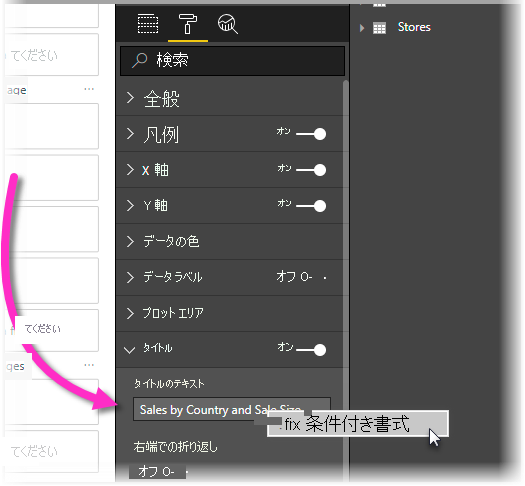

# <a name="expression-based-titles-in-power-bi-desktop"></a>Power BI Desktop の式に基づくタイトル

Power BI ビジュアルに対して、カスタマイズされた動的なタイトルを作成できます。 フィールド、変数、またはその他のプログラム要素に基づいて Data Analysis Expressions (DAX) を作成することで、ビジュアルのタイトルを必要に応じて自動的に調整できます。 これらの変更は、フィルター、選択、またはその他のユーザー操作と構成に基づいています。



動的なタイトル (*式に基づくタイトル* ともいう) の作成は簡単です。 

## <a name="create-a-field-for-your-title"></a>タイトルのフィールドを作成する

式に基づくタイトルを作成する最初の手順は、タイトルに使用するためにモデルでフィールドを作成することです。 

ビジュアルのタイトルに、伝えたい内容や表現したい内容を反映させるためのさまざまな創造的方法があります。 例をいくつか見てみましょう。

ビジュアルで製品のブランド名に対して受け取るフィルター コンテキストに基づいて変更される式を作成できます。 次の図は、このようなフィールドの DAX 式を示しています。


別の例では、ユーザーの言語またはカルチャに基づいて変更される動的なタイトルを使用します。 `USERCULTURE()` 関数を使用することで、DAX メジャーで言語固有のタイトルを作成できます。 この関数では、オペレーティング システムまたはブラウザーの設定に基づき、ユーザーのカルチャ コードが返されます。 次の DAX switch ステートメントを使用して、変換された正しい値を選択できます。 

```
SWITCH (
  USERCULTURE(),
  "de-DE", “Umsatz nach Produkt”,
  "fr-FR", “Ventes par produit”,
  “Sales by product”
)
```

または、すべての変換を含むルックアップ テーブルから文字列を取得することもできます。 そのテーブルをモデルに配置します。 

これらは、Power BI Desktop でビジュアルの式に基づく動的なタイトルを作成するために使用できるいくつかの例にすぎません。 タイトルでできることは、お客様の想像力とモデルで決まります。


## <a name="select-your-field-for-your-title"></a>タイトルのフィールドを選択する

モデルで作成するフィールドに対して DAX 式を作成した後、それをビジュアルのタイトルに適用する必要があります。

フィールドを選択して適用するには、 **[視覚化]** ウィンドウに移動します。 **[書式]** 領域で、 **[タイトル]** を選択してビジュアルのタイトル オプションを表示します。 

**[タイトルのテキスト]** を右クリックすると、コンテキスト メニューが表示され、 **[<em>fx</em>Conditional formatting]\(fx 条件付き書式\)** を選択できます。 そのメニュー項目を選択すると、 **[タイトル テキスト]** ダイアログボックスが表示されます。 

![[タイトル テキスト] ダイアログ ボックスのスクリーンショット](media/desktop-conditional-formatting-visual-titles/expression-based-title-02b.png)

このウィンドウから、タイトルに使用するために作成したフィールドを選択できます。

## <a name="limitations-and-considerations"></a>制限事項と考慮事項

ビジュアルの式に基づくタイトルの現在の実装にはいくつかの制限があります。

* 式に基づく書式設定は、現在、Python ビジュアル、R ビジュアル、または主要なインフルエンサーのビジュアルではサポートされていません。
* タイトルに対して作成するフィールドは、文字列データ型である必要があります。 数値や日付/時刻 (またはその他のデータ型) を返すメジャーは、現在、サポートされていません。
* ビジュアルをダッシュボードにピン留めすると、式に基づくタイトルが引き継がれません。

## <a name="next-steps"></a>次のステップ

この記事では、ユーザーがレポートを操作するときに変更される可能性がある動的フィールドにビジュアルのタイトルを変換する DAX 式を作成する方法について説明しました。 次の記事も役立つ場合があります。

* [テーブルでの条件付き書式設定](desktop-conditional-table-formatting.md)
* [Power BI Desktop でレポート間のドリルスルーを使用する](desktop-cross-report-drill-through.md)
* [Power BI Desktop でドリルスルーを使用する](desktop-drillthrough.md)
