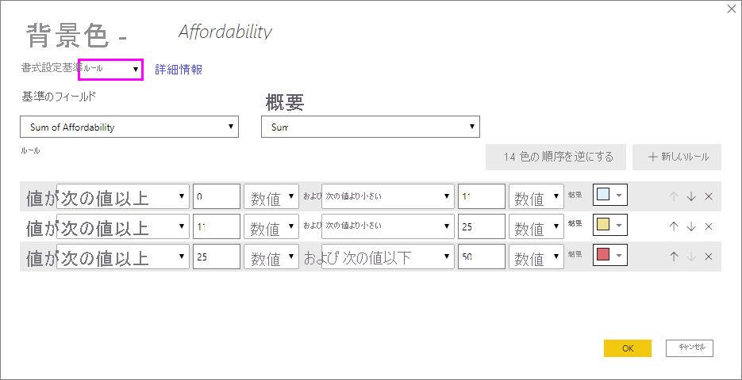

# テーブルでの条件付き書式の使用 

Power BI Desktop のテーブルで条件付き書式を使用すると、フィールド値に基づいて、色のグラデーションなど、カスタマイズしたセルの色を指定できます。 セル値は、データ バーや KPI アイコンを使用して、またはアクティブな Web リンクとして表すこともできます。 数値、色の名前や 16 進数コード、または Web URL の値が含まれるフィールドで書式設定を基準として使用していると、任意のテキストまたはデータ フィールドに条件付き書式を適用できます。 

条件付き書式を適用するには、Power BI Desktop で **テーブル** または **マトリックス** の視覚化を選択します。 **[視覚化]** ペインの **[フィールド]** セクションで、書式設定する **[値]** ウェルのフィールドの横にある下向き矢印を右クリックまたは選択します。 **[条件付き書式]** を選択してから、適用する書式設定の種類を選択します。

![[条件付き書式設定] メニュー](media/desktop-conditional-table-formatting/table-formatting-0-popup-menu.png)

> [!NOTE]
> 条件付き書式では、条件付きで書式設定されたセルに適用されるカスタムの背景またはフォントの色がオーバーライドされます。

視覚化から条件付き書式を削除するには、フィールドのドロップダウン メニューから **[条件付き書式の削除]** を選択して、削除する書式の種類を選択します。

![[条件付き書式の削除] メニュー](media/desktop-conditional-table-formatting/table-formatting-1-remove.png)

次のセクションでは、それぞれの条件付き書式設定オプションについて説明します。 1 つのテーブル列に複数のオプションを組み合わせることができます。

## 背景またはフォントの色を書式設定する

セルの背景またはフォントの色を書式設定するには、フィールドの **[条件付き書式]** を選択し、ドロップダウン メニューから **[背景色]** または **[フォントの色]** を選択します。 

**[背景色]** または **[フォントの色]** ダイアログ ボックスが開き、書式設定するフィールドの名前がタイトルに表示されます。 条件付き書式オプションを選択したら、 **[OK]** を選択します。 

![[背景色] ダイアログ ボックスと [フォントの色] ダイアログ ボックス](media/desktop-conditional-table-formatting/table-formatting-2-diverging.png)

**[背景色]** オプションと **[フォントの色]** オプションは同じですが、それぞれ、セルの背景色とフォントの色に影響します。 フィールドのフォントの色と背景色には、同じまたは別の条件付き書式を適用できます。 フィールドのフォントと背景を同じ色にした場合、そのフォントは背景と一体化して、テーブル列にはその色のみが表示されます。

## カラー スケールに基づく色

セルの背景またはフォントの色をカラー スケールに基づいて書式設定するには、 **[背景色]** または **[フォントの色]** ダイアログ ボックスの **[書式設定基準]** フィールドで、 **[カラー スケール]** を選択します。 **[フィールドに基づく]** で、書式設定の基準となるフィールドを選択します。 現在のフィールドまたは、モデル内の数値または色データが含まれる任意のフィールドで書式設定を基準として使用できます。 

**[概要]** で、選択したフィールドに使用する集計の種類を指定します。 **[既定の書式設定]** で、空白値に適用する書式を選択します。 

**[最小]** および **[最大]** で、最小と最大のフィールド値に基づいて配色を適用するか、入力するカスタム値に基づいて適用するかを選択します。 ドロップ ダウンから、最小値と最大値に適用する色の見本を選択します。 **[中央]** の値と色も指定する場合は、 **[左右逆方向]** チェック ボックスをオンにします。 

**Affordability** 列にカラー スケールの背景が書式設定されたテーブルの例を次に示します。

**Affordability** 列にカラー スケールのフォントが書式設定されたテーブルの例を次に示します。

## ルールに基づく色

セルの背景またはフォントの色をルールに基づいて書式設定するには、 **[背景色]** または **[フォントの色]** ダイアログ ボックスの **[書式設定基準]** フィールドで、 **[ルール]** を選択します。 ここでも、 **[フィールドに基づく]** には、書式設定の基準として使用するフィールドが表示され、 **[概要]** には、フィールドの集計の種類が表示されます。 

**[ルール]** で、1 つまたは複数の値の範囲を入力し、それぞれの色を設定します。 値範囲にはそれぞれ、"*値が次の場合*" 条件、"*かつ*" 値条件、色があります。 各値範囲のセルの背景またはフォントは、指定した色で色付けされます。 次の例には、3 つのルールがあります。

**Affordability** 列にルールベースの背景色が書式設定されたテーブルの例を次に示します。

![[ルールに基づく色] が適用されたサンプル テーブル](media/desktop-conditional-table-formatting/table-formatting-1-color-by-rules-table.png)

## 色の値に基づく色

色の名前または 16 進値のデータが設定されたフィールドまたはメジャーがある場合は、条件付き書式を使用して、それらの色を列の背景またはフォントの色に自動的に適用できます。 また、カスタム ロジックを使用して、フォントまたは背景に色を適用することもできます。

フィールドでは、[https://www.w3.org/TR/css-color-3/](https://www.w3.org/TR/css-color-3/) の CSS カラー仕様に示されている任意の色の値を使用できます。 これらの色の値には、次のものが含まれます。
- 3 桁、6 桁、または 8 桁の 16 進数コード (例: #3E4AFF)。 コードの先頭に # 記号が含まれていることを確認します。 
- RGB 値または RGBA 値 (例: RGBA(234, 234, 234, 0.5))。
- HSL 値または HSLA 値 (例: HSLA (123, 75%, 75%, 0.5))。
- 色の名前 (例: Green、SkyBlue、PeachPuff)。 

次の表には、各州に関連付けられている色の名前が含まれます。 

フィールド値に基づいて **Color** 列を書式設定するには、 **[色]** フィールドに **[条件付き書式]** を選択し、 **[背景色]** または **[フォントの色]** を選択します。 

**[背景色]** または **[フォントの色]** ダイアログ ボックスで、 **[書式設定基準]** ドロップダウン フィールドから **[フィールド値]** を選択します。

**[色]** フィールドに色フィールド値ベースの **[背景色]** が書式設定されたテーブルの例を次に示します。

また **[フィールド値]** を使用して、列の **[フォントの色]** を書式設定した場合、**Color** 列の結果は単色になります。

## 計算に基づく色

選択したビジネス ロジック条件に基づいて異なる値を出力する計算を作成できます。 通常、式の作成は、条件付き書式ダイアログで複数のルールを作成するよりもすばやく行うことができます。 

たとえば、次の式では、既存の **Affordability** 列の値に基づいて、新しい **Affordability rank** 列に 16 進カラー値を適用します。

色を適用するには、**Affordability** 列に **[背景色]** または **[フォントの色]** の条件付き書式を選択し、**Affordability rank** 列の **[フィールド値]** の書式設定を基準として使用します。 

計算された **Affordability rank** に基づく **Affordability** の背景色が設定されたテーブルの例は次のようになります。

想像力といくつかの計算を使うだけで、より多くのバリエーションを作成できます。

## データ バーの追加

セル値に基づいてデータ バーを表示するには、 **[Affordability]** フィールドの **[条件付き書式]** を選択し、ドロップダウン メニューから **[データ バー]** を選択します。 

**[データ バー]** ダイアログでは、 **[バーのみを表示]** オプションが既定でオフになっているため、テーブルのセルには棒と実際の値の両方が表示されます。 データ バーのみを表示するには、 **[バーのみを表示]** チェック ボックスをオンにします。

**[最小]** 値と **[最大]** 値、データ バーの色と方向、および軸の色を指定できます。 

![[データ バー] ダイアログ](media/desktop-conditional-table-formatting/table-formatting-3-default.png)

**Affordability** 列にデータ バーを適用すると、テーブルの例は次のようになります。

## アイコンの追加

セル値に基づいてアイコンを表示するには、フィールドの **[条件付き書式]** を選択し、ドロップダウン メニューから **[アイコン]** を選択します。 

**[アイコン]** ダイアログの **[書式設定基準]** で、 **[ルール]** または **[フィールド値]** を選択します。 

ルールに基づいて書式設定するには、 **[フィールドに基づく]** 、 **[概要]** 方法、 **[アイコンのレイアウト]** 、 **[アイコンの配置]** 、 **[スタイル]** 、1 つ以上の **[ルール]** を選択します。 **[ルール]** の下で、"*値が次の場合*" 条件、"*かつ*" 値条件を指定して 1 つ以上のルールを入力し、各ルールに適用するアイコンを選択します。 

フィールド値に基づいて書式設定するには、 **[フィールドに基づく]** 、 **[概要]** 方法、 **[アイコンのレイアウト]** 、 **[アイコンの配置]** を選択します。

次の例では、3 つのルールに基づいてアイコンを追加します。

**[OK]** を選択します。 **Affordability** 列にアイコンを適用すると、テーブルの例は次のようになります。

## Web URL として書式設定する

Web サイト URL が含まれる列またはメジャーがある場合は、条件付き書式を使用して、それらの URL をアクティブ リンクとしてフィールドに適用できます。 たとえば、次の表には、各州の Web サイト URL が含まれる **Website** 列があります。

各州の名前を Web サイトへのライブ リンクとして表示するには、 **[State]** フィールドの **[条件付き書式]** を選択し、 **[Web URL]** を選択します。 **[Web URL]** ダイアログ ボックスの **[フィールドに基づく]** で、 **[Website]** を選択し、 **[OK]** を選択します。 

**[State]** フィールドに適用された **Web URL** 書式設定により、各州の名前がその Web サイトへのアクティブなリンクになります。 次の表の例では、**State** 列に **Web URL** 書式設定が適用され、**Affordability** 列に **データ バー** と **背景の書式設定** が適用されています。 

## 合計と小計

2020 年 4 月のリリース以降、テーブルとマトリックスの両方のビジュアルで、条件付き書式ルールを合計と小計に適用できます。 

条件付き書式ルールを適用するには、次の図に示すように、条件付き書式の **[適用先]** ドロップダウンを使用します。

条件付き書式ルールのしきい値と範囲を手動で設定する必要があります。 マトリックスの場合、 **[値]** はマトリックス階層の表示可能な最下位レベルを参照します。

## 考慮事項と制限事項
条件付きテーブルの書式設定を使用する場合は、留意すべき考慮事項がいくつかあります。

- 条件付き書式は、テーブルまたはマトリックスのビジュアルの値にのみ適用され、小計、総計、**合計** 行には適用されません。 
- グループ化されていないテーブルは、条件付き書式をサポートしていない単一行として表示されます。
- データに *NaN* 値が含まれている場合は、自動最大値/最小値、または割合ルールを使用したルールベースの書式設定を使用してグラデーションの書式設定を適用することはできません。 NaN は "Not a number" (数値ではない) を意味し、通常は、ゼロ除算エラーで発生します。 このようなエラーを回避するには、[DIVIDE() DAX 関数](/dax/divide-function-dax)を使用できます。
- 条件付き書式を使用するには、集計またはメジャーを値に適用する必要があります。 そのため、 **[値によって色分け]** の例に "第 1" または "最後" が表示されます。 Analysis Services 多次元キューブに対してレポートを作成する場合、キューブ所有者が値を提供するメジャーを構築していない限り、条件付き書式の属性を使用することはできません。

## 次の手順

色の書式設定の詳細については、「[Power BI における色の書式設定に関するヒントとコツ](../visuals/service-tips-and-tricks-for-color-formatting.md)」をご覧ください