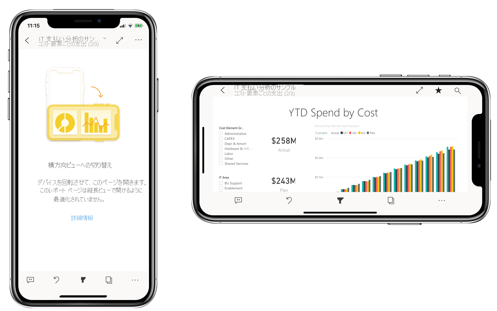

# モバイル アプリ用に Power BI レポートを最適化する
縦レイアウトを作成して、モバイル アプリでレポートを表示するエクスペリエンスを向上させることができます。 Power BI Desktop と Power BI サービスでは、レポートのビジュアルを再配置やサイズ変更を行って縦モードで最適なエクスペリエンスを実現することができます。  

モバイル デバイスでのレポートの表示について情報をお探しの場合は クイックスタート「[Power BI モバイル アプリでダッシュボードとレポートを調べる](../consumer/mobile/mobile-apps-quickstart-view-dashboard-report.md)」を参照してください。

どこでもサイズを変更できる[応答性の高いビジュアル](#optimize-a-visual-for-any-size)と[応答性の高いスライサー](#enhance-slicers-to-work-well-in-phone-reports)を作成できます。 レポートにフィルターを追加すると、最適化されたレポートに自動的に表示されます。

## 縦バージョンのレポート ページをレイアウトする

レポートを作成したら、スマートフォンとタブレット用にそれを最適化できます。

1. Power BI Desktop の **[レポート]** ビューにある **[表示]** タブで、 **[電話レイアウト]** を選択します。  
   
    ![[電話レイアウト] アイコン](media/desktop-create-phone-report/desktop-create-phone-report-3.png)
   
    Power BI サービスで、 **[レポートの編集]**  >  **[モバイル レイアウト]** を選択します。

    スマートフォンのような形の空白のキャンバスが表示されます。 元のレポート ページのすべてのビジュアルが、右側の **[視覚化]** ペインに表示されます。

1. 電話レイアウトにビジュアルを追加するには、それを **[視覚化]** ペインから電話キャンバスにドラッグします。
   
    電話レポートは、グリッド レイアウトを使用します。 ビジュアルをモバイル キャンバスにドラッグすると、そのグリッドにスナップされます。
   
    
   
    マスター レポート ページの一部またはすべてのビジュアルを電話レポート ページに追加できます。 各ビジュアルを追加できるのは 1 回だけであり、すべてのビジュアルを含める必要はありません。

1. ダッシュボードやモバイル ダッシュボード上のタイルの場合と同様に、グリッド上のビジュアルのサイズを変更できます。
   
   電話レポートのグリッドは、さまざまなサイズの電話に向けてスケーリングされます。このため、電話の画面が小さくても大きくても、レポートの見栄えがよくなります。
   
   

## ビジュアルのサイズを最適化する
ダッシュボードまたはレポート内のビジュアルを "*レスポンシブ*" に設定できます。 ビジュアルは、画面のサイズに関係なく、最大量のデータとインサイトを表示できるように動的に変化します。 

ビジュアルのサイズが変更されると、Power BI はデータ ビューを優先します。 たとえば、自動的に余白を削除し、凡例をビジュアルの上部に移動する場合があります。このため、ビジュアルは小さくなっても引き続き有益な情報を提供できます。

ビジュアルごとに応答性を有効にするかどうかを選択します。 詳細については、[ビジュアルの最適化](../visuals/desktop-create-responsive-visuals.md)に関するページをご覧ください。

## 電話レイアウトまたはレポート レイアウトを作成する場合の注意事項
* 複数ページのレポートの場合、すべてのページまたは数ページだけを最適化できます。 
* レポート ページの背景色を定義した場合、電話レポートに同じ背景色が設定されます。
* 電話用だけの書式設定を変更することはできません。 書式設定は、マスターとモバイルのレイアウトで一貫しています。 たとえば、フォント サイズは同じになります。
* 書式設定、データセット、フィルター、またはその他の属性の変更など、ビジュアルを変更するには、通常のレポート作成モードに戻ります。
* Power BI は、モバイル アプリの電話レポートに対して既定のタイトルとページ名を指定します。 レポートでタイトルとページ名のテキスト ビジュアルを作成していた場合は、それらを電話レポートに追加しないことを検討してください。     

## 電話レイアウトからのビジュアルの削除
* ビジュアルを削除するには、電話キャンバス上のビジュアルの右上にある **[X]** を選択するか、またはビジュアルを選択して **Delete** キーを押します。
  
   このビジュアルの削除では、電話レイアウト キャンバスからビジュアルが削除されるだけです。 ビジュアルとレポートは影響を受けません。
  
   

## 電話レポートで適切に機能するようにスライサーを拡張する
スライサーは、レポート データのキャンバス上のフィルター処理を行います。 通常のレポートの作成モードでスライサーを設計する場合、電話レポートそれらを使いやすくするために、いくつかのスライサー設定を変更できます。

* レポートの閲覧者が、1 つの項目だけを選択できるか、または複数の項目を選択できるかを決定します。
* レポートをスキャンしやすくなるように、スライサーの周りにボックスを配置します。
* スライサーを垂直、水平、または*レスポンシブ*にします。 

スライサーをレスポンシブにすると、スライサーのサイズとシェイプの変更に応じて表示されるオプションの数が増減します。 高さを変えたり、幅を変えたりできます。 非常に小さくすると、レポート ページにフィルターのアイコンだけが表示されるようになります。 

詳細については、[レスポンシブ スライサーの作成](power-bi-slicer-filter-responsive.md)に関するページをお読みください。

## 電話レポートの発行
レポートの電話バージョンを発行するには、[Power BI Desktop から Power BI サービスにメイン レポートを発行](desktop-upload-desktop-files.md)し、同時に電話バージョンを発行します。
  
詳しくは、[Power BI での共有およびアクセス許可](../collaborate-share/service-how-to-collaborate-distribute-dashboards-reports.md)に関するページを参照してください。

## スマートフォンまたはタブレット上で最適化されたレポートと最適化されていないレポートを表示する
電話のモバイル アプリの Power BI は、最適化された電話レポートと最適化されていない電話レポートを自動的に検出します。 電話用に最適化されたレポートが存在する場合、Power BI の電話アプリは自動的に電話レポート モードでレポートを開きます。

電話用に最適化されたレポートが存在しない場合は、最適化されていない横長ビューでレポートが開きます。  

電話レポートで、電話の向きを横長に変更すると、レポートを最適化しているかどうかに関係なく、元のレポート レイアウトの最適化されていないビューでレポートが開きます。

一部のページのみを最適化している場合、縦長ビューに、レポートを横長で使用できることを示すメッセージが表示されます。

レポート閲覧者は、スマートフォンまたはタブレットを横向きにして、横長モードでページを表示できます。 詳しくは、[縦モード用に最適化された Power BI レポートとの対話](../consumer/mobile/mobile-apps-view-phone-report.md)に関するページを参照してください。

## 次のステップ
* [Power BI でダッシュボードの Phone ビューを作成する](service-create-dashboard-mobile-phone-view.md)。
* [電話用に最適化された Power BI レポートを表示する](../consumer/mobile/mobile-apps-view-phone-report.md)。
* [任意のサイズに最適化されるレスポンシブ ビジュアルを作成する](../visuals/desktop-create-responsive-visuals.md)。
* 他にわからないことがある場合は、 [Power BI コミュニティで質問してみてください](https://community.powerbi.com/)。
