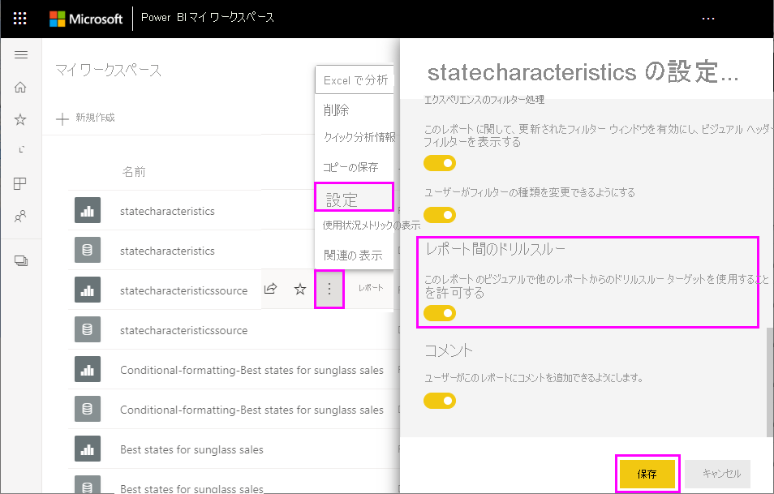

# Power BI でレポート間のドリルスルーを使用する

Power BI の "*レポート間のドリルスルー*" 機能を使用すると、同じ Power BI サービス ワークスペース内またはアプリ内で、あるレポートから別のレポートにコンテキストを保って移動できます。 レポート間のドリルスルーを使用すると、コンテンツに関連性がある複数のレポートを接続し、レポート間の接続と共にフィルターのコンテキストを渡すことができます。 

レポート間のドリルスルーを開始するには、"*ソース レポート*" の "*ソース ビジュアル*" でデータ ポイントを選択し、コンテキスト メニューからレポート間の **[ドリルスルー]** ターゲットを選択します。 

ドリルスルー アクションを実行すると、"*ターゲット レポート*" の "*ターゲット ページ*" が開きます。 

この記事では、Power BI レポートでレポート間ドリルスルーを設定して使用する方法について説明します。

> [!NOTE]
> [[マイ ワークスペース]](../collaborate-share/service-share-dashboards.md#share-a-dashboard-or-report) 内で個別に共有されている**自分と共有レポート**でレポート間ドリルスルーを使用することはできません。 レポート間ドリルスルーを使用するには、共有元のワークスペースのレポートにアクセスする必要があります。

## レポート間のドリルスルーを有効にする

レポート間ドリルスルーを有効にするための最初のステップは、ソース レポートとターゲット レポートのデータ モデルを検証することです。 各レポートのスキーマが同じである必要はありませんが、渡すフィールドが両方のデータ モデルに存在する必要があります。 フィールドの名前と、それらが属しているテーブルの名前は、同一である必要があります。 文字列が一致している必要があり、大文字と小文字が区別されます。

たとえば、テーブル **US States** 内のフィールド **State** に対するフィルターを渡す場合は、両方のモデルに **US States** テーブルと、そのテーブル内の **State** フィールドが存在している必要があります。 そうでない場合は、基になるモデルでフィールド名またはテーブル名を更新する必要があります。 フィールドの表示名を更新するだけでは、レポート間のドリルスルーで正しく機能しません。

モデルを検証した後、ソース レポートでレポート間ドリルスルーの使用を有効にします。 

1. Power BI Desktop で、 **[ファイル]**  >  **[オプションと設定]**  >  **[オプション]** の順に移動します。 
1. **[オプション]** ウィンドウの左側のナビゲーションで、 **[現在のファイル]** セクションの下部にある **[レポートの設定]** を選択します。 
1. 右下の **[レポート間のドリルスルー]** で、 **[このレポートの視覚化で他のレポートからのドリルスルー ターゲットを使用することを許可します]** をオンにします。 
1. **[OK]** を選択します。 
   
   

Power BI サービスからレポート間ドリルスルーを有効にすることもできます。
1. Power BI サービスで、ターゲット レポートとソース レポートが含まれているワークスペースを選択します。
1. ワークスペースの一覧で、ソース レポート名の横にある **[詳細オプション]** 記号を選択し、 **[設定]** を選択します。 
1. **[設定]** ペインの下部で、 **[レポート間のドリルスルー]** の下の **[レポート間のドリルスルー] で、[このレポートの視覚化で他のレポートからのドリルスルー ターゲットを使用することを許可します]** をオンにして、 **[保存]** を選択します。
   
   

## レポート間ドリルスルーのターゲットを設定する

レポート間ドリルスルーのターゲット ページの設定は、レポート内ドリルスルーの設定と似ています。 ターゲット ページでドリルスルーを有効にすると、他のビジュアルでそのページをドリルスルーのターゲットにすることができます。 1 つのレポート内でドリルスルーを作成する手順については、「[Power BI Desktop でドリルスルーを使用する](desktop-drillthrough.md)」を参照してください。

レポート間ドリルスルーのターゲットの設定は、Power BI Desktop または Power BI サービスで行うことができます。 
1. ターゲット ファイルを編集し、ターゲット レポートのターゲット ページで、 **[視覚化]** ペインの **[フィールド]** セクションを選択します。 
1. **[ドリルスルー]** で、 **[クロス レポート]** トグルを **[オン]** に設定します。 
1. ドリルスルー ターゲットとして使用するフィールドを **[ドリルスルーするフィールドをここに追加します]** にドラッグします。 フィールドごとに、フィールドがカテゴリとして使用されている場合、またはメジャーのように集計されている場合に、ドリルスルーを許可するかどうかを選択します。 
1. ビジュアルの **[すべてのフィルターを保持する]** かどうかを選択します。 ソース ビジュアルに適用されているフィルターをターゲット ビジュアルに渡さない場合は、 **[オフ]** を選択します。
   
   ![[ドリルスルー] オプションが強調して示されている [視覚化] ペイン](media/desktop-cross-report-drill-through/cross-report-drill-through-03.png)
   
1. ページをレポート間ドリルスルー用にのみ使用する場合は、キャンバスに自動的に追加される **[戻る]** ボタンを削除します。 **[戻る]** ボタンは、レポート内のナビゲーションに対してのみ機能します。 
1. ターゲット ページを構成した後、Power BI サービスを使用している場合はレポートを保存し、Power BI Desktop を使用している場合はレポートを保存して発行します。

これで終了です。 レポートでレポート間ドリルスルーを使用できるようになりました。 

## クロス レポートのドリルスルーの使用

レポート間ドリルスルーを使用するには、Power BI サービスでソース レポートを選択し、ターゲット ページの設定時に指定した方法でドリルスルー フィールドを使用するビジュアルを選択します。 データ ポイントを右クリックしてビジュアルのコンテキスト メニューを開き、 **[ドリルスルー]** を選択して、ドリルスルー ターゲットを選択します。 レポート間ドリルスルーのターゲットは、**ページ名 [レポート名]** という形式になっています。

ターゲットを作成するときに設定したように、レポート間ドリルスルーのターゲット ページに結果が表示されます。 結果は、ドリルスルーの設定に従ってフィルター処理されます。

> [!IMPORTANT]
> Power BI では、レポート間のドリルスルー ターゲットがキャッシュされます。 変更を行って、ドリルスルー ターゲットが想定どおりに表示されない場合は、必ずブラウザーの表示を更新してください。 

ターゲット ページを設定するときに、 **[すべてのフィルターを保持する]** を **[オン]** に設定した場合、ソース ビジュアルのフィルター コンテキストに次の内容を含めることができます。 

- ソース ビジュアルに影響を与えるレポート、ページ、ビジュアル レベルのフィルター 
- ソース ビジュアルに影響を与えるクロスフィルターとクロス強調表示 
- ページ上のスライサーと同期スライサー
- URL パラメーター

ドリルスルーのターゲット レポートに移動すると、Power BI によって、フィールド名とテーブル名の文字列が正確に一致するフィールドに対してのみ、フィルターが適用されます。 

Power BI では、ターゲット レポートの固定フィルターは適用されませんが、既定の個人用ブックマークが存在する場合は、それは適用されます。 たとえば、既定の個人用ブックマークに *Country = US* のレポート レベル フィルターが含まれている場合、Power BI では、ソース ビジュアルからのフィルター コンテキストが適用される前に、そのフィルターが適用されます。 

レポート間ドリルスルーの場合、Power BI では、ターゲット レポートの標準ページにフィルター コンテキストが渡されます。 ツールヒント ページはツールヒントを呼び出すソース ビジュアルに基づいてフィルター処理されるため、Power BI ではツールヒント ページにはフィルター コンテキストは渡されません。

レポート間のドリルスルー操作の後でソース レポートに戻る場合は、ブラウザーの **[戻る]** ボタンを使用します。 

## 次のステップ

次の記事にも興味をもたれるかもしれません。

- [Power BI のスライサー](../visuals/power-bi-visualization-slicers.md)
- [Power BI Desktop でドリルスルーを使用する](desktop-drillthrough.md)
