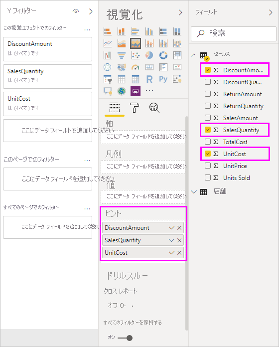
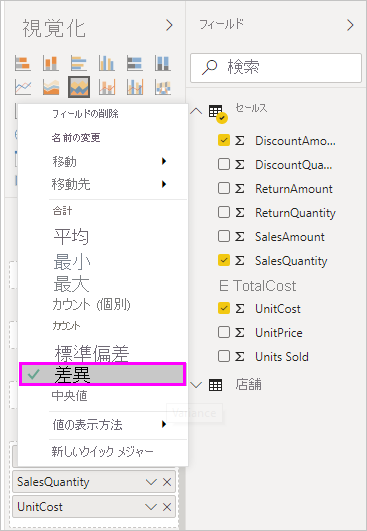

# Power BI Desktop でヒントをカスタマイズする

ヒントにより、ビジュアル上のデータ ポイントのコンテキスト情報と詳細を、洗練された方法で提供できます。 次の図は、Power BI Desktop のグラフに適用されたヒントを示しています。

視覚エフェクトが作成されると、既定のヒントに、データ ポイントの値とカテゴリが表示されます。 ヒント情報のカスタマイズが有用である多くの状況があります。 ヒントのカスタマイズによって、ビジュアルを表示するユーザーに対して、追加のコンテキストと情報が提供されます。 カスタム ヒントを使用すると、ヒントの一部として表示する追加のデータ ポイントを指定できます。

## ヒントをカスタマイズする方法

カスタマイズされたヒントを作成するには、次の図に示すように、 **[視覚化]** ペインの **[フィールド]** ウェルで、フィールドを **[ヒント]** バケットにドラッグします。 次の図では、3 つのフィールドが **[ヒント]** バケットに配置されています。

**[ヒント]** にヒントが追加されると、視覚化上のデータ ポイントにポインターを合わせたときに、それらのフィールドの値が表示されます。

## 集計またはクイック メジャーでのヒントのカスタマイズ

集計関数または*クイック メジャー*を選択することで、ヒントをさらにカスタマイズできます。 **[ヒント]** バケット内のフィールドの横にある矢印を選択します。 次に、使用可能なオプションから選択します。

ダッシュボードやレポートを閲覧するユーザーに情報と分析情報をすばやく伝えるために、データセットで使用できるフィールドを使用して、ヒントをカスタマイズする方法は多数あります。
