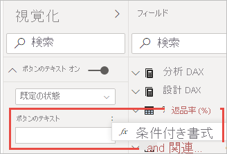

# <a name="create-a-drill-through-button-in-power-bi"></a>Power BI でドリルスルー ボタンを作成する

Power BI で "*ドリルスルー*" ボタンを作成することができます。このボタンでは、特定のコンテキストに対してフィルター処理された詳細情報を含むページにドリルスルーします。

レポートをドリルスルーする方法の 1 つは、ビジュアルを右クリックすることです。 ドリルスルー アクションをより明確にする場合は、代わりにドリルスルー ボタンを作成できます。 このボタンを使用すると、レポート内の重要なドリルスルー シナリオが見つけやすくなります。 ボタンの外観と動作の多くは、条件に応じて決定できます。 たとえば、特定の条件が満たされた場合に、ボタンに異なるテキストを表示できます。 詳細をお読みください。 

この例では、グラフ内の Word バーを選択した後、 **[詳細の表示]** ボタンが有効になります。

![[詳細の表示] ボタン](media/desktop-drill-through-buttons/power-bi-drill-through-visual-button.png)

**[詳細の表示]** ボタンを選択した場合は、[マーケット バスケット分析] ページにドリルスルーします。 左側のビジュアルからわかるように、ドリルスルー ページが Word 用にフィルター処理されました。


## <a name="set-up-a-drill-through-button"></a>ドリルスルー ボタンを設定する

ドリルスルー ボタンを設定するには、まず、レポート内に[有効なドリルスルー ページを設定する](desktop-drillthrough.md)必要があります。 次に、アクションの種類として**ドリルスルー**を含むボタンを作成し、 **[Destination]\(送信先\)** としてドリルスルー ページを選択する必要があります。

ドリルスルー ボタンには 2 つの状態 (有効と無効) があるため、2 つのツールヒント オプションが表示されます。


ツールヒントのボックスを空白のままにすると、Power BI によって自動的にツールヒントが生成されます。 このツールヒントは、[Destination]\(送信先\) フィールドとドリルスルー フィールドに基づいています。

ボタンが無効になっているときに自動生成されるツールヒントの例を次に示します。

"マーケット バスケット分析 [ターゲット ページ] にドリルスルーするには、Product [ドリルスルー フィールド] からデータ ポイントを 1 つ選択します。"


ボタンが有効になっているときに自動生成されるツールヒントの例を次に示します。

"クリックすると、マーケット バスケット分析 [ターゲット ページ] にドリルスルーします。"


ただし、カスタム ツールヒントを提供する場合は、常に静的な文字列を入力できます。 [条件付き書式をツールヒントに](#set-formatting-for-tooltips-conditionally)適用することもできます。

## <a name="pass-filter-context"></a>フィルター コンテキストを渡す

このボタンは、通常のドリルスルーと同様に機能します。ドリルスルー フィールドを含むビジュアルをクロスフィルター処理することで、追加のフィールドにフィルターを渡すことができます。 たとえば、 **[Ctrl** + **クリック]** とクロスフィルター処理を実行すると、ドリルスルー ページに Store の複数のフィルターを渡すことができます。これは、選択によって、ドリルスルー フィールドの Product を含むビジュアルがクロスフィルター処理されるためです。


ドリルスルー ボタンを選択した後、Store と Product の両方に対するフィルターがターゲット ページに渡されることがわかります。


### <a name="ambiguous-filter-context"></a>あいまいなフィルター コンテキスト

ドリルスルー ボタンは 1 つのビジュアルに関連付けられるわけではないため、選択範囲があいまいな場合、ボタンは無効になります。

この例では、2 つのビジュアルの両方に Product の選択が 1 つ含まれているため、ボタンは無効になっています。 どのビジュアルのどのデータポイントをドリルスルーかについてがあいまいです。


## <a name="customize-formatting-for-disabled-buttons"></a>無効なボタンの書式設定をカスタマイズする
ドリルスルー ボタンの無効状態の書式設定オプションをカスタマイズすることができます。


:::image type="content" source="media/desktop-drill-through-buttons/drill-through-customize-disabled-button.png" alt-text="無効なボタンの書式設定をカスタマイズする":::
 
次のような書式設定オプションがあります。
- **ボタン テキスト コントロール**: テキスト、色、余白、配置、サイズ、およびフォント ファミリ

    :::image type="content" source="media/desktop-drill-through-buttons/drill-through-disabled-button-text.png" alt-text="無効なボタン テキストの書式を設定する":::

- **ボタンの塗りつぶしコントロール**: 色、透明度、"*新しい*" 塗りつぶし画像 (これについては次のセクションで詳しく説明します)

    :::image type="content" source="media/desktop-drill-through-buttons/drill-through-disabled-button-fill.png" alt-text="無効なボタンの塗りつぶし":::

- **アイコン コントロール**: 図形、余白、配置、線の色、透明度、および太さ

    :::image type="content" source="media/desktop-drill-through-buttons/drill-through-disabled-button-icon.png" alt-text="無効なボタンのアイコン":::

- **枠線コントロール**: 色、透明度、太さ、角の丸み

     :::image type="content" source="media/desktop-drill-through-buttons/drill-through-disabled-button-outline.png" alt-text="無効なボタンの枠線":::

## <a name="set-formatting-for-button-text-conditionally"></a>条件に応じてボタン テキストの書式を設定する
条件付き書式を使用すると、フィールドの選択した値に基づいてボタンのテキストを変更できます。 これを行うには、DAX 関数 SELECTEDVALUE に基づいて目的の文字列を出力するメジャーを作成する必要があります。

Product の値が選択されていない場合に "製品の詳細を表示" を出力するメジャーの例を次に示します。それ以外の場合は、"[選択された Product ] の詳細を表示" を出力します。

```dax
String_for_button = If(SELECTEDVALUE('Product'[Product], 0) == 0, "See product details", "See details for " & SELECTEDVALUE('Product'[Product]))
```

このメジャーを作成したら、ボタンのテキストに **[条件付き書式]** オプションを選択します。



次に、ボタンのテキストに作成したメジャーを選択します。


製品を 1 つ選択すると、ボタンのテキストが次のように読み上げられます。

"Word の詳細を表示"


製品が選択されていないか、複数の製品が選択されている場合、ボタンが無効になります。 ボタンのテキストが次のように読み上げられます。

"製品の詳細を表示"


## <a name="set-formatting-for-tooltips-conditionally"></a>条件に応じてツールヒントの書式を設定する

ドリルスルー ボタンが有効または無効になっている場合、条件に応じてそのツールヒントの書式を設定することができます。 条件付き書式を使用してドリルスルー先を動的に設定した場合は、エンド ユーザーの選択に基づいて、ボタンの状態のツールヒントをより詳細にすることができます。 次に例をいくつか示します。

- カスタム メジャーを使用して、無効状態のツールヒントを個別に規範となるように設定することができます。 たとえば、ユーザーが 1 つの製品 "*および*" 1 軒の店を選択してから、マーケット分析ページにドリルスルーできるようにする場合は、以下のロジックを使用してメジャーを作成できます。

    ユーザーが 1 つの製品と 1 軒の店のいずれも選択していない場合、メジャーでは、"製品を 1 つ選択し、Ctrl キーを押しながらクリックして店も 1 軒選択してください" と返されます。

    ユーザーが 1 つの製品を選択しても、1 軒の店を選択しなかった場合、メジャーでは、"Ctrl キーを押しながらクリックして、店も 1 軒選択してください" と返されます。

- 同様に、有効状態のツールヒントを、ユーザーの選択に応じて設定することもできます。 たとえば、ドリルスルー ページをフィルター処理する対象の製品と店舗をユーザーに知らせる場合は、

    "クリックして [ドリルスルー ページ名] にドリルスルーすると、[店舗名] 店の [製品名] の売上の詳細が表示されます" と返すメジャーを作成することができます。


## <a name="set-the-drill-through-destination-conditionally"></a>条件に応じてドリルスルー先を設定する

条件付き書式を使用することで、メジャーの出力に基づいてドリルスルー先を設定できます。

ここでは、ボタンのドリルスルー先を条件にする場合のシナリオをいくつか示します。

- **複数の条件が満たされている場合**は、ページへのドリルスルーを有効にするだけです。 それ以外の場合、ボタンは無効になります。

    たとえば、ユーザーが 1 つの製品 "*および*" 1 軒の店を選択してから、マーケットの詳細ページにドリルスルーできるようにします。 それ以外の場合、ボタンは無効になります。

    :::image type="content" source="media/desktop-drill-through-buttons/drill-through-select-product-store.png" alt-text="製品と店舗を選択する":::
 
- ユーザーの選択に基づいて、ボタンで**複数のドリルスルー先をサポートする**ようにします。

    たとえば、ユーザーがドリルスルーできる複数のターゲット (マーケットの詳細と店舗の詳細) があるとします。 ドリルスルー先に対してボタンが有効になる前に、その特定のドリルスルー先を選択させることができます。

    :::image type="content" source="media/desktop-drill-through-buttons/drill-through-select-product-destination.png" alt-text="製品とターゲットを選択する":::
 
- 複数のドリルスルー先と、ボタンを無効にする特定の条件の両方をサポートする興味深い**ハイブリッド シナリオのケース**がある場合もあります。 これら 3 つのオプションの詳細をお読みください。

### <a name="disable-the-button-until-multiple-conditions-are-met"></a>複数の条件が満たされるまでボタンを無効にする

最初のケースを見てみましょう。この場合、追加の条件が満たされるまでボタンを無効のままにします。 条件が満たされていない限り、空の文字列 (“”) を出力する基本的な DAX メジャーを作成する必要があります。 それが満たされると、ドリルスルー先のページの名前が出力されます。

次に示す DAX メジャーの例では、ユーザーが Product でドリルスルーして Store の詳細ページを表示する前に Store を選択する必要があります。

```dax
Destination logic = If(SELECTEDVALUE(Store[Store], “”)==””, “”, “Store details”)
```

メジャーを作成したら、該当するボタンの **[ターゲット]** の横にある条件付き書式 (fx) ボタンを選択します。

:::image type="content" source="media/desktop-drill-through-buttons/drill-through-select-formula.png" alt-text="条件付き書式ボタンを選択する":::
 
最後の手順では、ターゲットのフィールド値として作成した DAX メジャーを選択します。

:::image type="content" source="media/desktop-drill-through-buttons/drill-through-based-formula.png" alt-text="フィールドに基づくターゲット"::: 

これで、1 つの製品が選択されていても、ボタンが無効になっていることがわかります。これは、このメジャーでは店も 1 軒選択する必要があるためです。

:::image type="content" source="media/desktop-drill-through-buttons/drill-through-button-disabled.png" alt-text="無効になっているドリルスルー ボタン":::

### <a name="support-multiple-destinations"></a>複数のターゲットをサポートする
 
複数のターゲットをサポートするその他の一般的なケースでは、まず、ドリルスルー先の名前を使用して単一列テーブルを作成します。

:::image type="content" source="media/desktop-drill-through-buttons/drill-through-create-table.png" alt-text="テーブルの作成":::

Power BI では、文字列の完全一致を使用してドリルスルー先を設定します。そのため、入力された値がドリルスルー ページ名と完全に一致していることを再確認します。

テーブルを作成した後、それを単一選択スライサーとしてページに追加します。

:::image type="content" source="media/desktop-drill-through-buttons/drill-through-slicer.png" alt-text="ドリルスルー スライサー":::
 
垂直スペースがさらに必要な場合は、スライサーをドロップダウンに変換します。 スライサー ヘッダーを削除し、タイトルを示すテキスト ボックスをその横に追加します。

:::image type="content" source="media/desktop-drill-through-buttons/drill-through-drop-down-slicer.png" alt-text="ヘッダーのないドリルスルー スライサー":::
 
または、リスト スライサーを垂直方向から水平方向に変更します。

:::image type="content" source="media/desktop-drill-through-buttons/drill-through-horizontal-slicer.png" alt-text="水平スライサー":::

ドリルスルー アクションのターゲットの入力については、該当するボタンの **[ターゲット]** の横にある条件付き書式 (fx) ボタンを選択します。

:::image type="content" source="media/desktop-drill-through-buttons/drill-through-select-formula.png" alt-text="条件付き書式ボタンを選択する":::
 
作成した列の名前 (ここでは、**Select a destination**) を選択します。

:::image type="content" source="media/desktop-drill-through-buttons/drill-through-select-destination.png" alt-text="Select a destination":::
 
これで、製品 "*および*" ターゲットを選択した場合にのみ、ドリルスルー ボタンが有効になっていることがわかります。

:::image type="content" source="media/desktop-drill-through-buttons/drill-through-select-product-destination.png" alt-text="製品とターゲットを選択する":::
 
### <a name="hybrid-of-the-two-scenarios"></a>2 つのシナリオのハイブリッド

2 つのシナリオのハイブリッドに関心がある場合は、DAX メジャーを作成して参照し、ターゲット選択のロジックをさらに追加することができます。

次に示す DAX メジャーの例では、ユーザーが Product でドリルスルーしてドリルスルー ページのいずれかを表示する前に、Store を選択する必要があります。

```dax
Destination logic = If(SELECTEDVALUE(Store[Store], “”)==””, “”, SELECTEDVALUE(‘Table'[Select a destination]))
```

その後、ターゲットのフィールド値として作成した DAX メジャーを選択します。
この例では、ユーザーは、ドリルスルー ボタンが有効になる前に、Product、Store、"*および*" ターゲット ページを選択する必要があります。

:::image type="content" source="media/desktop-drill-through-buttons/drill-through-product-store-destination.png" alt-text="製品、店舗、およびターゲットを選択する":::

## <a name="limitations"></a>制限事項

- このボタンでは、1 つのボタンを使用して複数の送信先を設定することはできません。
- このボタンは、同じレポート内のドリルスルーのみをサポートしています。言い換えると、レポート間のドリルスルーはサポートしていません。
- ボタンの無効状態の書式設定は、レポートのテーマの色クラスに関連付けられています。 色クラスに関する詳細は[こちら](desktop-report-themes.md#setting-structural-colors)を参照してください。
- ドリルスルー アクションは、組み込みのすべてのビジュアルに対して機能し、AppSource からインポートされた "*一部の*" ビジュアルと連携します。 ただし、AppSource からインポートされた "*すべての*" ビジュアルで動作することは保証されていません。

## <a name="next-steps"></a>次の手順
ボタンと似た機能またはボタンと相互作用する機能の詳細については、次の記事をご覧ください。

* [ボタンを作成する](desktop-buttons.md)
* [Power BI レポートでドリルスルーを使用する](desktop-drillthrough.md)
* [Power BI でブックマークを使用して詳細情報を共有し、ストーリーを作成する](desktop-bookmarks.md)

