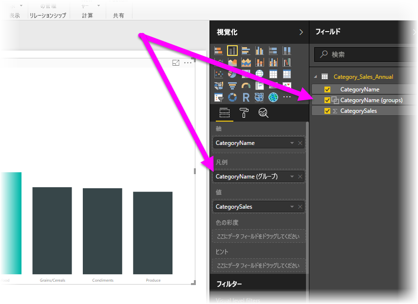

# Power BI Desktop でグループ化とビン分割を使用する
Power BI Desktop では、ビジュアルを作成するとき、基になっているデータで見つかった値に基づいて、データをチャンク (またはグループ) にまとめて集計します。 多くの場合は問題ありませんが、チャンクの表示方法の調整が必要になる場合もあります。 たとえば、3 つの製品カテゴリを 1 つの大きなカテゴリ (1 つの *グループ*) にしたい場合などです。 または、売上の数字を 923,983 ドルのサイズのチャンクではなく、1,000,000 ドルのビン サイズにしたいこともあります。

Power BI Desktop では、データ ポイントを*グループ化*して、ビジュアルでのデータと傾向の表示、分析、調査をいっそう明確にすることができます。 また、"*ビン サイズ*" を定義して、意味のある方法でデータを視覚化しやすくする等しいサイズのグループに値をまとめることもできます。 このアクションは、"*ビン分割*" と呼ばれることがよくあります。

## グループ化の使用
グループ化を使用するには、ビジュアル上で Ctrl キーを押しながら複数の要素をクリックして選択します。 次に、選択した複数の要素のいずれかを右クリックし、コンテキスト メニューから **[グループ]** を選択します。

作成されたグループはビジュアルの **[凡例]** バケットに追加されます。 グループは、 **[フィールド]** の一覧にも表示されます。

グループを作成した後、そのグループのメンバーを簡単に編集できます。 **[凡例]** バケットから、または **[フィールド]** の一覧からフィールドを右クリックし、 **[グループの編集]** を選択します。

**[グループ]** ダイアログ ボックスでは、新規グループの作成や既存グループの変更を行うことができます。 任意のグループの "*名前を変更*" することもできます。 **[グループとメンバー]** ボックスでグループのタイトルをダブルクリックし、新しい名前を入力するだけです。

グループを使用して、さまざまなことを行えます。 **[グループに属していない値]** の一覧から、新しいグループまたは既存のグループに項目を追加できます。 新しいグループを作成するには、 **[グループに属していない値]** ボックスで複数の項目を選択し (Ctrl キーを押しながらクリック)、そのボックスの下の **[グループ]** ボタンを選択します。

グループに属していない値を既存のグループに追加できます。 **[グループに属していない値]** のいずれかを選択し、その値を追加する既存のグループを選択して、 **[グループ]** ボタンを選択するだけです。 グループから項目を削除するには、 **[グループとメンバー]** ボックスで項目選択し、 **[グループ解除]** を選択します。 また、グループ化されていないカテゴリを **[その他]** グループに移動することや、グループ化しないままにすることもできます。

![[グループ] ダイアログ ボックス、Power BI Desktop](media/desktop-grouping-and-binning/grouping-binning_4.png)

> [!NOTE]
> 既存のビジュアルから複数の項目を選択することなく、 **[フィールド]** で任意のフィールドのグループを作成することもできます。 フィールドを右クリックし、表示されるメニューの **[グループ]** を選択するだけです。

## ビン分割の使用
**Power BI Desktop** の数値フィールドと時間フィールドに対してビンのサイズを設定できます。 ビン分割を使って、Power BI Desktop に表示されるデータを適切なサイズに設定できます。

ビンのサイズを適用するには、 **[フィールド]** を右クリックし、 **[新しいグループ]** を選択します。

**[グループ]** ダイアログ ボックスで、 **[ビンのサイズ]** を適切なサイズに設定します。

![ビンのサイズ、[グループ] ダイアログ ボックス、Power BI Desktop](media/desktop-grouping-and-binning/grouping-binning_6.png)

**[OK]** を選ぶと、 **[フィールド]** ウィンドウに新しいフィールドが表示されます。フィールド名の後には " **(ビン)** " が追加されています。 その後は、フィールドをキャンバスにドラッグして、ビジュアルでビンのサイズを使うことができます。

*ビン分割*を実際に使っている様子は、こちらの[ビデオ](https://www.youtube.com/watch?v=BRvdZSfO0DY)でご覧いただけます。

*グループ化*と*ビン分割*を使ってレポートのビジュアルに意図したとおりにデータを表示する方法がわかります。
