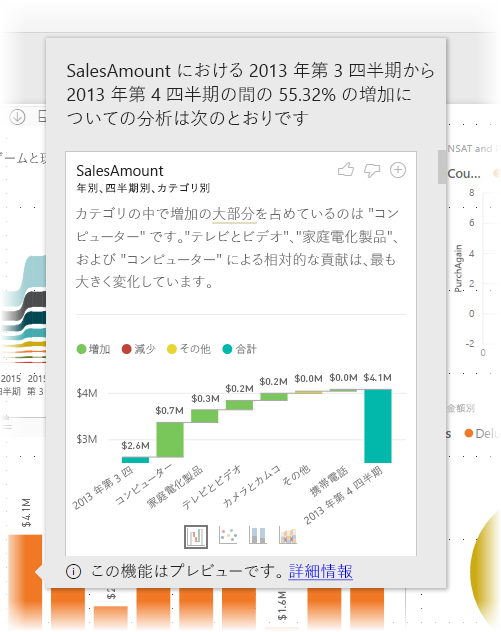
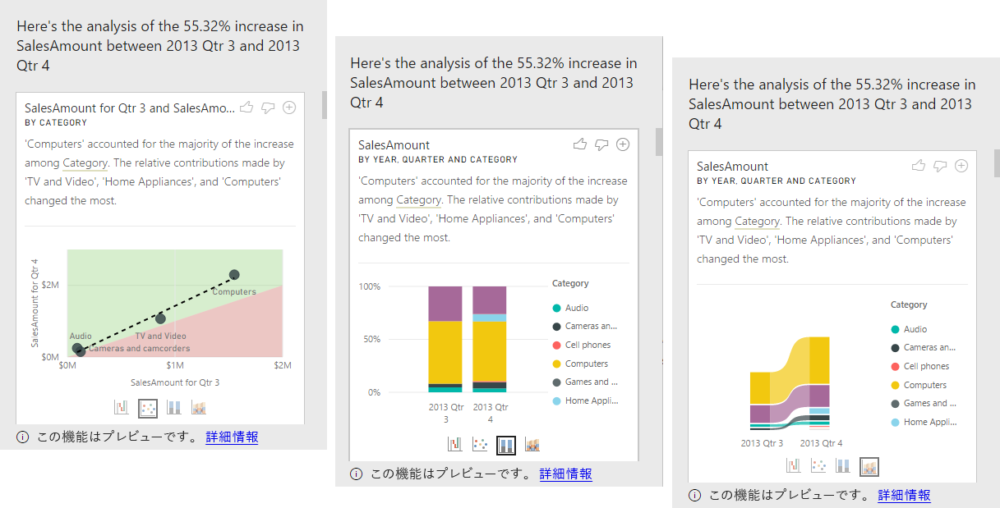

# ビジュアルの変動の説明に Power BI Desktop に分析情報を適用する (プレビュー)

ビジュアルでは、値の大幅な増加や急激な減少が確認されることが頻繁にあり、そのような変化の原因は何かと疑問に思います。 **Power BI Desktop** の **分析情報** を利用すれば、数回のクリックで原因がわかります。

たとえば、*売上高* を *年* 別と *四半期* 別で表示している次のビジュアルについて考えてください。 2014 年は売上が大きく下がっており、*第 1 四半期* と *第 2 四半期* の間で売上が急に落ちています。 このような場合、発生した変化について説明する目的でデータをいろいろ調べることができます。 

**Power BI Desktop** にグラフの増減を説明し、グラフの分布要因を確認し、データについてすばやく洞察に満ちた自動分析を行うように指示することができます。 その場合、ユーザーはただデータ ポイントを右クリックし、 **[分析]、[減少について説明してください]** (前の棒が低い場合は [増加について説明してください]) の順に選択するか、 **[分析] を選択し、分布が異なる部分を [検索]** します。これにより、使いやすいウィンドウで洞察が得られます。

インサイト機能はコンテキストに依存し、前の棒や列など、直前のデータ ポイントに基づきます。

> [!NOTE]
> この機能はプレビュー段階であり、変更される可能性があります。 2017 年 9 月バージョンの **Power BI Desktop** 以降では、インサイト機能は既定で有効になります ([プレビュー] チェック ボックスをオンにして有効にする必要はありません)。

## インサイトの使用
グラフ上で確認される増減を説明する目的で分析情報を使用するには、棒グラフまたは折れ線グラフでデータ ポイントを右クリックし、 **[分析] > [増加について説明してください]** (または *[減少について説明してください]* 。すべての分析情報は前のデータ ポイントからの変化に基づくため) の順に選択します。

その後、**Power BI Desktop** はデータに対して機械学習アルゴリズムを実行し、増減に最も影響したカテゴリを示す説明とビジュアルをウィンドウに取り込みます。 次の画像に示すように、既定では、インサイトは *ウォーターフォール* ビジュアルとして提供されます。

ウォーターフォール ビジュアルの下部にある小さいアイコンを選択すると、インサイトで散布グラフ、積み上げ縦棒グラフ、またはリボン グラフのいずれかを表示できます。

ページの上部にある *上向き親指* と *下向き親指* のアイコンを使用して、ビジュアルと機能に関するフィードバックを送ることができます。 このアイコンからはフィードバックが提供されますが、現在のところ、次回この機能を使用したときに違う結果を返すよう、アルゴリズムがトレーニングされることはありません。

さらに重要なのがビジュアルの上部にある **+** ボタンです。これを使用すれば、ビジュアルを手動で作成した場合と同じように、レポートに選択したビジュアルを追加できます。 その後、レポートの他のビジュアルと同じように、追加したビジュアルの書式を設定したり、調整したりすることができます。 選択したインサイト ビジュアルを追加できるのは、**Power BI Desktop** でレポートを編集する場合のみです。

インサイトは、レポートが読み取りモードの場合、または編集モードの場合に使用でき、データの分析と、レポートに簡単に追加できるビジュアルの作成の両方で使用できます。

## 返される結果の詳細

分析情報によって返される詳細の意図は、2 つの期間の間に発生した変化を理解する目的でその間の違いを強調表示することです。  

たとえば、*第 3 四半期* から *第 4 四半期* にかけて *売上* が 55% 増えているとき、それがあらゆる製品 *カテゴリ* に等しく当てはまり (コンピューターの売上が 55% 増え、オーディオやその他の売上も同様に増えるなど)、さらに、どこの国でも、どのような客層でも同じことが当てはまる場合、変化について説明する目的でデータから特定できるものはほとんどありません。 しかしながら、そのような状況は一般的ではありません。通常、出来事の中には違いを見いだせるものであり、たとえば、カテゴリの中で、*テレビとオーディオ* が 23% しか増加しなかったのに対し、*コンピューター* と *家電* の売上が 63% という大きな増加率を見せ、*コンピューター* と *家電* は *第 3 四半期* より *第 4 四半期* で総売上に大きく貢献したということがありえます。  この例では、増加に対する妥当な理由として、「*コンピューター、テレビとオーディオの売り上げが特に好調であったから*」という理由を挙げることができます。 

そのため、このアルゴリズムは最大の変化量を説明する値を単純に返すものではありません。 たとえば、売上の多く (98%) が米国からであるとすれば、増加の多くも米国で発生するのが一般的です。 それでも、米国やその他の国で総売上の相対的貢献度に大きな変化がない限り、*国* は重要な指標であるとは見なされません。  

単純に言えば、このアルゴリズムではモデル内の他の縦棒をすべて受け取り、*前* の期間と *後* の期間に対して縦棒ごとの内訳を計算し、その内訳の中でどのくらいの変化が発生したか判断し、変化が最も大きな縦棒を返します。 たとえば、上記の例で *カテゴリ* を選択すると、*テレビとビデオ* による (売上) 貢献度が 33% から 26% へと 7% 下がった一方で、*家電* の貢献度がゼロから 6% 超に増えました。 

返された縦棒ごとに 4 つのビジュアルを表示できます。 そのうち 3 つのビジュアルは、2 つの期間の間の貢献度変化を強調表示することです。 たとえば、*第 2 四半期* から *第 3 四半期* にかけての増加を説明します。

### 散布図

散布図ビジュアルでは、縦棒の各値に対して (ここでは *カテゴリ*)、第 1 期間の指標値 (X 軸) と第 2 期間の指標値 (Y 軸) が比較表示されます。 そのため、次の画像から確認できるように、値が増えたとき、データ ポイントは緑の領域に入り、値が減ると、赤の領域に入ります。 

点線は最良適合を示すものであり、この線より上にあるデータ ポイントは全体的傾向よりも増加が上回り、この線より下であれば増加も下回るということになります。  

いずれの期間も値が空のデータ項目は散布図に表示されないことにご注意ください (たとえば、この例であれば *家電*)。

### 100% 積み上げ縦棒グラフ

100% 積み上げ縦棒グラフのビジュアルでは、選択した縦棒別に、前後の指標値が 100% の積み上げ縦棒として表示されます。 前後の貢献度を横並びで比較できます。 ツールヒントを使うと、選択した値の実際の貢献度が表示されます。

### リボン グラフ

リボン グラフのビジュアルには、前後の指標値も表示されます。 これは特に、(*コンピューター* の売上順位が 1 位から 3 位に下がったなど) 貢献要素の *順序* が変わるとき、貢献度の変化を示す手法として便利です。 

### ウォーターフォール グラフ

4 番目のビジュアルがウォーターフォール グラフです。期間の間の主な増減を実際値で示します。 このビジュアルでは実際の変化がはっきり示されますが、その縦棒が重要であると見なされた理由を実際に強調する貢献度の変化はこのビジュアルだけでは示されません。 

相対的貢献度の変化の大きさで縦棒にランクを付けるとき、次が考慮されます。 

* カーディナリティが要素として取り込まれます。縦棒のカーディナリティが大きいとき、差異の重要性は低くなります。 

* 元の値が非常に高いかゼロに非常に近いカテゴリの差異には、他のカテゴリより高い重み付けが与えられます。 たとえば、あるカテゴリの貢献度がわずか 1% から 6% になった場合、50% から 55% になったカテゴリより、統計的に意味がある、重要であると見なされます。 

* 最も意味のある結果を選択する目的で、さまざまなヒューリスティックス (発見的手法) が採用されます。たとえば、データ間のその他の関係を考慮します。
 
さまざまな縦棒を調べた後、相対的貢献の変化が最も大きい縦棒が選択され、出力されます。 出力された縦棒ごとに、貢献度変化が最も大きい値に吹き出しで説明が付きます。 また、実際の増減が最も大きい値にも吹き出しが付きます。

## 考慮事項と制限事項
以上の分析情報は前のデータ ポイントからの変化に基づくため、ビジュアルで最初のデータ ポイントを選択した時点では利用できません。 

現在のところ、**増減を説明** できないシナリオには次のようなものがあります。

* 上位 N フィルター
* 含める/除外するフィルター
* メジャー フィルター
* 数値以外のメジャー
* "値の表示方法" の使用
* フィルターが適用された指標 - フィルターが適用された指標とは、特定のフィルター ("*フランスの売上合計*" など) が適用されたビジュアル レベルの計算結果であり、分析情報機能によって作成された一部のビジュアルで使用されます。
* X 軸のカテゴリ列 (スカラーである列で並べ替えが定義されている場合を除く)。 階層を使用する場合は、アクティブな階層内のすべての列がこの条件と一致する必要があります。

さらに、次のモデルの種類とデータ ソースは現在、インサイトではサポートされていません。

* DirectQuery
* ライブ接続
* オンプレミスの Reporting Services
* 埋め込み

## 次のステップ
**Power BI Desktop** と作業の開始方法の詳細については、次の記事を確認してください。

* [Power BI Desktop とは何ですか?](../fundamentals/desktop-what-is-desktop.md)
* [Power BI Desktop でのクエリの概要](../transform-model/desktop-query-overview.md)
* [Power BI Desktop のデータ ソース](../connect-data/desktop-data-sources.md)
* [Power BI Desktop におけるデータへの接続](../connect-data/desktop-connect-to-data.md)
* [Power BI Desktop でのデータの整形と結合](../connect-data/desktop-shape-and-combine-data.md)
* [Power BI Desktop での一般的なクエリ タスク](../transform-model/desktop-common-query-tasks.md)   
