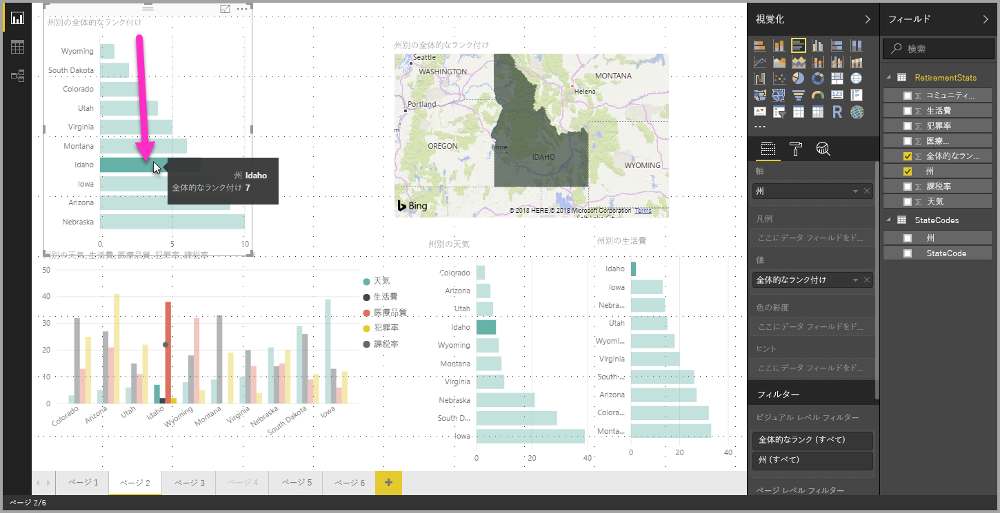
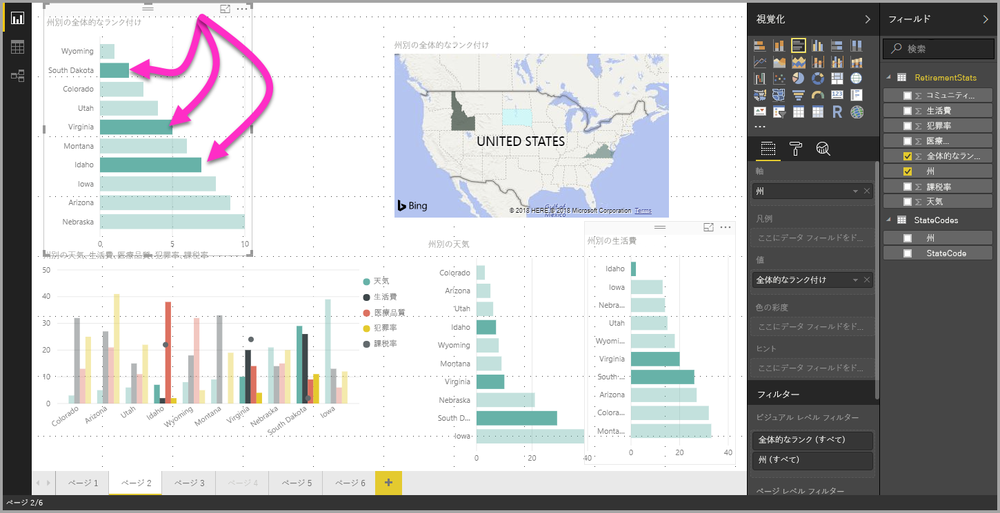

# Power BI Desktop でデータ要素、データ ポイント、視覚エフェクトを複数選択する

Power BI Desktop を使用して、1 つの視覚エフェクトで複数のデータ要素を選択したり、視覚エフェクト内の複数のデータ ポイントを選択したり、レポート内の複数の視覚エフェクトを選択したりできます。 以下のセクションでは、それぞれについて順次説明します。

## 複数のデータ ポイントを選択する

Power BI Desktop では、ビジュアルのデータ ポイントをクリックするだけで、所与のビジュアルでデータ ポイントを強調表示できます。 たとえば、重要なバーまたはグラフ要素があるとき、レポート ページの他のビジュアルで、選択したデータを強調表示する場合、1 つのビジュアルでデータ要素をクリックし、ページの他のビジュアルでその結果を反映させることができます。 これは 1 つを選択する基本的な強調表示です。 次の画像は基本的強調表示のものです。 

複数選択を利用すると、**Power BI Desktop** レポート ページで複数のデータ ポイントを選択し、ページのあらゆるビジュアルで結果を強調表示できます。 これは **and** ステートメントと等しい機能になります。"Idaho **and** Virginia の結果を強調表示する" のようなものです。 視覚エフェクトでデータ ポイントを複数選択するには、**Ctrl キーを押しながらクリック**して複数のデータ ポイントを選択します。 次の画像では、**複数のデータ ポイント**が選択されています (複数選択)。

これは単純な機能のように思われますが、レポートを作成、共有、操作するとき、さまざまな可能性が生まれます。 

## 四角形の選択を使用して複数の要素を選択する (プレビュー)

四角形の選択 ("*なげなわ選択*" ともよく呼ばれます) を使用して、視覚エフェクト内の複数のデータ要素を選択したり、レポート内の複数の視覚エフェクトを選択したりできます。 

### キャンバス上の複数の視覚エフェクトを選択する

複数の視覚エフェクトおよびその他のレポート要素を選択するには、キャンバス上をクリックしてドラッグし、四角形のなげなわを作成します。 なげなわ内に完全に含まれるすべての視覚エフェクトが選択されます。 *Ctrl* または *Shift* キーを押すと (Ctrl キーを押しながら個々の視覚エフェクトをクリックして複数選択するように)、新しいなげなわによって現在の複数選択に視覚エフェクトの選択を追加できます。 

視覚エフェクトが既に選択されていてなげなわに含まれている場合、*Ctrl* または *Shift* キーを使用するとその選択がオフになります。 なげなわでは、グループ内の 1 つの視覚エフェクトは選択されませんが、グループ全体を含めてグループを選択できます。

キャンバスが四角形のなげなわ選択によって自動的にスクロールされることはありません。 

### 視覚エフェクト内の複数のデータ ポイントを選択する

同じ四角形のなげなわの手順を使用して、視覚エフェクト内の複数のデータ ポイントを選択できます。 *Ctrl* キーを押しながら、視覚エフェクト内をクリックしてドラッグし、複数のデータ ポイントを選択します。 マウス ボタンを放すと、選択領域に重なっているすべてのポイントが選択され、前のなげなわ選択も保持されます。 前に *Ctrl* キーを使用しながら選択したポイントを含む領域をなげなわ選択すると、それらのデータ ポイントは選択されません (オフになります)。なげなわの使用には、各ポイントを *Ctrl* キーを押しながら個別にクリックするのと同じ効果があります。 

*Shift* キーを使用しながらなげなわ選択を行うと、前の選択内容が保持され、既に選択されているデータ ポイントは選択されたままになります。 したがって、なげなわ選択の実行中に *Shift* キーを使用すると、選択内容にデータ ポイントが追加されるだけであり、選択した領域のデータ ポイントは切り替わりません。

現在の選択内容をクリアするには、キーボードのキーを押さずに、プロット エリアの空白部分をクリックします。

この機能の詳細については、[この機能のリリースに関するブログ記事](https://powerbi.microsoft.com/blog/power-bi-desktop-august-2020-feature-summary/#_Data_point)を参照してください。

視覚エフェクト内のデータ ポイントを複数選択する際には、いくつかの制限事項と考慮事項があります。

* 折れ線グラフ、面グラフ、散布図、ツリーマップではなげなわ選択がサポートされます
* 一度に選択できるデータ ポイントの最大数は 300 個です
* Power BI サービスでレポートを表示する場合、四角形の選択が有効になるのは、レポートを保存して発行したときになげなわ選択機能が有効になっていた場合のみです

## 次のステップ

次の記事にも興味をもたれるかもしれません。

* [Power BI Desktop レポートでグリッド線と "グリッドにスナップ" を使用する](desktop-gridlines-snap-to-grid.md)
* [Power BI レポートのフィルターと強調表示について](power-bi-reports-filters-and-highlighting.md)

