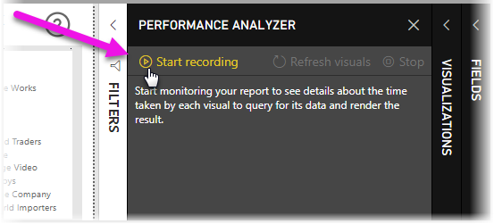

# パフォーマンス アナライザーを使用してレポート要素のパフォーマンスを確認する

**Power BI Desktop** では、各レポート要素 (ビジュアルや DAX の数式など) がどのように動作しているかを確認できます。 **パフォーマンス アナライザー**を使用すると、ユーザーがレポートの各要素を操作したときに各要素がどのように動作するか、リソースの消費量が最も大きい (または最も小さい) のはパフォーマンスのどの側面かを測定するログを表示して記録できます。

パフォーマンス アナライザーは、ユーザーの操作によって開始されたすべてのビジュアルの更新に必要な時間を調べて表示するほか、その結果を表示、ドリルダウン、またはエクスポートできるように情報を提示します。 パフォーマンス アナライザーは、レポートのパフォーマンスに影響を与えるビジュアルを特定し、その影響の理由を特定するのに役立ちます。

## [パフォーマンス アナライザー] ペインの表示

**Power BI Desktop** の **[表示]** リボンを選択します。 **[表示]** リボンの **[表示]** 領域で、 **[パフォーマンス アナライザー]** の横にあるチェック ボックスをオンにすると、[パフォーマンス アナライザー] ペインを表示できます。

![[表示] リボンでパフォーマンス アナライザーを選択する](media/desktop-performance-analyzer/performance-analyzer-02.png)

選択すると、パフォーマンス アナライザーが、レポート キャンバスの右側にある専用のペインに表示されます。

## パフォーマンス アナライザーの使用

パフォーマンス アナライザーでは、クエリを実行することになるユーザー操作の結果として開始されたレポート要素の更新に必要な処理時間 (ビジュアルの作成または更新にかかる時間など) を測定します。 たとえば、スライサーを調整するには、スライサーのビジュアルを変更し、クエリをデータ モデルに送信して、新しい設定の結果として影響を受けるビジュアルを更新する必要があります。 

パフォーマンス アナライザーで記録を開始するには、 **[記録の開始]** を選択します。

レポート内で実行するすべてのアクションは、Power BI によってビジュアルが読み込まれる順に [パフォーマンス アナライザー] ペインに表示され、ログに記録されます。 たとえば、更新に時間がかかるとユーザーが訴えているレポートがあるとします。 または、スライダーを調整したときに、レポート内の特定のビジュアルが表示されるまでに時間がかかるとします。 パフォーマンス アナライザーでは、どのビジュアルが原因であるかが表示され、そのビジュアルのどの側面の処理に最も時間がかかっているを特定できます。 

記録を開始すると、 **[録画の開始]** ボタンが淡色で表示され (既に記録が開始されているため非アクティブ)、 **[停止]** ボタンがアクティブになります。 

パフォーマンス アナライザーは、リアルタイムでパフォーマンス測定情報を収集して表示します。 そのため、ビジュアルをクリックしたり、スライサーを移動したり、その他の方法で操作したりするたびに、パフォーマンス アナライザーによって、パフォーマンス結果が即座にそのペインに表示されます。

そのペインに表示しきれない情報がある場合は、その他の情報に移動するためのスクロール バーが表示されます。

ペインには、操作ごとにセクション識別子があり、ログ エントリを開始したアクションについて説明しています。 次の図では、ユーザーがスライサーを変更したという操作が示されています。

各ビジュアルのログ情報には、以下のカテゴリのタスクを完了するためにかかった時間 (期間) が含まれます。

* **DAX クエリ** - DAX クエリが必要な場合、これは、ビジュアルからクエリが送信されてから Analysis Services から結果が返されるまでの時間になります。
* **ビジュアルの表示** - ビジュアルが画面に描画されるのに必要な時間 (Web の画像やジオコーディングの取得に必要な時間を含む)。 
* **その他** - クエリの準備、他のビジュアルの完了の待機、または他のバックグラウンド処理の実行のためにビジュアルが必要とする時間。

**[期間 (ミリ秒)]** 値は、各操作の "*開始*" と "*終了*" のタイムスタンプの差を示します。 ほとんどのキャンバスおよびビジュアル操作は、複数の操作で共有される単一のユーザー インターフェイス スレッド上で順番に実行されます。 報告される期間には、他の操作が完了するまでキューに入れられた時間が含まれます。 GitHub の [パフォーマンス アナライザー サンプル](https://github.com/microsoft/powerbi-desktop-samples/tree/master/Performance%20Analyzer)とそれに関連する[ドキュメント](https://github.com/microsoft/powerbi-desktop-samples/blob/master/Performance%20Analyzer/Power%20BI%20Performance%20Analyzer%20Export%20File%20Format.docx)で、ビジュアルでデータのクエリを実行する方法や、そのレンダリング方法の詳細がわかります。

パフォーマンス アナライザーを使用して測定するレポート要素の操作が終わったら、 **[停止]** ボタンを選択できます。 **[停止]** を選択した後も、パフォーマンス情報はペインに残っているため、分析に利用できます。

[パフォーマンス アナライザー] ペインの情報を消去するには、 **[クリア]** を選択します。 **[クリア]** を選択すると、すべての情報が消去され、保存されません。 ログの情報を保存する方法については、次のセクションを参照してください。 

## ビジュアルの更新

[パフォーマンス アナライザー] ペインの **[ビジュアルを更新します]** を選択すると、レポートの現在のページ上にあるすべてのビジュアルを更新することができます。これにより、そのすべてのビジュアルに関する情報がパフォーマンス アナライザーで収集されます。

また、個々のビジュアルを更新することもできます。 パフォーマンス アナライザーによる記録中に、各ビジュアルの右上隅にある **[このビジュアルを更新します]** を選択すると、そのビジュアルを更新して、そのパフォーマンス情報をキャプチャできます。

## パフォーマンス情報の保存

パフォーマンス アナライザーによって作成された、レポートに関する情報は、 **[エクスポート]** ボタンを選択することで保存できます。 **[エクスポート]** を選択すると、[パフォーマンス アナライザー] ペインの情報が記載された .json ファイルが作成されます。 

## 次のステップ
**Power BI Desktop** と作業の開始方法の詳細については、次の記事を確認してください。

* [Power BI Desktop とは何ですか?](../fundamentals/desktop-what-is-desktop.md)
* [Power BI Desktop でのクエリの概要](../transform-model/desktop-query-overview.md)
* [Power BI Desktop のデータ ソース](../connect-data/desktop-data-sources.md)
* [Power BI Desktop におけるデータへの接続](../connect-data/desktop-connect-to-data.md)
* [Power BI Desktop でのデータの整形と結合](../connect-data/desktop-shape-and-combine-data.md)
* [Power BI Desktop での一般的なクエリ タスク](../transform-model/desktop-common-query-tasks.md)   

パフォーマンス アナライザーのサンプルの詳細については、次のリソースを参照してください。

* [パフォーマンス アナライザーのサンプル](https://github.com/microsoft/powerbi-desktop-samples/tree/master/Performance%20Analyzer)
* [パフォーマンス アナライザーのサンプルのドキュメント](https://github.com/microsoft/powerbi-desktop-samples/blob/master/Performance%20Analyzer/Power%20BI%20Performance%20Analyzer%20Export%20File%20Format.docx)
