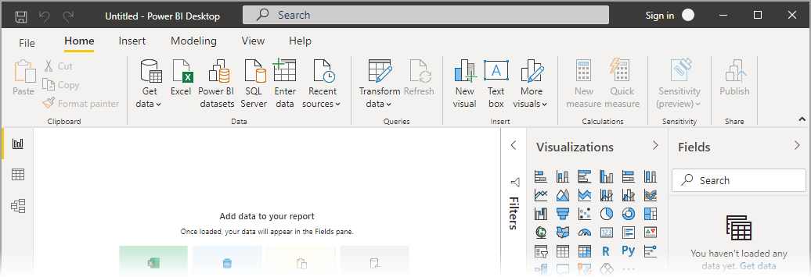

# Power BI Desktop のリボンを使用する

Power BI Desktop のリボンは、Microsoft Office などの他の Microsoft 製品と外観およびエクスペリエンスを合わせるように改良されました。

## リボンの機能

リボンの利点は、Power BI Desktop のエクスペリエンスをその他の Microsoft 製品と同じように簡単で使いやすくするこを目的としています。 

これらの利点は、次のカテゴリに分類できます。

* **検索バー** - 2021 年 2 月リリースから、他の Microsoft 製品で利用できる検索機能に似た検索エクスペリエンスがリボンに追加されました。 検索バーをクリックすると、Power BI によって、レポートの現在の状態に基づいたアクションが提案されます。 入力を行うと検索結果が更新されます。また、ヘルプを表示したり次の手順に進んだりするためのボタンが表示されます。 

    

    次のビデオで実際の動作をご確認ください。

    > [!VIDEO <iframe width="560" height="315" src="https://www.youtube.com/embed/jkqdyv7POq0" frameborder="0" allow="accelerometer; autoplay; clipboard-write; encrypted-media; gyroscope; picture-in-picture" allowfullscreen></iframe>]

* **外観、操作感、および編成の向上** - Power BI Desktop の更新されたリボンのアイコンと機能は、Office アプリケーションのリボン項目の外観、操作感、および編成に合わせています。

    

* **直感的なテーマ ギャラリー** - **[ビュー]**  リボンにあるテーマ ギャラリーは、使い慣れた PowerPoint のテーマ ギャラリーの外観になっています。 そのため、リボン内の画像は、テーマがレポートに適用された場合に、色の組み合わせやフォントがどのように変化するかを示しています。 

    

* **ビューに基づく動的なリボンのコンテンツ** - Power BI Desktop の既存のリボンでは、使用できないアイコンまたはコマンドはグレー表示されるだけであり、最適のエクスペリエンスではありませんでした。 更新されたリボンでは、アイコンの表示と配置は動的に実行されるため、コンテキストで使用可能なオプションを常に知ることができます。

* **折りたたむと単一行になるリボンによるスペースの節約** - 更新されたリボンの別の利点は、リボン自体を単一行に折りたたんで、コンテキストに基づいてリボン項目を動的に表示できることです。 

    

* **Keytip でのボタンの移動および選択** - **Alt + Windows キー** を押すと、Keytip をアクティブにしてリボン内を移動することができます。 アクティブになったら、表示されているキーをお使いのキーボードで押して移動できます。

    

* **カスタム書式設定文字列** - カスタム書式設定文字列は、 *[プロパティ]* ペインで設定するだけでなく、リボンで設定することもできます。 カスタマイズするメジャーまたは列を選択すると、ご自分の選択に応じて **[メジャー ツール]** または **[列ツール]** コンテキスト タブが表示されます。 そのタブの [書式設定] セクションのドロップダウン ボックスに、ご自分のカスタム書式指定文字列を直接入力します。

    

* **アクセシビリティ** - タイトル バー、リボン、およびファイル メニューは完全にアクセスできます。 Ctrl + F6 キーを押して、リボン セクションに移動します。 そこに移動したら、**Tab** キーを使用して上部と下部のバーを移動したり、矢印キーを使用した要素間を移動することができます。

これらの目に見える変更に加えて、更新されたリボンによって、今後、以下のような Power BI Desktop とリボンに対する更新を行うことができます。

* ビジュアル ギャラリーなど、より柔軟で直感的なコントロールをリボン内に作成する
* Office テーマの *[黒]* と *[濃い灰色]* を Power BI Desktop に追加する
* アクセシビリティの向上

## 次の手順
Power BI Desktop を使用して接続できるデータの種類は他にもあります。 データ ソースの詳細については、次のリソースを参照してください。

* [Power BI Desktop とは何ですか?](../fundamentals/desktop-what-is-desktop.md)
* [Power BI Desktop のデータ ソース](../connect-data/desktop-data-sources.md)
* [Power BI Desktop でのデータの整形と結合](../connect-data/desktop-shape-and-combine-data.md)
* [Power BI Desktop で Excel ブックに接続する](../connect-data/desktop-connect-excel.md)   
* [Power BI Desktop にデータを直接入力する](../connect-data/desktop-enter-data-directly-into-desktop.md)   
