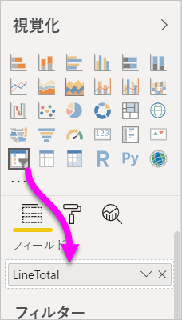

# Power BI で数値範囲スライサーを使用する

[!INCLUDE [applies-to](../includes/applies-to.md)] [!INCLUDE [yes-desktop](../includes/yes-desktop.md)] [!INCLUDE [yes-service](../includes/yes-service.md)]

数値範囲スライサーを使用して、データ モデルの数値列にあらゆるフィルターを適用することができます。 数値データのフィルター処理には、数値の間、数値以下、数値以上という 3 つのオプションがあります。 この簡単な手法は、データをフィルター処理するための強力な手段です。

## ビデオ

このビデオでは、で数値範囲スライサーを作成する手順について説明します。

> [!NOTE]
> このビデオでは、古いバージョンの Power BI Desktop を使用しています。

<iframe width="560" height="315" src="https://www.youtube.com/embed/zIZPA0UrJyA" frameborder="0" allowfullscreen></iframe> 

## 数値範囲スライサーの追加

他のスライサーを使用する場合と同様に、数値範囲スライサーを使用できます。 レポートに**スライサー** ビジュアルを作成し、 **[フィールド]** 値に対して数値を選択するだけです。 次の図では、**LineTotal** フィールドを選択しました。

数値範囲スライサーの右上隅にある下向き矢印を選択すると、メニューが表示されます。

数値範囲として、次の 3 つのオプションから選択できます。

* **次の値の間**
* **次の値以下**
* **次の値以上**

メニューから **[次の値の間]** を選択すると、スライダーが表示されます。 スライダーを使用して、数値の間に含まれる数値を選択できます。 スライサー バーの移動の細かさによっては、その数値を正確に示すことが困難な場合があります。 スライダーを使用して、いずれかのボックスを選択し、目的の値を入力することもできます。 このオプションは、特定の数値をスライスする場合に便利です。

次の図のレポート ページでは、2500.00 から 6000.00 までの範囲の **LineTotal** 値がフィルター処理されています。

![[次の値の間] を使用した数値範囲スライサー](media/desktop-slicer-numeric-range/desktop-slicer-numeric-range-3-between-range.png)

**[次の値以下]** を選択すると、スライダー バーの左側 (下限) のハンドルが消え、調整できるのはスライダー バーの上限のみとなります。 次の図では、スライダー バーが最大の 5928.19 に設定されています。

![[次の値以下] を使用した数値範囲スライサー](media/desktop-slicer-numeric-range/desktop-slicer-numeric-range-4-less-than.png)

最後に、 **[次の値以上]** を選択すると、右側 (高い値) のスライダー バーのハンドルが表示されなくなります。 次の図に示すように、下限値を調整できます。 これで、レポート ページのビジュアルには、**LineTotal** が 4902.99 以上のアイテムのみが表示されます。

![[次の値以上] を使用した数値範囲スライサー](media/desktop-slicer-numeric-range/desktop-slicer-numeric-range-5-greater-than.png)

## 数値範囲スライサーを整数にスナップする

基礎とするフィールドのデータ型が*整数*の場合、数値範囲スライサーは整数にスナップします。 この機能により、スライサーを完全に整数に揃えることができます。 *10 進数*のフィールドでは、ある数の分数を入力または選択できます。 数値をさらに正確に入力または選択できますが、テキスト ボックスに設定される書式設定は、フィールドに設定されている書式設定に一致します。

## 日付範囲スライサーによる表示書式設定

スライサーを使用して日付の範囲を表示または設定すると、日付が *[短い日付]* 形式で表示されます。 ユーザーのブラウザーまたはオペレーティング システムのロケールによって日付の形式が決まります。 そのため、基になるデータまたはモデルに対してデータ型の設定がどのようなものであるかにかかわらず、それが表示形式になります。

たとえば、基になるデータ型に対して長い日付形式を使用できます。 この場合、*dddd, MMMM d, yyyy* などの日付形式では、他のビジュアルまたは環境の日付が、*Wednesday, March 14, 2001* と書式が設定されます。 ただし、日付範囲スライサーでは、その日付はスライサーに *03/14/2001* と表示されます。

スライサーで [短い日付] 形式を表示することで、スライサー内で文字列の長さが確実に一貫しコンパクトに収まるようになります。

## 制限事項と考慮事項

数値範囲スライサーには、次の制限事項と考慮事項が適用されています。

* 数値範囲スライサーでは、集計値ではなく、データの基になるすべての行がフィルター処理されます。 たとえば、 *[Sales Amount]\(売上高\)* フィールドを使用するとします。 次に、スライサーによって、ビジュアルの各データ ポイントの売上高の合計ではなく、売上高に基づいて各トランザクションがフィルター処理されます。
* 現在、メジャーでは動作しません。
* 数値スライサーには、基になっている列の値の範囲から外れるものも含めて、あらゆる数値を入力できます。 今後、データが変わる可能性があることがわかっている場合、このオプションを使用してフィルターを設定できます。
