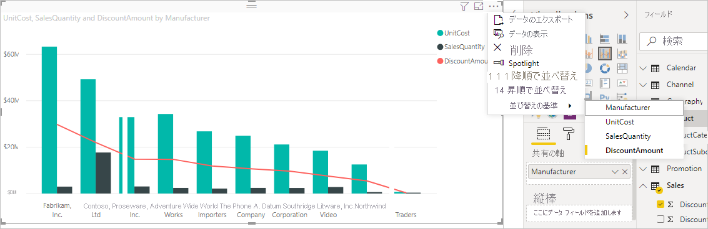
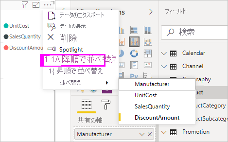
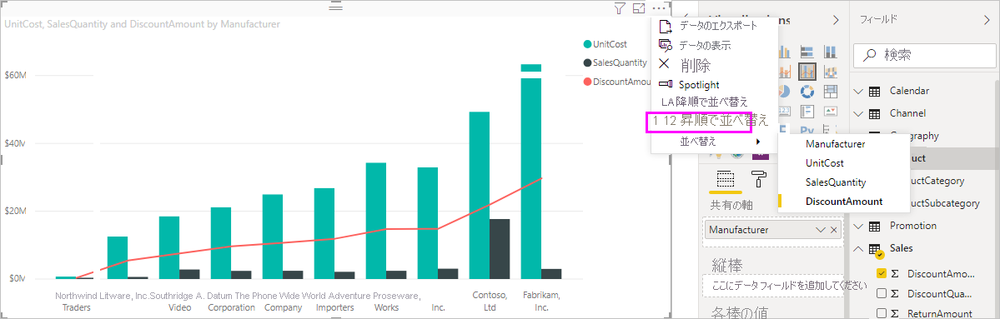
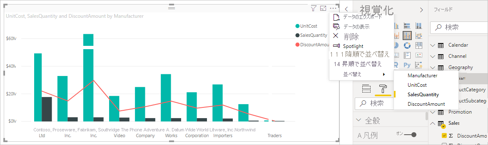

# Power BI Desktop での列による並べ替え
Power BI Desktop と Power BI サービスでは、さまざまなデータ フィールドを並べ替えることで視覚効果を変更できます。 並べ替えで視覚化を変更することで、伝えたい情報を強調でき、その傾向 (あるいは強調したい点) を視覚化に反映させることができます。

数値データ (売り上げ高など) を使用している場合でも、テキスト データ (州名など) を使用している場合でも、ご利用の視覚エフェクトを並べ替え、目的に応じたスタイルで表示できます。 Power BI では非常に柔軟に並べ替えを行うことができ、クイック メニューが用意されています。 ビジュアルを並べ替えるには、その **[その他のオプション]** (...) メニューを選択し、 **[並べ替え]** を選択してから、並べ替えの基準にするフィールドを選択します。

![[その他のオプション] メニュー](media/desktop-sort-by-column/sortbycolumn_2.png)

## 並べ替えの例
もっと詳しい例を使用して、Power BI Desktop のしくみを確認しましょう。

次の視覚エフェクトでは、製造元の名前別に費用、数量、金額が示されています。 並べ替えを行う前は、ここに表示されているとおりの視覚エフェクトです。

現在、ビジュアルは **SalesQuantity** 列で並べ替えられています。 昇順のバーの色を凡例に一致させることで並べ替え列を決定できますが、より便利な方法として **[その他のオプション]** メニューがあります。これにアクセスするには、省略記号 (...) を選択します。

![[その他のオプション] メニュー](media/desktop-sort-by-column/sortbycolumn_2.png)

並べ替えの選択項目は次のとおりです。

* 現在の並べ替えフィールドは **SalesQuantity** です ( **[SalesQuantity]** が太字で示され、黄色の棒が前に付いています)。 

* 現在の並べ替え方向は昇順です ( **[昇順で並べ替え]** が太字で示され、黄色の棒が前に付いています)。

並べ替えフィールドと並べ替え方向については、次の 2 つのセクションで確認します。

## 並べ替えに使用する列を選択
**[その他のオプション]** メニューの **[SalesQuantity]** の前に黄色の棒がありました。これは、ビジュアルが **SalesQuantity** 列を基準に並べ替えられていることを示します。 別の列によって並べ替えを行うのは簡単です。省略記号 (...) を選択して **[その他のオプション]** メニューを表示し、 **[並べ替え]** を選択して、別の列を選択します。

次の図では、並べ替えの基準にする列として **[DiscountAmount]** を選択しました。 その列は、ビジュアル上では棒の 1 つとしてではなく、線の 1 つとして表示されます。 

図がどのように変更されたかに注目してください。 この値は今、最高の **DiscountAmount** 値を示す Fabrikam Inc. から最低の Northwind Traders まで降順で並べられています。 

降順ではなく、昇順に並べ替える必要がある場合は、どうしたらよいでしょうか。 次のセクションでは、それがいかに簡単かを示します。

## 並べ替え順序を選択
前の図の **[その他のオプション]** メニューを詳しく見てみると、 **[降順で並べ替え]** が太字で表示され、前に棒が付いているのがわかります。

**[降順で並べ替え]** が選択されている場合、ビジュアルが選択された列によって最大値から最小値へと降順で並べ替えられていることを意味します。 変更する必要がありますか。 ご心配なく。 **[昇順で並べ替え]** を選択するだけで、選択した列の並べ替え順序が最も小さい値から最も大きい値への昇順に変更されます。

同じビジュアルにおいて、**DiscountAmount** の順序付けを変更すると、次のようになります。 今度は製造元として Northwind Traders が最初に、Fabrikam Inc. が最後に表示されてます。前とは逆の順序になっています。

ビジュアルに含まれる任意の列を基準にして並べ替えることができます。並べ替えの基準列として **SalesQuantity** を選択すると、それだけで、売り上げが最も大きい製造元が最初に表示されるようになり、ビジュアル内のその他の列はそのまま保持され、それらはその製造元に適用されます。 それらの設定で表示されたビジュアルは次のとおりです。

## [列で並べ替え] ボタンを使用して並び替える
データを並べ替える別の方法として、 **[列ツール]** タブの **[列で並べ替え]** を使用する方法があります。

![[列で並べ替え] ボタン](media/desktop-sort-by-column/power-bi-column-tools.png)

この並べ替えのアプローチでは、 **[フィールド]** ペインから、並べ替える列 (フィールド) をまず選択し、次に **[列ツール]**  >  **[列で並べ替え]** の順に選択することで、ご利用の視覚化を並べ替える必要があります。 最初に **[フィールド]** ペインから列を選択しなかった場合は、 **[列で並べ替え]** ボタンが非アクティブになります。

一般的な例を見てみましょう。 1 年間の月ごとのデータがあって、それらが現在、四半期を基準に並べられているとします。 これを、時系列の順序に並べ替えたいと思います。 次の手順は、その方法を示しています。

1. **[フィールド]** ペインで、並べ替えの基準となる列を選択すると、 **[列で並べ替え]** ボタンがアクティブになります。 この例の場合、視覚化は **Month** フィールドの **四半期** 順で並べられています。
   
   ![[列で並べ替え] ボタンが有効](media/desktop-sort-by-column/power-bi-sort.png)    
3. 次に、視覚化が選択された状態で **[MonthNo]** を選択すると、視覚化が目的の順序 (年の月順) に並べ替えられます。
   
   ![[列で並べ替え] メニュー](media/desktop-sort-by-column/power-bi-new-sort.png)

<!---
This functionality is no longer active. Jan 2020

## Getting back to default column for sorting
You can sort by any column you'd like, but there may be times when you want the visual to return to its default sorting column. No problem. For a visual that has a sort column selected, open the **More options** menu and select that column again, and the visualization returns to its default sort column.

For example, here's our previous chart:

When we go back to the menu and select **SalesQuantity** again, the visual defaults to being ordered alphabetically by **Manufacturer**, as shown in the following image.

With so many options for sorting your visuals, creating just the chart or image you want is easy.
--->

## 次のステップ

次の記事にも興味をもたれるかもしれません。

* [Power BI Desktop でレポート間のドリルスルーを使用する](desktop-cross-report-drill-through.md)
* [Power BI のスライサー](../visuals/power-bi-visualization-slicers.md)
