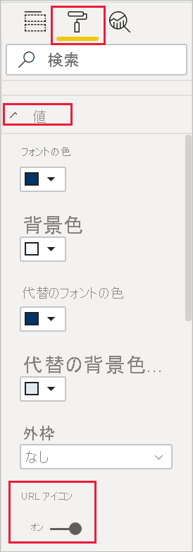
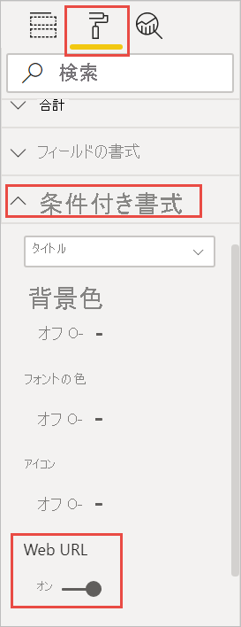

# テーブルまたはマトリックスにハイパーリンク (URL) を追加する
このトピックでは、テーブルにハイパーリンク (URL) を追加する方法について説明します。 Power BI Desktop を使用して、データセットにハイパーリンク (URL) を追加します。 Power BI Desktop または Power BI サービスでレポートのテーブルとマトリックスにそのハイパーリンクを追加できます。 これで、URL またはリンク アイコンを表示することや、別の列をリンク テキストとして書式を設定できるようになります。

[レポートのテキスト ボックス](service-add-hyperlink-to-text-box.md)内のハイパーリンクは、Power BI サービスと Power BI Desktop を使用して作成することもできます。 また、Power BI サービスでは、[ダッシュボード上のタイル](service-dashboard-edit-tile.md)と[ダッシュボード上のテキスト ボックス](service-dashboard-add-widget.md)にハイパーリンクを追加できます。 

## Power BI Desktop で URL をハイパーリンクとして書式を設定する

URL を含むフィールドは、Power BI Desktop ではハイパーリンクとして書式を設定できますが、Power BI サービスではできません。 Power BI にブックをインポートする前に、[Excel Power Pivot でハイパーリンクの書式を設定する](#create-a-table-or-matrix-hyperlink-in-excel-power-pivot)こともできます。

1. Power BI Desktop で、ハイパーリンクを含むフィールドがデータセットにまだ存在しない場合は、[カスタム列](../transform-model/desktop-common-query-tasks.md)として追加します。

    > [!NOTE]
    > DirectQuery モードでは列を作成できません。  ただし、データに URL が既に含まれている場合は、それらの URL をハイパーリンクに変えることができます。

2. データ ビューまたはレポート ビューで列を選択します。 

3. **[モデリング]** タブで、 **[データ カテゴリ]**  >  **[Web URL]** を選択します。
   
    ![[データ カテゴリ] のドロップダウン リスト](media/power-bi-hyperlinks-in-tables/power-bi-format-web-url.png)

    > [!NOTE]
    > URL は特定のプレフィックスで始める必要があります。 完全な一覧については、この記事の「[考慮事項とトラブルシューティング](#considerations-and-troubleshooting)」を参照してください。

## ハイパーリンクを含むテーブルまたはマトリックスを作成する

1. [ハイパーリンクを URL として書式を設定](#format-a-url-as-a-hyperlink-in-power-bi-desktop)したら、レポート ビューに切り替えます。
2. Web URL として分類したフィールドを含むテーブルまたはマトリックスを作成します。 ハイパーリンクは青色で下線付きです。

    

## URL ではなくハイパーリンク アイコンを表示する

テーブルに長い URL が表示されないようにするには、代わりにハイパーリンク アイコン  を表示できます。 

> [!NOTE]
> マトリックスにアイコンを表示することはできません。
   
1. まず、[ハイパーリンクを含むテーブルを作成](#create-a-table-or-matrix-with-a-hyperlink)します。

2. テーブルを選択してアクティブにします。

    **[書式設定]** アイコン  を選択して、[書式設定] タブを開きます。

    **[値]** を展開し、 **[URL アイコン]** を探して **[オン]** にします。

    

1. (省略可能) Power BI Desktop から Power BI サービスに[レポートを発行](desktop-upload-desktop-files.md)します。 Power BI サービスでレポートを開くと、ハイパーリンクも使用できるようになります。

## リンク テキストをハイパーリンクとして書式を設定する

また、テーブル内の別のフィールドをハイパーリンクとして書式を設定し、URL の列がまったく存在しないようにすることもできます。 この場合、列の書式を Web URL として設定しません。

> [!NOTE]
> 別のフィールドをマトリックスのハイパーリンクとして書式を設定することはできません。

1. ハイパーリンクを含むフィールドがデータセット内に存在しない場合は、Power BI Desktop を使用して、[カスタム列](../transform-model/desktop-common-query-tasks.md)として追加します。 繰り返しになりますが、DirectQuery モードでは新しい列を作成できません。  ただし、データに URL が既に含まれている場合は、それらの URL をハイパーリンクに変えることができます。

2. データ ビューまたはレポート ビューで、URL が含まれている列を選択します。 

3. **[モデリング]** タブで、 **[データ カテゴリ]** を選択します。 列が **[未分類]** として書式設定されていることを確認します。

2. レポート ビューで、URL 列と、リンク テキストとして書式を設定する列を含むテーブルまたはマトリックスを作成します。

3. テーブルを選択した状態で **[書式設定]** アイコン  を選択して [書式設定] タブを開きます。

4. **[条件付き書式]** を展開し、ボックス内の名前がリンク テキストとして使用する列であることを確認します。 **[Web URL]** を検索して **[オン]** にします。

    

    > [!NOTE]
    > **[Web URL]** オプションが表示されていない場合、ハイパーリンクが含まれる列が **[データ カテゴリ]** ドロップダウン ボックスで **[Web URL]** として書式設定されて "*いない*" ことを確認してください。

5. **[Web URL]** ダイアログ ボックスで、 **[フィールドに基づく]** ボックスで URL を含むフィールドを選択し、 **[OK]** を選択します。

    ![[Web URL] ダイアログ ボックス](media/power-bi-hyperlinks-in-tables/power-bi-format-web-url-dialog.png)

    これで、その列のテキストがリンクとして書式が設定されます。

    

1. (省略可能) Power BI Desktop から Power BI サービスに[レポートを発行](desktop-upload-desktop-files.md)します。 Power BI サービスでレポートを開くと、ハイパーリンクも使用できるようになります。

## Excel Power Pivot でテーブルまたはマトリックスのハイパーリンクを作成する

Power BI のテーブルおよびマトリックスにハイパーリンクを追加するもう 1 つの方法は、Power BI からデータセットにインポート/接続する前に、そのデータセット内でハイパーリンクを作成することです。 この例では Excel ブックを使います。

1. Excel でブックを開きます。
2. **[PowerPivot]** タブを選び、 **[管理]** を選びます。
   
   
1. PowerPivot が開いたら、 **[詳細設定]** タブを選びます。
   
   ![PowerPivot の [詳細設定] タブ](media/power-bi-hyperlinks-in-tables/createhyperlinkinpowerpivot3.png)
4. Power BI テーブル内でハイパーリンクに変換する URL が含まれている列に、カーソルを置きます。
   
   > [!NOTE]
   > URL は特定のプレフィックスで始める必要があります。 詳細な一覧については、「[考慮事項とトラブルシューティング](#considerations-and-troubleshooting)」を参照してください。
   > 
   
5. **[レポートのプロパティ]** グループで、 **[データ カテゴリ]** ドロップダウンを選び、 **[Web URL]** を選びます。 
   
   ![Excel 内の [データ カテゴリ] ドロップダウン リスト](media/power-bi-hyperlinks-in-tables/createhyperlinksnew.png)

6. Power BI サービスまたは Power BI Desktop から、このブックに接続するか、このブックをインポートします。
7. [URL] フィールドが含まれるテーブル視覚化を作成します。
   
   ![Power BI で [URL] フィールド付きのテーブルを作成する](media/power-bi-hyperlinks-in-tables/hyperlinksintables.gif)

## 考慮事項とトラブルシューティング

URL は、次のいずれかで始まる必要があります。
- http
- https
- mailto
- ftp
- news
- telnet

Q: カスタム URL を、テーブルまたはマトリックス内のハイパーリンクとして使用できますか。    
A: いいえ。 リンク アイコンを使用できます。 ハイパーリンク用のカスタム テキストが必要で、URL の一覧が短い場合には、代わりにテキスト ボックスを使うことができます。

## 次の手順
[Power BI レポートでの視覚化](../visuals/power-bi-report-visualizations.md)

[Power BI サービスのデザイナー向けの基本的な概念](../fundamentals/service-basic-concepts.md)

他にわからないことがある場合は、 [Power BI コミュニティを利用してください](https://community.powerbi.com/)。
