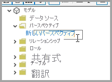
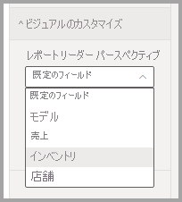

# ユーザーがレポート内のビジュアルをカスタマイズできるようにする

[!INCLUDE [applies-to](../includes/applies-to.md)] [!INCLUDE [yes-desktop](../includes/yes-desktop.md)] [!INCLUDE [yes-service](../includes/yes-service.md)]

多くの対象ユーザーとレポートを共有するとき、一部のユーザーが、特定のビジュアルの少し異なるビューを表示することが必要な場合もあります。 場合によっては、軸の内容を入れ替えたり、ビジュアルの種類を変更したり、ツールヒントに何かを追加したりする必要があります。 すべてのユーザーの要件を満たす 1 つのビジュアルを作成するのは困難です。 この新しい機能により、ビジネス ユーザーがレポートの読み取りビューで、視覚エフェクトを探索およびカスタマイズするための権限を与えることができます。 ビジュアルを必要に応じて調整し、戻るためのブックマークとして保存することができます。 レポートの編集アクセス許可を持っている必要はなく、変更のためにレポートの作成者に戻る必要もありません。

:::image type="content" source="media/power-bi-personalize-visuals/power-bi-personalize-visual.png" alt-text="ビジュアルをカスタマイズする":::
 
## レポート ユーザーが変更できるレポート

この機能により、ビジネス ユーザーは Power BI レポートの視覚エフェクトをアドホック探索することで、さらなる分析情報を得ることができます。 この機能をユーザーとして使用する方法については、[レポート内の視覚エフェクトのカスタマイズ](../consumer/end-user-personalize-visuals.md)に関する記事をご覧ください。 この機能は、レポート閲覧者の基本的な調査シナリオを有効にする必要があるレポートの作成者にとって理想的です。 レポートの閲覧者が行うことができる変更を次に示します。

- 視覚化の種類の変更
- メジャーまたはディメンションをスワップ アウトする
- 凡例を追加または削除する
- 2 つ以上のメジャーを比較する
- 集計を変更する、など

この機能によって、新しい探索機能が使用できるようになるだけではなく、 ユーザーが変更をキャプチャして共有する方法も含まれています。

- 変更内容をキャプチャする
- 変更内容を共有する
- レポートのすべての変更をリセットする
- ビジュアルのすべての変更をリセットする
- 最近の変更をクリアする

## パースペクティブを使用してより焦点を絞ったビューにする

ビジュアルをカスタマイズするために、**パースペクティブ** を使用して、より焦点を絞ったビューを提供するモデルのサブセットを選択できます。 サブセットを選択すると、大規模なデータ モデルを使用する場合に便利です。これにより、フィールドの管理可能なサブセットに集中でき、その大規模なモデル内のフィールドの完全なコレクションでレポート閲覧者に過剰な負担をかけることがなくなります。 

パースペクティブを使用する場合は、次の点に注意してください。

* パースペクティブは、セキュリティ メカニズムとして使用するためのものではなく、エンドユーザー エクスペリエンスをより良いものにするためのツールです。 パースペクティブのセキュリティはすべて、基になるモデルから継承されます。

* 表形式モデルと多次元モデルの両方のパースペクティブがサポートされています。 ただし、多次元モデルのパースペクティブでは、レポートのベース キューブと同じになるようにしかパースペクティブを設定できません。

* モデルからパースペクティブを削除する前に、そのパースペクティブがビジュアルのカスタマイズ エクスペリエンスで使用されていないことを確認してください。 

パースペクティブを使用するには、レポートに対して [ビジュアルのカスタマイズ] を有効にする必要があります。 また、ビジュアルのカスタマイズ エクスペリエンスのために、エンドユーザーに操作させたいパースペクティブ (ディメンションとメジャーを含む) を少なくとも 1 つ作成する必要があります。

パースペクティブを作成するには、[Tabular Editor](https://tabulareditor.com/) を使用します。これは次の場所からダウンロードできます。Tabular Editor のダウンロード

**Tabular Editor** をインストールしたら、**Power BI Desktop** でレポートを開き、次の図に示すように、リボンの **[外部ツール]** タブから **Tabular Editor** を起動します。

![[外部ツール] リボンの Tabular Editor](media/power-bi-personalize-visuals/power-bi-personalize-perspective-02.png)

Tabular Editor で、**Perspectives** フォルダーを右クリックして、新しいパースペクティブを作成します。

テキストをダブルクリックして、パースペクティブの名前を変更できます。

次に、パースペクティブにフィールドを追加します。これを行うには、Tabular Editor で **Tables** フォルダーを開き、パースペクティブに表示するフィールドを右クリックします。

パースペクティブに追加するフィールドごとに、そのプロセスを繰り返します。 パースペクティブに重複するフィールドを追加することはできないため、既にパースペクティブに追加されているフィールドには、それを追加することを無効にするオプションがあります。

必要なすべてのフィールドを追加したら、Tabular Editor と Power BI Desktop の両方で必ず設定を保存してください。

新しいパースペクティブをモデルに保存し、Power BI Desktop レポートを保存したら、そのページの **[形式]** ウィンドウに移動します。ここに、 **[ビジュアルのカスタマイズ]** の新しいセクションが表示されます。

![[形式] ウィンドウの [ビジュアルのカスタマイズ] セクション](media/power-bi-personalize-visuals/power-bi-personalize-perspective-07.png)

*[レポート閲覧者パースペクティブ]* の選択は、最初は *[既定のフィールド]* に設定されます。 ドロップダウン矢印を選択すると、作成した他のパースペクティブが表示されます。

レポート ページのパースペクティブを設定すると、そのページのビジュアルのカスタマイズ エクスペリエンスが、選択したパースペクティブにフィルター処理されます。 **[Apply to all pages]\(すべてのページに適用\)** を選択すると、レポート内の既存のすべてのページにパースペクティブ設定を適用できます。

![レポート全体に適用するパースペクティブに対して [Apply to all pages]\(すべてのページに適用\) を選択します](media/power-bi-personalize-visuals/power-bi-personalize-perspective-09.png)

## レポートの個人用設定を有効化する

この機能は Power BI Desktop または Power BI サービスのいずれかで有効にすることができます。 埋め込みレポートで有効にすることもできます。

### Power BI Desktop の場合

Power BI Desktop でこの機能を有効にするには、 **[ファイル]**  >  **[オプションと設定]**  >  **[オプション]**  >  **[現在のファイル]**  >  **[レポート設定]** を選択します。 **[Personalize visuals]\(視覚エフェクトのカスタマイズ\)** が有効になっていることを確認します。

:::image type="content" source="media/power-bi-personalize-visuals/personalize-report-setting-desktop.png" alt-text="レポートの個人用設定を有効化する":::

### Power BI サービスの場合

代わりに、Power BI サービスでこの機能を有効にするには、レポートの **[設定]** にアクセスします。

:::image type="content" source="media/power-bi-personalize-visuals/power-bi-report-service-settings-personalize-visual.png" alt-text="Power BI サービスのレポート設定":::

**[Personalize visuals]\(視覚エフェクトのカスタマイズ\)**  >  **[保存]** をオンにします。

:::image type="content" source="media/power-bi-personalize-visuals/personalize-report-setting-service.png" alt-text="サービスの [ビジュアルのカスタマイズ] をオンにする":::

## ページまたは視覚化レベルで機能をオンまたはオフにする

特定のレポートに対して [Personalize visuals]\(視覚エフェクトのカスタマイズ\) を有効にすると、既定では、そのレポート内のすべての視覚エフェクトをカスタマイズできます。 すべての視覚エフェクトをカスタマイズしたくない場合は、ページごと、または視覚エフェクトごとに設定をオンまたはオフにすることができます。

### ページごと

[ページ] タブを選択 > **[視覚化]** ペインで **[書式]** を選択します。

:::image type="content" source="media/power-bi-personalize-visuals/personalize-page-level-setting.png" alt-text="ページに対して [視覚エフェクトのカスタマイズ] を選択します。":::
 
**[視覚エフェクトのカスタマイズ]**  >   **[オン]** または **[オフ]** にスライドします。

### 視覚エフェクトごと

ビジュアルを選択し、 **[視覚化]** ペインで **[書式]** を選択し、 **[ビジュアル ヘッダー]** を展開します。

:::image type="content" source="media/power-bi-personalize-visuals/power-bi-format-visual-header-personalize.png" alt-text="[ビジュアル ヘッダー] を選択する":::
 
**[視覚エフェクトのカスタマイズ]**  >   **[オン]** または **[オフ]** にスライドします。

:::image type="content" source="media/power-bi-personalize-visuals/power-bi-format-visual-personalize-on-off.png" alt-text="[視覚エフェクトのカスタマイズ] スライダーをオンまたはオフにする":::

## 制限事項

現在、この機能には注意すべきいくつかの制限事項があります。

- Web に公開ではこの機能はサポートされていません。
- ユーザー探索は自動的に保持されません。 変更をキャプチャするには、個人用ブックマークとしてビューを保存する必要があります。
- この機能は、iOS と Android タブレット用の Power BI モバイルアプリ、および Power BI Windows アプリでサポートされています。スマートフォン用の Power BI モバイル アプリではサポートされていません。 ただし、Power BI サービスの使用中に個人用ブックマークに保存した視覚エフェクトの変更は、すべての Power BI モバイル アプリに適用されます。

## 次の手順

[レポート内のビジュアルをカスタマイズする](../consumer/end-user-personalize-visuals.md)。     

新しいビジュアルの個人用設定のエクスペリエンスを試してみてください。 この機能のフィードバックや、機能改善を続けていくための方法に関するご意見については、[Power BI のアイデア サイト](https://ideas.powerbi.com/forums/265200-power-bi)からお寄せください。 

他にわからないことがある場合は、 [Power BI コミュニティを利用してください](https://community.powerbi.com/)。
