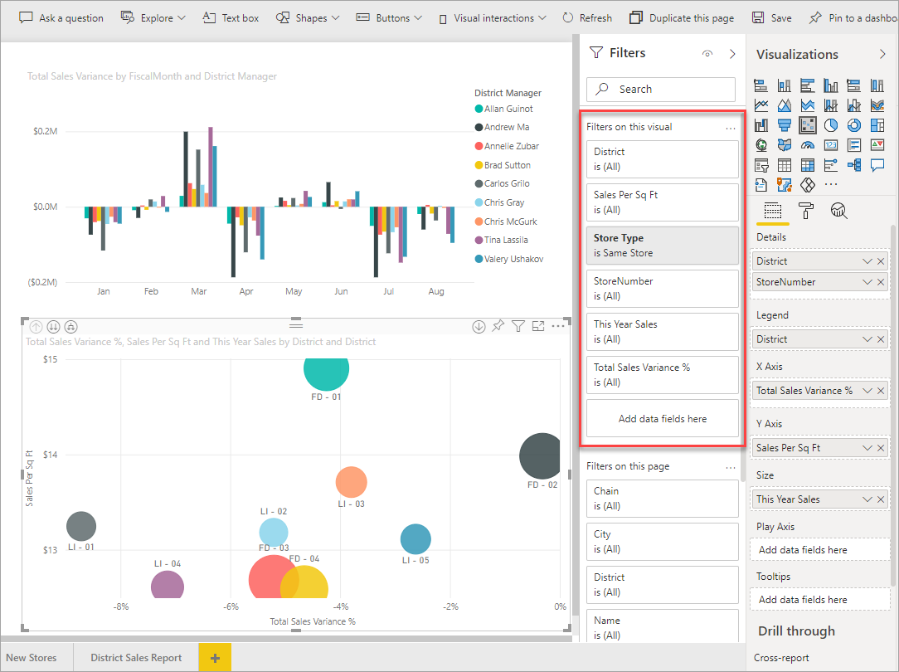
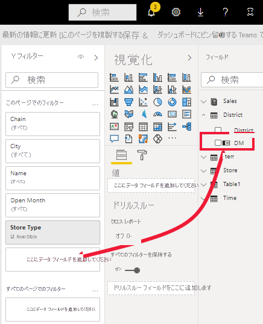

# Power BI でのレポートへのフィルターの追加

この記事では、Power BI でレポートに視覚化フィルター、ページ フィルター、またはレポート フィルターを追加する方法について説明します。 フィルターを追加するには、レポートを編集できる必要があります。 この記事に含まれている例は Power BI サービスのものですが、手順は Power BI Desktop でもほぼ同じです。 概要については、 最初に「[Power BI レポートのフィルターと強調表示](power-bi-reports-filters-and-highlighting.md)」を参照してください。

Power BI には、手動と自動からドリルスルーとパススルーまで、さまざまな種類のフィルターが多数用意されています。 [さまざまなフィルターの種類](power-bi-report-filter-types.md)に関する記事をご覧ください。

フィルターを追加した後は、望ましい外見と動作になるように [Power BI レポートでフィルターを書式設定する](power-bi-report-filter.md)ことができます。

## 編集ビューまたは読み取りビューでのフィルター
2 つの異なるビューでレポートを操作できます。読み取りビューと編集ビューです。 この記事では、レポートの **編集ビュー** でフィルターを作成する方法について説明します。  読み取りビューでのフィルターについて詳しくは、[レポートの読み取りビューのフィルターとの対話](../consumer/end-user-report-filter.md)に関する記事をご覧ください。

フィルターは "*永続的*" であるため、ユーザーがレポートから離れても、Power BI によってフィルター、スライサー、ユーザーが行ったその他のデータ ビューの変更は保持されます。 そのため、レポートに戻ったとき、前回終了したところから再開できます。 フィルターの変更内容を残したくない場合は、上部のメニュー バーから **[既定値にリセット]** を選択します。

:::image type="content" source="../consumer/media/end-user-report-filter/power-bi-reset-icon.png" alt-text="[既定値にリセット] アイコン。":::

レポートの作成者がレポートと共に保存したすべてのフィルターは、すべてのレポート閲覧者に対して "*既定のフィルター状態*" になることに注意してください。 **[既定値にリセット]** を選択すると、その状態に戻ります。

## [フィルター] ウィンドウのフィルターのレベル
Power BI Desktop と Power BI サービスのどちらを使用しているかに関係なく、[フィルター] ペインはレポート キャンバスの右側に表示されます。 フィルター ウィンドウが表示されない場合は、右上隅にある ">" アイコンを選択して展開してください。

レポートには、視覚化レベル、ページ レベル、レポート レベルという 3 つの異なるレベルでフィルターを設定できます。 この記事では、各レベルを設定する方法について説明します。

## ビジュアルにフィルターを追加する
視覚化には、2 種類のフィルターがあります。
視覚化レベルのフィルターは、2 つの方法で視覚化に追加できます。 

* 視覚化内のフィールドは、自動的にその視覚化に対するフィルターになります。 
* レポート デザイナーは、まだ視覚化ではないフィールドを識別し、そのフィールドを **視覚化レベル フィルター** バケットに直接追加できます。
 
ところで、この記事では小売りの分析サンプルを使用するので、よろしければインストールして同じように操作してみてください。 [小売りの分析のサンプル](sample-retail-analysis.md#get-the-content-pack-for-this-sample) コンテンツ パックをインストールします。

### ビジュアルに含まれていないフィールドでフィルター処理する

1. Power BI サービスで、 **[その他のオプション (...)]**  >  **[編集]** を選択して、編集ビューでレポートを開きます。
   
   

2. まだ開いていない場合は、[視覚化]、[フィルター]、および [フィールド] ペインを開きます。
   
   ![[視覚化]、[フィルター]、[フィールド] のウィンドウ](media/power-bi-report-add-filter/power-bi-display-panes.png)

3. ビジュアルを選んでアクティブにします。 この場合は [Overview] ページの散布図です。 視覚エフェクト内のすべてのフィールドが **[視覚化]** ペインに表示されます。 それらは **[フィルター]** ペインの **[Filters on this visual]\(この視覚エフェクトでのフィルター\)** 見出しの下にも表示されます。
   
   
  
1. [フィールド] ペインから、新しい視覚化レベル フィルターとして追加するフィールドを選び、 **[このビジュアルでのフィルター]** 領域までドラッグします。  この例では、 **[Category]** を **[ここにデータ フィールドを追加してください]** にドラッグします。
     
    ![[フィルター] ウィンドウにフィールドを追加](media/power-bi-report-add-filter/power-bi-search-add-visual-filter.png)

    **[Category]** は視覚エフェクト自体に追加されるのでは "*ない*" ことがわかります。
     
1. **Kids** を選択します。 散布図はフィルター処理されますが、他の視覚エフェクトは同じままです。
     
    

    レポートをこのフィルターと共に保存すると、レポート閲覧者が読み取りビューで **Category** フィルターを操作して、値を選択したりクリアしたりできるようになります。
    
    "*数値列*" をフィルター ウィンドウにドラッグしてビジュアルレベルのフィルターを作成すると、フィルターは "*基になるデータの行*" に適用されます。 たとえば、**UnitCost** フィールドにフィルターを追加し、それを **UnitCost** > 20 に設定した場合、ビジュアルに表示されているデータ ポイントの合計単価に関係なく、単価が 20 を超えた製品行のデータのみが表示されます。

## ページ全体にフィルターを追加する

ページ レベル フィルターを追加して、ページ全体をフィルター処理することもできます。

1. Power BI サービスで、小売りの分析レポートを開き、 **[District Monthly Sales]\(地区の毎月の売上\)** ページに移動します。 

2. **[...]**  >  **[レポートの編集]** を選択し、編集ビューでレポートを開きます。
   
   

2. まだ開いていない場合は、[視覚化]、[フィルター]、および [フィールド] ペインを開きます。

3. [フィールド] ペインから、新しいページ レベル フィルターとして追加するフィールドを選び、 **[このページでフィルター]** 領域の下部にドラッグします。  

   

1. フィルターを適用する値を選び、フィルター処理コントロールとして **基本** または **高度** を設定します。
   
   ページ上のすべての視覚化が、変更を反映するように再描画されます。
   
    レポートをフィルターとともに保存すると、レポート閲覧者が読み取りビューでフィルターと対話でき、値を選んだりクリアしたりすることができます。

## レポート レベル フィルターを追加して、レポート全体をフィルター処理する

1. **[レポートの編集]** を選んで、編集ビューでレポートを開きます。
   
   

2. [視覚化] と [フィルター] のウィンドウと [フィールド] ウィンドウをまだ開いていない場合は、開きます。
3. [フィールド] ウィンドウで新しいレポート レベル フィルターとして追加するフィールドを選び、 **[レポート レベル フィルター]** 領域までドラッグします。  
4. フィルターする値を選択します。

    アクティブ ページおよびレポート内のすべてのページ上のビジュアルに、新しいフィルターが反映されます。 レポートをフィルターとともに保存すると、レポート閲覧者が読み取りビューでフィルターと対話でき、値を選んだりクリアしたりすることができます。

1. 戻る矢印を選んで、前のレポート ページに戻ります。

## 考慮事項とトラブルシューティング

- [フィールド] ペインが表示されない場合は、レポートが[編集ビュー](service-interact-with-a-report-in-editing-view.md)になっていることを確認してください。
- フィルターに多くの変更を加えた後で、既定の設定に戻す場合は、上部のメニュー バーから **[既定値にリセット]** を選択します。 覚えておいてください:レポート作成者がレポートを保存するときに適用されていたすべてのフィルターは、既定のフィルター設定に "*なります*"。

## 次のステップ

[Power BI レポートでフィルターを書式設定する](power-bi-report-filter.md)

[レポート フィルター ウィンドウの使用方法](../consumer/end-user-report-filter.md)

[レポート内のフィルターと強調表示](power-bi-reports-filters-and-highlighting.md)

[Power BI で使用できるさまざまなフィルター](power-bi-report-filter-types.md)

他にわからないことがある場合は、 [Power BI コミュニティを利用してください](https://community.powerbi.com/)。
