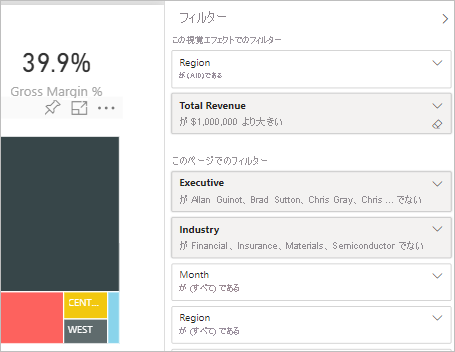
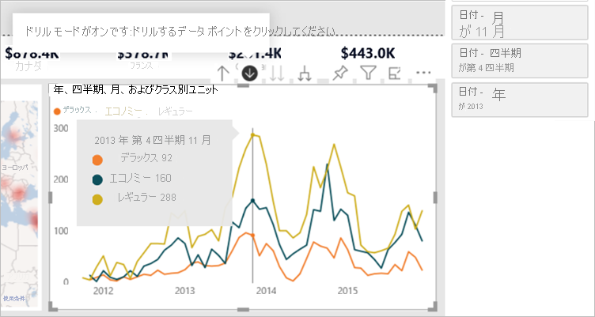
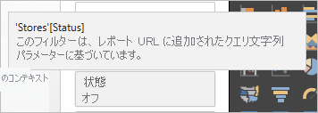
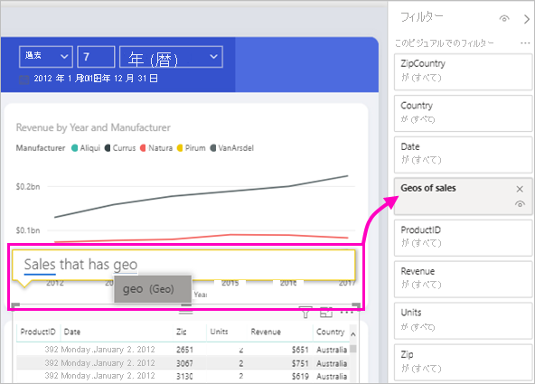

# Power BI レポート内のフィルターの種類

フィルターがどのように作成されたかはそれぞれ異なるため、その動作もそれぞれ異なります。 それらをどのように作成するかが、編集モードでのフィルター ペインの動作に影響を及ぼします。 この記事では、さまざまなフィルターの種類、作成方法、各フィルターが何に適しているかを説明します。 [フィルターをレポートに追加](power-bi-report-add-filter.md)する方法をお読みください。 

まずは 2 種類の最も一般的なフィルター、自動と手動について説明します。

## 自動フィルター 

自動フィルターは、ビジュアルを作成するときにフィルター ウィンドウのビジュアル レベルに自動的に追加されるフィルターです。 これらのフィルターは、ご自身のビジュアルを構成するフィールドに基づいています。 レポートに対する編集アクセス許可を持つユーザーが、ペインでこのフィルターに対して編集、クリア、非表示、ロック、名前変更、または並べ替えの操作を行うことができます。 自動フィルターを削除することはできません。それらのフィールドは、ビジュアルによって参照されているためです。

## 手動フィルター 

手動フィルターは、レポートを編集している際にフィルター ペインの任意のセクションにドラッグ アンド ドロップするフィルターです。 レポートに対する編集アクセス許可がある場合、ペインでこのフィルターに対して編集、削除、クリア、非表示、ロック、名前変更、または並べ替えの操作を行うことができます。

[フィルターをレポートに追加](power-bi-report-add-filter.md)する方法を参照してください。

## 高度なフィルター

このフィルターの種類はあまり一般的ではありませんが、お使いのレポートに表示されている場合は、やはり理解しておくことが重要です。 また、レポートに適したフィルターを作成するうえで、これが役に立つこともあります。

## 含める/除外するフィルター

含めるフィルターと除外するフィルターは、ビジュアルに対して含める機能または除外する機能を使用すると、フィルター ウィンドウに自動的に追加されます。 レポートを編集できる場合は、ペインでこのフィルターの削除、ロック、非表示、または並べ替えを行うことができます。 含めるフィルターまたは除外するフィルターを編集、クリア、または名前変更することはできません。これは視覚化の含める機能および除外する機能に関連付けられているためです。

## ドリルダウン フィルター

ドリルダウン フィルターは、お使いのレポートのビジュアルに対してドリルダウン機能を使用すると、フィルター ウィンドウに自動的に追加されます。 レポートを編集できる場合は、ペインでフィルターを編集またはクリアできます。 このフィルターに対して削除、非表示、ロック、名前変更、または並べ替えの操作を行うことはできません。これは視覚化のドリルダウン機能に関連付けられているためです。 ドリルダウン フィルターを削除するには、視覚化のドリルアップ ボタンを選択します。

## クロス詳細フィルター

クロス詳細フィルターは、ドリルダウン フィルターがクロスフィルターやクロス強調表示機能を介してレポート ページの他の視覚化に渡された場合に、自動的にペインに追加されます。 レポートを編集できる場合でも、このフィルターに対して削除、クリア、非表示、ロック、名前変更、または並べ替えの操作を行うことはできません。これは視覚化のドリルダウン機能に関連付けられているためです。 また、このフィルターは、他の視覚化でのドリルダウンによって取得されるため、編集することもできません。 ドリルダウン フィルターを削除するには、フィルターを渡している視覚化のドリルアップ ボタンを選択します。

## ドリルスルー フィルター

ドリルスルー フィルターは、ドリルスルー機能を介してページからページに渡されます。 それらは [ドリルスルー] ペインに表示されます。 2 種類のドリルスルー フィルターがあります。 1 つ目はドリルスルーを呼び出す種類です。 レポートを編集できる場合は、この種類のフィルターに対して編集、削除、クリア、非表示、またはロックの操作を行うことができます。 2 つ目の種類は、ソース ページのページ レベル フィルターに基づいてターゲットに渡されるドリルスルー フィルターです。 この一時的な種類のドリルスルー フィルターを編集、削除、またはクリアすることができます。 エンド ユーザーに対してこのフィルターのロックまたは非表示を行うことはできません。

[ドリルスルー フィルターの作成](desktop-drillthrough.md)に関する記事を参照してください。

## URL フィルター

URL フィルターは、URL クエリ パラメーターを追加することで、ペインに追加されます。 レポートを編集できる場合は、ペインでフィルターを編集、削除、またはクリアできます。 このフィルターに対して非表示、ロック、名前変更、または並べ替えの操作を行うことはできません。これは URL パラメーターに関連付けられているためです。 フィルターを削除するには、URL からパラメーターを削除します。 パラメーターを持つ URL の例を次に示します。

app.powerbi.com/groups/me/apps/*app-id*/reports/*report-id*/ReportSection?filter=Stores~2FStatus%20eq%20'Off'

[URL フィルターの設定](../collaborate-share/service-url-filters.md)に関する記事を参照してください。

## パススルー フィルター

パススルー フィルターは、Q&A によって作成されたビジュアル レベル フィルターです。 レポートを編集できる場合は、ペインでこれらのフィルターの削除、非表示、または並べ替えを行うことができます。 ただし、これらのフィルターに対して名前変更、編集、クリア、またはロックの操作を行うことはできません。

## フィルターの種類の比較

この表では、作成者がさまざまな種類のフィルターを使って行える操作を比較します。

| フィルターの種類 | [編集] | Clear | 削除 | 非表示 | ロック | 並べ替え | 名前の変更 |
|----|----|----|----|----|----|----|----|
| 手動フィルター | Y | Y | Y | Y | Y | Y | Y |
| 自動フィルター | Y | Y | N | Y | Y | Y | Y |
| 含める/除外するフィルター | N | N | Y | Y | Y | Y | N |
| ドリルダウン フィルター | Y | Y | N | N | N | N | N |
| クロス詳細フィルター | N | N | N | N | N | N | N |
| ドリルスルー フィルター (ドリルスルーを呼び出す) | Y | Y | Y | Y | Y | N | N |
| ドリルスルー フィルター (一時的) | Y | Y | Y | N | N | N | N |
| URL フィルター - 一時的 | Y | Y | Y | N | N | N | N |
| パススルー フィルター | N | N | Y | Y | N | Y | N |

## 次のステップ

[フィルターをレポートに追加する](power-bi-report-add-filter.md)

[レポート フィルター ウィンドウの使用方法](../consumer/end-user-report-filter.md)

[レポート内のフィルターと強調表示](power-bi-reports-filters-and-highlighting.md)

他にわからないことがある場合は、 [Power BI コミュニティを利用してください](https://community.powerbi.com/)。
