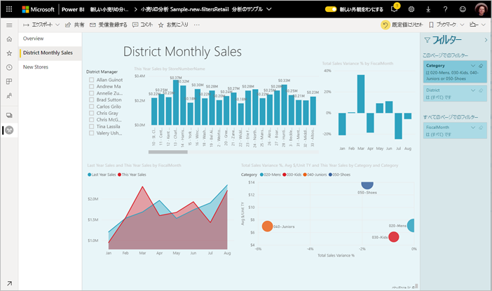
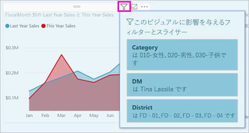
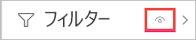
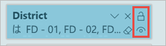
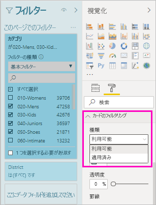
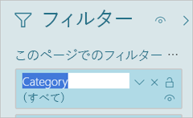
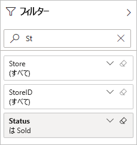
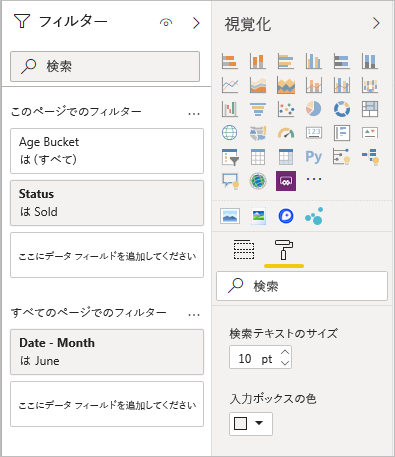
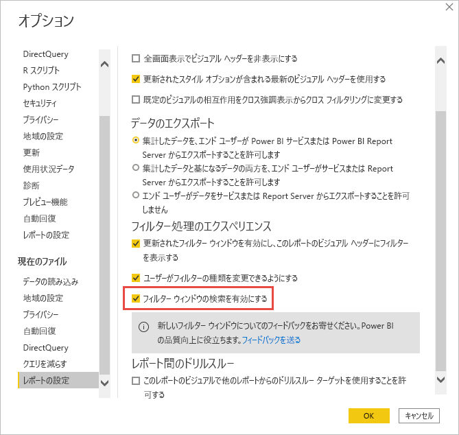
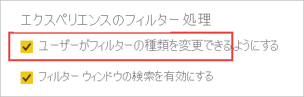

# <a name="format-filters-in-power-bi-reports"></a>Power BI レポートでフィルターを書式設定する

[!INCLUDE [applies-to](../includes/applies-to.md)] [!INCLUDE [yes-desktop](../includes/yes-desktop.md)] [!INCLUDE [yes-service](../includes/yes-service.md)]

レポート フィルターのデザインと機能は、さまざまな方法で制御できます。 この記事では、[フィルター] ペインを書式設定して、レポートの残りの部分と似た外観にする方法について説明します。 フィルターをロックし、非表示にすることも可能です。



最初の手順は、[レポートにフィルターを追加する](power-bi-report-add-filter.md)ことです。 その後、レポート デザイナーは、さまざまな方法で [フィルター] ペインを書式設定できます。

- フィルターを適用するフィールドを追加および削除する。 
- フィルターの状態を変更する。
- レポートの一部と感じられるように [フィルター] ウィンドウを書式設定およびカスタマイズする。
- コンシューマーがレポートを開くときに、フィルター ウィンドウは既定で開いているのか、折りたたまれているのかを定義する。
- [フィルター] ペイン全体、またはレポートのコンシューマーに表示させたくない特定のフィルターを非表示にする。
- [フィルター] ペインの表示、開く、折りたたむなどの状態を制御し、ブックマークする。
- コンシューマーに編集させたくないフィルターをロックする。

レポートを読む際に、ユーザーは視覚エフェクトをポイントして、その視覚エフェクトに影響を及ぼすすべてのフィルターまたはスライサーの一覧を読み取り専用で表示することができます。



レポートの読み取りモードで[レポート閲覧者がフィルターを使用する方法](../consumer/end-user-report-filter.md)に関する記事を参照してください。

## <a name="build-the-filters-pane"></a>[フィルター] ペインを構築する

既定では、[フィルター] ペインは現在のレポート設定に基づいて書式設定されます。 [フィルター] ペインでは、含めるフィルターを構成したり、既存のフィルターを更新したりできます。 [フィルター] ペインは、レポートを発行したときにレポートのコンシューマーに対して同じように表示されます。 

1. レポート キャンバスにビジュアルを追加すると、Power BI によって、ビジュアル内の各フィールドの [フィルター] ウィンドウにフィルターが自動的に追加されます。

2. [フィルター] ペインを作成するには、目的の他のフィールドを、視覚エフェクト、ページ、またはレポートのいずれかのレベルのフィルターとして、[フィルター] ペインにドラッグします。

## <a name="show-or-hide-the-filters-pane"></a>[フィルター] ペインの表示と非表示を切り替える

### <a name="hide-the-filters-pane-in-reading-mode"></a>読み取りモードで [フィルター] ペインを非表示にする

レポートの閲覧者に対して [フィルター] ペインがまったく表示されないようにするには、 **[フィルター]** の横にある **目** のアイコンを選択します。

 

### <a name="hide-the-filters-pane-while-editing"></a>編集中に [フィルター] ウィンドウを非表示にする

レポートの編集中、[フィルター] ペインを使用しておらず、画面に余分なスペースが必要な場合は、[フィルター] ペインを非表示にできます。 

- **[表示]** タブで、 **[フィルター]** ボタンを使用すると、[フィルター] ペインの表示と非表示を切り替えることができます。

![編集中に [フィルター] ウィンドウの表示と非表示を切り替える](media/power-bi-report-filter/power-bi-filter-hide.png)

この設定では、Power BI Desktop の [フィルター] ウィンドウのみ非表示になります。 Power BI サービスには、編集モードに相当するものはありません。

## <a name="lock-or-hide-filters"></a>フィルターのロックまたは非表示

個別のフィルター カードをロックしたり非表示にしたりすることができます。 フィルターをロックすると、レポートのコンシューマーはそれを表示できますが、変更はできません。 これを非表示にすると、表示もされなくなります。 フィルター カードの非表示は、null 値や予期しない値を除外する、データのクリーンアップ用フィルターを非表示にする必要がある場合に、特に便利です。 

- [フィルター] ペインで、フィルター カード内にある **[フィルターをロックします]** または **[フィルターの非表示]** アイコンを選択または選択解除します。

   

[フィルター] ペインでこれらの設定のオンとオフを切り替えると、レポートに変更が反映されるのを確認できます。 非表示のフィルターは、ビジュアルに対するポップアップ フィルター リストには表示されません。

また、[フィルター] ペインの状態を構成して、レポートのブックマークで満たすことも可能です。 ペインを開いた状態、閉じた状態、および表示の状態は、すべてブックマーク可能です。
 
## <a name="format-the-filters-pane"></a>[フィルター] ペインを書式設定する

このフィルター エクスペリエンスの大きな割合を占めるのは、レポートの外観と一致するように [フィルター] ペインを書式設定できることです。 また、レポート内のページごとに異なる方法で [フィルター] ペインを書式設定することもできます。 書式設定できる要素は次のとおりです。 

- 背景色
- 背景の透明度
- 境界線のオンまたはオフ
- 罫線の色
- タイトルとヘッダーのフォント、色、テキスト サイズ

また、フィルター カードに対しても、それが適用されている (何かに設定されている) か、または使用可能 (オフ) かに応じて、これらの要素を書式設定することができます。 

- 背景色
- 背景の透明度
- 境界線: オンまたはオフ
- 罫線の色
- フォント、色、テキスト サイズ
- 入力ボックスの色

### <a name="format-the-filters-pane-and-cards"></a>[フィルター] ウィンドウとカードを書式設定する

1. レポート内で、レポート自体か背景 ("*壁紙*") をクリックしてから、 **[視覚化]** ウィンドウ内で **[書式]** を選択します。 
    レポート ページや壁紙、また [フィルター] ウィンドウやフィルター カードを書式設定するためのオプションが表示されます。

1. **[フィルター] ウィンドウ** を展開して背景、アイコン、左の境界線の色を設定し、レポート ページを完成させます。

    ![[フィルター] ウィンドウを展開する](media/power-bi-report-filter/power-bi-format-filter-pane.png)

1. **[フィルター カード]** を展開して、色と境界線の **[使用可能]** と **[適用済み]** を設定します。 カードのさまざまな色を使用可能にして適用すれば、どのフィルターが適用されているか明確になります。 
  
    

## <a name="theming-for-filters-pane"></a>[フィルター] ウィンドウのテーマ
テーマ ファイルを使用して、[フィルター] ウィンドウの既定の設定を変更できるようになりました。 作業を開始するためのサンプル テーマのスニペットを次に示します。

 
```
"outspacePane": [{ 

"backgroundColor": {"solid": {"color": "#0000ff"}}, 

"foregroundColor": {"solid": {"color": "#00ff00"}}, 

"transparency": 50, 

"titleSize": 35, 

"headerSize": 8, 

"fontFamily": "Georgia", 

"border": true, 

"borderColor": {"solid": {"color": "#ff0000"}} 

}], 

"filterCard": [ 

{ 

"$id": "Applied", 

"transparency": 0, 

"backgroundColor": {"solid": {"color": "#ff0000"}}, 

"foregroundColor": {"solid": {"color": "#45f442"}}, 

"textSize": 30, 

"fontFamily": "Arial", 

"border": true, 

"borderColor": {"solid": {"color": "#ffffff"}}, 

"inputBoxColor": {"solid": {"color": "#C8C8C8"}} 

}, 

{ 

"$id": "Available", 

"transparency": 40, 

"backgroundColor": {"solid": {"color": "#00ff00"}}, 

"foregroundColor": {"solid": {"color": "#ffffff"}}, 

"textSize": 10, 

"fontFamily": "Times New Roman", 

"border": true, 

"borderColor": {"solid": {"color": "#123456"}}, 

"inputBoxColor": {"solid": {"color": "#777777"}} 

}] 
```

## <a name="sort-the-filters-pane"></a>[フィルター] ウィンドウを並べ替える

[フィルター] ペインでは、カスタムの並べ替え機能を使用できます。 レポートを作成するときに、フィルターをドラッグ アンド ドロップして、任意の順序で並べ替えることができます。


フィルターの既定の並べ替え順序はアルファベット順です。 カスタムの並べ替えモードを開始するには、任意のフィルターを新しい位置にドラッグします。 フィルターは、適用されているレベル内でのみ並べ替えることができます。 たとえば、[フィルター] ペインの視覚化レベルのセクション内では、視覚化レベルのフィルターの順序を変更できます。

## <a name="improved-filters-pane-accessibility"></a>[フィルター] ウィンドウのアクセシビリティの向上

[フィルター] ペインのキーボード ナビゲーションが改善されています。 [フィルター] ウィンドウのすべての部分を Tab キーを使って移動できるほか、キーボードのコンテキスト キーまたは Shift + F10 キーでコンテキスト メニューを開くことができます。

![[フィルター] ウィンドウのアクセシビリティ](media/power-bi-report-filter/power-bi-filter-accessible.png)

## <a name="rename-filters"></a>フィルターの名前を変更する
[フィルター] ウィンドウを編集している場合、タイトルを編集するには、そのタイトルをダブルクリックします。 名前の変更は、エンド ユーザーが理解しやすいようにフィルター カードを更新したいときに便利です。 フィルター カードの名前を変更しても、フィールド一覧のフィールドの表示名は "*変更されない*" ことに注意してください。 この操作では、フィルター カードで使用される表示名が変更されるだけです。



## <a name="filters-pane-search"></a>[フィルター] ウィンドウの検索

[フィルター] ウィンドウの検索機能を使用すると、フィルター カード全体をタイトルで検索できます。 この機能は、[フィルター] ウィンドウにいくつかの異なるフィルター カードがあり、その中で関心のあるものを見つける場合に役立ちます。



また、[フィルター] ウィンドウの他の要素を書式設定できるのと同じように、検索ボックスの書式も設定できます。



この [フィルター] ウィンドウ検索機能は、既定ではオンになりますが、 **[オプション]** ダイアログの **レポート** 設定で **[Enable search for Filters pane]\(フィルター ウィンドウの検索を有効にする\)** を選択することで、オンとオフを切り替えることができます。



## <a name="restrict-changes-to-filter-type"></a>フィルターの種類への変更を制限する

**レポート** 設定の **[エクスペリエンスのフィルター処理]** セクションには、ユーザーがフィルターの種類を変更できるかどうかを制御するオプションがあります。



## <a name="allow-saving-filters"></a>フィルターの保存を許可する

既定では、レポートの閲覧者はレポートのフィルターを保存できます。 フィルターの保存を許可しないように選択できます。

- また、 **[オプション]** ダイアログの **[レポート]** 設定で、 **[固定フィルター]** の下で **[Don't allow end users to save filters on this report]\(このレポートでフィルターを保存することをエンド ユーザーに許可しない\)** を選択します。

    :::image type="content" source="media/power-bi-report-filter/power-bi-persistent-filters.png" alt-text="[Don't allow end users to save filters on this report]\(このレポートでフィルターを保存することをエンド ユーザーに許可しない\) のスクリーンショット。":::

## <a name="apply-filters-button"></a>フィルターの [適用] ボタン

[フィルター] ペインに 1 つの **[適用]** ボタンを追加して、自分とエンド ユーザーがすべてのフィルターの変更を一度に適用できるようにすることが可能です。 このボタンは、フィルターの変更の適用を保留したい場合に便利です。 レポートまたは視覚エフェクトに対するすべてのフィルターの変更を適用する準備ができたら、1 回待機するだけで済みます。

:::image type="content" source="media/power-bi-report-filter/apply-filter-button.png" alt-text="フィルターの [適用] ボタン":::

### <a name="turn-on-the-apply-button"></a>[適用] ボタンをオンにする

この機能は、レポート レベルで設定できます。 ただし、この機能は既定ではオフになっています。

1. **[ファイル]**  >  **[オプションと設定]**  >  **[オプション]**  >  **[クエリを減らす]** の順に移動します。

1. **[Add a single Apply button to the filter pane to apply changes at once]\(一度に変更を適用するための 1 つの [適用] ボタンをフィルターウィンドウに追加します\)** をオンにします。

    :::image type="content" source="media/power-bi-report-filter/apply-all-filters.png" alt-text="フィルターの [適用] ボタンをオンにする":::

### <a name="format-the-apply-button"></a>[適用] ボタンを書式設定する

現時点では、ボタンの **[適用]** テキストの書式設定の一部を制御できます。 **[書式]** ペインの **[フィルター ペイン]** セクションで、次のオプションを設定します。

- **チェックボックスと色の適用** : 塗りつぶしの色を制御します。 
- **[フォントとアイコンの色]** : テキストの色を制御します。
- **[ヘッダー テキスト サイズ]** : テキスト サイズを制御します。
- **[フォント ファミリ]** : フォントを制御します。

    :::image type="content" source="media/power-bi-report-filter/format-apply-filter.gif" alt-text="フィルターの [適用] ボタンのテキストを書式設定する":::

## <a name="considerations-and-limitations"></a>考慮事項と制限事項

[Web に公開] に [フィルター] ウィンドウが表示されません。 レポートを Web に公開する予定の場合は、代わりにフィルター処理用のスライサーを追加することを検討してください。

## <a name="next-steps"></a>次の手順

- [レポート フィルターの使用方法](../consumer/end-user-report-filter.md)
- [レポート内のフィルターと強調表示](power-bi-reports-filters-and-highlighting.md)
- [Power BI で使用できるさまざまなフィルター](power-bi-report-filter-types.md)

他にわからないことがある場合は、 [Power BI コミュニティを利用してください](https://community.powerbi.com/)。
