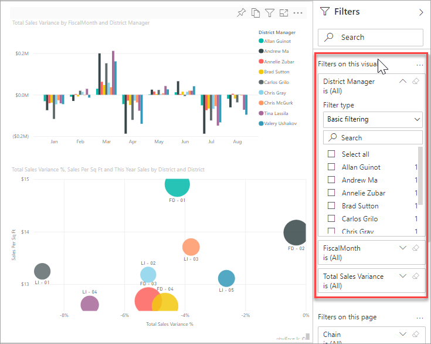

# Power BI レポートのフィルターと強調表示

 この記事では、Power BI サービスでのフィルター処理と強調表示の概要を示します。 操作は Power BI Desktop の場合とほぼ同じです。 *フィルター処理* を実行すると、絞り込んだデータ以外のすべてのデータが削除されます。 一般に、"*強調表示*" はフィルター処理ではありません。 ほとんどの視覚化では、強調表示によって関連のないデータが削除されることはありません。 代わりに、関連するデータが強調表示されます。 残りのデータは表示されますが、淡色表示になります。 詳細については、この記事で後述する[クロスフィルターとクロス強調表示](#cross-filter-and-cross-highlight-visuals)に関する記事を参照してください。

Power BI ではさまざまな方法でレポートをフィルター処理および強調表示できます。 すべての情報を 1 つの記事にまとめると量が多くなるため、以下のセクションに分けて説明します。

* フィルターと強調表示の概要 (この記事)
* Power BI サービスの[読み取りビューでフィルターと強調表示が動作する](../consumer/end-user-interactions.md)しくみ。 できることは編集ビューよりも限られていますが、それでもさまざまなフィルター処理と強調表示のオプションを使用できます。  
* Power BI Desktop と Power BI サービスの [[フィルター] ペインでフィルターを作成する](power-bi-report-add-filter.md)方法。 レポートの編集アクセス許可がある場合、レポートでフィルターを作成、変更、削除できます。
* フィルターを追加した後は、適切に動作するように、またレポートの残りの部分と似た外見になるように、[フィルターを書式設定](power-bi-report-filter.md)することができます。
* フィルターと強調表示が既定でどのように動作するかについて学習しました。 次は、[ページ上の視覚化が相互にフィルター処理および強調表示される方法を変更する](service-reports-visual-interactions.md)方法について学習します。
* その他の [Power BI レポート内のフィルターの種類](power-bi-report-filter-types.md)について確認します。

## フィルター ウィンドウの概要

**[フィルター]** ペインでフィルターを適用したり、またはレポート ページ自体で直接[スライサーを使って選択](../visuals/power-bi-visualization-slicers.md)したりできます。 [フィルター] ペインには、個々の視覚化のフィールドと、レポート デザイナーによって追加されたその他のすべてのフィルターが表示されます。 

[フィルター] ウィンドウでは、4 種類の標準的なフィルターを作成できます。

- **視覚化フィルター** は、レポート ページ上の単一の視覚化に適用されます。 レポート キャンバス上の視覚化を選択すると、視覚化レベルのフィルターが表示されます。 レポートを編集できない場合でも、視覚化を選択してフィルター処理できます。
- **ページ フィルター** は、レポート ページ上のすべての視覚化に適用されます。
- **レポート フィルター** は、レポート内のすべてのページに適用されます。
- **ドリルスルー フィルター** Power BI サービスと Power BI Desktop のドリルスルーを使用すると、サプライヤーなど、特定のエンティティに注目した "*ドリルスルー先*" レポート ページを作成できます。 ユーザーは、他のレポート ページでそのエンティティのデータ ポイントを右クリックして、フォーカスされたページにドリルスルーできます。

最初の 3 つの視覚化、ページ、およびレポート フィルターを作成するには、「[Power BI でのレポートへのフィルターの追加](power-bi-report-add-filter.md)」を参照してください。 

ドリルスルー フィルターを作成するには、「[Power BI レポートでドリルスルーを設定する](desktop-drillthrough.md)」を参照してください。

### 基本フィルターと高度なフィルター

既定では、レポートの閲覧者は **基本** から **高度な** フィルター処理に切り替えることができます。 

**基本フィルター** では、フィールド内のすべての値が一覧表示されます。 読み取りビューまたは編集ビューで、ページ フィルター、ビジュアル フィルター、レポート フィルターを使用して検索を行い、目的の値を探して選択できます。 

隣に **すべて** という単語があるフィルターではフィルター処理されず、フィールド内のすべての値が表示されます。  たとえば、 **[Chain は (すべて) です]** は、全ストア チェーンに関するデータがレポート ページに含まれることを意味します。 一方、レポート レベルのフィルター **[FiscalYear は 2013 または 2014]** は、2013 年および 2014 年の会計年度のデータのみがレポートに表示されることを意味します。

**高度なフィルター** によって、より複雑なフィルターを使用することができます。 たとえば、特定の値を含む値や含まない値、特定の値で始まる値や始まらない値を検索できます。 

:::image type="content" source="media/power-bi-reports-filters-and-highlighting/power-bi-advanced-filter.png" alt-text="高度なフィルターでは、より詳細なフィルター オプションが提供されます。":::

レポートを作成するときに、切り替えをオフにして、[レポートの閲覧者がフィルターの種類を変更できないようにする](power-bi-report-filter.md#restrict-changes-to-filter-type)ことができます。 また、フィルター ペインの検索を無効にすることもできます。

## 読み取りビューまたは編集ビューでのフィルター

Power BI サービスでレポートと対話するには、次の 2 つのモードがあります: 読み取りビューと編集ビューです。 使用できるフィルター処理機能は、どのモードを使用しているかによって異なります。

* [読み取りビュー](#filters-in-reading-view)では、レポートに既に存在するすべてのフィルターと対話して、行った選択の内容を保存することができます。 新しいフィルターを追加することはできません。
* [編集ビュー](#filters-in-editing-view)では、すべての種類のフィルターを追加できます。 レポートの閲覧者がモバイル アプリで開く場合でも、レポートを保存すると、フィルターはレポートと共に保存されます。 読み取りビューでレポートを表示しているユーザーは、お客様が追加したフィルターと対話しますが、新しいフィルターを追加することはできません。

### 読み取りビューでのフィルター

Power BI サービスでは、読み取りビューで視覚化を選択すると、[フィルター] ペインは次のようになります。

各視覚化には、その視覚化に含まれるすべてのフィールドのフィルターがあります。 レポートを作成するときに、さらに追加することができます。 この [フィルター] ペインでは、視覚化に 3 つのフィルターがあります。

読み取りビューでは、既存のフィルターを変更することによってデータを調べます。 レポートのビューのみをフィルター処理しています。 レポートを終了すると、モバイル アプリでレポートを開いた場合でも、加えた変更の内容はレポートのビューと共に保存されます。 フィルター処理を取り消し、レポート作成者が設定した既定値に戻すには、上部のメニュー バーから **[既定値にリセット]** を選択します。

:::image type="content" source="../consumer/media/end-user-report-filter/power-bi-reset-icon.png" alt-text="[既定値にリセット] アイコン。":::

読み取りビューの詳細については、次を参照してください:「[レポート フィルター ウィンドウの使用方法](../consumer/end-user-report-filter.md)」。

### 編集ビューでのフィルター
Power BI Desktop でレポートを開くと、 **[フィルター]** が利用可能ないくつかの編集ペインの 1 つにすぎないことがわかります。 Power BI サービスの編集ビューでレポートを開くと、同じペインが表示されます。

![編集ビューの [フィルター] ウィンドウ](media/power-bi-reports-filters-and-highlighting/power-bi-add-filter-editing-view.png)

レポートのこのページには、3 個のページ レベル フィルターと 1 個のレポート レベル フィルターがあります。 縦棒グラフを選択すると、それも 3 つの視覚化レベル フィルターを持っていることがわかります。

#### 編集ビューでフィルターを操作する

- Power BI Desktop と Power BI サービスの編集ビューで[レポートにフィルターを追加する](power-bi-report-add-filter.md)方法について学習します。

- フィルターを追加した後は、多くの書式設定オプションを利用できます。 たとえば、フィルターの非表示、ロック、または並べ替えを行ったり、レポートの残りの部分と一致するように書式設定したりできます。 [レポート内のフィルターを書式設定する](power-bi-report-filter.md)方法について学習します。 

- また、各視覚化の相互作用を変更することもできます。 クロス強調表示とクロスフィルター処理を微調整するには、[レポート内での視覚化の相互作用を変更する](service-reports-visual-interactions.md)方法に関する記事を参照してください。

## 視覚化をクロスフィルターおよびクロス強調表示する

フィルターやスライサーを使用せずに、レポート内の視覚化間の関係を調べることができます。 1 つの視覚化で値または軸のラベルを選択し、ページ上の他の視覚化の関連する値を "*クロスフィルター処理*" または "*クロス強調表示*" します。 すべてが同じように動作するとは限りません。 

- **クロス強調表示** 1 つの視覚化の値を選択すると、関連するデータが縦棒グラフや横棒グラフなどの視覚化で強調表示されます。 クロス強調表示によって、関連のないデータがそれらの視覚化から削除されることはありません。 関連のないデータは引き続き表示されますが、淡色表示になります。 
- **クロスフィルター処理** 1 つの視覚化の値を選択すると、折れ線グラフや散布図などの他の視覚化ではフィルターに近い動作が発生します。 それらの視覚化では、関連するデータのみが引き続き表示されます。 フィルターを使用した場合と同じように、関連のないデータは表示されません。 

強調表示を解除するには、もう一度値を選択するか、同じビジュアル内の空の領域を選択します。 その他の例については、「Power BI のレポート内でビジュアルがどのように相互作用するか」の「[クロスフィルター処理とクロス強調表示](../consumer/end-user-interactions.md#cross-filtering-and-cross-highlighting)」セクションを参照してください。

## 次のステップ

- [編集ビューでレポートにフィルターを追加する](power-bi-report-add-filter.md)
- [Power BI レポートでフィルターを書式設定する](power-bi-report-filter.md)
- [レポート フィルターの使用方法](../consumer/end-user-report-filter.md)
- [レポート内でレポートのビジュアルを相互間でクロスフィルター処理とクロス強調表示する方法](../consumer/end-user-interactions.md)

他にわからないことがある場合は、 [Power BI コミュニティを利用してください](https://community.powerbi.com/)。
