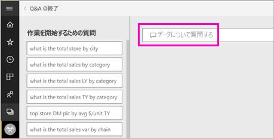
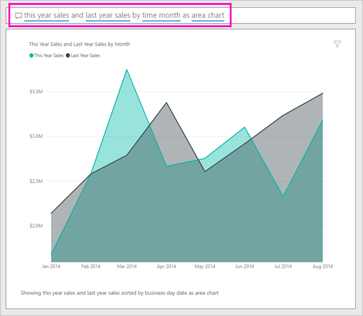

# Power BI Q&A でビジュアルを作成する

自然言語を使用して質問するのが、データから回答を得る最も速い方法である場合があります。  この記事では、同じ視覚エフェクトを作成する 2 種類の方法に注目します。1 つは Q&A を使用して質問することによって作成する方法、2 つ目はレポートで作成する方法です。 ここでは Power BI サービスを使用してレポートにビジュアルを作成しますが、その手順は Power BI Desktop を使用する場合とほぼ同じです。

作業を進めるには、編集できるレポートが必要なので、Power BI で使用可能なサンプルの 1 つを使います。

## Q&A でビジュアルを作成する

この折れ線グラフを Q&A を使用して作成するには、次のようにします。

1. Power BI ワークスペースから、 **[データの取得]** \> **[サンプル]** \> **[小売りの分析のサンプル]**  >  **[接続]** を選択します。

1. [小売りの分析のサンプル] ダッシュボードを開いて、Q&A ボックス ( **[データについて質問する]** ) にカーソルを置きます。

    

2. Q&A ボックスに、次のような質問を入力します。
   
    **this year sales and last year sales by month as area chart** (面グラフによる月別の今年度の売上高と前年度の売上高)
   
    質問を入力していくと、Q&A が回答を表示するために最適な視覚化を選択し、質問を変更するにつれ視覚化が動的に変化します。 また、Q&A は、候補機能、オートコンプリート、スペルの修正によって質問の形式を整えるようにユーザーを助けます。 言い回しにわずかな変更を加えた、"this year sales and last year sales by *time month* as area chart" が Q&A から提案されます。  

    

4. その文を選択して提案に同意します。 
   
   質問の入力が完了すると、結果はダッシュボードで確認したのと同じグラフになります。
   
   

4. グラフをダッシュボードにピン留めするには、ピン アイコンを選択します。  をタップします。

## レポート エディターでビジュアルを作成する

1. 小売りの分析のサンプル ダッシュボードに戻ります。
   
2. ダッシュボードには、"Last Year Sales and This Year Sales (前年度の売上高と今年度の売上高)" を表す同じ面グラフ タイルがあります。  このタイルを選択します。 Q&A で作成したタイルは選択しないでください。 選択すると Q&A が表示されてしまいます。 元の面グラフ タイルがレポートで作成された場合は、この視覚化が含まれたページにレポートが表示されます。

    

1. **[レポートの編集]** を選択して、レポートを編集ビューで開きます。  レポートの所有者でない場合は、編集ビューでレポートを開くオプションはありません。
   
    
4. 面グラフを選択して、 **[フィールド]** ウィンドウで設定を確認します。  レポートの作成者は、これらの 3 つの値 (**Sales** テーブルの **[Last Year Sales]** と **[This Year Sales]** の値、および **Time** テーブルの **[FiscalMonth]** ) を選択して、それらを **[軸]** ウェルと **[値]** ウェルに編成して、このグラフを作成しました。
   
    

    最終的に同じビジュアルになっていることがわかります。 この方法でも、作成にさほど手間はかかりません。 ただし、Q&A を使用した方が簡単に作成できます。

## 次のステップ

- [ダッシュボードとレポートで Q&A を使用する](power-bi-tutorial-q-and-a.md)  
- [コンシューマー向けの Q&A](../consumer/end-user-q-and-a.md)
- [データを Power BI の Q&A でうまく使う方法](service-prepare-data-for-q-and-a.md)

他にわからないことがある場合は、 [Power BI コミュニティを利用してください](https://community.powerbi.com/)。
