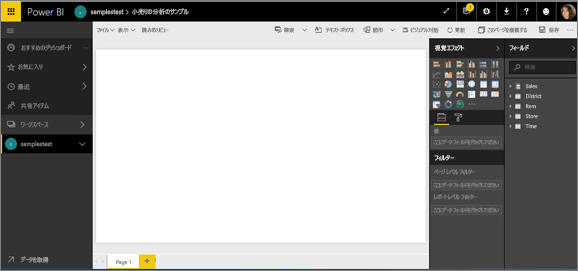
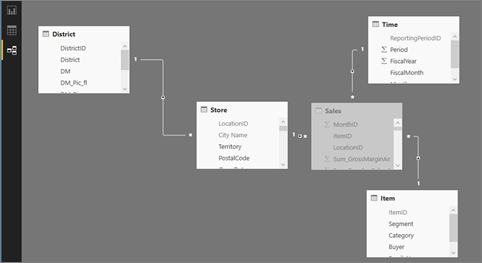

# 小売りの分析のサンプルを探索する

このチュートリアルでは、次の操作方法について説明します。 
- 小売りの分析のサンプル コンテンツ パックをインポートして Power BI サービスに追加し、コンテンツを開きます。 *コンテンツ パック* は、データセットにダッシュボードやレポートがバンドルされているタイプのサンプルです。 
- 小売りの分析のサンプルの .pbix ファイルを Power BI Desktop で開きます。

背景情報の詳細については、「[Power BI 用のサンプル データセット](sample-datasets.md)」を参照してください。 その記事では、入手方法、保存場所、使用方法、各サンプルのストーリーなど、サンプルに関するすべてがわかります。 

## 前提条件
このサンプルは、Power BI サービスでも Power BI Desktop でも利用できます。 手順に沿って作業を進める場合は、小売りの分析のサンプルを使用します。

このチュートリアルで使う *小売の分析* のサンプル コンテンツ パックは、ダッシュボード、レポート、データセットで構成されています。
このコンテンツ パックとそのシナリオに慣れるには、始める前に「[Power BI の小売りの分析のサンプル: ツアーを開始する](sample-retail-analysis.md)」をご覧ください。

## Power BI サービスにサンプルをインポートする

1. Power BI サービス (app.powerbi.com) を開いてサインインし、サンプルを保存するワークスペースを開きます。 

    Power BI Pro または Premium Per User (PPU) のライセンスを持っていない場合は、マイ ワークスペースにサンプルを保存できます。

2. ナビ ペインの下部にある **[データの取得]** を選択します。 

   ![[データを取得] を選択](media/sample-datasets/power-bi-get-data.png)

   **[データの取得]** が表示されない場合、ナビ ペインの一番上にあるを選択してナビ ペインを展開してください。

5. 表示された **[データを取得]** ページで、 **[サンプル]** を選びます。
   
6. **[小売りの分析のサンプル]** を選び、**[接続]** を選びます。   
   
   ![[接続] ボタン](media/sample-tutorial-connect-to-the-samples/pbi_retailanalysissampleconnect.png)

## 何がインポートされましたか?
サンプル コンテンツ パックの場合、**[接続]** を選択すると、Power BI にそのコンテンツ パックのコピーが与えられ、クラウドに自動保存されます。 コンテンツ パックにはデータセット、レポート、ダッシュボードが含まれるので、**[接続]** を選択するとそれらが取得されます。 

1. **[接続]** を選択すると、Power BI では新しいダッシュボードが作成され、**[ダッシュボード]** タブに一覧表示されます。 
   
   
2. **[レポート]** タブを開きます。"*小売りの分析のサンプル*" という名前の新しいレポートが表示されます。
   
   
   
   **[データセット]** タブを確認します。新しいデータセットもそこにあります。
   
   

## 新しいコンテンツを調べる
ダッシュボード、データセット、レポートを自分で調べてみてください。 ダッシュボード、レポート、データセットにはさまざまな方法で移動できます。 その 1 つは次の手順になります。  

1. **[ダッシュボード]** タブに戻り、**[小売りの分析のサンプル]** ダッシュボードを選択して開きます。       

   ダッシュボードが開きます。ダッシュボードには、さまざまな視覚的タイルが含まれています。   
 
1. ダッシュボードでタイルの 1 つを選択し、基になるレポートを開きます。 この例では、**[This Year's Sales, Last Year's Sales by Fiscal Month]\(会計月別の今年の売上、昨年の売上\)** という面グラフを選択します。  

   ![[小売りの分析のサンプル] ダッシュボード。ビジュアルが強調表示されています](media/sample-tutorial-connect-to-the-samples/power-bi-dashboards2new.png)

   レポートが開き、選択した面グラフが含まれるページが表示されます。この場合、レポートの **[地区の毎月の売上]** ページになります。
   
   ![[地区の毎月の売上] レポートページ](media/sample-tutorial-connect-to-the-samples/power-bi-report.png)
   
   > [!NOTE]
   > [Power BI Q&A](power-bi-tutorial-q-and-a.md) を利用してタイルが作成された場合、代わりに Q&A ページが開きます。 タイルを [Excel からピン留め](service-dashboard-pin-tile-from-excel.md)した場合、Power BI 内で Excel Online が開きます。
   > 
   > 
1. 同僚とコンテンツ パックを共有する作成者は、通常、分析情報だけを共有し、データに直接アクセスできるようにはしません。 **[データセット]** タブには、データセットを調べるためのいくつかのオプションがあります。 ただし、Power BI Desktop または Excel でできるように、データの行と列を表示することはできません。 
   
   
   
1. データセットを調べる 1 つの方法は、独自の視覚化とレポートを一から作成することです。 [グラフ] アイコンを選び、 ![[グラフ] アイコン](media/sample-tutorial-connect-to-the-samples/power-bi-chart-icon4.png) レポート編集モードでデータセットを開きます。
     
   

1. データセットを調べるもう 1 つの方法は、[クイック分析情報](../consumer/end-user-insights.md)を実行することです。 **その他のオプション** (...) を選択し、**[クイック分析情報を取得する]** を選択します。 詳細情報の準備ができたら、**[詳細情報を表示]** を選びます。
     
    

## Power BI Desktop にサンプルをダウンロードする 
Power BI Desktop でサンプルの .pbix ファイルを初めて開くと、ファイルがレポート ビューで表示され、レポートの任意のページを視覚エフェクトを利用して検索、作成、変更できます。 [レポート] ビューには、Power BI サービスのレポートの編集ビューとほとんど同じデザイン機能が用意されています。 視覚化の移動、コピーと貼り付け、マージなどを行うことができます。 

Power BI サービスでレポートを編集する場合とは異なり、Power BI Desktop では、データのクエリとモデルを操作し、レポートでの最適な分析情報をサポートするデータが確実に得られます。 その後、Power BI Desktop のファイルは、ローカルのドライブまたはクラウドに関係なく、任意の場所に保存できます。

1. [小売りの分析のサンプルの .pbix ファイル](https://download.microsoft.com/download/9/6/D/96DDC2FF-2568-491D-AAFA-AFDD6F763AE3/Retail%20Analysis%20Sample%20PBIX.pbix)をダウンロードし、Power BI Desktop で開きます。 

    

1. ファイルがレポート ビューで開きます。 レポート エディターの下部にある 4 つのタブにご注目ください。これらのタブは、このレポートの 4 つのページを表わします。 この例では、**[新しい店舗]** ページが現在選択されています。 

    ![[新しい店舗] タブが強調表示されている](media/sample-tutorial-connect-to-the-samples/power-bi-sample-tabs.png).

1. レポートエディターの詳細については、「[Power BI でのレポート エディターのツアー](service-the-report-editor-take-a-tour.md)」を参照してください。

## レポートには何が入っていますか?
サンプルの .pbix ファイルをダウンロードすると、レポートだけでなく、*基になるデータセット* もダウンロードされます。 ファイルを開くと、Power BI Desktop では、データとそれに関連するクエリやリレーションシップが読み込まれます。 基になるデータやリレーションシップを表示できますが、クエリ エディターで基になるクエリを表示することはできません。

1. テーブル アイコン  を選択し、[[データ ビュー]](../connect-data/desktop-data-view.md) に切り替えてください。
 
    

    データ ビューで、Power BI Desktop モデルのデータを調べ、いろいろ試し、理解できます。 クエリ エディターでテーブル、列、データを表示する方法とは異なります。 データ ビューのデータはモデルに既に読み込まれています。

    データをモデリングするとき、レポート キャンバスでビジュアルを作成することなく、テーブルの行と列に実際にあるものを表示できれば便利なことがあります。 これは、メジャーと計算列を作成している場合や、データ型またはデータのカテゴリを識別する必要に特に当てはまります。

1. [[リレーションシップ ビュー]](../transform-model/desktop-relationship-view.md) に切り替えるには、 アイコンを選択します。
 
    

    リレーションシップ ビューには、モデル内のすべてのテーブル、列、リレーションシップが表示されます。 ここからリレーションシップの表示、変更、および作成を行えます。

## 次のステップ
変更内容を保存しないことを選択できるため、この環境で試してみるのは安全です。 一方、それらを保存した場合は、 **[データを取得]** を選択して、常にこのサンプルの新しいコピーを取得できます。

Power BI のダッシュボード、データセット、リレーションシップ、レポートでサンプル データから分析情報を得るしくみをこのツアーでご理解いただけたら幸いです。 次はあなたの番です。ご自分のデータに接続してみてください。 Power BI を使用すると、広範なデータ ソースに接続することができます。 詳細は、[Power BI サービスの概要](../fundamentals/service-get-started.md)ページと [Power BI Desktop の概要](../fundamentals/desktop-getting-started.md)ページをご覧ください。  

   詳細については、次を参照してください。  
- [Power BI サービスのデザイナー向けの基本的な概念](../fundamentals/service-basic-concepts.md)
- [Power BI サービスのサンプル](sample-datasets.md)
- [Power BI のデータ ソース](../connect-data/service-get-data.md)

他にわからないことがある場合は、 [Power BI コミュニティを利用してください](https://community.powerbi.com/)。
