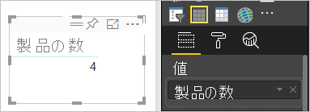
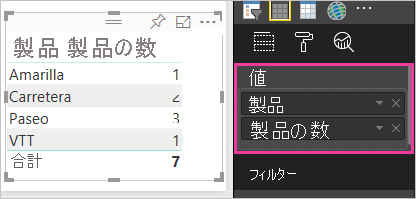

# Power BI サービスで集計 (合計や平均値など) を使用する

## 集計とは

データの値を数学的に結合したい場合があります。 数学的演算には、合計、平均、最大、カウントなどがあります。 データの値を結合することを、"*集計*" といいます。 その数学的演算の結果は "*集計値*" です。

Power BI サービスと Power BI Desktop は、視覚エフェクトを作成する際にデータを集計する場合があります。 多くの場合、必要なのは集計のみですが、別の方法で値を集計する場合もあります。  たとえば、合計と平均について考えてみます。 Power BI が視覚エフェクトで使用する、集計を管理して変更する方法はいくつかあります。

まず、データの "*型*" を見てましょう。データの型によって、Power BI でデータを集計する方法と、データを集計できるかどうかが決まります。

## データの型

ほとんどのデータセットには複数のデータ型があります。 最も基本的なレベルでは、データは数値であるか、そうでないかのいずれかです。 Power BI では、合計、平均、カウント、最小、差異などを使用して数値データを集計できます。 サービスでは、テキスト データ (多くの場合、"*カテゴリ*" データと呼ばれます) でさえ集計できます。 **[値]** や **[ヒント]** のような数値のみのバケットに配置することによって、カテゴリ フィールドを集計しようとすると、Power BI では各カテゴリの発生件数または各カテゴリの個別の発生件数がカウントされます。 日付のような特別な型のデータには、独自の集計オプションがいくつか (最も早い、最終、最初、最後) あります。

例を以下に示します。

- **販売数** と **製造価格** は、数値データを含む列です。

- **セグメント**、**国**、**製品**、**月**、**月名** にはカテゴリ データが含まれます。

   

Power BI で視覚エフェクトを作成すると、一部のカテゴリ フィールド (既定値は "*合計*" です) で数値フィールドが集計されます。  たとえば、"***製品による** _販売数"、"_*_月による_*_ 販売数"、"_*_セグメントによる_*_ 製造価格" などです。 Power BI では、一部の数値フィールドは_*メジャー**と呼ばれます。 Power BI レポート エディターでは、メジャーを簡単に見分けることができます。 **[フィールド]** 一覧でメジャーの横には ∑ 記号が表示されます。 詳しくは、[レポート エディターのツアー](service-the-report-editor-take-a-tour.md)に関する記事をご覧ください。

![[フィールド] 一覧が表示されている Power BI のスクリーンショット。](media/service-aggregates/power-bi-aggregate-fields.png)

## 集計が思い通りに動作しないのはなぜですか?

Power BI サービスで集計を使おうとすると、わかりにくいことがあります。 数値フィールドがあって、Power BI で集計を変更できないのでしょうか。 それとも、年度のようなフィールドがあるとき、集計せず、発生数だけを数えたいのでしょうか。

通常、基になっている問題は、データセットでのフィールドの定義です。 データセットの所有者がフィールドをテキストとして定義しており、そのために Power BI でその合計や平均を計算できない場合があります。 残念ながら、[フィールドの分類方法を変更できるのはデータセットのオーナーだけです](../transform-model/desktop-measures.md)。 したがって、データセットに対する所有者アクセス許可がある場合は、Desktop またはデータセットの作成に使用したプログラム (Excel など) で、この問題を解決することができます。 それ以外の場合は、支援を得るためにデータセットの所有者に連絡する必要があります。  

この記事の終わりに、「[**考慮事項とトラブルシューティング**](#considerations-and-troubleshooting)」という特別なセクションがあります。 そこでは、ヒントとガイダンスが提供されています。 そこで回答が見つからない場合は、[Power BI コミュニティ フォーラム](https://community.powerbi.com)に質問を投稿してください。 Power BI チームが速やかに直接お答えします。

## 数値フィールドの集計方法の変更

製品別に販売数を合計するグラフを、平均を算出するグラフに変更してみましょう。

1. メジャーとカテゴリを使用する **集合縦棒グラフ** を作成します。 この例では、製品別販売数を使用します。  既定では、Power BI によって、製品 ( **[軸]** ウェルにカテゴリをドラッグ) ごとに販売数 ( **[値]** ウェルにメジャーをドラッグ) が合計されるグラフが作成されます。

   ![グラフ、[視覚化] ウィンドウ、[フィールド] 一覧と、[合計] が選択されているスクリーンショット。](media/service-aggregates/power-bi-aggregate-sum.png)

1. **[視覚化]** ウィンドウで、メジャーを右クリックして、必要な集計の種類を選択します。 この例では、 **[平均]** を選択します。 必要な集計が表示されない場合は、「[**考慮事項とトラブルシューティング**](#considerations-and-troubleshooting)」セクションをご覧ください。

   ![[平均] が選択されて強調表示されている集計リストのスクリーンショット。](media/service-aggregates/power-bi-aggregate-average.png)

   > [!NOTE]
   > ドロップダウン リストで使用できるオプションは、1) 選択したフィールドと、2) データセット所有者がそのフィールドを分類した方法によって異なります。

1. これで視覚エフェクトでは平均別の集計が使用されます。

   

## データの集計方法

フィールド集計に使用できる可能性のあるオプションの一部を次に示します。

- **集計しない**。 このオプションを選択すると、Power BI によってそのフィールド内の各値が個別に扱われ、集計は行われません。 このオプションは、サービスで合計されてはならない数値 ID 列がある場合に使用します。

- **合計**。 そのフィールド内のすべての値が加算されます。

- **平均**。 値の算術平均が算出されます。

- **最小**。 最小値が示されます。

- **最大**。 最大値が示されます。

- **カウント (空白なし)** 。 そのフィールド内の空白以外の値の数がカウントされます。

- **カウント (個別)** そのフィールド内の個別の値の数がカウントされます。

- **標準偏差**

- **分散**。

- **中央値**。  中央値を示します。 これは上と下に同数の項目がある値です。  中央値が 2 つある場合、Power BI はそれらの平均値を求めます。

たとえば、次のようなデータがあるとします。

| 国 | 量 |
|:--- |:--- |
| 米国 |100 |
| 英国 |150 |
| カナダ |100 |
| ドイツ |125 |
| フランス | |
| 日本 |125 |
| オーストラリア |150 |

結果は次のようになります。

- **集計しない**:それぞれの値が個別に表示される

- **合計**:750

- **平均**:125

- **最大**:150

- **最小**:100

- **データの個数 (空白以外):** 6

- **データの個数 (個別):** 4

- **標準偏差:** 20.4124145...

- **分散:** 416.666...

- **中央値:** 125

## カテゴリ (テキスト) フィールドを使用して集計を作成する

数値以外のフィールドを集計することもできます。 たとえば、製品名フィールドがある場合は、それを値として追加してから、 **[カウント]** 、 **[個別のカウント]** 、 **[最初]** 、または **[最後]** に設定します。

1. **Product** フィールドを **[値]** ウェルにドラッグします。 通常、 **[値]** ウェルは数値フィールドに使用されます。 Power BI によってこのフィールドがテキスト フィールドであることが認識され、集計が **[集計しない]** に設定されて、単一列テーブルが表示されます。

   ![[値] ウェル内の Product フィールドのスクリーンショット](media/service-aggregates/power-bi-aggregate-value.png)

1. 集計を既定の **[集計しない]** から **[カウント (個別)]** に変更すると、異なる製品の数がカウントされます。 この例では、4 となります。
  
   

1. 集計を **[カウント]** に変更すると、Power BI は合計数をカウントします。 この例では、**Product** に 7 個のエントリがあります。

   

1. 同じフィールド (この例では、**Product**) を **[値]** ウェルにドラッグし、既定の集計の **[集計しない]** のままにすると、カウントが製品別に分類されます。

   

## 考慮事項とトラブルシューティング

Q: **[集計しない]** オプションが表示されないのはなぜですか。

A:選択したフィールドが、多次元モデルの計算メジャーであるか、Excel または [Power BI Desktop](../transform-model/desktop-measures.md) で作成されたメジャーである可能性があります。 各メジャーには、独自のハードコーディングされた式があります。 Power BI で使用される集計を変更することはできません。 たとえば、それが合計である場合、使用できるのは合計のみとなります。 **[フィールド]** の一覧では、"*メジャー*" は電卓のシンボルで示されます。

Q:フィールドは **数値** ですが、選択肢が **[カウント]** と **[個別のカウント]** だけなのはなぜですか?

回答 1:考えられる説明としては、データセットの所有者がフィールドを数値として "*分類していません*"。 たとえば、データセットに **年** フィールドがある場合、データセットの所有者は値をテキストとして分類できます。 Power BI によって **年** フィールドがカウントされる可能性が高くなります (たとえば、1974 年に生まれた人数)。 Power BI によって合計または平均が計算される可能性は低くなります。 所有者であれば、Power BI Desktop でデータセットを開き、 **[モデリング]** タブでデータ型を変更できます。

回答 2:フィールドに電卓アイコンがある場合は、それが "*メジャー*" であることを意味します。 各メジャーには固有の式があり、データセットの所有者のみがそれを変更できます。 Power BI で使用される計算は、平均や合計などの単純な集計である場合があります。 "親カテゴリに対する貢献の割合" や "年度開始から現在までの合計" のような複雑なものになる場合もあります。 Power BI では、結果の合計または平均は計算されません。 代わりに、データポイントごとの (ハードコーディングされた式を使用した) 再計算だけが行われます。

回答 3:別の可能性としては、フィールドが "*バケット*" に配置されています。その場合、カテゴリ値のみが許可されます。  選択肢は、カウントと個別のカウントだけになります。

回答 4:4 つ目の可能性としては、軸に対してフィールドが使用されています。 たとえば、Power BI では、棒グラフの軸で、個別の値ごとに棒が 1 本表示されます。フィールド値はまったく集計されません。

>[!NOTE]
>このルールの例外は散布図です。X 軸と Y 軸に集計値が *要求されます*。

Q:SQL Server Analysis Services (SSAS) データ ソースのテキスト フィールドを集計できないのはなぜですか?

A:SSAS 多次元モデルにライブ接続すると、クライアント側で集計できません (first、last、avg、min、max、sum を含む)。

Q:散布図がありますが、フィールドで集計 "*したくありません*"。  方法はありますか。

A:フィールドを X 軸バケットまたは Y 軸バケットではなく **詳細** バケットに追加してください。

Q:視覚エフェクトに数値フィールドを追加すると、ほとんどは初期設定で合計になりますが、平均、カウント、またはその他の集計になるものもあります。  既定の集計が常に同じではないのはなぜですか?

A:データセットの所有者は、フィールドごとに既定の集計を設定できます。 データセットの所有者は、Power BI Desktop の **[モデリング]** タブで既定の集計を変更できます。

Q:私はデータセット オーナーです。フィールドが絶対に集計されないようにしたいのですが。

A:Power BI Desktop の **[モデリング]** タブで、 **[データ型]** を **[テキスト]** に設定します。

Q:ドロップダウン リストのオプションとして **[集計しない]** が表示されません。

A:フィールドを削除し、もう一度追加してみてください。

他にわからないことがある場合は、 [Power BI コミュニティを利用してください](https://community.powerbi.com/)。
