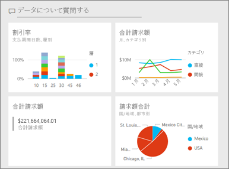
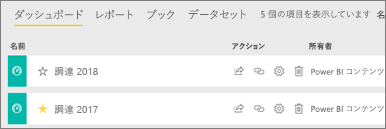

# Power BI サービスでダッシュボードのコピーを作成する

 ダッシュボードをコピーするにはさまざまな理由があります。 ダッシュボードを変更し、元のダッシュボードとパフォーマンスを比較する場合や、少しずつ異なるバージョンを作成して同僚、リージョン、チームに配布する場合などです。 ダッシュボードのデザインを気に入った同僚は、マネージャーへのレポートにそれを使いたいと思うかもしれません。 または、データ構造とデータ型が同じ新しいデータベースがあり、既に作成してあるダッシュボードを再利用したい場合もコピーしますが、Power BI Desktop で何らかの作業が必要になる場合があります。 

ダッシュボードは、Power BI サービスを使って作成 (およびコピー) し、Power BI モバイルおよび Power BI Embedded で表示できます。  ダッシュボードは Power BI Desktop では利用できません。 

ダッシュボードをコピーするには、ダッシュボードの "*作成者*" である必要があります。 アプリとして他のユーザーから共有を受けているダッシュボードは複製できません。

1. ダッシュボードを開きます。
2. 右上隅の **その他のオプション** (...) を選び、 **[ダッシュボードの複製]** を選びます。
   
   
3. ダッシュボードの名前を指定し、 **[複製]** を選びます。 
   
   ![[ダッシュボードの複製] ダイアログ](media/service-dashboard-copy/power-bi-name.png)
4. 新しいダッシュボードがオリジナルと同じワークスペースに保存されます。 
   
   

5.    新しいダッシュボードを開き、必要に応じて編集します。 たとえば次の動作として以下のようなことができます。    
    a. [タイルの移動、名前変更、サイズ変更、または削除](service-dashboard-edit-tile.md)を行います。  
    b. タイルの **その他のオプション** (...) を選んで **[詳細の編集]** を選ぶことにより、タイルの詳細とハイパーリンクを編集します。  
    c. [ダッシュボードのメニュー バーから新しいタイルを追加します](service-dashboard-add-widget.md) ( **[タイルの追加]** )。  
    d.グループ メンバーがコンテンツ パックを簡単に見つけられるようにロゴを追加します。 [Q&A](service-dashboard-pin-tile-from-q-and-a.md) または[レポート](service-dashboard-pin-tile-from-report.md)から新しいタイルをピン留めします。  
    e. ダッシュボードの [設定] ウィンドウから、ダッシュボードの名前の変更、Q&A のオンまたはオフ、タイル フローの設定を行います   (ダッシュボードの **その他のオプション** (...) ドロップダウンを選んで、 **[設定]** を選びます)。  
    f. ダッシュボードを同僚と直接、または Power BI アプリの一部として共有します。 

## 次のステップ
* [優れたダッシュボードのデザインに関するヒント](service-dashboards-design-tips.md) 

他にわからないことがある場合は、 [Power BI コミュニティを利用してください](https://community.powerbi.com/)。

