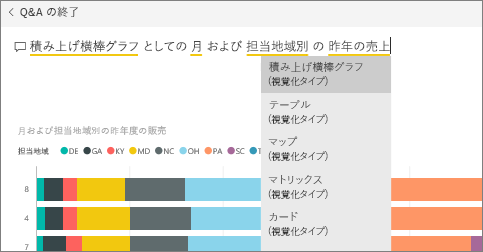
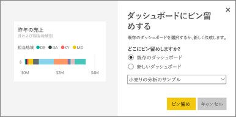
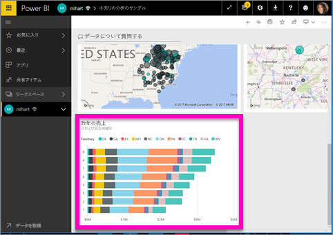

# Q&A からダッシュボードにタイルをピン留めする
## Q&A からタイルをピン留めする方法
Q&A は、Power BI のアドホック レポート作成ツールです。 特定の情報を検索する必要がありますか。 データについての質問を投稿し、視覚エフェクト形式で回答を受信します。

この記事では、Power BI サービス (app.powerbi.com) を使ってダッシュボードを開き、自然言語を使って視覚エフェクトを作成し、その視覚エフェクトをダッシュボードにピン留めする方法を紹介します。 ダッシュボードは Power BI Desktop では利用できません。 他の Power BI ツールやコンテンツで Q&A を使う方法について詳しくは、[Power BI Q&A の概要](../consumer/end-user-q-and-a.md)についての説明をご覧ください。 

作業を進めるために、[小売りの分析のサンプル ダッシュボード](sample-retail-analysis.md)を開きます。

1. レポートから少なくとも 1 つのタイルをピン留めした[ダッシュボード](../consumer/end-user-dashboards.md)を開きます。 質問を入力すると、Power BI はダッシュボードにタイルがピン留めされたデータセットで回答を検索します。  詳細については、[データの取得](../connect-data/service-get-data.md)に関するページを参照してください。
2. ダッシュボードの上部にある質問ボックスに、データに関する質問を入力します。  
   
3. たとえば、"月および担当地域別の昨年度の販売" と入力します。  
   

   入力と同時に [質問] ボックスに検索候補が表示されます。
4. グラフをタイルとしてダッシュボードに追加するには、キャンバスの右上隅にあるピン  を選択します。 他のユーザーから共有を受けているダッシュボードの場合は、どの視覚エフェクトもピン留めできません。

5. タイルを既存のダッシュボードまたは新しいダッシュボードにピン留めします。

   

   * 既存のダッシュボード: ドロップダウンから、ダッシュボードの名前を選びます。 現在のワークスペース内のダッシュボードのみを選択できます。
   * 新しいダッシュボード: 新しいダッシュボードの名前を入力すると、現在のワークスペースに追加されます。

6. **[Pin]** (ピン留め) を選択します。

   右上隅の近くに成功メッセージが表示され、視覚エフェクトがダッシュボードにタイルとして追加されたことがわかります。  

   
7. **[ダッシュボードへ移動]** を選択して新しいタイルを表示します。 ここでは、ダッシュボード上のタイルに対して、[名前の変更、サイズ変更、ハイパーリンクの追加、位置変更など](service-dashboard-edit-tile.md)を行うことができます。

   

## 考慮事項とトラブルシューティング
* 質問を入力し始めると、Q&A はすぐに、現在のダッシュボードに関連付けられているすべてのデータセットから最適な回答の検索を開始します。  "現在のダッシュボード" は、上部のナビ ペインに表示されているダッシュボードです。 たとえば、この質問は、 **[小売りの分析のサンプル]** ダッシュボードで入力しています。このダッシュボードは **mihart** ワークスペースの一部です。

  
* **Q&A が使用するデータセットを認識する方法**:  Q&A は、そのダッシュボードにピン留めされた視覚エフェクトが 1 つでもあるデータセットすべてにアクセスします。

* **質問ボックスが表示されない場合**: Power BI 管理者に問い合わせてください。 管理者は Q&A 機能を無効にすることができます。

## 次の手順
[タイルの名前の変更、サイズ変更、ハイパーリンクの追加、位置変更など](service-dashboard-edit-tile.md)    
[フォーカス モードでダッシュボード タイルを表示する](../consumer/end-user-focus.md)     
[Power BI での Q&A に戻る](../consumer/end-user-q-and-a.md)  
他にわからないことがある場合は、 [Power BI コミュニティを利用してください](https://community.powerbi.com/)。
