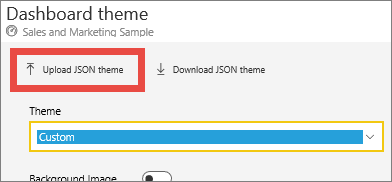

# <a name="use-dashboard-themes-in-the-power-bi-service"></a>Power BI サービスのダッシュボード テーマを使用する
**ダッシュボード テーマ** では、企業の色、季節の色、または適用する可能性がある他の色のテーマなど、色のテーマをダッシュボード全体に適用することができます。 ダッシュボードのテーマを適用すると、ダッシュボードのすべてのビジュアルで、選択したテーマから色が使用されます。 例外がいくつか適用されます。この記事の「[考慮事項と制限事項](#considerations-and-limitations)」をご覧ください。


ダッシュボード上のレポート ビジュアルの色を変更しても、関連するレポート内のビジュアルには影響しません。 また、既に[レポート テーマが適用](desktop-report-themes.md)されているレポートからのタイルをピン留めする場合は、現在のテーマを保持するか、ダッシュボード テーマを使用するかを選択できます。


## <a name="prerequisites"></a>前提条件
* 作業を進めるために、[売上およびマーケティングのサンプル ダッシュボード](sample-datasets.md)を開きます。


## <a name="how-dashboard-themes-work"></a>ダッシュボード テーマのしくみ
作業を開始するには、作成したダッシュボード、または編集できるダッシュボードを開きます。 **[編集]**  >  **[ダッシュボード テーマ]** の順に選択します。 


表示されたダッシュボード ウィンドウで、構築済みのテーマのいずれかを選択します。  次の例では、**[暗い]** を選択します。

![選択されている [明るい] オプション](media/service-dashboard-themes/power-bi-theme-menu.png)

![適用された [暗い] オプション](media/service-dashboard-themes/power-bi-theme-dark.png)

## <a name="create-a-custom-theme"></a>カスタム テーマを作成する

Power BI ダッシュボードの既定のテーマは **[明るい]** です。 色をカスタマイズするか、独自のテーマを作成する場合は、ドロップダウン リストで **[カスタム]** を選択します。 

![ドロップダウン リストから [カスタム] を選択する](media/service-dashboard-themes/power-bi-theme-custom.png)

カスタム オプションを使用して、独自のダッシュボードのテーマを作成します。 背景画像を追加する場合は、画像の解像度を 1920 x 1080 以上にすることをお勧めします。 画像を背景として使用するには、その画像をパブリックな Web サイトにアップロードし、その URL をコピーして **[画像の URL]** フィールドに貼り付けます。 

## <a name="use-a-json-theme"></a>JSON テーマを使用する
カスタム テーマを作成するもう 1 つの方法は、ダッシュボードで使用するすべての色の設定を含む JSON ファイルをアップロードすることです。 Power BI Desktop では、レポート作成者は JSON ファイルを使用して、[レポートのテーマを作成](desktop-report-themes.md)します。 これらの同じ JSON ファイルをダッシュボード用にアップロードすることも、Power BI コミュニティの[テーマ ギャラリー ページ](https://community.powerbi.com/t5/Themes-Gallery/bd-p/ThemesGallery)で、JSON ファイルを見つけてアップロードすることもできます。 


カスタム テーマを JSON ファイルとして保存してから、他のダッシュボード作成者と共有することもできます。 

### <a name="use-a-theme-from-the-theme-gallery"></a>テーマ ギャラリーのテーマを使用する

組み込みおよびカスタム オプションの場合と同じように、テーマをアップロードすると、ダッシュボードのすべてのタイルに色が自動的に適用されます。 

1. テーマの上にマウスを置き、**[レポートの表示]** を選択します。

    

2. 下にスクロールし、JSON ファイルへのリンクを見つけます。  ダウンロード アイコンを選択し、ファイルを保存します。

    

3. Power BI サービスに戻り、カスタム ダッシュボード テーマ ウィンドウで **[JSON テーマのアップロード]** を選択します。

    

4. JSON テーマ ファイルを保存した場所に移動し、**[開く]** を選択します。

5. ダッシュボード テーマ ページで、**[保存]** を選択します。 新しいテーマがダッシュボードに適用されます。

    

## <a name="reports-and-dashboards-with-different-themes"></a>それぞれテーマが異なるレポートとダッシュボード

レポートにダッシュボード テーマとは異なるテーマを使用している場合は、ビジュアルで現在のテーマを保持するか、ダッシュボード テーマを使用するかを制御できるケースがほとんどです。 ただし、ダッシュボードのカード ビジュアルでは、'DIN' フォント ファミリと黒のテキストが使用されます。 ダッシュボード上のすべてのタイル (カードなど) のテキストの色を変更するには、カスタムのダッシュボード テーマを作成します。

- ダッシュボードにタイルをピン留めする際に、レポート テーマを保持する場合は、**[現在のテーマを保持する]** を選択します。 ダッシュボードのビジュアルでは、透明度の設定を含む、レポート テーマが保持されます。

    **[タイルのテーマ]** オプションが表示されるのは、Power BI Desktop でレポートを作成し、[レポート テーマを追加](desktop-report-themes.md)してから Power BI サービスにレポートを発行した場合のみです。

    ![選択されている [現在のテーマを保持する]](media/service-dashboard-themes/power-bi-keep-current.png)

- タイルを再度ピン留めし、**[保存先のテーマを使用]** を選択してみます。

    

## <a name="dashboard-theme-json-file-format"></a>ダッシュボード テーマの JSON ファイル形式

最も基本的なレベルにおいて、テーマの JSON ファイルに必須の行は、**name** の 1 つだけです。

```json
{
    "name": "Custom Theme"
}
```

**[名前]** 以外は、すべて省略可能です。 具体的に書式設定したいプロパティのみを自由にテーマ ファイルに追加し、残りについては Power BI の既定値をそのまま使用することができます。

ダッシュボードのテーマ用の JSON ファイルには次のようなものがあります。

- name: テーマ名 (唯一の必須フィールド)。
- foreground and background: ダッシュボードの色。
- dataColors: グラフ内のデータに使用する 16 進コードの一覧。 必要に応じて色をいくつでも含めることができます。
- tiles: ダッシュボードの背景および色の構成。
- visualStyles: ビジュアルの詳細な書式設定。

次に示すのは、既定のライト テーマ用のテーマ JSON のサンプルです。

```json
{

"name":"Light",

"foreground":"#000000",

"background":"#EAEAEA",

"dataColors":["#01B8AA","#374649","#FD625E","#F2C80F","#5F6B6D","#8AD4EB","#FE9666","#A66999"],

"tiles":{"background":"#FFFFFF","color":"#000000"},

"visualStyles":{"*":{"*":{"*":[{"color":{"solid":{"color":"#000000"}}}]}}}

}
```

## <a name="considerations-and-limitations"></a>考慮事項と制限事項

* ピン留めされたライブ レポート ページ、iframe タイル、SSRS タイル、ブック タイル、またはイメージにダッシュボード テーマを適用することはできません。
* ダッシュボード テーマはモバイル デバイス上に表示されますが、ダッシュボード テーマを作成できるのは Power BI サービスに限られています。
* ダッシュボードのカスタム テーマは、レポートからピン留めされたタイルでのみ機能します。

## <a name="next-steps"></a>次のステップ

- [レポートにテーマを適用する](desktop-report-themes.md)
