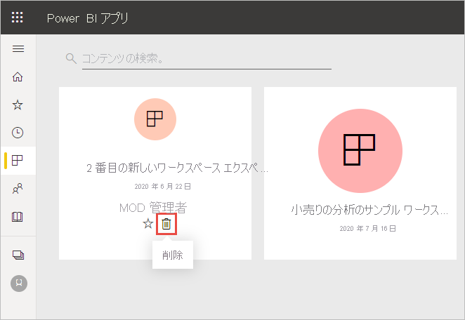

# Power BI サービスのほとんどすべてのものを削除する
この記事では、Power BI サービスでダッシュボード、レポート、ブック、データセット、アプリ、視覚化、ワークスペースを削除する方法について示します。 いくつかの例外を除き、Power BI サービスのほとんどすべてのものを削除できます。 

## ダッシュボード、レポート、データセット、またはブックを削除する

1. ワークスペースで、 **[すべて]** タブを選択します。
1. 削除する資産の横にある **[その他のオプション]** (...) を選択し、 **[削除]** を選択します。

    ![[その他のオプション] を選択してから [削除] を選択するスクリーンショット。](media/service-delete/power-bi-delete-dashboard.png)

1. **[削除]** を選択して、削除を確認します。

## アプリ リスト ページからアプリを除去する

アプリ一覧ページからアプリを簡単に除去できます。 アプリを除去しても、他のメンバーのアプリは削除されません。 ワークスペースの管理者またはメンバーのみが、そのワークスペースからアプリを完全に削除できます。

1. ナビ ペインで、 **[アプリ]** を選択してアプリ リスト ページを開きます。
2. 削除するアプリにカーソルを合わせ、削除アイコン :::image type="icon" source="media/service-delete/power-bi-delete-report2.png" border="false"::: を選択します。

   

   アプリを誤って除去した場合、いくつかの方法で戻すことができます。  たとえば、アプリ作成者に再送信を依頼するか、アプリへのリンクが示されている元のメールを見つけます。または、[通知センター](../consumer/end-user-notification-center.md)でアプリの通知がまだリストされているかどうかを確認するか、組織の [AppSource](../consumer/end-user-apps.md) を確認します。

## ワークスペースを除去または削除する

Power BI には、オリジナルである "*クラシック*" ワークスペースと新しいワークスペースの、2 種類のワークスペースがあります。 それらを除去または削除するプロセスは異なります。 詳細については、[新しいワークスペースとクラシック ワークスペース](../collaborate-share/service-new-workspaces.md)に関する記事を参照してください。

### 新しいワークスペースからメンバーを除去する

新しいワークスペースのメンバーを除去できるのは、ワークスペース管理者だけです。 管理者は、自分自身または他のすべてのユーザーを除去できます。 ただし、自分がワークスペースの唯一の管理者である場合は、Power BI で自分自身を除去することはできません。

1. ワークスペースのリスト ビューで、右上隅にある **[アクセス]** を選択します。

    :::image type="content" source="media/service-delete/power-bi-select-access.png" alt-text="[アクセス] の選択のスクリーンショット。":::

1. **[アクセス]** ペインで、除去するユーザーの名前の横にある **[その他のオプション]** (...) を選択し、 **[削除]** を選択します。

    :::image type="content" source="media/service-delete/power-bi-access-remove.png" alt-text="[アクセス] ペインで [削除] を選択したスクリーンショット。":::

### 新しいワークスペースを削除する

"*新しいワークスペース*" の 1 つを作成するとき、関連付けられた Microsoft 365 グループを作成しません。 ワークスペース管理者の場合は、Microsoft 365 グループに影響を与えることなく、新しいワークスペースを削除できます。 詳細については、[新しいワークスペースとクラシック ワークスペース](../collaborate-share/service-new-workspaces.md)に関する記事を参照してください。

ワークスペース管理者は、それを除去したり、それから他のユーザーを除去したりすることができます。 それを削除すると、関連するアプリがすべてのグループ メンバーについても削除され、アプリは AppSource から除去されます。 

1. ナビ ペインから **[ワークスペース]** を選択します。

2. 削除するワークスペースの右にある **[その他のオプション]** (...) を選択し、 **[ワークスペースの設定]** を選択します。

    ![[その他のオプション] で [ワークスペースの設定] を選択したスクリーンショット。](media/service-delete/power-bi-delete-workspace.png)

3. **[ワークスペースの設定]** ペインで、 **[ワークスペースの削除]**  >  **[削除]** を選択します。

### リストからクラシック ワークスペースを除去する

クラシック ワークスペースのメンバーである必要がなくなった場合は、それから "**_脱退_*" することができます。そうすると、それはリストから除去されます。 ワークスペースから脱退しても、他のすべてのワークスペース メンバーはそのままです。  

> [!NOTE]
> ワークスペースの管理者が 1 人だけの場合は、脱退できません。
>

1. 除去するワークスペースに移動します。

2. 右上隅にある _ *[その他のオプション]* (...) を選択し、 **[ワークスペースからの脱退]**  >  **[脱退する]** を選択します。

      :::image type="content" source="media/service-delete/power-bi-leave-workspace.png" alt-text="[その他のオプション] の [ワークスペースからの脱退] のスクリーンショット。":::

   > [!NOTE]
   > ドロップダウン リストに表示されるオプションは、そのワークスペースの管理者であるか、メンバーであるかによって異なります。
   >

### クラシック ワークスペースを削除する

> [!WARNING]
> "*クラシック*" ワークスペースを作成するときは、Microsoft 365 グループを作成します。 クラシック ワークスペースを削除するときは、その Microsoft 365 グループを削除します。 そのグループは、SharePoint や Microsoft Teams などの他の Microsoft 365 製品からも削除されます。
> 

ワークスペースを削除することは、ワークスペースから脱退することとは異なります。 それを削除するには、ワークスペース管理者である必要があります。 それを削除すると、関連するアプリがすべてのグループ メンバーについても削除され、AppSource から除去されます。 ただし、自分がワークスペースの唯一の管理者である場合は、脱退できません。

1. ナビゲーション ペインから **[ワークスペース]** を選択します。

2. 削除するワークスペースの隣にある **[その他のオプション]** (...)  >  **[ワークスペースの設定]** を選択します。

    

3. **[設定]** ペインで、 **[ワークスペースの削除]** を選択し、 **[削除]** を確認します。

    ![[ワークスペースの削除] のスクリーンショット。](media/service-delete/power-bi-delete-classic-workspace.png)

## 考慮事項と制限事項

- "*ダッシュボード*" を除去しても、基となっているデータセットや、そのダッシュボードに関連付けられているレポートは削除されません。
- "*ダッシュボードまたはレポートの所有者*" は、それを除去することができます。 それを同僚と共有している場合、それを Power BI ワークスペースから除去すると、その人たちの Power BI ワークスペースからも除去されます。
- "*ダッシュボードまたはレポートが自分と共有されている*" 場合、それを除去することはできません。
- レポートを削除しても、レポートの基になっているデータセットは削除されません。  レポートからダッシュボードにピン留めした視覚化も安全です。 それらは、個別に削除するまで、ダッシュボードに残ります。
- "*データセット*" を削除することができます。 ただし、データセットを削除すると、そのデータセットのデータを含むダッシュボード タイルとレポートもすべて削除されます。
- "*ブック*" を除去することができます。 ただし、ブックを除去すると、そのブックのデータを含むダッシュボード タイルやレポートもすべて除去されます。 ブックが OneDrive for Business に格納されている場合は、それを Power BI から削除しても OneDrive からは削除されません。
- "*ダッシュボードまたはレポート*" が [組織のコンテンツ パック](../collaborate-share/service-organizational-content-pack-disconnect.md)の一部である場合、この方法を使用してそれを削除することはできません。  「[組織のコンテンツ パックに対する接続を削除する](../collaborate-share/service-organizational-content-pack-disconnect.md)」を参照してください。
- "*データセット*" が 1 つ以上の組織のコンテンツ パックの一部である場合、それを削除する唯一の方法は、それが使用されているコンテンツ パックから除去し、処理されるまで待ってから、もう一度削除を試みることです。

## 次のステップ

この記事では、Power BI サービスの主な構成要素を削除する方法について説明しました。 他にもいくつかの項目を削除できます。  

- [おすすめのダッシュボードを除去する](../consumer/end-user-featured.md)
- [ダッシュボードをお気に入りから外す](../consumer/end-user-favorite.md)
- [ダッシュボード タイルを削除する](service-dashboard-edit-tile.md)

その他の質問 [Power BI コミュニティを利用してください](https://community.powerbi.com/)。