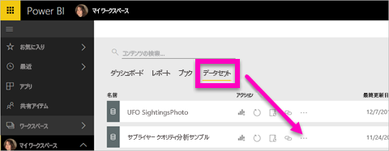
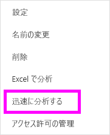
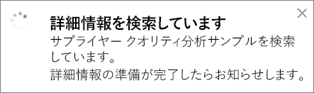
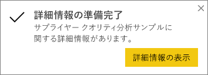
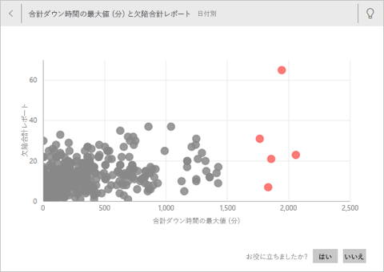
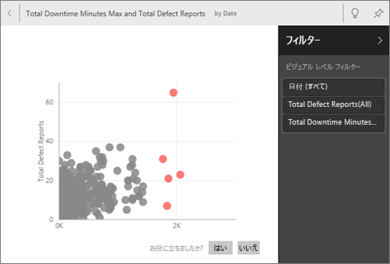
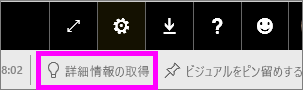
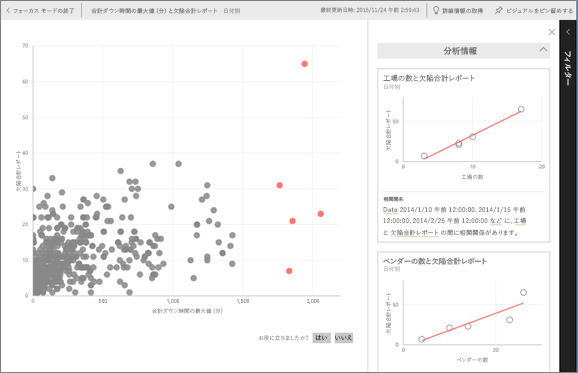

# Power BI を使用してデータセットに関するデータの分析情報を自動的に生成する
新しいデータセットがあるが、どこから始めるべきかわからない場合。  ダッシュボードをすばやく構築する必要がある場合。  不足している情報を探したい場合。

クイック分析情報を実行して、データに基づいて、興味のある対話型の視覚化を生成します。 この記事では、データセット全体に対してクイック分析情報を実行する方法について説明します (クイック分析情報)。 また、[特定のダッシュボード タイルに対してクイック分析情報](../consumer/end-user-insights.md)を実行することもできます (範囲付き分析情報)。 インサイトに対してインサイトを実行することもできます。

> [!NOTE]
> 分析情報は、DirectQuery では機能しません。Power BI にアップロードされたデータに限り機能します。
> 

Microsoft Research を使用して開発した[一連の高度な分析アルゴリズム](../consumer/end-user-insight-types.md)は現在も増え続けており、それに基づいて分析情報機能が構築されました。 Microsoft では、今後もこれらのアルゴリズムを使用し、より多くのユーザーが新しい直感的な方法でデータの分析情報を見つけられるように支援します。 [クイック分析情報のためにデータを最適化する方法についてはこちら](service-insights-optimize.md)を参照してください。

## データセットへのクイック インサイトの実行
Amanda がデータセットに対してクイック分析情報を実行し、フォーカス モードで分析情報を開く動画をご覧ください。 Amanda は、分析情報をダッシュボードのタイルとしてピン留めし、ダッシュボード タイルの分析情報を取得しています。

<iframe width="560" height="315" src="https://www.youtube.com/embed/et_MLSL2sA8" frameborder="0" allowfullscreen></iframe>

次はあなたの番です。 [サプライヤー クオリティ分析サンプル](sample-supplier-quality.md)を使用して分析情報を試してみます。

1. **[データセット]** タブから **その他のオプション** (...) を選び、**[クイック分析情報を取得する]** を選びます。
   
    
   
    
2. Power BI は[さまざまなアルゴリズム](../consumer/end-user-insight-types.md)を使用して、データセット内の傾向を検索します。
   
    
3. 数秒で、情報を取得する準備が整います。  **[詳細情報の表示]** を選択して、視覚化を表示します。
   
    
   
    > [!NOTE]
    > データが統計的に有意でないために分析情報を生成できないデータセットもあります。  詳細については、「[Power BI クイック インサイト用のデータの最適化](service-insights-optimize.md)」を参照してください。
    > 
    
4. 視覚化は、最大 32 個の個別のインサイト カードとともに特別な **[クイック分析情報]** キャンバスに表示されます。 各カードには、グラフまたはグラフと簡単な説明が含まれます。
   
    

## インサイト カードとの対話

1. ダッシュボードに視覚化を追加するには、カードの上にポインターを移動してピン アイコンを選択します。

2. カードをポイントし、**その他のオプション** (...) を選択し、**[詳細情報の表示]** を選択します。 

    分析情報画面がフォーカス モードで開きます。
   
    
3. フォーカス モードでは次のことができます。
   
   * 視覚エフェクトをフィルター処理します。 **[フィルター]** ウィンドウがまだ開いていない場合、ウィンドウの右側にある矢印を選択して展開します。

       
   * **[ビジュアルをピン留めする]** を選択して、分析情報カードをダッシュボードにピン留めします。
   * カード自体で分析情報を実行します。カードは *範囲付き分析情報* と呼ばれることもあります。 右上隅にある電球アイコン ![[詳細情報の取得] アイコン](media/service-insights/power-bi-bulb-icon.png) または **[詳細情報の取得]** を選択します。
     
       
     
     分析情報は左側に表示されます。 その 1 つの分析情報のデータのみに基づいた新しいカードが右側に表示されます。
     
       
4. 元のインサイト キャンバスに戻るには、左上隅にある **[フォーカス モードの終了]** を選択します。

## 次の手順
- データセットを所有している場合は、[クイック分析情報用に最適化します](service-insights-optimize.md)。
- 使用できるクイック分析情報の種類については[こちら](../consumer/end-user-insight-types.md)を参照してください。

他にわからないことがある場合は、 [Power BI コミュニティを利用してください](https://community.powerbi.com/)。
