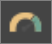

# Power BI サービスで Excel ファイルからレポートを作成する
[Power BI のレポート](../consumer/end-user-reports.md)を読んで、次は自分のレポートを作成しようと思われるでしょう。 レポートを作成するには、さまざまな方法があります。 この記事では、まず、Excel ファイルから Power BI サービスに基本的なレポートを作成します。 レポートの作成の基本を理解したら、最後の「[次の手順](#next-steps)」でより高度なレポートに関するトピックを確認してください。  

## 前提条件
- [Power BI サービスにサインアップする](../fundamentals/service-self-service-signup-for-power-bi.md)。 
- [小売りの分析のサンプル Excel ファイルをダウンロード](https://go.microsoft.com/fwlink/?LinkId=529778)し、それを自分のコンピューターまたは OneDrive for Business に保存します。

## Excel ファイルをインポートする
この方法でのレポート作成は、ファイルと空白のレポート キャンバスから始まります。 小売りの分析のサンプル Excel ファイルでも同じようにできます。

1. ナビゲーション ペインで、 **[マイ ワークスペース]** を選択します。
   
   :::image type="content" source="media/service-report-create-new/power-bi-select-my-workspace.png" alt-text="[マイ ワークスペース] を選択するスクリーンショット。":::
2. ナビ ペインの下部にある **[データの取得]** を選択します。
   
   
3. **[ファイル]** を選択し、小売りの分析のサンプルを保存した場所に移動します。
   
    ![[ファイル] の選択](media/service-report-create-new/power-bi-select-files.png)
4. この演習では、 **[インポート]** を選択します。
   
   ![[インポート] の選択](media/service-report-create-new/power-bi-import.png)
5. **[Open (開く)]** を選択します。

   Excel ファイルがインポートされると、ワークスペース リストに "*データセット*" として一覧表示されます。

1. データセットの横にある **[その他のオプション] (...)** を選択し、 **[レポートの作成]** を選択します。
   
   :::image type="content" source="media/service-report-create-new/power-bi-dataset-create-report.png" alt-text="[レポートの作成] を選択するスクリーンショット。":::
6. レポート エディターが開きます。 
   
   

> [!TIP]
> ナビゲーション ウィンドウを非表示にするメニュー アイコンを選択すると、スペースが増えます。
> 
> :::image type="content" source="../media/power-bi-hide-navigation-pane.png" alt-text="ナビゲーション ウィンドウを非表示にするメニュー アイコンを選択するスクリーンショット。":::

## レポートに放射状ゲージを追加する
データセットがインポートされたので、質問への回答を始めましょう。  最高マーケティング責任者 (CMO) は、今年の売上目標にどれだけ近づいているかを知りたいと考えています。 ゲージは、このような種類の情報を表示するために[適した視覚化の選択肢](../visuals/power-bi-report-visualizations.md)です。

1. [フィールド] ウィンドウで、 **[Sales (売上)]**  >  **[This Year Sales (今年の売上)]**  >  **[値]** を選びます。
   
    
2. ゲージのテンプレート  を **[視覚化]** ウィンドウから選択して、ビジュアルをゲージに変換します。
   
    
3. **\[Sales] \(売上)**  >  **\[This Year Sales] \(今年の売上)**  >  **[目標]** を **[目標値]** にドラッグします。 目標に非常に近づいているようです。
   
    
4. ここでレポートを保存することをお勧めします。
   
   ![[ファイル] メニュー](media/service-report-create-new/powerbi-save.png)

## 面グラフとスライサーをレポートに追加する
CMO に対して、その他いくつかの質問に応える必要があります。 昨年と比較して、今年の売上がどうであるかを知りたいと考えています。 また、地区ごとの結果を確認したいと考えています。

1. まず、キャンバスに空き領域を作りましょう。 ゲージを選択し、右上隅に移動します。 次に、四隅のいずれかをつかんでドラッグし、サイズを小さくします。
2. ゲージの選択を解除します。 [フィールド] ウィンドウで、 **[Sales (売上)]**  >  **[This Year Sales (今年の売上)]**  >  **[値]** を選択し、 **[Sales (売上)]**  >  **[Last Year Sales (昨年の売上)]** を選択します。
   
    
3. 面グラフのテンプレート  を **[視覚化]** ウィンドウから選択し、ビジュアルを面グラフに変換します。
4. **[Time (時間)]**  >  **[Period (期間)]** を選択して、[Period (期間)] を **[軸]** に追加します。
   
    
5. 視覚化を期間で並べ替えるには、省略記号を選んで、**[Sort by Period]\(期間別に並べ替え\)** を選びます。
6. 次にスライサーを追加しましょう。 キャンバスの空いている領域を選択して、スライサー  テンプレートを選択します。 これで、キャンバスに空のスライサーが作成されました。
   
        
7. [フィールド] ウィンドウから **[District (地区)]**  >  **[District (地区)]** の順に選択します。 スライサーを移動し、サイズを変更します。
   
      
8. スライサーを使用して地区ごとのパターンや洞察を探します。
   
     

データの調査と視覚エフェクトの追加を続けます。 特に興味深い分析情報が見つかったら、[ダッシュボードにピン留め](service-dashboard-pin-tile-from-report.md)します。

## 次のステップ

* [ダッシュボードに視覚エフェクトをピン留めする](service-dashboard-pin-tile-from-report.md)
* [Power BI サービスのレポート設定を変更する](power-bi-report-settings.md)
* 他にわからないことがある場合は、 [Power BI コミュニティを利用してください](https://community.powerbi.com/)。
