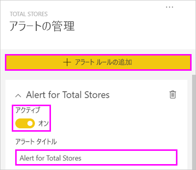
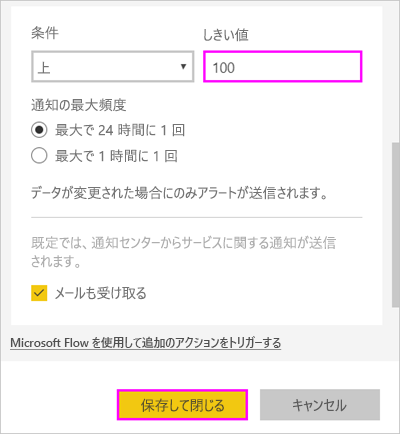
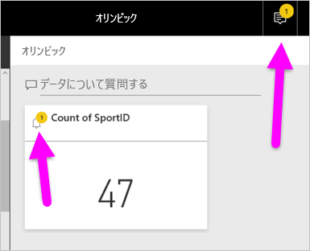
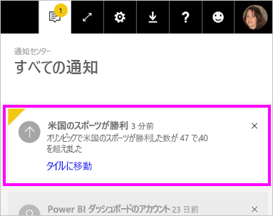
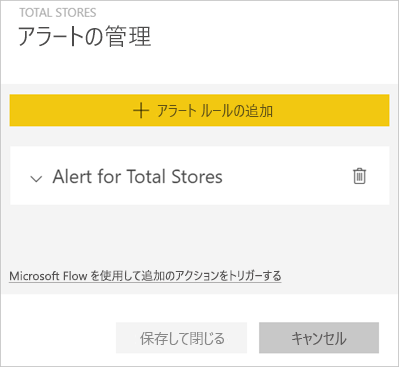
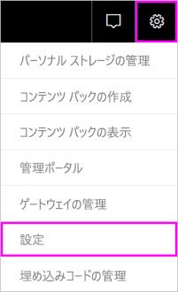

# Power BI サービスのデータ アラート

アラートを設定すると、ダッシュボード内のデータが設定した制限を超えて変更された場合に通知されます。

個人用ワークスペースのタイルにアラートを設定することができます。 だれかが [Premium 容量](../admin/service-premium-what-is.md)にあるダッシュボードを共有している場合にも、アラートを設定することができます。 Power BI Pro ライセンスをお持ちの場合は、他のワークスペースのタイルにもアラートを設定することができます。 アラートは、レポートのビジュアルからピン留めされたタイルでのみ、ゲージ、KPI、カードに対してだけ設定できます。 アラートは、レポートからダッシュボードにピン留めするストリーミング データセットから作成されたビジュアルに対して設定できます。 **[タイルの追加]**  >  **[カスタム ストリーミング データ]** を使用して、ダッシュボード上に直接作成されたストリーミング タイルにアラートを設定することはできません。

ダッシュボードを共有している場合であっても、見ることができるのは自分で設定したアラートだけです。 ダッシュボードのビューで設定したアラートは、そのダッシュボードの所有者でも表示できません。 データ アラートはプラットフォーム間で完全に同期されます。[Power BI モバイル アプリ](../consumer/mobile/mobile-set-data-alerts-in-the-mobile-apps.md)および Power BI サービスで、データ アラートを設定して表示できます。 これらを Power BI Desktop で使用することはできません。 アラートを自動化し、Power Automate と統合することもできます。 この [Power Automate と Power BI](../collaborate-share/service-flow-integration.md) に関する記事では、それをご自分で試すことができます。

> [!WARNING]
> データ ドリブン アラート通知は、データに関する情報を提供します。 モバイル デバイスで Power BI データを表示し、そのデバイスを紛失したり盗まれたりした場合、Power BI サービスを使用して、すべてのデータ ドリブン アラート ルールをオフにすることをお勧めします。

## Power BI サービスでデータ アラートを設定する

Amanda がダッシュボードのタイルにいくつかのアラートを追加する様子をご覧ください。 その後、ビデオで説明されている手順に従って、ご自分でやってみてください。

<iframe width="560" height="315" src="https://www.youtube.com/embed/JbL2-HJ8clE" frameborder="0" allowfullscreen></iframe>

この例では、Retail Analysis サンプル ダッシュボードのカード タイルを使用します。 作業を進める場合は、[小売りの分析のサンプル レポートを取得](sample-retail-analysis.md#get-the-content-pack-for-this-sample)します。

1. ダッシュボードで開始します。 **[Total Stores]\(総店舗数\)** タイルで、省略記号を選択します。

   ![[Total Stores] タイル](media/service-set-data-alerts/powerbi-card.png)

1. ベルのアイコン  を選択して、 **[Total Stores]\(総店舗数\)** に 1 つまたは複数のアラートを追加します。

1. 最初に、 **[+ アラート ルールの追加]** を選んで、 **[アクティブ]** スライダーが **[オン]** に設定されていることを確認し、アラートのタイトルを指定します。 タイトルは、アラートの内容を簡単に理解するために役立ちます。

   

1. 下にスクロールして、アラートの詳細を入力します。  この例では、総店舗数の値が 100 を超えた場合に 1 日に 1 回通知するアラートを作成します。

   

    アラートは**通知センター**に表示されます。 このチェック ボックスをオンにした場合は、Power BI によってアラートに関するメールも送信されます。

1. **[保存して閉じる]** を選びます。

## アラートの受信

追跡対象データが設定したしきい値のいずれかに達した場合は、いくつかの処理が行われます。 最初に、Power BI によって、最後のアラートから 1 時間以上または 24 時間以上 (選択したオプションによって異なる) 経過しているかどうかが確認されます。 データがしきい値を超えている場合は、アラートを受け取ります。

次に、Power BI によって**通知センター**にアラートが送信され、さらにオプションで電子メールでもアラートが送信されます。 各アラートにはデータへの直接リンクが含まれています。 リンクを選択して関連するタイルを表示し、調査、共有、詳細の確認を行うことができます。  

* 電子メールを送信するようにアラートを設定した場合は、次のようなメールを受信します。

   

* Power BI は、メッセージを**通知センター**に追加し、新しいアラート アイコンを該当するタイルに追加します。

   

* **通知センター**にアラートの詳細が表示されます。

    

   > [!NOTE]
   > アラートは、更新されたデータに対してのみ機能します。 データが更新されると、Power BI はそのデータにアラートが設定されているかどうかを確認します。 データがアラートのしきい値に達した場合、Power BI によってアラートがトリガーされます。

## アラートの管理

アラートを管理するには多くの方法があります。

* ダッシュボード タイルから。

* Power BI の [設定] メニューから。

* [Power BI モバイル アプリ](../consumer/mobile/mobile-set-data-alerts-in-the-mobile-apps.md)のタイルで。

### ダッシュボード タイルから

1. タイルのアラートを変更または削除する必要がある場合は、ベルのアイコン **アラート アイコン** を選択して ![[アラートの管理]](media/service-set-data-alerts/power-bi-bell-icon.png) ウィンドウを再び開きます。

    Power BI によりこのタイルに設定したアラートが表示されます。

    

1. アラートを変更するには、アラート名の左側にある矢印を選択します。

    

1. アラートを削除するには、アラート名の右側にあるごみ箱を選択します。

      

### Power BI の [設定] メニューから

1. Power BI のメニュー バーから歯車アイコンを選択し、 **[設定]** を選択します。

    。

1. **[設定]** の **[アラート]** を選択します。

    ![[設定] ウィンドウの [アラート] タブ](media/service-set-data-alerts/powerbi-alert-settings.png)

1. ここからは、アラートをオンまたはオフにしたり、 **[アラートの管理]** ウィンドウを開いて変更を行ったり、アラートを削除したりできます。

## 考慮事項とトラブルシューティング

* 日付/時刻メジャーを含むカード タイルについては、アラートがサポートされていません。
* アラートは、数値データ型でのみ機能します。
* アラートは、更新されたデータに対してのみ機能します。 静的データでは動作しません。
* KPI、カード、またはゲージ レポート ビジュアルを作成し、そのビジュアルをダッシュボードにピン留めした場合、アラートはストリーミング データセットでのみ動作します。

## 次のステップ

* [データ アラートを含む Power Automate を作成する](../collaborate-share/service-flow-integration.md)。

* [モバイル デバイスでデータ アラートを設定する](../consumer/mobile/mobile-set-data-alerts-in-the-mobile-apps.md)。

* [Power BI とは?](../fundamentals/power-bi-overview.md)

他にわからないことがある場合は、 [Power BI コミュニティで質問してみてください](https://community.powerbi.com/)。
