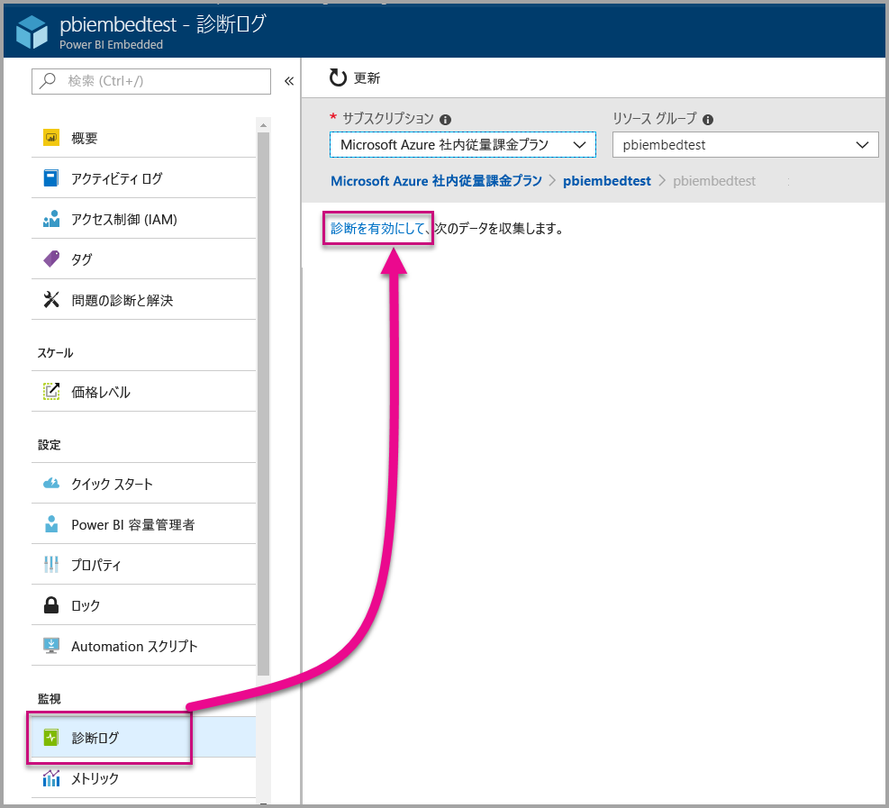
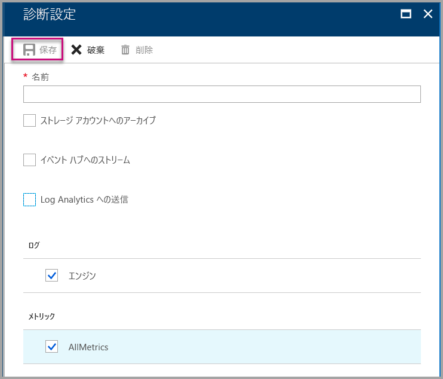
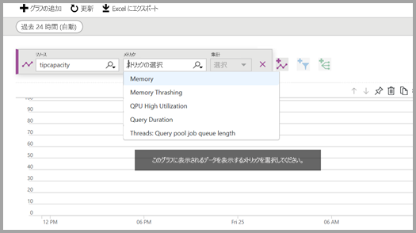
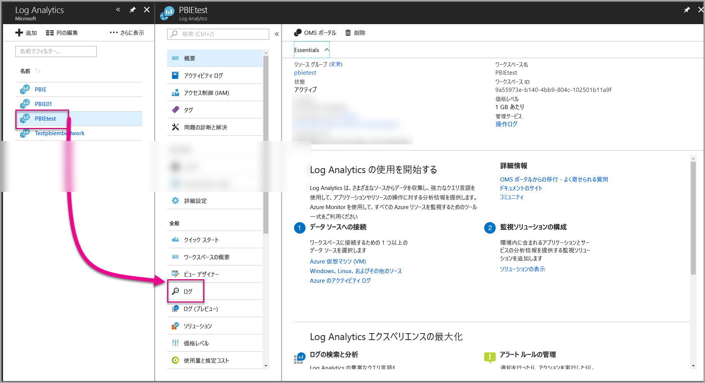
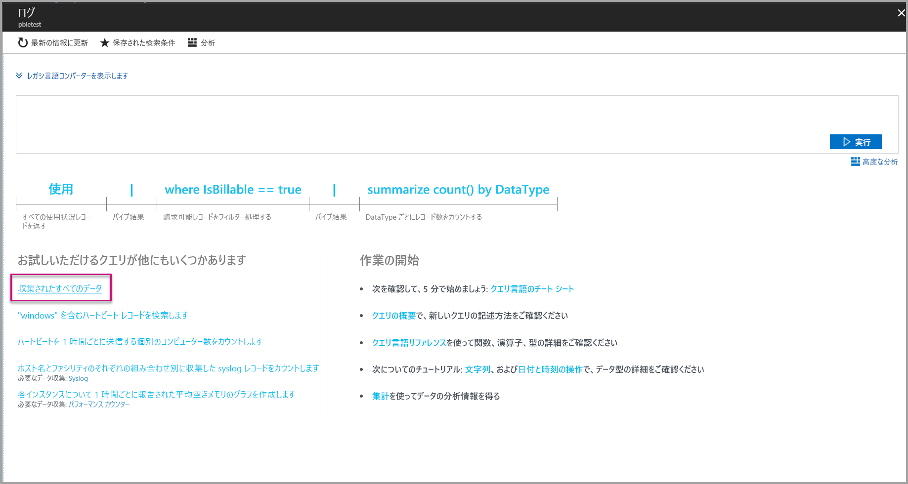
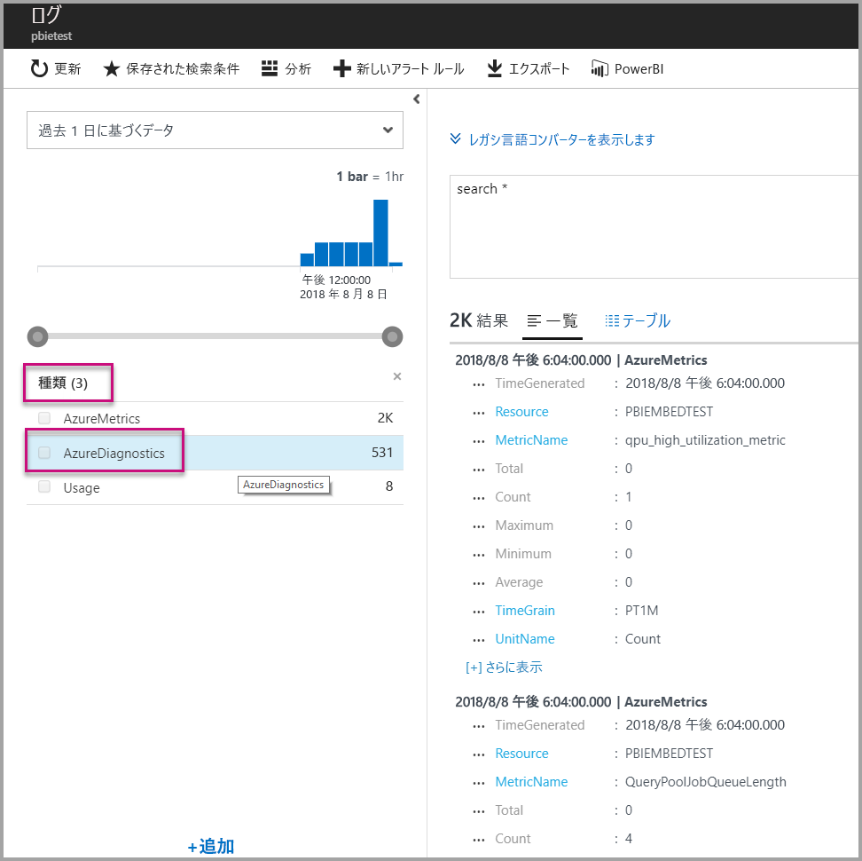
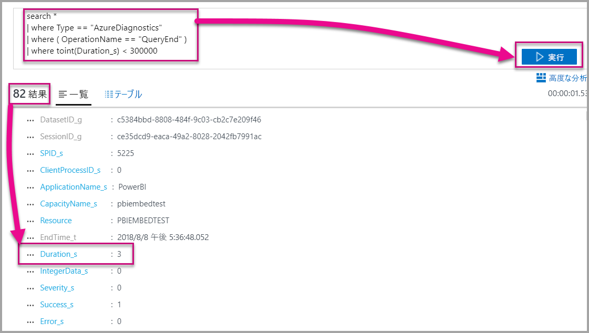

# <a name="diagnostic-logging-for-power-bi-embedded-in-azure"></a>Azure の Power BI Embedded の診断ログ

[Azure のリソース診断ログ](https://docs.microsoft.com/azure/monitoring-and-diagnostics/monitoring-overview-of-diagnostic-logs)を使用すると、容量からのさまざまなイベントをログに記録して、それらを分析ツールで読み込み、リソースの動作に関する分析情報を得られます。

診断を使用することで、次のようないくつかのシナリオに対処できます。

* 実行時間の長いクエリや問題のあるクエリを検出する。
* [容量メトリック](https://powerbi.microsoft.com/blog/power-bi-developer-community-april-update/)の派生。
* 特定のデータセットの使用状況を追跡する。

## <a name="set-up-diagnostics-logging"></a>診断ログの設定

### <a name="azure-portal"></a>Azure Portal

1. [Azure portal](https://portal.azure.com) の Power BI Embedded リソースで、ナビ ペインの **[診断ログ]** を選択し、 **[診断をオンにする]** を選択します。

    

2. **[診断設定]** で次のオプションを指定します。

    * **名前** - 作成する診断設定の名前を入力します。

    * **ストレージ アカウントへのアーカイブ** - このオプションを使用するには、既存のストレージ アカウントに接続する必要があります。 「[ストレージ アカウントを作成する](https://docs.microsoft.com/azure/storage/common/storage-create-storage-account)」に記載されている手順に従ってストレージ アカウントを作成します。 次に、ポータルのこのページに戻ってきて、ストレージ アカウントを選択します。 新しく作成したストレージ アカウントがドロップダウン メニューに表示されるまでには、数分かかる場合があります。 ログ ファイルのストレージは JSON 形式です。
    * **イベント ハブへのストリーム** - このオプションを使用するには、既存のイベント ハブの名前空間とイベント ハブに接続する必要があります。 詳細については、「[Azure Portal を使用して Event Hubs 名前空間とイベント ハブを作成する](https://docs.microsoft.com/azure/event-hubs/event-hubs-create)」をご覧ください。
    * **Log Analytics への送信** - このオプションを使用するには、既存のワークスペースを使用するか、ポータルで[新しいワークスペースを作成する](https://docs.microsoft.com/azure/log-analytics/log-analytics-quick-collect-azurevm#create-a-workspace)ための手順に従って、新しいLog Analytics ワークスペースを作成します。 これは、組み込みの分析、ダッシュボード、通知の機能を備えている [Azure Log Analytics](https://docs.microsoft.com/azure/log-analytics/log-analytics-overview) を活用します。 Log Analytics を使用して、他のリソースからのより多くのデータに接続し、アプリケーションのリソースすべてにわたるデータを 1 つの完全なビューにまとめます。 また、[1 回のクリックで Power BI](https://docs.microsoft.com/azure/log-analytics/log-analytics-powerbi) に接続することもできます。
    Log Analytics でのログの表示について詳しくは、[Log Analytics でのログの表示](https://docs.microsoft.com/azure/log-analytics/log-analytics-activity)に関するページをご覧ください。
    * **エンジン** - このオプションを選択して、以下で一覧表示されている一連の[エンジンのイベント](#whats-logged)をログに記録します。
    * **AllMetrics** - このオプションを選択して、詳細データを[メトリック](https://docs.microsoft.com/azure/analysis-services/analysis-services-monitor#server-metrics)に保存します。 ストレージ アカウントにアーカイブする場合は、診断ログの保有期間を選択できます。 保有期間を過ぎると、ログは自動的に削除されます。

3. **[保存]** を選択します。

    診断ログの保存方法を変更するには、このページに戻って設定を変更します。

    

### <a name="using-powershell-to-enable-diagnostics"></a>PowerShell を使用して診断を有効にする

PowerShell を使用してメトリックと診断ログを有効にするには、次のコマンドを使用します。

* ストレージ アカウントで診断ログのストレージを有効にするには、次のコマンドを使用します。

    ```powershell
    Set-AzureRmDiagnosticSetting -ResourceId [your resource id] -StorageAccountId [your storage account id] -Enabled $true
    ```
    ストレージ アカウント ID は、ログを送信するストレージ アカウントのリソース ID です。

* イベント ハブに対して診断ログのストリーミングを有効にするには、次のコマンドを使用します。

    ```powershell
    Set-AzureRmDiagnosticSetting -ResourceId [your resource id] -ServiceBusRuleId [your service bus rule id] -Enabled $true
    ```
* Azure Service Bus ルール ID は、次の形式の文字列です。

    ```powershell
    {service bus resource ID}/authorizationrules/{key name}
    ```

* Log Analytics ワークスペースへの診断ログの送信を有効にするには、次のコマンドを使用します。

    ```powershell
        Set-AzureRmDiagnosticSetting -ResourceId [your resource id] -WorkspaceId [resource id of the log analytics workspace] -Enabled $true
    ```

* 次のコマンドを使用して、Log Analytics ワークスペースのリソース ID を取得できます。

    ```powershell
    (Get-AzureRmOperationalInsightsWorkspace).ResourceId
    ```

これらのパラメーターを組み合わせて、複数の出力オプションを有効にすることができます。

### <a name="rest-api"></a>REST API

[Azure Monitor の REST API を使用して診断設定を変更する](https://docs.microsoft.com/rest/api/monitor/)方法を学習します。 

### <a name="resource-manager-template"></a>Resource Manager テンプレート

[Resource Manager テンプレートを使用してリソースの作成時に診断設定を有効にする](https://docs.microsoft.com/azure/monitoring-and-diagnostics/monitoring-enable-diagnostic-logs-using-template)方法を学習します。

## <a name="whats-logged"></a>ログの記録対象

**[エンジン]** と **[AllMetrics]** カテゴリを選択できます。

### <a name="engine"></a>エンジン

エンジン カテゴリは次のイベントをログに記録するようリソースに指示します。各イベントのプロパティは次のとおりです。

|     イベント名     |     イベントの説明     |
|----------------------------|----------------------------------------------------------------------------------|
|    監査ログイン    |    追跡開始以降のエンジン イベントへの新しい接続を、すべて記録します。    |
|    セッションの初期化    |    追跡開始以降のセッション初期化イベントをすべて記録します。    |
|    Vertipaq クエリの開始    |    追跡開始以降の VertiPaq SE クエリの開始イベントを、すべて記録します。    |
|    クエリの開始    |    追跡開始以降のクエリの開始イベントを、すべて記録します。    |
|    クエリの終了    |    追跡開始以降のクエリの終了イベントを、すべて記録します。    |
|    Vertipaq クエリの終了    |    追跡開始以降の VertiPaq SE クエリの終了イベントを、すべて記録します。    |
|    監査ログアウト    |    追跡開始以降のエンジン イベントからの切断を、すべて記録します。    |
|    Error    |    追跡開始以降のエンジン エラーのイベントを、すべて記録します。    |

<br>
<br>

| プロパティ名 | Vertipaq クエリの終了の例 | プロパティの説明 |
|-------------------|---------------------------------------------------------------------------------------------------------------------------------------------------------------------------------------------------------|--------------------------------------------------------------------------------------------------------------------------|
| EventClass | XM_SEQUERY_END | イベント クラスを使用してイベントを分類します。 |
| EventSubclass | 0 | イベントのサブクラスは、各イベント クラスに関する追加情報を提供します。 (たとえば、0:VertiPaq Scan) |
| RootActivityId | ff217fd2-611d-43c0-9c12-19e202a94f70 | ルート アクティビティの ID です。 |
| CurrentTime | 2018-04-06T18:30:11.9137358Z | イベントが開始された時刻です (使用可能な場合)。 |
| StartTime | 2018-04-06T18:30:11.9137358Z | イベントが開始された時刻です (使用可能な場合)。 |
| JobID | 0 | 進行状況に対応するジョブ ID です。 |
| ObjectID | 464 | オブジェクト ID |
| ObjectType | 802012 | ObjectType |
| EndTime | 2018-04-06T18:30:11.9137358Z | イベントが終了した時刻です。 |
| 期間 | 0 | イベントの実行にかかった時間です (ミリ秒)。 |
| SessionType | ユーザー | セッションの種類です (操作の原因となったエンティティ)。 |
| ProgressTotal | 0 | 進行状況の合計です。 |
| IntegerData | 0 | 整数データです。 |
| 重大度 | 0 | 例外の重要度レベルです。 |
| Success | 1 | 1 = 成功。 0 = 失敗 (たとえば、1 は権限チェックの成功を表し、0 は失敗を表します)。 |
| Error | 0 | 指定されたイベントのエラー番号です。 |
| ConnectionID | 3 | 一意な接続 ID です。 |
| DatasetID | 5eaa550e-06ac-4adf-aba9-dbf0e8fd1527 | ユーザーのステートメントが実行されているデータセットの ID です。 |
| SessionID | 3D063F66-A111-48EE-B960-141DEBDA8951 | セッション GUID です。 |
| SPID | 180 | サーバー プロセス ID です。 これにより、ユーザー セッションを一意に識別します。 これは、XML/A によって使用されるセッション GUID と直接対応します。 |
| ClientProcessID | null | クライアント アプリケーションのプロセス ID です。 |
| ApplicationName | null | サーバーへの接続を作成したクライアント アプリケーションの名前です。 |
| CapacityName | pbi641fb41260f84aa2b778a85891ae2d97 | Power BI Embedded 容量のリソースの名前です。 |


### <a name="allmetrics"></a>AllMetrics

**[AllMetrics]** オプションをオンにすると、Power BI Embedded リソースで使用できるすべてのメトリックのデータをログに記録します。

   

## <a name="manage-your-logs"></a>ログの管理

通常、ログを使用できるのは、ログ記録を設定した後の数時間以内です。 ログはストレージ アカウントで自由に管理できます。

* 標準的な Azure アクセス制御メソッドを使用してアクセスできるユーザーを制限することで、ログをセキュリティで保護します。
* ストレージ アカウントに保持する必要がなくなったログを削除します。
* 古いログがストレージ アカウントから削除されるようにするため、保有期間を設定します。

## <a name="view-logs-in-log-analytics"></a>Log Analytics でログを表示する

メトリックとサーバーのイベントは、並列して分析するために Log Analytics の xEvents と統合されます。 Log Analytics を構成して、アーキテクチャ間で診断ログ データの全体像を提供する他の Azure サービスからイベントを受信するようにすることもできます。

Log Analytics で診断データを表示するには、次のように、左側のメニューまたは管理領域から、 **[ログ]** ページを開きます。



これでデータの収集が有効になったので、 **[ログ]** で、 **[収集されたすべてのデータ]** を選択します。



**[タイプ]** で **[AzureDiagnostics]** を選択した後、 **[適用]** を選択します。 AzureDiagnostics にはエンジンのイベントが含まれます。 Log Analytics クエリがその場で作成されることに注意してください。



**EventClass\_s** またはイベント名のいずれかを選択すると、Log Analytics はクエリの作成を続行します。 後で再利用するためにクエリを保存しておきます。

強化されたクエリ、ダッシュ ボード、収集したデータに対するアラート機能を備えた Web サイトを提供する [Log Analytics](https://docs.microsoft.com/azure/log-analytics/) をご覧ください。

### <a name="queries"></a>クエリ

使用できるクエリは数百個あります。 作業開始するためのクエリを次にいくつか示します。 新しいログ検索クエリ言語の使用について詳しくは、「[Log Analytics でのログ検索について](https://docs.microsoft.com/azure/log-analytics/log-analytics-log-search)」をご覧ください。

* 5 分 (300,000 ミリ秒) 未満の時間で完了したクエリの結果。

    ```
    search *
    | where Type == "AzureDiagnostics"
    | where ( OperationName == "QueryEnd" )
    | where toint(Duration_s) < 300000
    ```

    

* 容量の名前を特定します。

    ```
    search *
    | where ( Type == "AzureDiagnostics" )
    | summarize count() by CapacityName_s 
    ```

    

## <a name="next-steps"></a>次の手順

Azure リソースの診断ログについて、さらに詳しく学習することができます。

> [!div class="nextstepaction"]
> [Azure リソースの診断ログ](https://docs.microsoft.com/azure/monitoring-and-diagnostics/monitoring-overview-of-diagnostic-logs)

> [!div class="nextstepaction"]
> [Set-AzureRmDiagnosticSetting](https://docs.microsoft.com/powershell/module/azurerm.insights/Set-AzureRmDiagnosticSetting)
