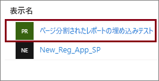

# <a name="tutorial-embed-power-bi-paginated-reports-into-an-application-for-your-customers"></a>チュートリアル:顧客向けのアプリケーションに Power BI のページ分割されたレポートを埋め込む

**Azure の Power BI Embedded** または **Office での Power BI の埋め込み** を使用すると、アプリ所有データを使用して、ページ分割されたレポートをアプリケーション内に埋め込むことができます。 **アプリ所有データ** がある場合、Power BI を埋め込み分析プラットフォームとして使用するアプリケーションが含まれます。 **ISV** または **開発者** は、完全に統合された対話型のアプリケーションにページ分割されたレポートを表示する Power BI コンテンツを作成できます。ユーザーに Power BI ライセンスは必要ありません。 このチュートリアルでは、Power BI .NET SDK と Power BI JavaScript API を使用して、アプリケーションにページ分割されたレポートを統合する方法を説明します。


このチュートリアルで学習する内容は次のとおりです。
> [!div class="checklist"]
> * Azure にアプリケーションを登録します。
> * Power BI のページ分割されたレポートをアプリケーションに埋め込みます。

## <a name="prerequisites"></a>前提条件

始めるにあたり、必要なもの:

* [サービス プリンシパル (アプリ専用トークン)](embed-service-principal.md)
* [Microsoft Azure](https://azure.microsoft.com/) サブスクリプション
* 独自に設定された [Azure Active Directory テナント](create-an-azure-active-directory-tenant.md)
* [ページ分割されたレポート](../../admin/service-admin-premium-workloads.md#paginated-reports)のワークロードが有効になっている、少なくとも A4 または P1 の[容量](#create-a-capacity)

Azure サブスクリプションをお持ちでない場合は、始める前に[無料アカウントを作成](https://azure.microsoft.com/free/?WT.mc_id=A261C142F)してください。

> [!IMPORTANT]
> * **サービス プリンシパル** を使用する必要があります。 マスター ユーザーはサポートされていません。
>* [Premium Per User (PPU)](../../admin/service-premium-per-user-faq.md) はサポートされていません。 PPU を使用してソリューションを試してみることはできますが、[運用に移行する](move-to-production.md)ことはできません。
> * シングル サインオン (SSO) を必要とするデータソースは、サポートされていません。 サポートされているデータセットとその認証方法の一覧については、「[Power BI のページ分割されたレポートでサポートされるデータ ソース](../../paginated-reports/paginated-reports-data-sources.md)」を参照してください。 
> * Power BI データセットは、[データソース](../../connect-data/service-get-data.md)としてサポートされていません。

## <a name="set-up-your-power-bi-environment"></a>Power BI 環境を設定する

ページ分割されたレポートを埋め込むには、容量にワークスペースを割り当て、ワークスペースにレポートをアップロードする必要があります。

### <a name="create-an-app-workspace"></a>アプリ ワークスペースを作成する

[サービス プリンシパル](embed-service-principal.md)を使用してアプリケーションにサインインしている場合は、[新しいワークスペース](../../collaborate-share/service-create-the-new-workspaces.md)を使用する必要があります。 "*サービス プリンシパル*" として、アプリケーションに関連するアプリ ワークスペースの管理者またはメンバーである必要もあります。

### <a name="create-a-capacity"></a>容量を作成する

ページ分割されたレポートを埋め込むためにインポートまたはアップロードする前に、レポートを含むワークスペースを、少なくとも A4 または P1 の容量に割り当てる必要があります。 選択できる容量には、次の 2 種類があります。
* **Power BI Premium** - ページ分割されたレポートを埋め込むには、*P* SKU の容量が必要です。 Power BI コンテンツを埋め込む場合、このソリューションは "*Power BI 埋め込み*" と呼ばれます。 このサブスクリプションの詳細については、「[Power BI Premium とは](../../admin/service-premium-what-is.md)」を参照してください。
* **Azure Power BI Embedded** - [Microsoft Azure portal](https://portal.azure.com) で容量を購入できます。 このサブスクリプションは、*A* SKU を使用します。 ページ分割されたレポートを埋め込むには、少なくとも *A4* サブスクリプションが必要です。 Power BI Embedded 容量の作成方法の詳細については、「[Create Power BI Embedded capacity in the Azure portal](azure-pbie-create-capacity.md)」 (Azure Portal で Power BI Embedded 容量を作成する) をご覧ください。

次の表は、各 SKU のリソースと制限を示しています。 ニーズに最適な容量を判断するには、[シナリオに応じてどの SKU を購入すればよいか](./embedded-faq.md#which-solution-should-i-choose)をまとめた表を参照してください。

| 容量ノード | 合計 v コア数 | バックエンド v コア数 | RAM (GB) | フロントエンド v コア数 | 
| --- | --- | --- | --- | --- |
| P1/A4 | 8 | 4 | 25 | 4 |
| P2/A5 | 16 | 8 | 50 | 8 |
| P3/A6 | 32 | 16 | 100 | 16 |
| | | | | |

### <a name="assign-an-app-workspace-to-a-capacity"></a>容量にアプリ ワークスペースを割り当てる

容量を作成した後、アプリ ワークスペースをその容量に割り当てることができます。

[サービス プリンシパル](embed-service-principal.md)を使用して容量をワークスペースに割り当てるには、[Power BI REST API](/rest/api/power-bi/capacities/groups_assigntocapacity) を使用します。 Power BI REST API の使用時は必ず[サービス プリンシパル オブジェクト ID](embed-service-principal.md) を使用してください。

### <a name="create-and-upload-your-paginated-reports"></a>ページ分割されたレポートを作成してアップロードする

[Power BI レポート ビルダー](../../paginated-reports/paginated-reports-report-builder-power-bi.md#create-reports-in-power-bi-report-builder)を使用して、ページ分割されたレポートを作成し、[レポートをサービスにアップロード](../../paginated-reports/paginated-reports-quickstart-aw.md#upload-the-report-to-the-service)できます。

[Power BI REST API](/rest/api/power-bi/imports/postimportingroup) を使用して、ページ分割されたレポートを新しいワークスペースにインポートできます。

## <a name="embed-content-using-the-sample-application"></a>サンプル アプリケーションを使用してコンテンツを埋め込む

このサンプルは実演目的から意図的に単純に作られています。 アプリケーション シークレットの保護は、お客様や開発者の責任となります。

次の手順に従い、サンプル アプリケーションを使用してコンテンツの埋め込みを開始します。

1. [Visual Studio](https://www.visualstudio.com/) (バージョン 2013 以降) をダウンロードします。 必ず最新の [NuGet パッケージ](https://www.nuget.org/profiles/powerbi)をダウンロードしてください。

2. 最初に、GitHub から [App Owns Data サンプル](https://github.com/Microsoft/PowerBI-Developer-Samples)をダウンロードします。

    

3. サンプル アプリケーションで **Web.config** ファイルを開きます。 アプリケーションを実行する目的で入力必須となるフィールドがあります。 **[AuthenticationType]** では **[ServicePrincipal]** を選択します。

    以下のフィールドを設定します。
    * [applicationId](#application-id)
    * [workspaceId](#workspace-id)
    * [reportId](#report-id)
    * [applicationsecret](#application-secret)
    * [tenant](#tenant)

    > [!Note]
    > このサンプルの既定の **AuthenticationType** は MasterUser です。 必ず **[ServicePrincipal]** に変更してください。 


    

### <a name="application-id"></a>アプリケーション ID

**applicationId** 情報には、**Azure** の **アプリケーション ID** を入力します。 **applicationId** は、アクセス許可を要求しているユーザーに対して、アプリケーションが自身を識別するために使用します。

**applicationId** を取得するには、次の手順に従います。

1. [Azure Portal ](https://portal.azure.com)にサインインします。

2. 左側のナビ ペインで、 **[すべてのサービス]** を選択し、 **[アプリの登録]** を検索します。

    

3. **applicationId** を必要とするアプリケーションを選択します。

    

4. **アプリケーション ID** が GUID として一覧表示されます。 この **アプリケーション ID** を、アプリケーションの **applicationId** として使用します。

    

### <a name="workspace-id"></a>ワークスペース ID

**workspaceId** 情報には、Power BI のアプリ ワークスペース (グループ) の GUID を入力します。 この情報は、Power BI サービスにサインインしたときに URL から取得するか、PowerShell を使用して取得できます。

URL <br>


PowerShell <br>

```powershell
Get-PowerBIworkspace -name "Paginated Report Embed"
```

   

### <a name="report-id"></a>レポート ID

**reportId** には、Power BI からレポートの GUID を設定します。 この情報は、Power BI サービスにサインインしたときに URL から取得するか、PowerShell を使用して取得できます。

URL<br>


PowerShell <br>

```powershell
Get-PowerBIworkspace -name "Paginated Report Embed" | Get-PowerBIReport
```


### <a name="application-secret"></a>アプリケーション シークレット

**ApplicationSecret** は、**Azure** の **[アプリの登録]** セクションの **[キー]** セクションから設定します。

**ApplicationSecret** を取得するには、次の手順に従います。

1. [Azure portal](https://portal.azure.com) にサインインします。

2. 左側のナビ ペインで、 **[すべてのサービス]** を選択し、 **[アプリの登録]** を検索します。

    

3. **ApplicationSecret** を使用する必要があるアプリケーションを選択します。

    

4. **[管理]** で **[証明書とシークレット]** を選択します。

5. **[新しいクライアント シークレット]** を選択します。

6. **[説明]** ボックスに名前を入力し、期間を選択します。 次に、 **[保存]** を選択して、アプリケーションの **値** を取得します。 キーの値を保存した後で **[キー]** ウィンドウを閉じると、値フィールドは非表示としてのみ表示されます。 その時点では、キー値を取得することはできません。 キー値をなくした場合は、Azure portal で新しいものを作成します。

    

### <a name="tenant"></a>テナント

**テナント** 情報には Azure テナント ID を入力します。 この情報は Power BI サービスにサインインしたときに [Azure AD 管理センター](/onedrive/find-your-office-365-tenant-id)から取得するか、PowerShell を使用して取得できます。

### <a name="run-the-application"></a>アプリケーションの実行

1. **Visual Studio** で **[実行]** を選びます。

    

2. 次に、 **[Embed Report]** を選びます。

    

3. サンプル アプリケーションでレポートを表示できるようになります。

    

## <a name="embed-power-bi-paginated-reports-within-your-application"></a>アプリケーション内に Power BI のページ分割されたレポートを埋め込む

Power BI のページ分割されたレポートを埋め込む手順は [Power BI REST API](/rest/api/power-bi/) で行いますが、この記事で説明するコード例は **.NET SDK** で作成されています。

顧客向けの Power BI のページ分割されたレポートをアプリケーションに埋め込むには、[Power BI REST API](/rest/api/power-bi/) を呼び出す前に、**Azure AD** [サービス プリンシパル](embed-service-principal.md)を持ち、Power BI アプリケーションの [Azure AD アクセス トークン](get-azuread-access-token.md#access-token-for-non-power-bi-users-app-owns-data)を取得する必要があります。

**アクセス トークン** を使用して Power BI Client を作成するには、[Power BI REST API](/rest/api/power-bi/) とやり取りするための Power BI クライアント オブジェクトを作成する必要があります。 **AccessToken** を *_Microsoft.Rest.TokenCredentials_* オブジェクトでラップして、Power BI クライアント オブジェクトを作成します。

```csharp
using Microsoft.IdentityModel.Clients.ActiveDirectory;
using Microsoft.Rest;
using Microsoft.PowerBI.Api.V2;

var tokenCredentials = new TokenCredentials(authenticationResult.AccessToken, "Bearer");

// Create a Power BI Client object. it's used to call Power BI APIs.
using (var client = new PowerBIClient(new Uri(ApiUrl), tokenCredentials))
{
    // Your code to embed items.
}
```

### <a name="get-the-paginated-report-you-want-to-embed"></a>埋め込み対象のページ分割されたレポートを取得する

Power BI クライアント オブジェクトを使って、埋め込むアイテムへの参照を取得できます。

指定したワークスペースから最初のレポートを取得する方法のコード例を次に示します。

"コンテンツ アイテムとしてレポート、ダッシュボード、タイルのいずれを埋め込む場合でも、それらを取得するサンプルは、[サンプル アプリケーション](https://github.com/Microsoft/PowerBI-Developer-Samples)の Services\EmbedService.cs ファイル内にあります。"

```csharp
using Microsoft.PowerBI.Api.V2;
using Microsoft.PowerBI.Api.V2.Models;

// You need to provide the workspaceId where the dashboard resides.
ODataResponseListReport reports = await client.Reports.GetReportsInGroupAsync(workspaceId);

// Get the first report in the group.
Report report = reports.Value.FirstOrDefault();
```

### <a name="create-the-embed-token"></a>埋め込みトークンを作成する

JavaScript API から使うことができる埋め込みトークンを生成します。 Power BI のページ分割されたレポートを埋め込むための埋め込みトークンを作成するには、[Reports GenerateTokenInGroup](/rest/api/power-bi/embedtoken/reports_generatetokeningroup) API を使用します。

埋め込みトークンを作成するサンプルは、[サンプル アプリケーション](https://github.com/Microsoft/PowerBI-Developer-Samples)内の *Services\EmbedService.cs* ファイルにあります。

```csharp
using Microsoft.PowerBI.Api.V2;
using Microsoft.PowerBI.Api.V2.Models;

// Generate Embed Token.
var generateTokenRequestParameters = new GenerateTokenRequest(accessLevel: "view");
EmbedToken tokenResponse = client.Reports.GenerateTokenInGroup(workspaceId, report.Id, generateTokenRequestParameters);

// Generate Embed Configuration.
var embedConfig = new EmbedConfig()
{
    EmbedToken = tokenResponse,
    EmbedUrl = report.EmbedUrl,
    Id = report.Id
};
```

### <a name="load-an-item-using-javascript"></a>JavaScript を使ってアイテムを読み込む

JavaScript を使用して、Web ページの div 要素に、ページ分割されたレポートを読み込むことができます。

JavaScript API を使用する完全なサンプルの場合、[Playground ツール](https://microsoft.github.io/PowerBI-JavaScript/demo)を使用できます。 プレイグラウンド ツールを使うと、さまざまな種類の Power BI Embedded のサンプルを簡単に試すことができます。 JavaScript API について詳しくは、[PowerBI-JavaScript wiki](https://github.com/Microsoft/powerbi-javascript/wiki) のページも参照してください。

## <a name="next-steps"></a>次の手順

このチュートリアルでは、顧客向けアプリケーションに Power BI のページ分割されたレポートを埋め込む方法を説明しました。 ご自分の顧客または組織向けに Power BI コンテンツの埋め込みを試すこともできます。

> [!div class="nextstepaction"]
>[顧客向けにコンテンツを埋め込む](embed-sample-for-customers.md)

> [!div class="nextstepaction"]
>[組織向けにコンテンツを埋め込む](embed-sample-for-your-organization.md)

他にわからないことがある場合は、 [Power BI コミュニティで質問してみてください](https://community.powerbi.com/)。