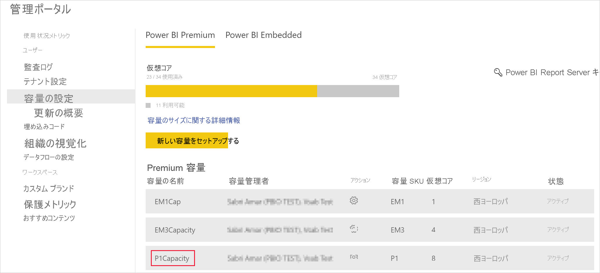
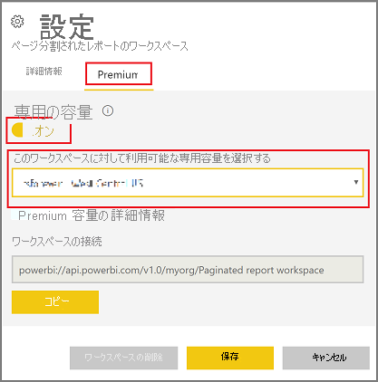
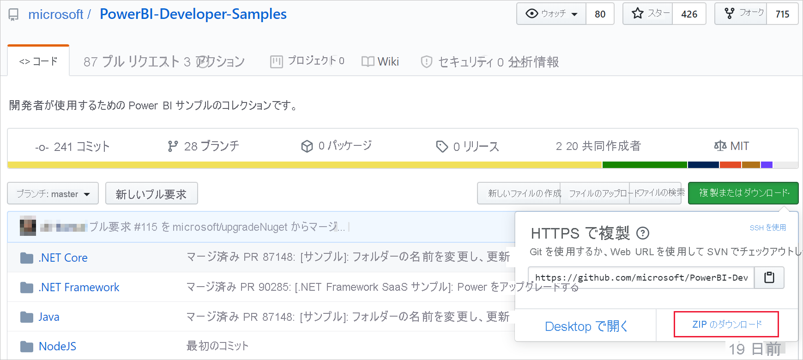

# <a name="tutorial-embed-power-bi-paginated-reports-into-an-application-for-your-organization"></a>チュートリアル:組織向けのアプリケーションに Power BI のページ分割されたレポートを埋め込む

**Power BI** では、"*ユーザー所有データ*" シナリオを使用して、組織向けのアプリケーションにページ分割されたレポートを埋め込むことができます。

ページ分割されたレポートは、高品質な印刷のためにデザインされたレポートです。 通常、これらのレポートには大量のデータが含まれており、印刷されたページに合うようにレンダリングされます。
Power BI でページ分割されたレポートがどのようにサポートされているかを理解するには、「[Power BI Premium のページ分割されたレポートとは](../../paginated-reports/paginated-reports-report-builder-power-bi.md)」をご覧ください。

**ユーザー所有データ** を使用すれば、アプリケーションで埋め込み分析を使用できるように Power BI サービスを拡張できます。 このチュートリアルでは、ページ分割されたレポートをアプリケーションに統合する方法を示します。

Power BI .NET SDK と Power BI JavaScript API を使用して、組織向けのアプリケーションに Power BI を埋め込みます。


このチュートリアルでは、以下のタスクについて説明します。
> [!div class="checklist"]
> * Azure にアプリケーションを登録します。
> * Power BI テナントを使用して、Power BI のページ分割されたレポートをアプリケーションに埋め込みます。

## <a name="prerequisites"></a>前提条件
始めるにあたり、必要なもの:

* [Power BI Pro アカウント](../../admin/service-admin-purchasing-power-bi-pro.md)。

* 独自の [Azure Active Directory テナント](create-an-azure-active-directory-tenant.md)のセットアップが必要です。

* P1 以上の容量。 「[ページ分割されたレポートに必要な Premium 容量のサイズはどれくらいですか。](../../paginated-reports/paginated-reports-faq.md#what-size-premium-capacity-do-i-need-for-paginated-reports)」をご覧ください。

**Power BI Pro** にサインアップしていない場合は、[無料の試用版にサインアップ](https://powerbi.microsoft.com/pricing/)してください。

>[!NOTE]
>[Premium Per User (PPU)](../../admin/service-premium-per-user-faq.md) はサポートされています。 ただし、PPU を使用している場合は、組織内の PPU ユーザーのみがソリューションにアクセスできるようになります。

## <a name="set-up-your-power-bi-environment"></a>Power BI 環境を設定する

このセクションの手順に従って、ページ分割されたレポートを埋め込むために Power BI を設定します。

### <a name="register-a-server-side-web-application-app"></a>サーバー側 Web アプリケーションのアプリを登録する

「[Azure AD アプリケーションを登録して Power BI とともに使用する](register-app.md)」の手順に従って、サーバー側 Web アプリケーションのアプリを登録します。

>[!NOTE]
>アプリを登録するときは、必ず次のことを行ってください。
>* アプリケーション シークレットを取得する
>* **Report.ReadAll** (スコープ) をアプリに適用する。

### <a name="create-a-capacity"></a>容量を作成する

容量を作成することにより、アプリ ワークスペース内のコンテンツに対してリソースを持つことができます。 ページ分割されたレポートを使用する場合は、少なくとも P1 容量を使用してアプリ ワークスペースをバックアップする必要があります。 [Power BI Premium](../../admin/service-premium-what-is.md) を使用して、容量を作成できます。

次の表に、[Microsoft Office 365](../../admin/service-admin-premium-purchase.md) でページ分割されたレポート用の容量を作成するために使用できる Power BI Premium SKU の一覧を示します。

| 容量ノード | 仮想コアの合計<br/>(バックエンド + フロント エンド) | バックエンドの仮想コア | フロント エンドの仮想コア | DirectQuery/ライブ接続の制限 |
| --- | --- | --- | --- | --- | --- |
| P1 |8 仮想コア |4 仮想コア、25 GB の RAM |4 仮想コア |1 秒あたり 30 |
| P2 |16 仮想コア |8 仮想コア、50 GB の RAM |8 仮想コア |1 秒あたり 60 |
| P3 |32 仮想コア |16 仮想コア、100 GB の RAM |16 仮想コア |1 秒あたり 120 |
| P4 |64 仮想コア |32 仮想コア、200 GB の RAM |32 仮想コア |1 秒あたり 240 |
| P5 |128 仮想コア |64 仮想コア、400 GB の RAM |64 仮想コア |1 秒あたり 480 |
|||||

### <a name="enable-paginated-reports-workload"></a>ページ分割されたレポートのワークロードを有効にする

容量で、ページ分割されたレポートのワークロードを有効にする必要があります。

1. [Power BI にサインインし、管理ポータル > [容量の設定]](https://app.powerbi.com/admin-portal/capacities) に移動します。

2. ページ分割されたレポートのアップロード先のワークスペースが含まれている容量を選択します。

    

3. **[ワークロード]** を展開します。

    

4. ページ分割されたレポートのワークロードをアクティブにします。

    

### <a name="assign-an-app-workspace-to-a-capacity"></a>容量にアプリ ワークスペースを割り当てる

容量を作成した後、アプリ ワークスペースをその容量に割り当てることができます。 このプロセスを完了するには、次の手順に従います。

1. Power BI サービス内でワークスペースを展開し、コンテンツを埋め込むために使用しているワークスペースの **[すべて表示]** を選択します。 次に、 **[ワークスペースの設定]** を選択します。

    

2. **[Premium]** を選択し、 **[容量]** を有効にします。 作成した容量を選択します。 その後、 **[保存]** を選びます。

    

3. **[保存]** を選択した後、アプリ ワークスペース名の横にひし形が表示されます。

    

### <a name="create-and-publish-your-power-bi-paginated-reports"></a>Power BI のページ分割されたレポートを作成して発行する

[Power BI Report Builder](../../paginated-reports/paginated-reports-report-builder-power-bi.md#create-reports-in-power-bi-report-builder) を使用して、ページ分割されたレポートを作成できます。 その後、少なくとも P1 容量に割り当てられているアプリ ワークスペースに[レポートをアップロード](../../paginated-reports/paginated-reports-quickstart-aw.md#upload-the-report-to-the-service)し、[ページ分割されたレポートのワークロード](#enable-paginated-reports-workload)を有効にできます。 レポートをアップロードするエンド ユーザーは、アプリのワークスペースに発行するために Power BI Pro ライセンスを持っている必要があります。
   
## <a name="embed-your-content-by-using-the-sample-application"></a>サンプル アプリケーションを使用してコンテンツを埋め込む

このサンプルは実演目的から意図的に単純に作られています。

次の手順に従い、サンプル アプリケーションを使用してコンテンツの埋め込みを開始します。

1. [Visual Studio](https://www.visualstudio.com/) (バージョン 2013 以降) をダウンロードします。 必ず最新の [NuGet パッケージ](https://www.nuget.org/profiles/powerbi)をダウンロードしてください。

2. [PowerBI-Developer-Samples](https://github.com/Microsoft/PowerBI-Developer-Samples) をダウンロードし、.NET Framework > Embed for your organization > integrate-web-app > **PBIWebApp** の順に開きます。

    

3. サンプル アプリケーションの **Cloud.config** ファイルを開き、次のフィールドを入力してアプリケーションを実行します。
    * [アプリケーション ID](#application-id)
    * [ワークスペース ID](#workspace-id)
    * [レポート ID](#report-id)
    * [AADAuthorityUrl](#aadauthorityurl)

    

### <a name="application-id"></a>アプリケーション ID

**applicationId** 情報には、**Azure** の **アプリケーション ID** を入力します。 **applicationId** は、アクセス許可を要求しているユーザーに対して、アプリケーションが自身を識別するために使用します。

**applicationId** を取得するには、次の手順に従います。

1. [Azure Portal ](https://portal.azure.com)にサインインします。

2. 左側のナビゲーション ウィンドウで、 **[すべてのサービス]** 、 **[アプリの登録]** の順に選択します。

3. **applicationId** を必要とするアプリケーションを選択します。

    

4. **アプリケーション ID** が GUID として一覧表示されます。 この **アプリケーション ID** を、アプリケーションの **applicationId** として使用します。

    

### <a name="workspace-id"></a>ワークスペース ID

**workspaceId** 情報には、Power BI のアプリ ワークスペース (グループ) の GUID を入力します。 この情報は、Power BI サービスにサインインしたときに URL から取得するか、PowerShell を使用して取得できます。

URL <br>


PowerShell <br>

```powershell
Get-PowerBIworkspace -name "User Owns Embed Test"
```

   

### <a name="report-id"></a>レポート ID

**reportId** には、Power BI からレポートの GUID を設定します。 この情報は、Power BI サービスにサインインしたときに URL から取得するか、PowerShell を使用して取得できます。


PowerShell <br>

```powershell
Get-PowerBIworkspace -name "User Owns Embed Test" | Get-PowerBIReport -Name "Sales Paginated Report"
```


### <a name="aadauthorityurl"></a>AADAuthorityUrl

組織のテナント内に埋め込むか、またはゲスト ユーザーに埋め込むことのできる URL を使用して、**AADAuthorityUrl** 情報を入力します。

組織のテナントに埋め込む場合は、URL - *https://login.microsoftonline.com/common/oauth2/authorize* を使用します。

ゲストに埋め込む場合は、URL - *`https://login.microsoftonline.com/report-owner-tenant-id`* を使用します。ここで、*report-owner-tenant-id* に置き換えてレポート所有者のテナント ID を追加します。

### <a name="run-the-application"></a>アプリケーションの実行

1. **Visual Studio** で **[実行]** を選びます。

    

2. 次に、 **[Embed Report]** を選びます。 テスト対象に選んだコンテンツ (レポート、ダッシュボード、タイル) に応じて、アプリケーションでそのオプションを選びます。

    

3. サンプル アプリケーションでレポートを表示できるようになります。

    

## <a name="next-steps"></a>次の手順

このチュートリアルでは、Power BI の組織アカウントを使用して、アプリケーションに Power BI のページ分割されたレポートを埋め込む方法について説明しました。 

> [!div class="nextstepaction"]
> [アプリからの埋め込み](embed-from-apps.md)

> [!div class="nextstepaction"]
>[顧客向けに Power BI コンテンツを埋め込む](embed-sample-for-customers.md)

> [!div class="nextstepaction"]
>[顧客向けに Power BI のページ分割されたレポートを埋め込む](embed-paginated-reports-customers.md)

さらに質問がある場合は、[Power BI コミュニティで質問してみてください](http://community.powerbi.com/)。