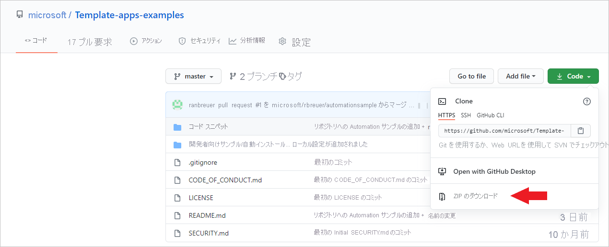
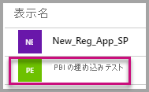
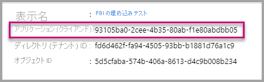
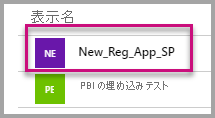
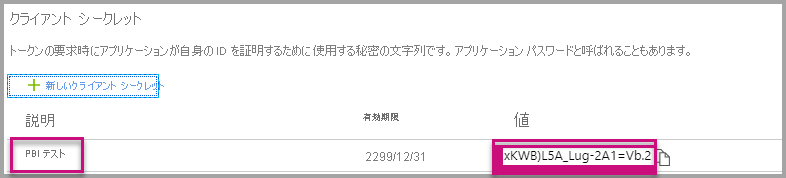

# <a name="tutorial-automate-configuration-of-template-app-installation-using-an-azure-function"></a>チュートリアル:Azure 関数を使用してテンプレート アプリのインストールの構成を自動化する

テンプレート アプリは、顧客がデータから分析情報の取得を開始するのに最適な方法です。 テンプレート アプリをデータに接続することで、迅速に作業を開始できます。 テンプレート アプリにより、顧客が希望に応じてカスタマイズできる、事前に作成されたレポートが提供されます。

データへの接続方法の詳細に顧客が精通しているとは限りません。 テンプレート アプリをインストールするときにこれらの詳細を提供する必要があることは、彼らにとって問題になる可能性があります。

データ サービス プロバイダーとして、ご自身のサービスで顧客がデータを使い始めるのに役立つテンプレート アプリを作成している場合は、彼らがテンプレート アプリを簡単にインストールできるようにすることができます。 テンプレート アプリのパラメーターの構成を自動化できます。

顧客はポータルにサインインすると、準備された特別なリンクを選択します。 このリンクは:

- 必要な情報を収集するオートメーションを起動します。
- テンプレート アプリのパラメーターをあらかじめ構成します。
- アプリをインストールできる Power BI アカウントに顧客をリダイレクトします。

行う必要があるのは、 **[インストール]** を選択し、データ ソースに対して認証を行うことだけです。それで準備は完了です。

このカスタマー エクスペリエンスを次に示します。


このチュートリアルでは、テンプレート アプリを事前構成してインストールするために作成された自動インストールの Azure Functions サンプルを使用します。 このサンプルは、例を示すことを目的としているため、意図的にシンプルに作成されています。 Power BI API を使用してテンプレート アプリを自動的にインストールし、ユーザー向けに構成する Azure 関数のセットアップをカプセル化しています。

一般的な自動化のフローとアプリで使用される API の詳細については、「[テンプレート アプリのインストールの自動構成](template-apps-auto-install.md)」を参照してください。

この単純なアプリケーションでは、Azure 関数を使用します。 Azure Functions について詳しくは、[Azure Functions のドキュメント](/azure/azure-functions/)をご覧ください。

## <a name="basic-flow"></a>基本のフロー

次の基本的なフローは、顧客がポータルでリンクを選択して起動したときにアプリケーションで何が実行されるかを示しています。

1. ユーザーは、ISV のポータルにログインして、指定されたリンクを選択します。 このアクションによりフローが開始されます。 この段階で、ISV のポータルにより、ユーザー固有の構成が準備されます。

1. ISV は、ISV のテナントに登録されている [サービス プリンシパル (アプリ専用トークン)](../embedded/embed-service-principal.md) に基づいて、"*アプリ専用*" トークンを取得します。

1. ISV は、[Power BI REST API](/rest/api/power-bi/) を使用して、"*インストール チケット*" を作成します。この中には、ISV によって準備されたユーザー固有のパラメーター構成が含まれます。

1. ISV は、インストール チケットを含む ```POST``` リダイレクト メソッドを使用して、ユーザーを Power BI にリダイレクトします。

1. ユーザーは、インストール チケットを使用して Power BI アカウントにリダイレクトされ、テンプレート アプリをインストールするように求められます。 ユーザーが **[インストール]** を選択すると、テンプレート アプリが自動的にインストールされます。

>[!Note]
>パラメーター値は、インストール チケットの作成プロセス中に ISV によって構成されますが、データ ソース関連の資格情報は、インストールの最終段階でユーザーによってのみ提供されます。 この処理により、それらがサードパーティに公開されるのを防ぎ、ユーザーとテンプレート アプリのデータ ソースとの間にセキュリティで保護された接続を確保します。

## <a name="prerequisites"></a>前提条件

* 独自の Azure Active Directory (Azure AD) テナントの設定。 その設定方法については、[Azure AD テナントの作成](../embedded/create-an-azure-active-directory-tenant.md)に関するページを参照してください。
* 前述のテナントに登録されている[サービス プリンシパル (アプリ専用トークン)](../embedded/embed-service-principal.md)。
* インストール用に準備された、パラメーター化された[テンプレート アプリ](../../connect-data/service-template-apps-overview.md)。 テンプレート アプリは、Azure AD でアプリケーションを登録するのと同じテナント内に作成する必要があります。 詳細については、[テンプレート アプリのヒント](../../connect-data/service-template-apps-tips.md)に関するページまたは「[Power BI でテンプレート アプリを作成する](../../connect-data/service-template-apps-create.md)」を参照してください。
* 自動化のワークフローをテストできるようにするには、管理者としてサービス プリンシパルをテンプレート アプリ ワークスペースに追加します。
* Power BI Pro ライセンス。 Power BI Pro にサインアップしていない場合は、[無料試用版にサインアップ](https://powerbi.microsoft.com/pricing/)してから始めてください。

## <a name="set-up-your-template-apps-automation-development-environment"></a>テンプレート アプリの自動化開発環境を設定する

アプリケーションのセットアップを続行する前に、「[クイック スタート:Azure App Configuration を使用して Azure Functions アプリを作成する](/azure/azure-app-configuration/quickstart-azure-functions-csharp)」の手順に従い、Azure アプリ構成と共に Azure 関数を開発します。 この記事の説明に従ってアプリ構成を作成します。

### <a name="register-an-application-in-azure-ad"></a>アプリケーションを Azure AD に登録する

「[サービス プリンシパルとアプリケーション シークレットを使用した Power BI コンテンツの埋め込み](../embedded/embed-service-principal.md)」の説明に従ってサービス プリンシパルを作成します。

必ず、アプリケーションを **サーバー側 Web アプリケーション** として登録してください。 アプリケーション シークレットを作成するには、サーバー側 Web アプリケーションを登録します。

以降の手順のために、"*アプリケーション ID*" (ClientID) と "*アプリケーション シークレット*" (ClientSecret) を保存します。

[埋め込みセットアップ ツール](https://aka.ms/embedsetup/AppOwnsData)に移動して、アプリの登録の作成をすぐに開始することができます。 [Power BI アプリ登録ツール](https://app.powerbi.com/embedsetup)を使用する場合は、"**顧客向けに埋め込む**" オプションを選択します。

管理者としてサービス プリンシパルをテンプレート アプリ ワークスペースに追加し、自動化のワークフローをテストできるようにします。

## <a name="template-app-preparation"></a>テンプレート アプリの準備

テンプレート アプリの作成が終わり、インストールする準備ができたら、移行の手順のために、次の情報を保存します。

* アプリの作成時に [テンプレート アプリのプロパティを定義する](../../connect-data/service-template-apps-create.md#define-the-properties-of-the-template-app)プロセスの終わりの時点でインストール URL 内に表示される、"*アプリ ID*"、"*パッケージ キー*"、"*所有者 ID*" をメモしておく必要があります。

    また、テンプレート アプリの [[リリース管理] ウィンドウ](../../connect-data/service-template-apps-create.md#manage-the-template-app-release)で **[リンクの取得]** を選択することでも同じリンクを取得できます。

* テンプレート アプリのデータセットで定義されている "*パラメーター名*"。 パラメーター名は、大文字と小文字を区別する文字列です。 [テンプレート アプリのプロパティを定義する](../../connect-data/service-template-apps-create.md#define-the-properties-of-the-template-app)ときに **[Parameter Settings]\(パラメーターの設定\)** タブから、または Power BI のデータセット設定から取得することもできます。

>[!NOTE]
>AppSource でまだ一般公開されていない場合でも、テンプレート アプリをインストールする準備ができていれば、テンプレート アプリで、事前構成されたインストール アプリケーションをテストできます。 テナント外のユーザーが自動インストール アプリケーションを使用してテンプレート アプリをインストールできるようにするには、テンプレート アプリが [Power BI アプリ マーケットプレース](https://app.powerbi.com/getdata/services)で一般公開されている必要があります。 テンプレート アプリは、作成している自動インストール アプリケーションを使用して配布する前に、必ず[パートナー センター](/azure/marketplace/partner-center-portal/create-power-bi-app-offer)に公開してください。


## <a name="install-and-configure-your-template-app"></a>テンプレート アプリのインストールと構成

このセクションでは、テンプレート アプリを事前構成してインストールするために作成された自動インストールの Azure Functions サンプルを使用します。 このサンプルは、例を示すことを目的としているため、意図的にシンプルに作成されています。 これを使用すると、[Azure 関数](/azure/azure-functions/functions-overview)と [Azure App Configuration](/azure/azure-app-configuration/overview) を利用して、テンプレート アプリの自動インストール API を簡単にデプロイし、使用することができます。

### <a name="download-visual-studio-version-2017-or-later"></a>[Visual Studio](https://www.visualstudio.com/) (バージョン 2017 以降) をダウンロードする

[Visual Studio](https://www.visualstudio.com/) (バージョン 2017 以降) をダウンロードします。 必ず最新の [NuGet パッケージ](https://www.nuget.org/profiles/powerbi)をダウンロードしてください。

### <a name="download-the-automated-installation-azure-functions-sample"></a>自動インストールの Azure Functions サンプルをダウンロードする

開始するには、[自動インストールの Azure Functions サンプル](https://github.com/microsoft/Template-apps-examples/tree/master/Developer%20Samples/Automated%20Install%20Azure%20Function)を GitHub からダウンロードします。



### <a name="set-up-your-azure-app-configuration"></a>Azure アプリ構成を設定する

このサンプルを実行するには、ここで説明する値とキーを使用して、Azure アプリ構成を設定する必要があります。 キーは、**アプリケーション ID**、**アプリケーション シークレット**、およびテンプレート アプリの **AppId**、**PackageKey**、**OwnerId** の値です。 これらの値を取得する方法については、次のセクションを参照してください。

キーは、**Constants.cs** ファイルでも定義されています。

| 構成キー | 説明           |
|---------------    |-------------------|
| TemplateAppInstall:Application:AppId | [インストール URL](#get-the-template-app-properties) からの **AppId** |
| TemplateAppInstall:Application:PackageKey | [インストール URL](#get-the-template-app-properties) からの **PackageKey** |
| TemplateAppInstall:Application:OwnerId | [インストール URL](#get-the-template-app-properties) からの **OwnerId** |
| TemplateAppInstall:ServicePrincipal:ClientId | サービス プリンシパル [アプリケーション ID](#get-the-application-id) |
| TemplateAppInstall:ServicePrincipal:ClientSecret | サービス プリンシパル [アプリケーション シークレット](#get-the-application-secret) |
|||


**Constants.cs** ファイルを次に示します。


#### <a name="get-the-template-app-properties"></a>テンプレート アプリのプロパティの取得

アプリの作成時に定義されている、テンプレート アプリの関連するすべてのプロパティを入力します。 これらのプロパティは、テンプレート アプリの **AppId**、**PackageKey**、**OwnerId** の値です。

上記の値を取得するには、次の手順に従います。

1. [Power BI](https://app.powerbi.com) にサインインします。

1. アプリケーションの元のワークスペースに移動します。

1. **[リリース管理]** ウィンドウを開きます。

    ![[リリース管理] ウィンドウを示すスクリーンショット。](media/template-apps-auto-install/release-management-001.png)

1. アプリのバージョンを選択して、そのインストール リンクを取得します。

    ![[リリース管理] ボタンを示すスクリーンショット。](media/template-apps-auto-install/release-management-002.png)

1. このリンクをクリップボードにコピーします。

    ![[リンクの取得] ボタンを示すスクリーンショット。](media/template-apps-auto-install/release-management-003.png)

1. このインストール URL には、必要な値を持つ 3 つの URL パラメーターが格納されています。 アプリケーションの **appId**、**packageKey**、**ownerId** の値を使用します。 サンプル URL は、次に示すようなものになります。

    ```html
    https://app.powerbi.com/Redirect?action=InstallApp&appId=3c386...16bf71c67&packageKey=b2df4b...dLpHIUnum2pr6k&ownerId=72f9...1db47&buildVersion=5
    ```

#### <a name="get-the-application-id"></a>アプリケーション ID を取得する

**applicationId** 情報には、Azure のアプリケーション ID を入力します。 **applicationId** の値は、アクセス許可を要求しているアプリケーションで、ユーザーに対してそれ自体を識別するために使用されます。

applicationId を取得するには、次の手順に従います。

1. [Azure portal](https://portal.azure.com) にサインインします。

1. 左側のウィンドウで、 **[すべてのサービス]**  >  **[アプリの登録]** を選択します。

    

1. **アプリケーション ID** を必要とするアプリケーションを選択します。

    

1. アプリケーション ID が GUID として一覧表示されます。 このアプリケーション ID を、アプリケーションの **applicationId** 値として使用します。

    

#### <a name="get-the-application-secret"></a>アプリケーション シークレットを取得する

**ApplicationSecret** の情報は、Azure の **[アプリの登録]** セクションの **[キー]** セクションから設定します。 この属性は、[サービス プリンシパル](../embedded/embed-service-principal.md)を使用する場合に機能します。

アプリケーション シークレットを取得するには、次の手順に従います。

 1. [Azure portal](https://portal.azure.com) にサインインします。

 1. 左側のウィンドウで、 **[すべてのサービス]**  >  **[アプリの登録]** を選択します。

    

1. **アプリケーション シークレット** を使用する必要があるアプリケーションを選択します。

    

1. **[管理]** で **[証明書とシークレット]** を選択します。

1. **[新しいクライアント シークレット]** を選択します。

1. **[説明]** ボックスに名前を入力し、期間を選択します。 次に、 **[保存]** を選択してアプリケーションの値を取得します。 キーの値を保存した後で **[キー]** ウィンドウを閉じると、 **[値]** フィールドは非表示としてのみ表示されます。 その時点では、キー値を取得することはできません。 キー値をなくした場合は、Azure portal で新しいものを作成します。

    

## <a name="test-your-function-locally"></a>関数をローカルでテストする

「[関数をローカルで実行する](/azure/azure-functions/functions-create-your-first-function-visual-studio#run-the-function-locally)」で説明されている手順に従って、関数を実行します。

関数の URL への ```POST``` 要求を発行するようにポータルを構成します。 たとえば ```POST http://localhost:7071/api/install``` です。 要求本文は、キーと値のペアを記述する JSON オブジェクトである必要があります。 キーは、Power BI Desktop で定義されている "*パラメーター名*" です。 値は、テンプレート アプリの各パラメーターに設定する必要がある値です。

>[!Note]
> 運用環境では、ポータルの目的のロジックによって、ユーザーごとにパラメーター値が推測されます。

目的のフローは、次のようになります。

1. ポータルで、ユーザーおよびセッションごとに要求が準備されます。
1. Azure 関数に対して ```POST /api/install``` 要求が発行されます。 要求本文は、キーと値のペアで構成されます。 キーはパラメーター名です。 値は、設定する必要のある値です。
1. すべてが適切に構成されている場合、ブラウザーが自動的に顧客の Power BI アカウントにリダイレクトされ、自動インストール フローが表示されます。
1. インストール時、手順 1 および 2 で構成されたとおりにパラメーター値が設定されます。
 
## <a name="next-steps"></a>次のステップ

### <a name="publish-your-project-to-azure"></a>プロジェクトを Azure に発行する

プロジェクトを Azure に発行するには、[Azure Functions のドキュメント](/azure/azure-functions/functions-create-your-first-function-visual-studio#publish-the-project-to-azure)の手順に従います。 その後、テンプレート アプリの自動インストール API を製品に統合し、運用環境でのテストを開始できます。