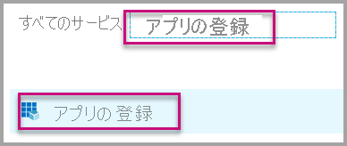

# <a name="tutorial-automate-configuration-of-template-app-installation-using-an-azure-function"></a>チュートリアル:Azure 関数を使用してテンプレート アプリのインストールの構成を自動化する

テンプレート アプリは、顧客がデータから分析情報の取得を開始するのに最適な方法です。 テンプレート アプリは、データに接続し、必要に応じてカスタマイズできる事前構築済みのレポートを提供することにより、すばやく起動して実行できます。

顧客は、データへの接続方法の詳細に精通しているとは限らないため、テンプレート アプリをインストールするときにこれらの詳細を提供する必要があることは、顧客にとって問題になる可能性があります。

あなたがデータ サービス プロバイダーであり、顧客がサービスでデータを使い始めるのに役立つテンプレート アプリを作成している場合は、テンプレート アプリのパラメーターの構成を自動化することで、顧客がテンプレート アプリを簡単にインストールできるようにすることができます。 顧客はポータルにログインすると、準備された特別なリンクをクリックします。 これにより、自動化が開始され、必要な情報の収集とテンプレート アプリのパラメーターの事前構成が行われ、アプリをインストールできる Power BI アカウントに顧客がリダイレクトされます。 行う必要があるのは、[インストール] をクリックし、データ ソースに対して認証を行うことだけで、準備は完了です。 

このカスタマー エクスペリエンスを次に示します。


このチュートリアルでは、テンプレート アプリを事前構成してインストールするために作成された自動インストール Azure 関数のサンプルを使用します。 このサンプルは、例を示すことを目的としているため、意図的にシンプルに作成されています。 これは、Power BI API を活用してテンプレート アプリを自動的にインストールし、ユーザー向けに構成するために Azure 関数のセットアップをカプセル化しています。

一般的な自動化のフローと使用される API の詳細については、「[テンプレート アプリのインストールの自動構成](template-apps-auto-install.md)」を参照してください

この単純なアプリケーションでは、Azure 関数を使用します。 Azure Functions の詳細については、「[Azure Functions のドキュメント](https://docs.microsoft.com/azure/azure-functions/)」を参照してください。

## <a name="basic-flow"></a>基本のフロー

顧客がポータルでリンクをクリックして起動したときにアプリケーションで実行される基本的なフローを次に示します。

1. ユーザーは、ISV のポータルにログインして、指定されたリンクをクリックします。 これにより、フローが開始されます。 この段階で、ISV のポータルにより、ユーザー固有の構成が準備されます。

2. ISV は、ISV のテナントに登録されている [サービス プリンシパル (アプリ専用トークン)](../embedded/embed-service-principal.md) に基づいて、**アプリ専用** トークンを取得します。

3. ISV は、[Power BI REST API](https://docs.microsoft.com/rest/api/power-bi/) を使用して、**インストール チケット** を作成します。この中には、ISV によって準備されたユーザー固有のパラメーター構成が含まれます。

4. ISV は、インストール チケットを含む ```POST``` リダイレクト メソッドを使用して、ユーザーを Power BI にリダイレクトします。

5. ユーザーは、インストール チケットを使用して Power BI アカウントにリダイレクトされ、テンプレート アプリをインストールするように求められます。 ユーザーが [インストール] をクリックすると、テンプレート アプリが自動的にインストールされます。

>[!Note]
>パラメーター値は、インストール チケットの作成時に ISV によって構成されますが、データソース関連の資格情報は、インストールの最終段階でユーザーによってのみ提供されます。 これにより、サードパーティに公開されるのを防ぎ、ユーザーとテンプレート アプリのデータ ソース間のセキュリティで保護された接続が確保されます。

## <a name="prerequisites"></a>前提条件

開始する前に、次のものが必要です。

* 独自の Azure Active Directory テナントのセットアップ。 セットアップ方法については、[Azure Active Directory テナントの作成](https://docs.microsoft.com/power-bi/developer/embedded/create-an-azure-active-directory-tenant)に関するページを参照してください。

* 上記のテナントに登録されている[サービス プリンシパル (アプリ専用トークン)](https://docs.microsoft.com/power-bi/developer/embedded/embed-service-principal)。

* インストール用に準備された、[パラメーター化されたテンプレート アプリ](https://docs.microsoft.com/power-bi/connect-data/service-template-apps-overview)。 テンプレート アプリは、Azure Active Directory (Azure AD) にアプリケーションを登録するものと同じテナント内に作成する必要があります。 詳細については、[テンプレート アプリのヒント](https://docs.microsoft.com/power-bi/connect-data/service-template-apps-tips)に関するページまたは「[Power BI でテンプレート アプリを作成する](https://docs.microsoft.com/power-bi/connect-data/service-template-apps-create)」を参照してください。

* **Power BI Pro ライセンス**。 Power BI Pro にサインアップしていない場合は、[無料試用版にサインアップ](https://powerbi.microsoft.com/pricing/)してから始めてください。

## <a name="set-up-your-template-apps-automation-development-environment"></a>テンプレート アプリの自動化開発環境を設定する

アプリケーションのセットアップを続行する前に、「[クイック スタート:Azure App Configuration を使用して Azure Functions アプリを作成する](https://docs.microsoft.com/azure/azure-app-configuration/quickstart-azure-functions-csharp)」の手順に従い、Azure App Configuration と共に Azure 関数を開発します。 この記事の説明に従って App Configuration を作成します。

### <a name="register-an-application-in-azure-active-directory-azure-ad"></a>Azure Active Directory (Azure AD) にアプリケーションを登録する

「[サービス プリンシパルとアプリケーション シークレットを使用した Power BI コンテンツの埋め込み](https://docs.microsoft.com/power-bi/developer/embedded/embed-service-principal)」の説明に従ってサービス プリンシパルを作成します。

必ず、アプリケーションを **サーバー側 Web アプリケーション** として登録してください。 アプリケーション シークレットを作成するには、サーバー側 Web アプリケーションを登録します。

以降の手順のために、"*アプリケーション ID*" (クライアント ID) と "*アプリケーション シークレット*" (クライアント シークレット) を保存します。

[埋め込みセットアップ ツール](https://aka.ms/embedsetup/AppOwnsData)に移動して、アプリの登録の作成をすぐに開始することができます。 [Power BI アプリ登録ツール](https://app.powerbi.com/embedsetup)を使用する場合は、"*顧客向けに埋め込む*" オプションを選択します。

## <a name="template-app-preparation"></a>テンプレート アプリの準備

テンプレート アプリを作成し、インストールする準備ができたら、移行の手順のために、

* アプリの作成時に [テンプレート アプリのプロパティを定義する](../../connect-data/service-template-apps-create.md#define-the-properties-of-the-template-app)プロセスの終了時にインストール URL 内に表示される "*アプリ ID*"、"*パッケージ キー*"、"*所有者 ID*" を保存します。

    また、テンプレート アプリの [[リリース管理]](../../connect-data/service-template-apps-create.md#manage-the-template-app-release) で **[リンクの取得]** をクリックして、同じリンクを取得することもできます。

* テンプレート アプリのデータセットで定義されている "*パラメーター名*"。 パラメーター名は、大文字と小文字を区別する文字列であり、[テンプレート アプリのプロパティを定義する](../../connect-data/service-template-apps-create.md#define-the-properties-of-the-template-app)ときに **[Parameter Settings]\(パラメーターの設定\)** タブから、または Power BI のデータセット設定から取得することもできます。

>[!NOTE]
>AppSource でまだ一般公開されていない場合でも、テンプレート アプリをインストールする準備ができていれば、テンプレート アプリで、アプリケーションの事前構成されたインストールをテストできます。 ただし、テナント外のユーザーが自動インストール アプリケーションを使用してテンプレート アプリをインストールできるようにするには、テンプレート アプリが [Power BI アプリ マーケットプレース](https://app.powerbi.com/getdata/services)で一般公開されている必要があります。 このため、作成している自動インストール アプリケーションを使用するテンプレート アプリは、配布する前に、必ず[パートナー センター](https://docs.microsoft.com/azure/marketplace/partner-center-portal/create-power-bi-app-offer)に公開してください。


## <a name="install-and-configure-your-template-app-using-our-azure-function-sample"></a>Azure 関数サンプルを使用してテンプレート アプリをインストールし、構成する

このセクションでは、テンプレート アプリを事前構成してインストールするために作成された自動インストール Azure 関数のサンプルを使用します。 このサンプルは、例を示すことを目的としているため、意図的にシンプルに作成されています。 これを使用すると、[Azure 関数](https://docs.microsoft.com/azure/azure-functions/functions-overview)と [Azure App Configuration](https://docs.microsoft.com/azure/azure-app-configuration/overview) を利用して、テンプレート アプリの自動インストール API を簡単にデプロイし、使用することができます。

### <a name="download-visual-studio-version-2017-or-later"></a>[Visual Studio](https://www.visualstudio.com/) (バージョン 2017 以降) をダウンロードする

[Visual Studio](https://www.visualstudio.com/) (バージョン 2017 以降) をダウンロードします。 必ず最新の [NuGet パッケージ](https://www.nuget.org/profiles/powerbi)をダウンロードしてください。

### <a name="download-the-automated-install-azure-function-sample"></a>自動インストール Azure 関数のサンプルをダウンロードする

開始するには、[自動インストール Azure 関数のサンプル](https://github.com/microsoft/Template-apps-examples/tree/master/Developer%20Samples/Automated%20Install%20Azure%20Function)を GitHub からダウンロードします。


### <a name="setup-your-azure-app-configuration"></a>Azure App Configuration をセットアップする

このサンプルを実行するには、以下で説明する値とキーを使用して、Azure App Configuration をセットアップする必要があります。 キーは、**アプリケーション ID** と **アプリケーション シークレット**、およびテンプレート アプリの **AppId**、**PackageKey**、**OwnerId** です。 これらの値の取得については、以下のセクションを参照してください。 

キーは、**Constants.cs** ファイルでも定義されています。

| Configuration キー | 説明           |
|---------------    |-------------------|
| TemplateAppInstall:Application:AppId | [インストール URL](#getting-the-template-app-properties) からの *AppId* |
| TemplateAppInstall:Application:PackageKey | [インストール URL](#getting-the-template-app-properties) からの *PackageKey* |
| TemplateAppInstall:Application:OwnerId | [インストール URL](#getting-the-template-app-properties) からの *OwnerId* |
| TemplateAppInstall:ServicePrincipal:ClientId | サービス プリンシパル [アプリケーション ID](#getting-the-application-id) |
| TemplateAppInstall:ServicePrincipal:ClientSecret | サービス プリンシパル [アプリケーション シークレット](#getting-the-application-secret) |
|||


**Constants.cs** ファイル:


#### <a name="getting-the-template-app-properties"></a>テンプレート アプリのプロパティの取得
アプリの作成時に定義されている、テンプレート アプリの関連するすべてのプロパティを入力します。 これらのプロパティは、テンプレート アプリの **AppId**、**PakcageKey** & **OwnerId** です。

上記の値を取得するには、次の手順に従います。

1. [Power BI](https://app.powerbi.com) にサインインします。

2. アプリケーションの元のワークスペースに移動します。

3. [リリース管理] ウィンドウを開きます。

    ![[リリース管理] ウィンドウ](media/template-apps-auto-install/release-management-001.png)

4. アプリのバージョンを選択して、そのインストール リンクを取得します。

    ![[リリース管理] ボタンのスクリーンショット。](media/template-apps-auto-install/release-management-002.png)

5. リンクをクリップボードにコピーします。

    ![[リンクの取得] ボタンのスクリーンショット。](media/template-apps-auto-install/release-management-003.png)

6. このインストール URL には、必要な値を持つ 3 つの URL パラメーターが格納されています。 アプリケーションの **appId**、**packageKey** & **ownerId** の値を使用します。 サンプル URL は、次に示すようなものになります。

    ```html
    https://app.powerbi.com/Redirect?action=InstallApp&appId=3c386...16bf71c67&packageKey=b2df4b...dLpHIUnum2pr6k&ownerId=72f9...1db47&buildVersion=5
    ```

#### <a name="getting-the-application-id"></a>アプリケーション ID の取得

**applicationId** 情報には、**Azure** の **アプリケーション ID** を入力します。 **applicationId** は、アクセス許可を要求しているユーザーに対して、アプリケーションが自身を識別するために使用します。

**applicationId** を取得するには、次の手順に従います。

1. [Azure Portal ](https://portal.azure.com)にサインインします。

2. 左側のナビ ペインで、 **[すべてのサービス]** 、 **[アプリの登録]** の順に選択します。

    

3. **applicationId** を必要とするアプリケーションを選択します。

    

4. **アプリケーション ID** が GUID として一覧表示されます。 この **アプリケーション ID** を、アプリケーションの **applicationId** として使用します。

    

#### <a name="getting-the-application-secret"></a>アプリケーション シークレットの取得

**ApplicationSecret** は、**Azure** の **[アプリの登録]** セクションの **[キー]** セクションから設定します。  この属性は[サービス プリンシパル](../embedded/embed-service-principal.md)の使用時に動作します。

**ApplicationSecret** を取得するには、次の手順に従います。

 1. [Azure portal](https://portal.azure.com) にサインインします。

 2. 左側のナビ ペインで、 **[すべてのサービス]** 、 **[アプリの登録]** の順に選択します。

    

3. **ApplicationSecret** を使用する必要があるアプリケーションを選択します。

    

4. **[管理]** で **[証明書とシークレット]** を選択します。

5. **[新しいクライアント シークレット]** を選択します。

6. **[説明]** ボックスに名前を入力し、期間を選択します。 次に、 **[保存]** を選択して、アプリケーションの **値** を取得します。 キーの値を保存した後で **[キー]** ウィンドウを閉じると、値フィールドは非表示としてのみ表示されます。 その時点では、キー値を取得することはできません。 キー値をなくした場合は、Azure portal で新しいものを作成します。

    

## <a name="test-your-function-locally"></a>関数をローカルでテストする

「[関数をローカルで実行する](https://docs.microsoft.com/azure/azure-functions/functions-create-your-first-function-visual-studio#run-the-function-locally)」で説明されている手順に従って、関数を実行します。

関数の URL への ```POST``` 要求 (例: ```POST http://localhost:7071/api/install```) を発行するようにポータルを構成します。 要求本文は、キーと値のペアを記述する JSON オブジェクトである必要があります。ここで、キーは "*パラメーター名*" (Power BI Desktop で定義) であり、値は、テンプレート アプリの各パラメーターに設定する必要がある値です。

>[!Note]
> 運用環境では、ポータルの目的のロジックによって、ユーザーごとにパラメーター値が推測されます。

目的のフローは、次のようになります。

1. ポータルでは、ユーザーおよびセッションごとに要求が準備されます。
2. ```POST /api/install``` 要求は、Azure 関数に対して発行されます。 要求本文は、キーと値のペアで構成されます。ここで、キーはパラメーター名で、値は、設定する必要がある値です。 
3. すべてが適切に構成されている場合、ブラウザーは自動的に顧客の Power BI アカウントにリダイレクトされ、自動インストール フローが表示されます。
4. インストール時、パラメーター値は、手順 1 および 2 で構成されたとおりに設定されます。
 
## <a name="next-steps"></a>次のステップ

### <a name="publish-your-project-to-azure"></a>プロジェクトを Azure に発行する

プロジェクトを Azure に公開して、テンプレート アプリの自動インストール API を製品に統合し、運用環境でのテストを開始する方法については、[Azure 関数のドキュメント](https://docs.microsoft.com/azure/azure-functions/functions-create-your-first-function-visual-studio#publish-the-project-to-azure)を参照してください。
