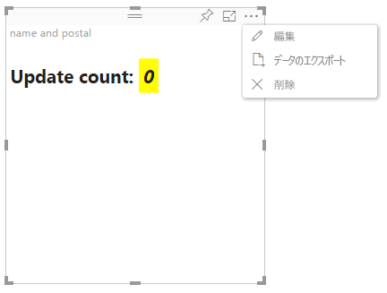

# Power BI ビジュアルの高度な編集モード

Power BI ビジュアルに高度な UI コントロールが必要な場合は、高度な編集モードを利用できます。 レポート編集モードになっている場合は、**[編集]** ボタンを選択して、編集モードを **[詳細]** に設定します。 ビジュアルでは `EditMode` フラグを使用して、この UI コントロールを表示するかどうかを決定できます。

既定では、ビジュアルで高度な編集モードはサポートされません。 別の動作が必要な場合は、`advancedEditModeSupport` プロパティを設定し、ビジュアルの *capabilities.json* ファイルでこれを明示的に示すことができます。

次の値を指定できます。

- `0` - NotSupported

- `1` - SupportedNoAction

- `2` - SupportedInFocus

## 高度な編集モードを開始する

次の場合、**[編集]** ボタンが表示されます。

* *capabilities.json* ファイルで `advancedEditModeSupport` プロパティが `SupportedNoAction` または `SupportedInFocus` のいずれかに設定されている

* ビジュアルがレポート編集モードで表示されている

`advancedEditModeSupport` プロパティが *capabilities.json* ファイルにない場合、または `NotSupported` に設定されている場合、**[編集]** ボタンは表示されません。

**[編集]** を選択すると、ビジュアルでは、EditMode が `Advanced` に設定された update() 呼び出しを取得します。 *capabilities.json* ファイルに設定されている値に応じて、次のアクションが実行されます。

* `SupportedNoAction`:ホストではこれ以上アクションは必要とされません。
* `SupportedInFocus`:ホストでは、ビジュアルがフォーカス モードでポップアウトされます。

## 高度な編集モードを終了する

次の場合、**[レポートに戻る]** ボタンが表示されます。

* *capabilities.json* ファイルで `advancedEditModeSupport` プロパティが `SupportedInFocus` に設定されている
