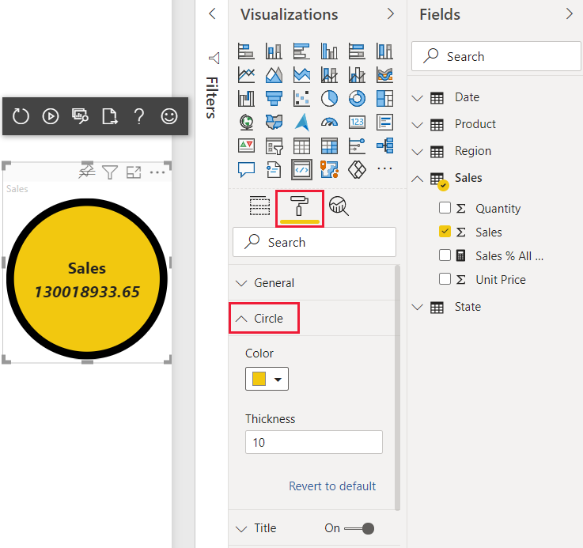

# <a name="tutorial-create-a-power-bi-visual-using-react"></a>チュートリアル:React を使用して Power BI 視覚エフェクトを作成する

[!INCLUDE[Power B I visuals tutorials overview](../../includes/visual-tutorial-overview.md)]

このチュートリアルでは、[React](https://reactjs.org/) を使用して Power BI 視覚化を開発します。 この視覚化では、円の内側に書式設定された測定値が表示されます。 視覚化のサイズはアダプティブで、その設定をカスタマイズできます。

このチュートリアルでは、以下の内容を学習します。
> [!div class="checklist"]
> * 視覚化の開発プロジェクトを作成します。
> * React を使用して視覚化を開発します。
> * データを処理するように視覚化を構成します。
> * サイズ変更に適合するように視覚化を構成します。
> * 視覚化に対してアダプティブな色と境界線の設定を構成します。

>[!NOTE]
>この視覚化の完全なソース コードについては、[React Circle Card の Power BI 視覚化](https://github.com/Microsoft/powerbi-visuals-circlecard-react)に関するページを参照してください。

## <a name="prerequisites"></a>前提条件

[!INCLUDE[Power B I tutorials prerequisites](../../includes/visual-tutorial-prerequisites.md)]

## <a name="create-a-development-project"></a>開発プロジェクトを作成する

このセクションでは、React Circle Card 視覚化用のプロジェクトを作成します。

1. PowerShell を開き、プロジェクトを作成するフォルダーに移動します。

2. 次のコマンドを入力します。

    ```PowerShell
    pbiviz new ReactCircleCard
    ```

3. プロジェクトのフォルダーに移動します。

    ```powershell
    cd ReactCircleCard
    ```

4. React Circle Card 視覚化を開始します。 これで、お使いのコンピューターでホストされている間、視覚化が実行されるようになりました。

    ```powershell
    pbiviz start
    ```
    >[!IMPORTANT]
    >視覚化の実行を停止するには、PowerShell で Ctrl + C キーを押し、バッチ ジョブを終了するように求められたら、「Y」と入力して *Enter* キーを押します。

## <a name="view-the-react-circle-card-in-power-bi-service"></a>Power BI サービスで React Circle Card を表示する

[!INCLUDE[View the Power B I visual in Power B I service](../../includes/visual-tutorial-view.md)]

## <a name="set-up-react-in-your-project"></a>プロジェクトで React を設定する

このセクションでは、Power BI 視覚化プロジェクト用に React を設定する方法について説明します。

PowerShell を開き、Ctrl + C キーを押して視覚化の実行を停止します。 バッチ ジョブの終了を求められたら、「Y」と入力して *Enter* キーを押します。

### <a name="install-react"></a>React をインストールする

必要な React の依存関係をインストールするには、*ReactCircleCard* フォルダー内で PowerShell を開き、次のコマンドを実行します。

```powershell
npm i react react-dom
```

### <a name="install-react-type-definitions"></a>React の型定義をインストールする

React の型定義をインストールするには、*reactCircleCard* フォルダー内で PowerShell を開き、次のコマンドを実行します。

```powershell
npm i @types/react @types/react-dom
```

### <a name="create-a-react-component-class"></a>React コンポーネント クラスを作成する

次の手順に従って、React コンポーネント クラスを作成します。

1. **VS Code** を開き、**reactCircleCard** フォルダーに移動します。

2. **[ファイル]**  >  **[新しいファイル]** の順に選択して、新しいファイルを作成します。

3. 新しいファイルに次のコードをコピーします。

    ```typescript
    import * as React from "react";

    export class ReactCircleCard extends React.Component<{}>{
        render(){
            return (
                <div className="circleCard">
                    Hello, React!
                </div>
            )
        }
    }

    export default ReactCircleCard;
    ```

4. **[名前を付けて保存]** を選択し、**src** フォルダーに移動します。

5. 次のようにファイルを保存します。

    * *[ファイル名]* フィールドに「**component**」と入力します。
    * *[ファイルの種類]* ドロップダウン メニューから **[TypeScript React]** を選択します。

### <a name="add-react-to-the-visual-file"></a>視覚化ファイルに React を追加する

**visual.ts** ファイル内のコードを、React の使用を有効にするコードに置き換えます。

1. **src** フォルダーで **visual.ts** を開き、ファイル内のコードを次のコードに置き換えます。

    ```typescript
    "use strict";
    import powerbi from "powerbi-visuals-api";

    import DataView = powerbi.DataView;
    import VisualConstructorOptions = powerbi.extensibility.visual.VisualConstructorOptions;
    import VisualUpdateOptions = powerbi.extensibility.visual.VisualUpdateOptions;
    import IVisual = powerbi.extensibility.visual.IVisual;

    // Import React dependencies and the added component
    import * as React from "react";
    import * as ReactDOM from "react-dom";
    import ReactCircleCard from "./component";

    import "./../style/visual.less";

    export class Visual implements IVisual {

        constructor(options: VisualConstructorOptions) {

        }

        public update(options: VisualUpdateOptions) {

        }
    }
    ```

    >[!NOTE]
    >既定の Power BI TypeScript 設定では React の *tsx* ファイルが認識されないため、VS Code によって `component` がエラーとして強調表示されます。

2. コンポーネントをレンダリングするには、対象の HTML 要素を **visual.ts** に追加します。 この要素は `VisualConstructorOptions` の `HTMLElement` であり、コンストラクターに渡されます。

    1. **src** フォルダーで、**visual.ts** を開きます。

    2. 以下のコードを `Visual` クラスに追加します。

    ```typescript
    private target: HTMLElement;
    private reactRoot: React.ComponentElement<any, any>;
    ```

    3. `VisualConstructorOptions` コンストラクターに次の行を追加します。

    ```Typescript
    this.reactRoot = React.createElement(ReactCircleCard, {});
    this.target = options.element;

    ReactDOM.render(this.reactRoot, this.target);
    ```

    これで、**visual.ts** ファイルは次のようになったはずです。

    ```Typescript
    "use strict";
    import powerbi from "powerbi-visuals-api";

    import DataView = powerbi.DataView;
    import VisualConstructorOptions = powerbi.extensibility.visual.VisualConstructorOptions;
    import VisualUpdateOptions = powerbi.extensibility.visual.VisualUpdateOptions;
    import IVisual = powerbi.extensibility.visual.IVisual;
    import * as React from "react";
    import * as ReactDOM from "react-dom";
    import ReactCircleCard from "./component";    
    
    import "./../style/visual.less";

    export class Visual implements IVisual {
        private target: HTMLElement;
        private reactRoot: React.ComponentElement<any, any>;
    
        constructor(options: VisualConstructorOptions) {
            this.reactRoot = React.createElement(ReactCircleCard, {});
            this.target = options.element;
        
            ReactDOM.render(this.reactRoot, this.target);
        }
    
        public update(options: VisualUpdateOptions) {
    
        }
    }
    ```

3. **visual.ts** を保存します。

### <a name="edit-the-tsconfig-file"></a>tsconfig ファイルを編集する

React を使用するように **tsconfig.json** を編集します。

1. **reactCircleCard** フォルダーで **tsconfig.json** ファイルを開き、`compilerOptions` 項目の先頭に 2 行を追加します。

    ```json
    "jsx": "react",
    "types": ["react", "react-dom"],
    ```

    これで **tsconfig.json** ファイルは次のようになり、**visual.ts** の `component` エラーはなくなるはずです。

    ```json
    {
        "compilerOptions": {
            "jsx": "react",
            "types": ["react", "react-dom"],
            "allowJs": false,
            "emitDecoratorMetadata": true,
            "experimentalDecorators": true,
            "target": "es6",
            "sourceMap": true,
            "outDir": "./.tmp/build/",
            "moduleResolution": "node",
            "declaration": true,
            "lib": [
                "es2015",
                "dom"
            ]
        },
        "files": [
            "./src/visual.ts"
        ]
    }
    ```

2. **tsconfig.json** を保存します。

### <a name="test-your-visual"></a>視覚化をテストする

*CircleCardVisual* フォルダー内で PowerShell を開き、プロジェクトを実行します。

```bash
pbiviz start
```

Power BI サービスでレポートに新しい **[開発者向けビジュアル]** を追加すると、次のように表示されます。

>[!div class="mx-imgBorder"]
>

## <a name="configure-your-visuals-data-field"></a>視覚化のデータ フィールドを構成する

視覚化の *Measure Data* フィールドにデータ フィールドを 1 つだけ送信できるように、視覚化の capabilities ファイルを構成します。

1. VS Code で、**reactCircleCard** フォルダーから **capabilities.json** を開きます。

2. `ReactCircleCard` によって、1 つの値 `Measure Data` が表示されます。 `dataRoles` から `Category Data` オブジェクトを削除します。

    `Category Data` オブジェクトを削除すると、`dataRoles` キーは次のようになります。

    ```json
    "dataRoles": [
        {
            "displayName": "Measure Data",
            "name": "measure",
            "kind": "Measure"
        }
    ],
    ```

3. `objects` キーのすべての内容を削除します (後で入力します)。

    内容を削除した後、`objects` キーは次のようになります。 

    ```json
    "objects": {},
    ```

4. `dataViewMappings` プロパティを以下のコードに置き換えます。 `measure` の `max: 1` により、視覚化の *Measure Data* フィールドにはデータ フィールドを 1 つだけ送信できることを指定します。

    ```json
    "dataViewMappings": [
        {
            "conditions": [
                {
                    "measure": {
                        "max": 1
                    }
                }
            ],
            "single": {
                "role": "measure"
            }
        }
    ]
    ```

5. **capabilities.json** に加えた変更内容を保存します。

6. `pbiviz start` が実行されていることを確認し、Power BI サービスで *React Circle Card* 視覚化を更新します。 **Measure Data** フィールドは、`max: 1` で指定したようにデータ フィールドを 1 つだけ持つことができます。  

    >[!div class="mx-imgBorder"]
    >

## <a name="update-the-visuals-style"></a>視覚化のスタイルを更新する

このセクションでは、視覚化の形を円に変えます。 **visual.less** ファイルを使用して、視覚化のスタイルを制御します。

1. **style** フォルダーから、**visual.less** を開きます。

2. **visual.less** の内容を次のコードに置き換えます。

    ```css
    .circleCard {
        position: relative;
        box-sizing: border-box;
        border: 1px solid #000;
        border-radius: 50%;
        width: 200px;
        height: 200px;
    }

    p {
        text-align: center;
        line-height: 30px;
        font-size: 20px;
        font-weight: bold;

        position: relative;
        top: -30px;
        margin: 50% 0 0 0;
    }
    ```

3. **visual.less** を保存します。

## <a name="set-your-visual-to-receive-properties-from-power-bi"></a>Power BI からプロパティを受け取るように視覚化を設定する

このセクションでは、視覚化を構成して、Power BI からデータを受け取り、**component.tsx** ファイル内のインスタンスに更新内容を送信するようにします。

### <a name="render-data-using-react"></a>React を使用してデータをレンダリングする

React を使用して、データをレンダリングできます。 コンポーネントでは、独自の状態のデータを表示できます。

1. VS Code で、**reactCircleCard** フォルダーから **component.tsx** を開きます。

2. **component.tsx** の内容を次のコードに置き換えます。

    ```javascript
    import * as React from "react";

    export interface State {
        textLabel: string,
        textValue: string
    }

    export const initialState: State = {
        textLabel: "",
        textValue: ""
    }

    export class ReactCircleCard extends React.Component<{}, State>{
        constructor(props: any){
            super(props);
            this.state = initialState;
        }

        render(){
            const { textLabel, textValue } = this.state;

            return (
                <div className="circleCard">
                    <p>
                        {textLabel}
                        <br/>
                        <em>{textValue}</em>
                    </p>
                </div>
            )
        }
    }
    ```

3. **component.tsx** を保存します。

### <a name="set-your-visual-to-receive-data"></a>データを受け取るように視覚化を設定する

視覚化では、`update` メソッドの引数としてデータを受け取ります。 このセクションでは、データを受け取るようにこのメソッドを更新します。

以下のコードでは、`DataView` から `textLabel` と `textValue` を選択し、データが存在する場合はコンポーネントの状態を更新します。

1. VS Code で、**src** フォルダーから **visual.ts** を開きます。

2. 次のコードを使用して、*ReactCircleCard* クラスの内容を追加します。

    ```typescript
    import { ReactCircleCard, initialState } from "./component";
    ```

3. `update` メソッドに次のコードを追加します。

    ```typescript
    if(options.dataViews && options.dataViews[0]){
        const dataView: DataView = options.dataViews[0];

        ReactCircleCard.update({
            textLabel: dataView.metadata.columns[0].displayName,
                textValue: dataView.single.value.toString()
        });
    } else {
        this.clear();
    }
    ```

4. `update` メソッドの下に次のコードを追加して、`clear` メソッドを作成します。

    ```typescript
    private clear() {
        ReactCircleCard.update(initialState);
    }
    ```

5. **visual.ts** を保存します

### <a name="set-your-visual-to-send-data"></a>データを送信するように視覚化を設定する

このセクションでは、*component* ファイル内のインスタンスに更新内容を送信するように視覚化を更新します。

1. VS Code で、**src** フォルダーから **component.tsx** を開きます。

2. `ReactCircleCard` クラスの内容を次のコードに置き換えます。

    ```typescript
    private static updateCallback: (data: object) => void = null;

    public static update(newState: State) {
        if(typeof ReactCircleCard.updateCallback === 'function'){
            ReactCircleCard.updateCallback(newState);
        }
    }

    public state: State = initialState;

    public componentWillMount() {
            ReactCircleCard.updateCallback = (newState: State): void => { this.setState(newState); };
    }

    public componentWillUnmount() {
        ReactCircleCard.updateCallback = null;
    }
    ```

3. **component.tsx** を保存します。

### <a name="view-the-changes-to-the-visual"></a>視覚化への変更内容を確認する

*React Circle Card* 視覚化をテストして、行った変更内容を確認します。

1. `pbiviz start` が実行されていることを確認し、Power BI サービスで *React Circle Card* 視覚化を更新します。

2. 視覚化の *Measure Data* フィールドに **Sales** を追加します。

>[!div class="mx-imgBorder"]
>

## <a name="make-your-visual-resizable"></a>視覚化のサイズを変更可能にする

現在、視覚化の幅と高さは固定されています。 このセクションでは、視覚化のサイズを変更できるようにします。

このセクションで説明されている手順を完了すると、視覚化の円の直径が、幅または高さの最小サイズと一致するようになり、Power BI サービスでサイズを変更できるようになります。

### <a name="configure-the-visualts-file"></a>visual.ts ファイルを構成する

`options` オブジェクトから、ビジュアル ビューポートの現在のサイズを取得します。

1. VS Code で、**src** フォルダーから **visual.ts** を開きます。

2. 次のコードを挿入して、`IViewport` インターフェイスをインポートします。

    ```typescript
    import IViewport = powerbi.IViewport;
    ```

3. `visual` クラスに `viewport` プロパティを追加します。

    ```typescript
    private viewport: IViewport;
    ```

4. `update` メソッドの `ReactCircleCard.update` の前に、次のコードを追加します。

    ```typescript
    this.viewport = options.viewport;
    const { width, height } = this.viewport;
    const size = Math.min(width, height);
    ```

5. `update` メソッドの `ReactCircleCard.update` に、`size` を追加します。

    ```typescript
    size,
    ```

6. **visual.ts** を保存します。

### <a name="configure-the-componenttsx-file"></a>component.tsx ファイルを構成する

1. VS Code で、**src** フォルダーから **component.tsx** を開きます。

2. 次のコードを `export interface State` に追加します。

    ```typescript
    size: number
    ```

3. 次のコードを `export const initialState: State` に追加します。

    ```typescript
    size: 200
    ```

4. `render` メソッドで、次の操作を行います。

    1. `size` を `const { textLabel, textValue, size } = this.state;` に追加します。 この宣言は、次のようになるはずです。

        ```typescript
        const { textLabel, textValue, size } = this.state;
        ```

    2. `return` の前に次のコードを追加します。

        ```typescript
        const style: React.CSSProperties = { width: size, height: size };
        ```

    3. *return* の最初の行 `<div className="circleCard">` を次に置き換えます。

        ```typescript
        <div className="circleCard" style={style}>
        ```

5. **component.tsx** を保存します。

### <a name="configure-the-visual-file"></a>視覚化ファイルを構成する

1. VS Code で、**style** フォルダーから、**visual.less** を開きます。

2. `.circleCard` で、`width` と `height` を `min-width` と `min-height` に置き換えます。

    ```css
    min-width: 200px;
    min-height: 200px;
    ```

3. **visual.less** を保存します。

## <a name="make-your-power-bi-visual-customizable"></a>Power BI ビジュアルをカスタマイズできるようにする

このセクションでは視覚化をカスタマイズする機能を追加し、ユーザーが色と境界線の太さを変更できるようにします。

### <a name="add-color-and-thickness-to-the-capabilities-file"></a>capabilities ファイルに色と太さを追加する

*capabilities.json* の `object` プロパティに、色と境界線の太さを追加します。 

1. VS Code で、**reactCircleCard** フォルダーから **capabilities.json** を開きます。

2. `objects` プロパティに以下の設定を追加します。

    ```json
    "circle": {
        "displayName": "Circle",
        "properties": {
           "circleColor": {
                "displayName": "Color",
                "description": "The fill color of the circle.",
                "type": {
                    "fill": {
                        "solid": {
                            "color": true
                        }
                    }
                }
            },
            "circleThickness": {
                "displayName": "Thickness",
                "description": "The circle thickness.",
                "type": {
                    "numeric": true
                }
            }
        }
    }
    ```

3. **capabilities.json** を保存します。

### <a name="add-a-circle-settings-class-to-the-settings-file"></a>settings ファイルに円の設定クラスを追加する

*settings.ts* に `CircleSettings` クラスを追加します。

1. VS Code で、**src** フォルダーから **settings.ts** を開きます。

2. **settings.ts** のコードを次のコードに置き換えます。

    ```typescript
    "use strict";

    import { dataViewObjectsParser } from "powerbi-visuals-utils-dataviewutils";
    import DataViewObjectsParser = dataViewObjectsParser.DataViewObjectsParser;

    export class CircleSettings {
        public circleColor: string = "white";
        public circleThickness: number = 2;
    }

    export class VisualSettings extends DataViewObjectsParser {
        public circle: CircleSettings = new CircleSettings();
    }
    ```

3. **settings.ts** を保存します。

### <a name="add-a-method-to-apply-visual-settings"></a>視覚化の設定を適用するためのメソッドを追加する

視覚化の設定の適用に使用する `enumerateObjectInstances` メソッドと、必要な import を、*visuals.ts* ファイルに追加します。

1. VS Code で、**src** フォルダーから **visuals.ts** を開きます。

2. **visual.ts** の先頭に次の `import` ステートメントを追加します。

    ```typescript
    import VisualObjectInstance = powerbi.VisualObjectInstance;
    import EnumerateVisualObjectInstancesOptions = powerbi.EnumerateVisualObjectInstancesOptions;
    import VisualObjectInstanceEnumerationObject = powerbi.VisualObjectInstanceEnumerationObject;
    import { VisualSettings } from "./settings";
    ```

3. **Visual** に次の宣言を追加します。

    ```typescript
    private settings: VisualSettings;
    ```

4. **Visual** に `enumerateObjectInstances` メソッドを追加します。

    ```typescript
    public enumerateObjectInstances(
        options: EnumerateVisualObjectInstancesOptions
    ): VisualObjectInstance[] | VisualObjectInstanceEnumerationObject {

        return VisualSettings.enumerateObjectInstances(this.settings || VisualSettings.getDefault(), options);
    }
    ```

5. `Visual` クラスの `update` に次のコードを追加して、`dataView` オブジェクトで `settings` を受け取ることができるようにします。

    1. `const size = Math.min(width, height);` の後の *if* ステートメントに、次のコードを追加します。

        ```typescript
        this.settings = VisualSettings.parse(dataView) as VisualSettings;
        const object = this.settings.circle;
        ```

    2. `size` の後の `ReactCircleCard.update` に次のコードを追加します。

        ```typescript
        borderWidth: object && object.circleThickness ? object.circleThickness : undefined,
        background: object && object.circleColor ? object.circleColor : undefined,
        }
        ```

6. **visual.ts** を保存します。

### <a name="edit-the-component-file"></a>component ファイルを編集する

視覚化の色と境界線の太さに対する変更内容をレンダリングできるように、component ファイルを編集します。

1. VS Code で、**src** フォルダーから **component.tsx** を開きます。

2. `State` に次の値を追加します。

    ```typescript
    background?: string,
    borderWidth?: number
    ```

3. `render` メソッド内の以下のコード行を置き換えます。

    1. `const { textLabel, textValue, size } = this.state;` を次に:

        ```typescript
        const { textLabel, textValue, size, background, borderWidth } = this.state;
        ```

    2. `const style: React.CSSProperties = { width: size, height: size };` を次に:

        ```typescript
        const style: React.CSSProperties = { width: size, height: size, background, borderWidth };
        ```

4. **component.tsx** を保存します。

### <a name="review-your-changes"></a>変更内容を確認します。

制御できるようになった視覚化の色と境界線の太さを試してみます。

1. `pbiviz start` が実行されていることを確認し、Power BI サービスで *React Circle Card* 視覚化を更新します。

2. **[書式]** タブを選択し、 **[円]** を展開します。

3. 視覚化の **[色]** と **[太さ]** の設定を調整し、視覚化に対するその効果を確認します。

>[!div class="mx-imgBorder"]
>

## <a name="next-steps"></a>次のステップ

> [!div class="nextstepaction"]
> [円形カード視覚化に書式設定オプションを追加する](custom-visual-develop-tutorial-format-options.md)

> [!div class="nextstepaction"]
> [Power BI の横棒グラフ視覚化を作成する](create-bar-chart.md)

> [!div class="nextstepaction"]
> [作成した Power BI の視覚化をデバッグする方法を学習する](visuals-how-to-debug.md)

> [!div class="nextstepaction"]
> [Power BI ビジュアル プロジェクトの構造](visual-project-structure.md)

> [!div class="nextstepaction"]
> [Power BI ビジュアルのガイドライン](guidelines-powerbi-visuals.md)