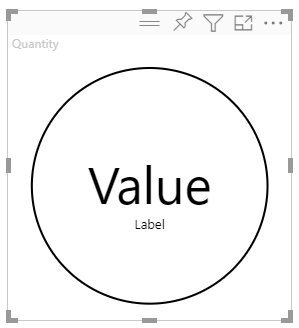

# <a name="tutorial-develop-a-power-bi-circle-card-visual"></a>チュートリアル:Power BI の円形カード視覚化を開発する

[!INCLUDE[Power B I visuals tutorials overview](../../includes/visual-tutorial-overview.md)]

このチュートリアルでは、円の中に書式設定された測定値が表示される、円形カードという名前の Power BI 視覚化を開発します。 円形カード視覚化を使用すると、塗りつぶしの色と輪郭の太さのカスタマイズがサポートされます。

このチュートリアルでは、以下の内容を学習します。
> [!div class="checklist"]
> * 視覚化の開発プロジェクトを作成します。
> * D3 視覚化要素を使用して視覚化を開発します。
> * データを処理するように視覚化を構成します。
> * サイズ変更に適合するように視覚化を構成します。
> * 視覚化に対してアダプティブな色と境界線の設定を構成します。

>[!NOTE]
>この視覚化の完全なソース コードについては、[Circle Card の Power BI 視覚エフェクト](https://github.com/microsoft/powerbi-visuals-circlecard)に関するページを参照してください。

## <a name="prerequisites"></a>前提条件

[!INCLUDE[Power B I tutorials prerequisites](../../includes/visual-tutorial-prerequisites.md)]

## <a name="create-a-development-project"></a>開発プロジェクトを作成する

このセクションでは、円カード視覚化用のプロジェクトを作成します。

1. PowerShell を開き、プロジェクトを作成するフォルダーに移動します。

2. 次のコマンドを入力します。

    ```PowerShell
    pbiviz new CircleCard
    ```

3. プロジェクトのフォルダーに移動します。

    ```powershell
    cd CircleCard
    ```

4. 円形カード視覚化を開始します。 これで、お使いのコンピューターでホストされている間、視覚化が実行されるようになりました。

    ```powershell
    pbiviz start
    ```
    >[!IMPORTANT]
    >チュートリアルを終えるまで、PowerSell ウィンドウを閉じないでください。 視覚化の実行を停止するには、Ctrl + C キーを押し、バッチ ジョブを終了するように求められたら、「Y」と入力して *Enter* キーを押します。

## <a name="view-the-circle-card-in-power-bi-service"></a>Power BI サービスで円形カードを表示する

[!INCLUDE[View the Power B I visual in Power B I service](../../includes/visual-tutorial-view.md)]

## <a name="add-visual-elements-and-text"></a>視覚化要素とテキストを追加する

このセクションでは、視覚化を円形に変換し、テキストが表示されるようにする方法について説明します。

>[!NOTE]
>このチュートリアルでは、[Visual Studio Code](https://code.visualstudio.com/) (VS Code) を使用して、Power BI の視覚化を開発します。

### <a name="modify-the-visuals-file"></a>視覚化のファイルを変更する

いくつかのコード行を削除して追加することにより、**visual.ts** ファイルを設定します。

1. VS Code でプロジェクトを開きます ( **[ファイル]**  >  **[フォルダーを開く]** )。

2. **[エクスプローラー] ペイン** で **[src]** フォルダーを展開して、**visual.ts** ファイルを選択します。

    >[!div class="mx-imgBorder"]
    >

    > [!IMPORTANT]
    > **visual.ts** ファイルの最上部のコメントに注目してください。 Massachusetts Institute of Technology (MIT) ライセンス契約の下で、Power BI の視覚化パッケージを使用する権限が、無料で付与されます。 契約の一環として、ファイルの最上部に必ずコメントを残す必要があります。

3. *visual.ts* ファイルから、次のコード行を削除します。

    * *VisualSettings* インポート:
        ```typescript
        import { VisualSettings } from "./settings";
        ```

    * 4 つのクラス レベルのプライベート変数宣言。

    * *constructor* 内のすべてのコード行。

    * *update* メソッド内のすべてのコード行。

    * *update* メソッドより下のある、*parseSettings* メソッドと *enumerateObjectInstances* メソッドを含む残りのすべてのコード行。

4. import セクションの最後に次のコード行を追加します。

    * *IVisualHost* - 視覚化ホスト (Power BI) との対話に使用されるプロパティとサービスのコレクション。

         ```typescript
        import IVisualHost = powerbi.extensibility.IVisualHost;
        ```

    * *D3 ライブラリ*

        ```typescript
        import * as d3 from "d3";
        type Selection<T extends d3.BaseType> = d3.Selection<T, any,any, any>;
        ```
    
        >[!NOTE]
        >セットアップの一部としてこのライブラリをインストールしなかった場合は、[D3 JavaScript ライブラリをインストールします](environment-setup.md#d3-javascript-library)。

5. *Visual* クラス宣言の下に、次のクラス レベルのプロパティを挿入します。 `private` で始まるコード行のみを追加する必要があります。

    ```typescript
    export class Visual implements IVisual {
        // ...
        private host: IVisualHost;
        private svg: Selection<SVGElement>;
        private container: Selection<SVGElement>;
        private circle: Selection<SVGElement>;
        private textValue: Selection<SVGElement>;
        private textLabel: Selection<SVGElement>;
        // ...
    }
    ```

6. **visual.ts** ファイルを保存します。

### <a name="add-a-circle-and-text-elements"></a>円要素とテキスト要素を追加する

D3 スケーラブル ベクター グラフィックス (SVG) を追加します。 これにより、円 と 2 つのテキスト要素の 3 つの図形を作成できます。

1. VS Code で **visual.ts** を開きます。

2. 次のコードを "*コンストラクター* "に追加します。

    ```typescript
    this.svg = d3.select(options.element)
        .append('svg')
        .classed('circleCard', true);
    this.container = this.svg.append("g")
        .classed('container', true);
    this.circle = this.container.append("circle")
        .classed('circle', true);
    this.textValue = this.container.append("text")
        .classed("textValue", true);
    this.textLabel = this.container.append("text")
        .classed("textLabel", true);
    ```

    >[!TIP]
    >読みやすくするため、コード スニペットをプロジェクトにコピーするたびに、ドキュメントの書式を設定することをお勧めします。 VS Code 内の任意の場所を右クリックして、 *[ドキュメントのフォーマット]* (Alt + Shift + F) を選択します。

3. **visual.ts** ファイルを保存します。

### <a name="set-the-width-and-height"></a>幅と高さを設定する

視覚化の幅と高さを設定し、視覚化の要素の属性とスタイルを初期化します。

1. VS Code で **visual.ts** を開きます。

2. *update* メソッドに次のコードを追加します。

    ```typescript
    let width: number = options.viewport.width;
    let height: number = options.viewport.height;
    this.svg.attr("width", width);
    this.svg.attr("height", height);
    let radius: number = Math.min(width, height) / 2.2;
    this.circle
        .style("fill", "white")
        .style("fill-opacity", 0.5)
        .style("stroke", "black")
        .style("stroke-width", 2)
        .attr("r", radius)
        .attr("cx", width / 2)
        .attr("cy", height / 2);
    let fontSizeValue: number = Math.min(width, height) / 5;
    this.textValue
        .text("Value")
        .attr("x", "50%")
        .attr("y", "50%")
        .attr("dy", "0.35em")
        .attr("text-anchor", "middle")
        .style("font-size", fontSizeValue + "px");
    let fontSizeLabel: number = fontSizeValue / 4;
    this.textLabel
        .text("Label")
        .attr("x", "50%")
        .attr("y", height / 2)
        .attr("dy", fontSizeValue / 1.2)
        .attr("text-anchor", "middle")
        .style("font-size", fontSizeLabel + "px");
    ```

3. **visual.ts** ファイルを保存します。

### <a name="optional-review-the-code-in-the-visuals-file"></a>(省略可能) 視覚化のファイル内のコードを確認する

*visuals.ts* ファイルのコードが次のようになっていることを確認します。

```typescript
/*
*  Power BI Visual CLI
*
*  Copyright (c) Microsoft Corporation
*  All rights reserved.
*  MIT License
*
*  Permission is hereby granted, free of charge, to any person obtaining a copy
*  of this software and associated documentation files (the ""Software""), to deal
*  in the Software without restriction, including without limitation the rights
*  to use, copy, modify, merge, publish, distribute, sublicense, and/or sell
*  copies of the Software, and to permit persons to whom the Software is
*  furnished to do so, subject to the following conditions:
*
*  The above copyright notice and this permission notice shall be included in
*  all copies or substantial portions of the Software.
*
*  THE SOFTWARE IS PROVIDED *AS IS*, WITHOUT WARRANTY OF ANY KIND, EXPRESS OR
*  IMPLIED, INCLUDING BUT NOT LIMITED TO THE WARRANTIES OF MERCHANTABILITY,
*  FITNESS FOR A PARTICULAR PURPOSE AND NONINFRINGEMENT. IN NO EVENT SHALL THE
*  AUTHORS OR COPYRIGHT HOLDERS BE LIABLE FOR ANY CLAIM, DAMAGES OR OTHER
*  LIABILITY, WHETHER IN AN ACTION OF CONTRACT, TORT OR OTHERWISE, ARISING FROM,
*  OUT OF OR IN CONNECTION WITH THE SOFTWARE OR THE USE OR OTHER DEALINGS IN
*  THE SOFTWARE.
*/
"use strict";

import "core-js/stable";
import "./../style/visual.less";
import powerbi from "powerbi-visuals-api";
import VisualConstructorOptions = powerbi.extensibility.visual.VisualConstructorOptions;
import VisualUpdateOptions = powerbi.extensibility.visual.VisualUpdateOptions;
import IVisual = powerbi.extensibility.visual.IVisual;
import EnumerateVisualObjectInstancesOptions = powerbi.EnumerateVisualObjectInstancesOptions;
import VisualObjectInstance = powerbi.VisualObjectInstance;
import DataView = powerbi.DataView;
import VisualObjectInstanceEnumerationObject = powerbi.VisualObjectInstanceEnumerationObject;
import IVisualHost = powerbi.extensibility.IVisualHost;
import * as d3 from "d3";
type Selection<T extends d3.BaseType> = d3.Selection<T, any, any, any>;

export class Visual implements IVisual {
    private host: IVisualHost;
    private svg: Selection<SVGElement>;
    private container: Selection<SVGElement>;
    private circle: Selection<SVGElement>;
    private textValue: Selection<SVGElement>;
    private textLabel: Selection<SVGElement>;

    constructor(options: VisualConstructorOptions) {
        this.svg = d3.select(options.element)
            .append('svg')
            .classed('circleCard', true);
        this.container = this.svg.append("g")
            .classed('container', true);
        this.circle = this.container.append("circle")
            .classed('circle', true);
        this.textValue = this.container.append("text")
            .classed("textValue", true);
        this.textLabel = this.container.append("text")
            .classed("textLabel", true);
    }

    public update(options: VisualUpdateOptions) {
        let width: number = options.viewport.width;
        let height: number = options.viewport.height;
        this.svg.attr("width", width);
        this.svg.attr("height", height);
        let radius: number = Math.min(width, height) / 2.2;
        this.circle
            .style("fill", "white")
            .style("fill-opacity", 0.5)
            .style("stroke", "black")
            .style("stroke-width", 2)
            .attr("r", radius)
            .attr("cx", width / 2)
            .attr("cy", height / 2);
        let fontSizeValue: number = Math.min(width, height) / 5;
        this.textValue
            .text("Value")
            .attr("x", "50%")
            .attr("y", "50%")
            .attr("dy", "0.35em")
            .attr("text-anchor", "middle")
            .style("font-size", fontSizeValue + "px");
        let fontSizeLabel: number = fontSizeValue / 4;
        this.textLabel
            .text("Label")
            .attr("x", "50%")
            .attr("y", height / 2)
            .attr("dy", fontSizeValue / 1.2)
            .attr("text-anchor", "middle")
            .style("font-size", fontSizeLabel + "px");
    }
}
```

### <a name="modify-the-capabilities-file"></a>capabilities ファイルを変更する

capabilities ファイルから不要なコード行を削除します。

1. VS Code でプロジェクトを開きます ( **[ファイル]**  >  **[フォルダーを開く]** )。

2. **capabilities.json** ファイルを選択します。

    >[!div class="mx-imgBorder"]
    >

3. すべてのオブジェクト要素を削除します (14 - 60 行)。

4. **capabilities.json** ファイルを保存します。

### <a name="restart-the-circle-card-visual"></a>円形カード視覚化を再起動する

視覚化の実行を停止して再起動します。

1. 視覚化を実行している PowerShell ウィンドウで、Ctrl + C キーを押し、バッチ ジョブを終了するように求められたら、「Y」と入力して *Enter* キーを押します。

2. PowerShell で、ビジュアルを開始します。

    ```powershell
    pbiviz start
    ```

### <a name="test-the-visual-with-the-added-elements"></a>追加した要素を使用して視覚化をテストする

視覚化に新しく追加した要素が表示されることを確認します。

1. Power BI サービスで、*Power BI US Sales Analysis* レポートを開きます。 別のレポートを使用して円形カード視覚化を開発している場合は、そのレポートに移動します。

2. 視覚化が円の形になっていることを確認します。

    >[!div class="mx-imgBorder"]
    >

    >[!NOTE]
    >視覚化に何も表示されない場合は、 **[フィールド]** ペインから **Quantity** フィールドを開発者向け視覚化にドラッグします。

3. ビジュアルのサイズを変更します。

    視覚化の寸法に合わせて円とテキストが拡大縮小されることを確認します。 視覚化のサイズを変更すると update メソッドが呼び出され、その結果、視覚化の要素が再び拡大縮小されます。

### <a name="enable-auto-reload"></a>自動再読み込みを有効にする

プロジェクトの変更を保存するたびに、視覚化が自動的に再度読み込まれるようにするには、この設定を使用します。

1. *Power BI US Sales Analysis* レポート (または、円形カード視覚化が含まれるプロジェクト) に移動します。

2. 円形カード視覚化を選択します。

3. フローティング ツール バーで、 **[自動再読み込みの切り替え]** を選択します。

    >[!div class="mx-imgBorder"]
    >![円形カード視覚化のフローティング ツール バーの [自動再読み込みの切り替え] オプションをクリックしたスクリーンショット。](media/develop-circle-card/toggle-auto-reload.png)

## <a name="get-the-visual-to-process-data"></a>視覚化でデータを処理する

このセクションでは、データ ロールとデータ ビュー マッピングを定義します。 また、表示されている値の名前を表示するように視覚化を変更します。

### <a name="configure-the-capabilities-file"></a>capabilities ファイルを構成する

**capabilities.json** ファイルを変更して、データ ロールとデータ ビューのマッピングを定義します。

* **データ ロールの定義**

    *measure* 型の単一のデータ ロールで *dataRoles* 配列を定義します。 このデータ ロールは *measure* と呼ばれ、*Measure* と表示されます。 それを使用して、メジャー フィールドまたは集計されたフィールドのどちらかを渡すことができます。

    1. VS Code で **capabilities.json** ファイルを開きます。

    2. **dataRoles** 配列内のすべての内容を削除します (3 - 12 行)。

    3. **dataRoles** 配列に次のコードを挿入します。

        ```json
        {
            "displayName": "Measure",
            "name": "measure",
            "kind": "Measure"
        }
        ```

    4. **capabilities.json** ファイルを保存します。

* **データ ビュー マッピングの定義**

    *dataViewMappings* 配列に *measure* という名前のフィールドを定義します。 このフィールドは、データ ロールに渡すことができます。

    1. VS Code で **capabilities.json** ファイルを開きます。

    2. **dataViewMappings** 配列内のすべての内容を削除します ( 10 - 30 行)。

    3. **dataViewMappings** 配列に次のコードを挿入します。

        ```json
        {
            "conditions": [
                { "measure": { "max": 1 } }
            ],
            "single": {
                "role": "measure"
            }
        }
        ```

    4. **capabilities.json** ファイルを保存します。

### <a name="optional-review-the-capabilities-file-code-changes"></a>(省略可能) capabilities ファイルのコードの変更を確認する

円形カード視覚化に *measure* フィールドが表示されることを確認し、 *[Dataview の表示]* オプションを使用して行った変更を確認します。 

1. Power BI サービスで、*Power BI US Sales Analysis* レポートを開きます。 別のレポートを使用して円形カード視覚化を開発している場合は、そのレポートに移動します。

2. 円形カード視覚化を *Measure* というタイトルのフィールドで構成できることに注意してください。 **[フィールド]** ペインから *Measure* フィールドに要素をドラッグ アンド ドロップできます。

    >[!div class="mx-imgBorder"]
    >![Power BI サービスの [視覚化] ペインに表示されている円形カードの measure フィールドのスクリーンショット。](media/develop-circle-card/measure.png)

    > [!Note]
    > ビジュアル プロジェクトには、データ バインド ロジックがまだ含まれていません。

3. フローティング ツール バーで、 **[Dataview の表示]** を選択します。 

    >[!div class="mx-imgBorder"]
    >![円形カードのフローティング ツール バーにある [Dataview の表示] ボタンのスクリーンショット。](media/develop-circle-card/show-dataview.png)

4. 3 つの点を選択して表示を展開し、**single** を選択して value を表示します。

    >[!div class="mx-imgBorder"]
    >![円形カードの [Dataview の表示] オプションで表示される value の値のスクリーンショット。](media/develop-circle-card/value.png)

5. **metadata** を展開し、**columns** 配列を展開して、**format** と **displayName** の値を確認します。

    >[!div class="mx-imgBorder"]
    >![円形カードの [Dataview の表示] オプションで表示される format と displayName の値のスクリーンショット。](media/develop-circle-card/colunms.png)

6. もう一度ビジュアルに切り替えて、ビジュアルの上に表示されるツールバーで、**[Dataview の表示]** を選択します。

### <a name="configure-the-visual-to-consume-data"></a>データを使用するように視覚化を構成する

**visual.ts** ファイルを変更し、円形カード視覚化でデータを使用できるようにします。

1. VS Code で **visual.ts** ファイルを開きます。

2. 次の行を追加して、`powerbi` モジュールから `DataView` インターフェイスをインポートします。

    ```typescript
    import DataView = powerbi.DataView;
    ```

3. *update* メソッドで次のようにします。

    * 最初のステートメントとして次のステートメントを追加します。 このステートメントにより、簡単にアクセスできるように *dataView* が変数に割り当てられ、*dataView* オブジェクトを参照するように変数が宣言されます。

        ```typescript
        let dataView: DataView = options.dataViews[0];
        ```

    * **.text("Value")** を次のコード行に置き換えます。

        ```typescript
        .text(<string>dataView.single.value)
        ```

    * **.text("Label")** を次のコード行に置き換えます。

        ```typescript
        .text(dataView.metadata.columns[0].displayName)
        ```

4. **visual.ts** ファイルを保存します。

5. Power BI サービスで視覚化を確認します。 視覚化に、値と表示名が表示されるようになります。

## <a name="next-steps"></a>次のステップ

> [!div class="nextstepaction"]
> [円形カード視覚化に書式設定オプションを追加する](custom-visual-develop-tutorial-format-options.md)

> [!div class="nextstepaction"]
> [Power BI の横棒グラフ視覚化を作成する](create-bar-chart.md)

> [!div class="nextstepaction"]
> [作成した Power BI の視覚化をデバッグする方法を学習する](visuals-how-to-debug.md)

> [!div class="nextstepaction"]
> [Power BI ビジュアル プロジェクトの構造](visual-project-structure.md)
