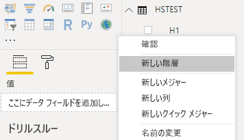
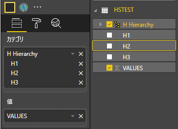

# <a name="add-drill-down-support"></a>ドリルダウン サポートの追加

Power BI ビジュアルでは Power BI のドリルダウンを使用できます。

Power BI のドリルダウンの詳細については、[こちら](./../../consumer/end-user-drill.md)をご覧ください。

## <a name="enable-drill-down-support-in-the-visual"></a>ビジュアルでドリルダウン サポートを有効にする

ビジュアルでドリルダウンをサポートするには、`capabilities.json` に "drill-down" という名前の新しいフィールドを追加します。このフィールドには、1 つのプロパティがあります。

    *roles - the name of the dataRole you want to enable drill-down on.

> [!NOTE]
> drill-down dataRole は `Grouping` 型である必要があります。
> dataRole 条件の `max` プロパティは 1 に設定する必要があります。

drill-down にロールを追加すると、ユーザーはデータ ロールに複数のフィールドをドラッグできるようになります。

例:

```json
{
    "dataRoles": [
        {
            "displayName": "Category",
            "name": "category",
            "kind": "Grouping"
        },
        {
            "displayName": "Value",
            "name": "value",
            "kind": "Measure"
        }
    ],
    "drilldown": {
        "roles": [
            "category"
        ]
    },
    "dataViewMappings": [
        {
            "categorical": {
                "categories": {
                    "for": {
                        "in": "category"
                    }
                },
                "values": {
                    "select": [
                        {
                            "bind": {
                                "to": "value"
                            }
                        }
                    ]
                }
            }
        }
    ]
}
```

## <a name="create-the-visual-with-drill-down-support"></a>ドリルダウン サポートを使用したビジュアルを作成する

Run

```cmd
pbiviz new testDrillDown -t default
```

既定のサンプル ビジュアルを作成します。 新しく作成したビジュアルに上記の `capabilities.json` のサンプルを適用します。

ビジュアルの HTML 要素を保持する `div` コンテナーのプロパティを作成します。

```typescript
"use strict";

import "core-js/stable";
import "./../style/visual.less";
// imports

export class Visual implements IVisual {
    // visual properties
    // ...
    private div: HTMLDivElement; // <== NEW PROPERTY

    constructor(options: VisualConstructorOptions) {
        // constructor body
        // ...
    }

    public update(options: VisualUpdateOptions) {
        // update method body
        // ...
    }

    private static parseSettings(dataView: DataView): VisualSettings {
        return <VisualSettings>VisualSettings.parse(dataView);
    }

    public enumerateObjectInstances(options: EnumerateVisualObjectInstancesOptions): VisualObjectInstance[] | VisualObjectInstanceEnumerationObject {
        return VisualSettings.enumerateObjectInstances(this.settings || VisualSettings.getDefault(), options);
    }
}
```

ビジュアルのコンストラクターを更新します。

```typescript

export class Visual implements IVisual {
    // visual properties
    // ...
    private div: HTMLDivElement;

    constructor(options: VisualConstructorOptions) {
        console.log('Visual constructor', options);
        this.target = options.element;
        this.updateCount = 0;

        const new_p: HTMLElement = document.createElement("p");
        new_p.appendChild(document.createTextNode("Hierarchy level:"));
        const new_em: HTMLElement = document.createElement("em");
        this.textNode = document.createTextNode(this.updateCount.toString());
        new_em.appendChild(this.textNode);
        new_p.appendChild(new_em);
        this.target.appendChild(new_p);

        this.div = document.createElement("div"); // <== CREATE DIV ELEMENT
        this.target.appendChild(this.div);
    }
}
```

ビジュアルの `update` メソッドを更新して、`button` を作成します。

```typescript
export class Visual implements IVisual {
    // ...

    public update(options: VisualUpdateOptions) {
        this.settings = Visual.parseSettings(options && options.dataViews && options.dataViews[0]);
        console.log('Visual update', options);

        const dataView: DataView = options.dataViews[0];
        const categoricalDataView: DataViewCategorical = dataView.categorical;

        // don't create elements if no data
        if (!options.dataViews[0].categorical ||
            !options.dataViews[0].categorical.categories) {
            return
        }

        // to display current level of hierarchy
        if (typeof this.textNode !== undefined) {
            this.textNode.textContent = categoricalDataView.categories[categoricalDataView.categories.length - 1].source.displayName.toString();
        }

        // remove old elements
        // for better performance use D3js pattern:
        // https://d3js.org/#enter-exit
        while (this.div.firstChild) {
            this.div.removeChild(this.div.firstChild);
        }

        // create buttons for each category value
        categoricalDataView.categories[categoricalDataView.categories.length - 1].values.forEach( (category: powerbi.PrimitiveValue, index: number) => {
            let button = document.createElement("button");
            button.innerText = category.toString();

            this.div.appendChild(button);
        })

    }
    // ...
```

`.\style\visual.less` に単純なスタイルを適用します。

```less
button {
    margin: 5px;
    min-width: 50px;
    min-height: 50px;
}
```

ビジュアルをテストするためのサンプル データを準備します。

|   H1  |   H2    | H3  |   VALUES  |
|-----|-----|------|-------|
|   A   |    A1  |    A11 |    1   |
|   A    |    A1    |    A12    |    2    |
|   A    |    A2    |    A21    |    3    |
|   A    |    A2    |    A22    |    4    |
|   A    |    A3    |    A31    |    5    |
|   A    |    A3    |    A32    |    6    |
|   B    |    B1    |    B11    |    7    |
|   B    |    B1    |    B12    |    8    |
|   B    |    B2    |    B21    |    9    |
|   B    |    B2    |    B22    |    10    |
|   B    |    B3    |    B31    |    11    |
|   B    |    B3    |    B32    |    12    |

Power BI Desktop に階層を作成します。



新しい階層にすべてのカテゴリ列 (H1、H2、H3) を含めます。


これらの手順が完了すると、次のビジュアルが表示されます。


## <a name="add-context-menu-to-visual-elements"></a>ビジュアル要素にコンテキスト メニューを追加する

この手順では、ビジュアルのボタンにコンテキスト メニューを追加します。


コンテキスト メニューを作成するには、ビジュアルのプロパティに `host` オブジェクトを保存し、選択項目の作成マネージャーに `createSelectionManager` メソッドを呼び出して、Power BI ビジュアル API を使用してコンテキスト メニューを表示します。

```typescript
"use strict";

import "core-js/stable";
import "./../style/visual.less";
// imports

export class Visual implements IVisual {
    // visual properties
    // ...
    private div: HTMLDivElement;
    private host: IVisualHost; // <== NEW PROPERTY
    private selectionManager: ISelectionManager; // <== NEW PROPERTY

    constructor(options: VisualConstructorOptions) {
        // constructor body
        // save the host in the visuals properties
        this.host = options.host;
        // create selection manager
        this.selectionManager = this.host.createSelectionManager();
        // ...
    }

    public update(options: VisualUpdateOptions) {
        // update method body
        // ...
    }

    // ...
}
```

`forEach` 関数コールバックの本体を次のように変更します。

```typescript
    categoricalDataView.categories[categoricalDataView.categories.length - 1].values.forEach( (category: powerbi.PrimitiveValue, index: number) => {
        // create selectionID for each category value
        let selectionID: ISelectionID = this.host.createSelectionIdBuilder()
            .withCategory(categoricalDataView.categories[0], index)
            .createSelectionId();

        let button = document.createElement("button");
        button.innerText = category.toString();

        // add event listener to click event
        button.addEventListener("click", (event) => {
            // call select method in the selection manager
            this.selectionManager.select(selectionID);
        });

        button.addEventListener("contextmenu", (event) => {
            // call showContextMenu method to display context menu on the visual
            this.selectionManager.showContextMenu(selectionID, {
                x: event.clientX,
                y: event.clientY
            });
            event.preventDefault();
        });

        this.div.appendChild(button);
    });
```

ビジュアルにデータを適用します。



最後の手順では、選択項目とコンテキスト メニューを使用したビジュアルが表示されます。


## <a name="add-drill-down-support-for-matrix-data-view-mapping"></a>マトリックス データ ビュー マッピングにドリルダウン サポートを追加する

マトリックス データ ビュー マッピングでビジュアルをテストするためのサンプル データを準備します。

|   行 1   |   行 2   |   行 3   |   列 1   |   列 2   |   列 3   |   値   |
|-----|-----|------|-------|-------|-------|-------|
|   R1   |   R11   |   R111   |   C1   |   C11   |   C111   |   1   |
|   R1   |   R11   |   R112   |   C1   |   C11   |   C112   |   2   |
|   R1   |   R11   |   R113   |   C1   |   C11   |   C113   |   3   |
|   R1   |   R12   |   R121   |   C1   |   C12   |   C121   |   4   |
|   R1   |   R12   |   R122   |   C1   |   C12   |   C122   |   5   |
|   R1   |   R12   |   R123   |   C1   |   C12   |   C123   |   6   |
|   R1   |   R13   |   R131   |   C1   |   C13   |   C131   |   7   |
|   R1   |   R13   |   R132   |   C1   |   C13   |   C132   |   8   |
|   R1   |   R13   |   R133   |   C1   |   C13   |   C133   |   9   |
|   R2   |   R21   |   R211   |   C2   |   C21   |   C211   |   10   |
|   R2   |   R21   |   R212   |   C2   |   C21   |   C212   |   11   |
|   R2   |   R21   |   R213   |   C2   |   C21   |   C213   |   12   |
|   R2   |   R22   |   R221   |   C2   |   C22   |   C221   |   13   |
|   R2   |   R22   |   R222   |   C2   |   C22   |   C222   |   14   |
|   R2   |   R22   |   R223   |   C2   |   C22   |   C223   |   16   |
|   R2   |   R23   |   R231   |   C2   |   C23   |   C231   |   17   |
|   R2   |   R23   |   R232   |   C2   |   C23   |   C232   |   18   |
|   R2   |   R23   |   R233   |   C2   |   C23   |   C233   |   19   |

ビジュアルに次の dataview マッピングを適用します。

```json
{
    "dataRoles": [
        {
            "displayName": "Columns",
            "name": "columns",
            "kind": "Grouping"
        },
        {
            "displayName": "Rows",
            "name": "rows",
            "kind": "Grouping"
        },
        {
            "displayName": "Value",
            "name": "value",
            "kind": "Measure"
        }
    ],
    "drilldown": {
        "roles": [
            "columns",
            "rows"
        ]
    },
    "dataViewMappings": [
        {
            "matrix": {
                "columns": {
                    "for": {
                        "in": "columns"
                    }
                },
                "rows": {
                    "for": {
                        "in": "rows"
                    }
                },
                "values": {
                    "for": {
                        "in": "value"
                    }
                }
            }
        }
    ]
}
```

ビジュアルにデータを適用します。


マトリックス データ ビュー マッピングを処理するために必要なインターフェイスをインポートします。

```typescript
// ...
import DataViewMatrix = powerbi.DataViewMatrix;
import DataViewMatrixNode = powerbi.DataViewMatrixNode;
import DataViewHierarchyLevel = powerbi.DataViewHierarchyLevel;
// ...
```

rows 要素と columns 要素の 2 つの `div` に対して、2 つのプロパティを作成します。

```typescript
export class Visual implements IVisual {
    // ...
    private rowsDiv: HTMLDivElement;
    private colsDiv: HTMLDivElement;
    // ...
    constructor(options: VisualConstructorOptions) {
        // constructor body
        // ...
        // Create div elements and append to main div of the visual
        this.rowsDiv = document.createElement("div");
        this.target.appendChild(this.rowsDiv);

        this.colsDiv = document.createElement("div");
        this.target.appendChild(this.colsDiv);
    }
    // ...
}
```

要素をレンダリングする前にデータを確認し、階層の現在のレベルを表示します。

```typescript
export class Visual implements IVisual {
    // ...
    constructor(options: VisualConstructorOptions) {
        // constructor body
    }

    public update(options: VisualUpdateOptions) {
        this.settings = Visual.parseSettings(options && options.dataViews && options.dataViews[0]);
        console.log('Visual update', options);

        const dataView: DataView = options.dataViews[0];
        const matrixDataView: DataViewMatrix = dataView.matrix;

        // if the visual doesn't receive the data no reason to continue rendering
        if (!matrixDataView ||
            !matrixDataView.columns ||
            !matrixDataView.rows ) {
            return
        }

        // to display current level of hierarchy
        if (typeof this.textNode !== undefined) {
            this.textNode.textContent = categoricalDataView.categories[categoricalDataView.categories.length - 1].source.displayName.toString();
        }
        // ...
    }
    // ...
}
```

階層を走査するための関数 `treeWalker` を作成します。

```typescript
export class Visual implements IVisual {
    // ...
    public update(options: VisualUpdateOptions) {
        // ...

        // if the visual doesn't receive the data no reason to continue rendering
        if (!matrixDataView ||
            !matrixDataView.columns ||
            !matrixDataView.rows ) {
            return
        }

        const treeWalker = (matrixNode: DataViewMatrixNode, index: number, levels: DataViewHierarchyLevel[], div: HTMLDivElement)  => {
            // ...
            if (matrixNode.children) {
                // ...
                // traversing child nodes
                matrixNode.children.forEach((node, index) => treeWalker(node, index, levels, childDiv));
            }
        }

        // traversing rows
        const rowRoot: DataViewMatrixNode = matrixDataView.rows.root;
        rowRoot.children.forEach((node, index) => treeWalker(node, index, matrixDataView.rows.levels, this.rowsDiv));

        // traversing columns
        const colRoot = matrixDataView.columns.root;
        colRoot.children.forEach((node, index) => treeWalker(node, index, matrixDataView.columns.levels, this.colsDiv));
    }
    // ...
}
```

データポイントの選択項目を生成します。

```typescript
const treeWalker = (matrixNode: DataViewMatrixNode, index: number, levels: DataViewHierarchyLevel[], div: HTMLDivElement)  => {
    // generate selectionID for each node of matrix
    const selectionID: ISelectionID = this.host.createSelectionIdBuilder()
        .withMatrixNode(matrixNode, levels)
        .createSelectionId();
    // ...
    if (matrixNode.children) {
        // ...
        // traversing child nodes
        matrixNode.children.forEach((node, index) => treeWalker(node, index, levels, childDiv));
    }
}
```

階層のレベルごとに `div` を作成します。

```typescript
const treeWalker = (matrixNode: DataViewMatrixNode, index: number, levels: DataViewHierarchyLevel[], div: HTMLDivElement)  => {
    // generate selectionID for each node of matrix
    const selectionID: ISelectionID = this.host.createSelectionIdBuilder()
        .withMatrixNode(matrixNode, levels)
        .createSelectionId();
    // ...
    if (matrixNode.children) {
        // create div element for level
        const childDiv = document.createElement("div");
        // add to current div
        div.appendChild(childDiv);
        // create paragraph element to display next
        const p = document.createElement("p");
        // display level name on paragraph element
        const level = levels[matrixNode.level];
        p.innerText = level.sources[level.sources.length - 1].displayName;
        // add paragraph element to created child div
        childDiv.appendChild(p);
        // traversing child nodes
        matrixNode.children.forEach((node, index) => treeWalker(node, index, levels, childDiv));
    }
}
```

ビジュアルとやりとりするための `buttons` を作成し、マトリックス データポイントのコンテキスト メニューを表示します。

```typescript
const treeWalker = (matrixNode: DataViewMatrixNode, index: number, levels: DataViewHierarchyLevel[], div: HTMLDivElement)  => {
    // generate selectionID for each node of matrix
    const selectionID: ISelectionID = this.host.createSelectionIdBuilder()
        .withMatrixNode(matrixNode, levels)
        .createSelectionId();

    // create button element
    let button = document.createElement("button");
    // display node value/name of the button's text
    button.innerText = matrixNode.value.toString();

    // add event listener on click
    button.addEventListener("click", (event) => {
        // call select method in the selection manager
        this.selectionManager.select(selectionID);
    });

    // display context menu on click
    button.addEventListener("contextmenu", (event) => {
        // call showContextMenu method to display context menu on the visual
        this.selectionManager.showContextMenu(selectionID, {
            x: event.clientX,
            y: event.clientY
        });
        event.preventDefault();
    });

    div.appendChild(button);

    if (matrixNode.children) {
        // ...
    }
}
```

要素を再びレンダリングする前に、`div` 要素をクリアします。

```typescript
public update(options: VisualUpdateOptions) {
    // ...
    const treeWalker = (matrixNode: DataViewMatrixNode, index: number, levels: DataViewHierarchyLevel[], div: HTMLDivElement)  => {
        // ...
    }

    // remove old elements
    // to better performance use D3js pattern:
    // https://d3js.org/#enter-exit
    while (this.rowsDiv.firstChild) {
        this.rowsDiv.removeChild(this.rowsDiv.firstChild);
    }
    // create label for row elements
    const prow = document.createElement("p");
    prow.innerText = "Rows";
    this.rowsDiv.appendChild(prow);

    while (this.colsDiv.firstChild) {
        this.colsDiv.removeChild(this.colsDiv.firstChild);
    }
    // create label for columns elements
    const pcol = document.createElement("p");
    pcol.innerText = "Columns";
    this.colsDiv.appendChild(pcol);

    // render elements for rows
    const rowRoot: DataViewMatrixNode = matrixDataView.rows.root;
    rowRoot.children.forEach((node, index) => treeWalker(node, index, matrixDataView.rows.levels, this.rowsDiv));

    // render elements for columns
    const colRoot = matrixDataView.columns.root;
    colRoot.children.forEach((node, index) => treeWalker(node, index, matrixDataView.columns.levels, this.colsDiv));
}
```

最後の手順では、コンテキスト メニューを使用したビジュアルが表示されます。


## <a name="next-steps"></a>次の手順

詳細については、「[Power BI ビジュアルでのデータ ビューのマッピングについて理解する](dataview-mappings.md)」を参照してください。
