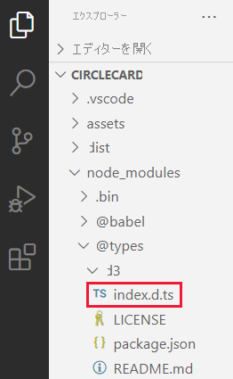

# <a name="set-up-your-environment-for-developing-a-power-bi-visual"></a>Power BI の視覚化の開発用に環境をセットアップする

この記事では、Power BI の視覚化を開発するための環境をセットアップする方法について説明します。

開発を始める前に、**Node.js** と **pbiviz** パッケージをインストールする必要があります。 また、証明書を作成してインストールする必要もあります。 ローカル環境をセットアップするときは、Power BI の視覚化を開発するために Power BI サービスを構成する必要があります。

この記事では、次の方法について学習します。
> [!div class="checklist"]
> * *Node.js* をインストールします。
> * *pbiviz* をインストールします。
> * 証明書を作成してインストールします。
> * 視覚化の開発用に Power BI サービスを設定します。
> * 追加のライブラリをインストールします (視覚化の開発に必要です)。

## <a name="install-nodejs"></a>Node.js をインストールする

*Node.js* は、Chrome の V8 JavaScript エンジン上に構築された JavaScript ランタイムです。 これにより、開発者は JavaScript で作成されたアプリを実行できます。

1. *Node.js* をインストールするには、Web ブラウザーで [Node.js](https://nodejs.org) に移動します。

2. 最新の MSI インストーラーをダウンロードします。

3. インストーラーを実行して、インストールの手順に従います。 使用許諾契約に同意して、すべての既定値を受け入れます。

4. コンピューターを再起動する

## <a name="install-pbiviz"></a>pbiviz をインストールする

JavaScript を使用して記述された *pbiviz* ツールを使用して、*pbiviz* パッケージの視覚化のソース コードをコンパイルします。

*pbiviz* パッケージは、必要なすべてのスクリプトと資産が含まれる zip 形式の Power BI 視覚化プロジェクトです。

1. Windows PowerShell を開いて、次のコマンドを入力します。

    ```powershell
    npm i -g powerbi-visuals-tools
    ```

## <a name="create-and-install-a-certificate"></a>証明書を作成してインストールする

クライアント (コンピューター) とサーバー (Power BI サービス) が安全にやり取りできるようにするには、[Secure Sockets Layer (SSL) の証明書](create-ssl-certificate.md)が必要です。 セキュリティで保護されたやり取りを保証するための証明書がないと、ブラウザーによってブロックされます。

# <a name="windows"></a>[Windows](#tab/windows)

このプロセスでは、**証明書のインポート ウィザード** を起動する PowerShell コマンドの実行について説明します。 以下の手順のようにして、ウィザードで証明書を構成します。

>[!IMPORTANT]
>この手順の間、PowerShell ウィンドウを閉じないでください。

1. Windows PowerShell を開いて、次のコマンドを入力します。

    ```powershell
    pbiviz --install-cert
    ```

    このコマンドでは 2 つのことが行われます。
    * "*パスフレーズ*" が返されます。 この例での "*パスフレーズ*" は 9765328806094 です。
    * 証明書のインポート ウィザードも起動します。
    
    >[!div class="mx-imgBorder"]
    >

2. 証明書のインポート ウィザードで、ストアの場所が *[現在のユーザー]* に設定されていることを確認して、 **[次へ]** を選択します。

    >[!div class="mx-imgBorder"]
    >

3. **[インポートするファイル]** ウィンドウで、 **[次へ]** を選択します。

4. **[秘密キーの保護]** ウィンドウの *[パスワード]* テキスト ボックスに、PowerShell コマンドを実行して (ステップ 1) 受け取ったパスフレーズを貼り付けて、 **[次へ]** を選択します。 この例でのパスフレーズは 9765328806094 です。

    >[!div class="mx-imgBorder"]
    >![[パスワード] ボックスが強調表示されている証明書のインポート ウィザードの [秘密キーの保護] ウィンドウのスクリーンショット。](media/environment-setup/certificate-wizard-password.png)

5. **[証明書ストア]** ウィンドウで、 **[証明書をすべて次のストアに配置する]** オプションを選択して、 **[参照]** を選択します。

    >[!div class="mx-imgBorder"]
    >![[証明書をすべて次のストアに配置する] が選択されている証明書のインポート ウィザードの [証明書ストア] ウィンドウのスクリーンショット。](media/environment-setup/certificate-wizard-certificate-store.png)

6. **[証明書ストアの選択]** ウィンドウで、 **[信頼されたルート証明機関]** を選択して、 **[OK]** をクリックします。

    >[!div class="mx-imgBorder"]
    >![[信頼されたルート証明機関] フォルダーが選択されている [証明書ストアの選択] ウィンドウのスクリーンショット。](media/environment-setup/trusted-root.png)

7. **[証明書ストア]** ウィンドウで *[次へ]* を選択します。

    >[!div class="mx-imgBorder"]
    >![[信頼されたルート証明機関] フォルダーが選択され、[次へ] ボタンが強調表示されている、証明書のインポート ウィザードの [証明書ストア] ウィンドウのスクリーンショット。](media/environment-setup/certificate-wizard-store-next.png)

8. **[証明書のインポート ウィザードの完了]** ウィンドウで、設定を確認して、 **[完了]** を選択します。

    >[!NOTE]
    >セキュリティの警告を受信した場合は、 **[はい]** を選択します。


# <a name="osx"></a>[OSX](#tab/sdk2osx)

1. 左上の鍵がロックされている場合は、鍵を選択してロックを解除します。 *localhost* を検索し、証明書をダブルクリックします。

    

2. **[Always Trust]** \(常に信頼する) を選択して、ウィンドウを閉じます。

    

3. ユーザー名とパスワードを入力し、 **[設定の更新]** を選択します。

    

4. 開いているブラウザーをすべて閉じます。

> [!NOTE]
> 証明書が認識されない場合は、コンピューターを再起動します。

---

## <a name="optional-verify-that-your-environment-is-set-up"></a>(省略可能) 環境がセットアップされていることを確認する

Power BI 視覚化ツール パッケージがインストールされていることを確認します。 PowerShell で `pbiviz` コマンドを実行して、サポートされているコマンドの一覧が含まれる出力を確認します。

>[!div class="mx-imgBorder"]
>

## <a name="set-up-power-bi-service-for-developing-a-visual"></a>視覚化の開発用に Power BI サービスを設定する

Power BI の視覚化を開発するには、Power BI サービスでカスタム視覚化のデバッグを有効にする必要があります。 このセクションの手順に従って、このオプションを有効にします。

1. [PowerBI.com](https://powerbi.microsoft.com/) にサインインします。

2. **[設定]**  >  **[設定]**  >  **[設定]** に移動します。

    >[!div class="mx-imgBorder"]
    >![Power bi I サービスの[設定]、[設定]、[設定] メニュー オプションのスクリーンショット。](media/environment-setup/powerbi-settings.png)

3. **[全般]** タブで、 **[開発者]** を選択します。 **[開発者向け設定]** で **[開発者向けビジュアルを使用して、カスタム ビジュアル デバッグを有効にします]** チェック ボックスをオンにして、 **[適用]** を選択します。

    >[!div class="mx-imgBorder"]
    >![Power BI の [設定] の [全般] タブの [開発者向けビジュアルを使用して、カスタム ビジュアル デバッグを有効にします] オプションのスクリーンショット。](media/environment-setup/developer-settings.png)

## <a name="install-development-libraries"></a>開発ライブラリをインストールする

Power BI の独自の視覚化を開発するには、追加のライブラリをインストールする必要があります。 このセクションでは、これらのライブラリをインストールし、インストールが成功したことを確認する方法について説明します。

この記事に記載されているライブラリをインストールするには、PowerShell を開き、コンポーネントごとにインストール コマンドを入力します。

>[!NOTE]
>これらのライブラリをコンピューターにインストールすると、任意の Power BI 視覚化プロジェクトにそれらを使用できるようになります。 これは、コンピューターごとに 1 回限りのインストール手順です。


### <a name="d3-javascript-library"></a>D3 JavaScript ライブラリ

[D3](https://d3js.org/) は、Web ブラウザーに動的で対話型のデータ視覚化を生成するための JavaScript ライブラリです。 広く実装されているスケーラブル ベクター グラフィックス (SVG)、HTML5、CSS の各標準に依存します。

```powershell
npm i d3@^5.0.0 --save
```

### <a name="typescript-definitions"></a>TypeScript 定義

JavaScript のスーパーセットである [TypeScript](https://www.typescriptlang.org/) で Power BI の視覚化を開発できるようにするには、TypeScript 定義をインストールします。

```powershell
npm i @types/d3@^5.0.0 --save
```

### <a name="core-js"></a>core-js

[core-js](https://www.npmjs.com/package/core-js) は、ECMAScript 用のポリフィルが含まれる JavaScript 用のモジュール型標準ライブラリです。

```powershell
npm i core-js@3.2.1 --save
```

### <a name="powerbi-visual-api"></a>powerbi-visual-api

Power BI Visuals API の定義をインストールします。

```powershell
npm i powerbi-visuals-api --save-dev
```

### <a name="optional-verify-that-the-d3-library-is-installed"></a>(省略可能) D3 ライブラリがインストールされていることを確認する

[Visual Studio Code](https://code.visualstudio.com/) (VS Code) は、TypeScript アプリケーションを開発するための理想的な統合開発環境 (IDE) です。 このセクションでは、VS Code を使用して、Power BI の視覚化を開発するために必要な D3 ライブラリが正しくインストールされていることを確認します。

>[!NOTE]
>このセクションで説明する検証プロセスでは、Power BI 視覚化プロジェクトが既にあることを前提としています。 Power BI 視覚化プロジェクトがない場合は、[円形カード プロジェクトの作成](develop-circle-card.md#create-a-development-project)の手順に従って作成できます。

1. VS Code を開きます。

    >[!TIP]
    >次のコマンドを実行することで、PowerShell から VS Code を開くことができます。
    >
    >```powershell
    >code .
    >```
2. VS Code で、 **[ファイル]** メニューを開いて **[フォルダーを開く]** を選択します。

    >[!div class="mx-imgBorder"]
    >![VS スタジオの [ファイル] メニューの [フォルダーを開く] オプションのスクリーンショット。](media/environment-setup/open-folder.png)

3. **[フォルダーを開く]** ウィンドウで、Power BI 視覚化プロジェクトが含まれるフォルダーを選択して、 **[フォルダーの選択]** を選択します。

    >[!div class="mx-imgBorder"]
    >![VS スタジオの [フォルダーを開く] ウィンドウでの Power BI 視覚化プロジェクト フォルダーの選択のスクリーンショット。](media/environment-setup/project-folder.png)

4. **[エクスプローラー]** ペインで **node_modules** フォルダーを展開し、**d3** ライブラリがインストールされていることを確認します。

    >[!div class="mx-imgBorder"]
    >

5. **[エクスプローラー]** ペインで **node_modules > @types > d3** を展開し、**index.t.ds** ファイルがインストールされていることを確認します。

    >[!div class="mx-imgBorder"]
    >

## <a name="next-steps"></a>次のステップ

> [!div class="nextstepaction"]
> [Power BI の円形カード視覚化を作成する](develop-circle-card.md)

> [!div class="nextstepaction"]
> [Power BI の横棒グラフ視覚化を作成する](create-bar-chart.md)