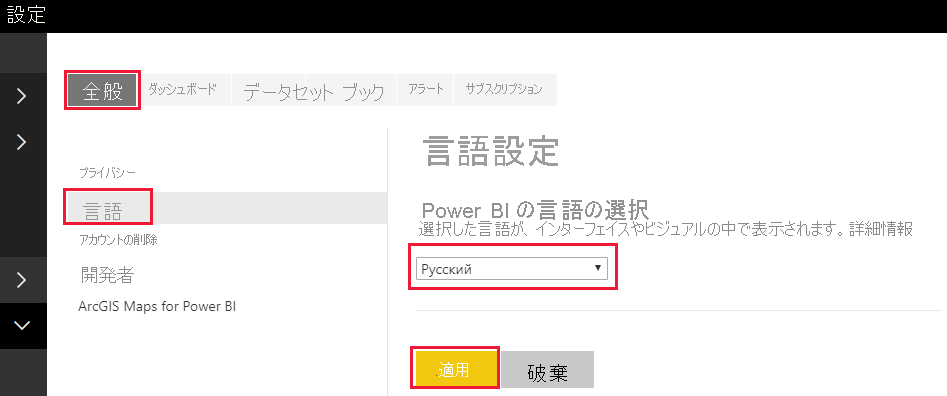
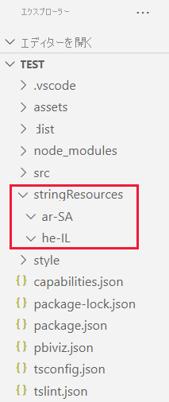
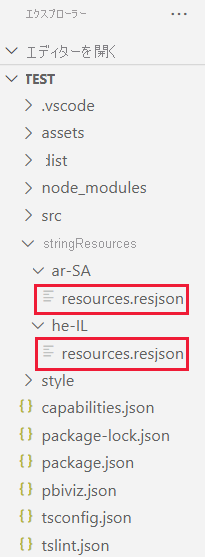

# <a name="add-the-locale-power-bi-language-to-your-power-bi-visual"></a>Power BI ビジュアルにロケール Power BI 言語を追加する

Power BI は、[さまざまなローカル言語をサポート](./../../fundamentals/supported-languages-countries-regions.md)しています。 Power BI ロケール言語を取得し、それを使用してビジュアルでコンテンツを表示できます。

さまざまな言語でコンテンツを表示している *サンプルの横棒グラフ* ビジュアルの例を次に示します。 これらの各横棒グラフは、ツールヒントに表示されているさまざまなロケール言語 (英語、バスク語、ヒンディー語) を使用して作成されました。


> [!NOTE]
> * ビジュアルのコードのローカライズ マネージャーは、API 1.10.0 以降でサポートされています。
> * 開発用ビジュアルのデバッグでは、ローカライズはサポートされていません。

## <a name="how-to-add-the-local-power-bi-language-to-your-visual"></a>ビジュアルにローカル Power BI 言語を追加する方法

ビジュアルにローカル Power BI 言語を追加するには、次の手順に従う必要があります。

1. [英語ではない言語を表示するように環境を設定します](#step-1---set-up-your-environment-to-display-a-language-that-isnt-english)。

2. [ローカル Power BI 言語を取得します](#step-2---get-the-locale-power-bi-language)。

3. [ビジュアル表示名を設定します](#step-3---set-the-visual-display-names)。

4. [言語フォルダーを作成します](#step-4---create-a-language-folder)。

5. [各言語のリソース ファイルを追加します](#step-5---add-a-resources-file-for-each-language)。

6. [新しい localizationManager インスタンスを作成します](#step-6---create-a-new-localizationmanager-instance)。

7. [getDisplayName 関数を呼び出します](#step-7---call-the-getdisplayname-function)。

### <a name="step-1---set-up-your-environment-to-display-a-language-that-isnt-english"></a>手順 1 - 英語ではない言語を表示するように環境を設定する

ビジュアルをテストするには、Power BI で、英語ではない言語を使用する必要があります。 このセクションでは、Power BI Desktop と Power BI サービスの設定を変更して、英語ではないローカル言語を使用するようにする方法を示します。

* **Power BI Desktop** - https://powerbi.microsoft.com から Power BI Desktop のローカライズ版をダウンロードします。

* **Power BI サービス** - Power BI サービス (Web ポータル) を使用している場合は、設定内の言語を変更します。

    1. [PowerBI.com](https://powerbi.microsoft.com/) にサインインします。

    2. **[設定]**  >  **[設定]**  >  **[設定]** に移動します。

        >[!div class="mx-imgBorder"]
        >![Power bi I サービスの[設定]、[設定]、[設定] メニュー オプションのスクリーンショット。](media/environment-setup/powerbi-settings.png)

    3. **[全般]** タブから、 **[言語]** を選択します。 **[言語設定]** で、Power BI で使用する言語を選択し、 **[適用]** を選択します。

        >[!div class="mx-imgBorder"]
        >

### <a name="step-2---get-the-locale-power-bi-language"></a>手順 2 - ロケール Power BI 言語を取得する

ローカル Power BI 言語は、ビジュアルの初期化中に `locale` という名前の文字列として渡されます。 Power BI でロケール言語が変更されると、ビジュアルは、新しい `locale` で再生成されます。

```typescript
private locale: string;
...
this.locale = options.host.locale;
```

> [!NOTE]
> Power BI Desktop では、`locale` プロパティには、インストールされている Power BI Desktop の言語が含まれています。

### <a name="step-3---set-the-visual-display-names"></a>手順 3 - ビジュアル表示名を設定する

どのビジュアルでも、情報はプロパティ ペインに表示されます。 たとえば、`pbiviz new` コマンドを使用して作成されたローカライズされていないカスタム ビジュアルでは、プロパティ ペインに *[カテゴリ データ]* および *[メジャー データ]* フィールドが表示されます。

>[!div class="mx-imgBorder"]
>![新しく作成された Power BI ビジュアル内の [カテゴリ データ] および [メジャー データ] フィールドを示すスクリーンショット。](media/localization/property-pane.png)

プロパティ ペインの表示フィールドは、**capabilities.json** ファイルで定義されています。 すべての表示フィールドが `displayName` プロパティを使用して定義されます。 ローカライズするすべての表示名に `displayNameKey` を追加します。

```json
{
    "dataRoles": [
        {
            "displayName": "Category Data",
            "displayNameKey": "VisualCategoryDataNameKey1",
            "name": "category",
            "kind": "Grouping"
        },
        {
            "displayName": "Measure Data",
            "displayNameKey": "VisualMeasureDataNameKey2",
            "name": "measure",
            "kind": "Measure"
        }
    ]
}
```

### <a name="step-4---create-a-language-folder"></a>手順 4 - 言語フォルダーを作成する

ローカライズされたビジュアルを作成するには、プロジェクトに言語フォルダーが存在する必要があります。 プロジェクトで、**stringResources** という名前のフォルダーを作成します。 このフォルダーには、ビジュアルでサポートするローカル言語ごとに 1 つのサブフォルダーが含まれます。 たとえば、アラビア語とヘブライ語をサポートするには、次の方法で 2 つのフォルダーを追加します。

>[!div class="mx-imgBorder"]
>

### <a name="step-5---add-a-resources-file-for-each-language"></a>手順 5 - 各言語のリソース ファイルを追加する

ビジュアルでサポートする言語ごとに、対応する **stringResources** サブフォルダー内に **resources.resjson** JSON ファイルを追加する必要があります。 これらのファイルには、そのロケール言語の情報と、置き換えるすべての `displayNameKey` のローカライズされた文字列値が含まれます。

>[!div class="mx-imgBorder"]
>

すべての JSON ファイルで 1 つの[サポートされるロケール言語](#supported-languages)を定義します。 使用しようとしているすべてのローカライズ文字列を各 **resources.resjson** ファイルに追加します。

#### <a name="examples"></a>例

* 各 `displayNameKey` に対応する "*ロシア語*" の文字列を含む **resources.resjson** ファイル。

    ```json
    {
        ...
        "Role_Legend": "Обозначения",
        "Role_task": "Задача",
        "Role_StartDate": "Дата начала",
        "Role_Duration": "Длительность"
        ...
    }
    ```

* 各 `displayNameKey` に対応する "*ヘブライ語*" の文字列を含む **resources.resjson** ファイル。

    ```json
    {
        ...
        "Role_Legend": "Legend",
        "Role_task": "Task",
        "Role_StartDate": "Start date",
        "Role_Duration": "Duration"
        ...
    }
    ```

### <a name="step-6---create-a-new-localizationmanager-instance"></a>手順 6 - 新しい localizationManager インスタンスを作成する

ビジュアルのコード内に新しい `localizationManager` インスタンスを作成します。

```typescript
private localizationManager: ILocalizationManager;

constructor(options: VisualConstructorOptions) {
    this.localizationManager = options.host.createLocalizationManager();
}
```

### <a name="step-7---call-the-getdisplayname-function"></a>手順 7 - getDisplayName 関数を呼び出す

新しい `localizationManager` インスタンスを作成したら、**resources.resjson** で定義した文字列キー引数を使用して、ローカライズ マネージャーの `getDisplayName` 関数を呼び出すことができます。

たとえば、次のコードでは en-US の場合は *Legend*、ru-RU の場合は *Обозначения* が返されます。

```typescript
let legend: string = this.localization.getDisplayName("Role_Legend");
```

## <a name="supported-languages"></a>サポートされている言語

次の表には、Power BI でサポートされているすべての言語と、それぞれに対して `local` 変数で返される文字列の一覧が含まれています。

ロケール文字列 | 言語
--------------|---------------------
ar-SA | العربية (アラビア語)
bg-BG | български (ブルガリア語)
ca-ES | català (カタルニア語)
cs-CZ | čeština (チェコ語)
da-DK | dansk (デンマーク語)
de-DE | Deutsche (ドイツ語)
el-GR | ελληνικά (ギリシャ語)
en-US | English (英語)
es-ES | español service (スペイン語)
et-EE | eesti (エストニア語)
eU-ES | Euskal (バスク語)
fi FI | suomi (フィンランド語)
fr-FR | français (フランス)
gl-ES | galego (ガリシア語)
he-IL | עברית (ヘブライ語)
hi-IN | हिन्दी (ヒンディー語)
hr-HR | hrvatski (クロアチア語)
hu-HU | magyar (ハンガリー語)
id-ID | Bahasa Indonesia (インドネシア語)
it-IT | italiano (イタリア語)
ja-JP | 日本 (日本語)
kk-KZ | Қазақ (カザフ語)
ko-KR | 한국의 (韓国語)
lt-LT | Lietuvos (リトアニア語)
lv-LV | Latvijas (ラトビア語)
ms-MY | Bahasa Melayu (マレー語)
nb-NO | norsk (ノルウェー語)
nl-NL | Nederlands (オランダ語)
pl-PL | polski (ポーランド語)
pt-BR | português (ポルトガル語)
pt-PT | português (ポルトガル語)
ro-RO | românesc (ルーマニア語)
ru-RU | русский (ロシア語)
sk-SK | slovenský (スロバキア語)
sl-SI | slovenski (スロベニア語)
sr-Cyrl-RS | српски (セルビア語)
sr-Latn-RS | srpski (セルビア語)
sv-SE | svenska (スウェーデン語)
th-TH | ไทย (タイ語)
tr-TR | Türk (トルコ語)
uk-UA | український (ウクライナ語)
vi-VN | tiếng Việt (ベトナム語)
zh-CN | 中国 (簡体中国語)
zh-TW | 中國 (繁体中国語)

## <a name="next-steps"></a>次のステップ

>[!div class="nextstepaction"]
>[ユーティリティの書式設定](utils-formatting.md)
