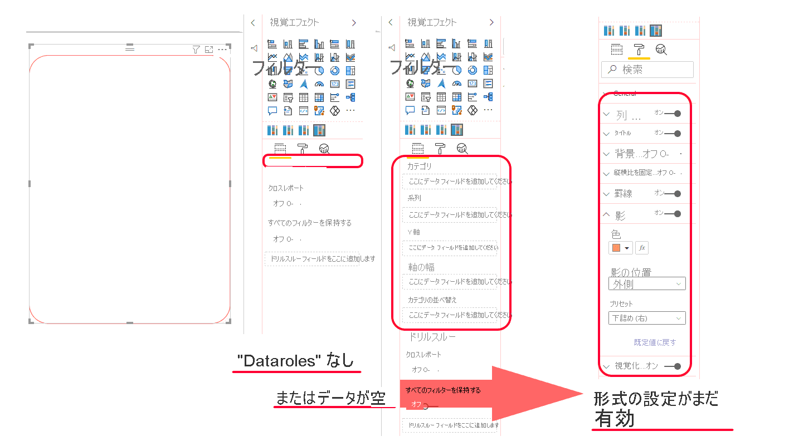

# <a name="render-a-visual-without-the-need-to-bind-any-data"></a>データをバインドせずに視覚エフェクトをレンダリングする

`powerbi-visuals-api` バージョン 3.6.0 から、`dataRoles` 機能モデルはサポートされません。 この機能により、データをバインドせずに、Power BI から更新プログラムを受け取ることができます。 つまり、データバケットが空の場合でも、ビジュアルでデータロールがまったく使用されない場合でも、ビジュアルをレンダリングしたり、更新メソッドを利用してビジュアルの書式設定を変更したりできます。

この機能を有効にするには、`capabilities.json` ファイルの 2 つのパラメーターを *true* に設定する必要があります。 

```json
    {
        "supportsLandingPage": true,
        "supportsEmptyDataView": true,
    }
```

次のタブには、Power BI ビジュアルの例が 2 つあります。その 1 つでは、データをバインドする必要があります。もう 1 つでは、新しい機能を使用し、データをバインドする必要がありません。

## <a name="binding-data-required"></a>[データのバインドが必要](#tab/NoDataroles)
   

>[!div class="mx-imgBorder"]
>


## <a name="binding-data-not-required"></a>[データのバインドは不要](#tab/NoDatarolesSupport) 

>[!div class="mx-imgBorder"]
>

---

## <a name="next-steps"></a>次の手順

> [!div class="nextstepaction"]
> [機能を使用する](capabilities.md)
