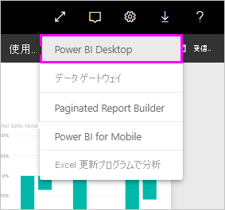
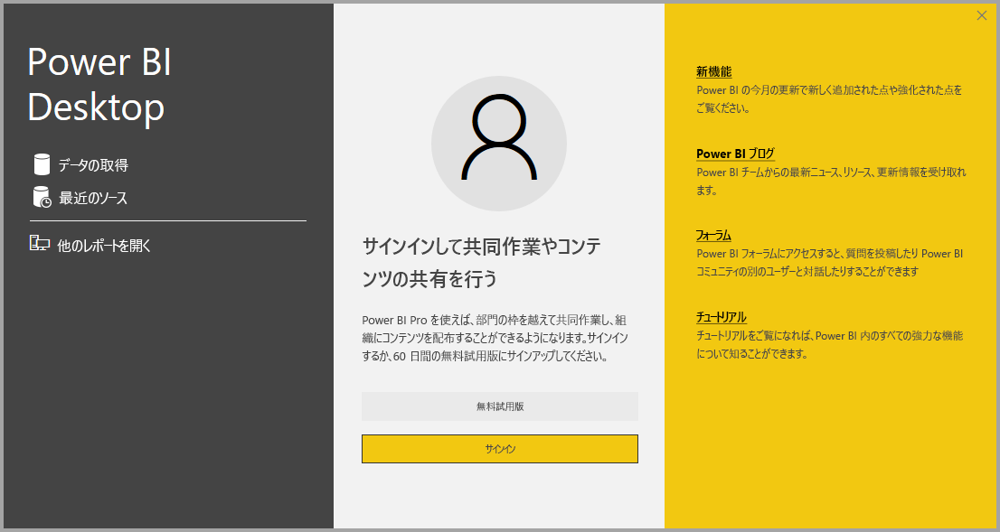

# <a name="get-power-bi-desktop"></a>Power BI Desktop の取得
Power BI Desktop では、データを視覚化する高度なクエリ、モデル、レポートを作成できます。 Power BI Desktop を使うと、データ モデルを作成し、レポートを作成し、Power BI サービスに発行することで作業を共有することができます。 Power BI Desktop は無料でダウンロードできます。

Power BI Desktop は 2 つの方法で取得でき、次のセクションではそれぞれについて説明します。

* [Microsoft ストアからアプリとしてインストールする](#install-as-an-app-from-the-microsoft-store)。
* [実行可能ファイルとして直接ダウンロードしてコンピューターにインストールする](#download-power-bi-desktop-directly)。

どちらの方法でも最新バージョンの Power BI Desktop がコンピューターにインストールされますが、注目すべきいくつかの違いがあります。これについては以下のセクションで説明します。


> [!IMPORTANT]
> Power BI Desktop は、お客様のフィードバックと新機能を組み込み、月単位で更新およびリリースされます。 サポート対象の Power BI Desktop は、最新バージョンのみです。お客様が Power BI Desktop に関してサポートに問い合わせた場合、最新バージョンにアップグレードするように求められます。 最新バージョンの Power BI Desktop は、[Windows ストア](https://aka.ms/pbidesktopstore)から入手するか、またはサポートされているすべての言語を含む 1 つの実行可能ファイルとして[ダウンロード](https://www.microsoft.com/download/details.aspx?id=58494)してお使いのコンピューターにインストールできます。


## <a name="install-as-an-app-from-the-microsoft-store"></a>Microsoft ストアからアプリとしてインストールする
Microsoft Store で最新バージョンの Power BI Desktop にアクセスする方法はいくつかあります。 

1. 次のいずれかのオプションを使用して、Microsoft Store の **Power BI Desktop** ページを開きます。

   - ブラウザーを開き、Microsoft Store の [Power BI Desktop ページ](https://aka.ms/pbidesktopstore)に直接移動します。

    - [Power BI サービス](./service-get-started.md)で、右上隅にある **[ダウンロード]** アイコンを選択し、 **[Power BI Desktop]** を選択します。

      

   - [Power BI Desktop 製品ページ](https://powerbi.microsoft.com/desktop/)にアクセスし、 **[無料ダウンロード]** を選択します。
  
2. Microsoft Store の **Power BI Desktop** ページに移動した後、 **[入手]** を選択します。

     

Microsoft ストアから Power BI Desktop を入手するといくつかの利点があります。

* **自動更新**: Windows では、最新バージョンが入手できるようになるとすぐに自動的にダウンロードされるので、バージョンは常に最新の状態です。
* **少ないダウンロード量**: Microsoft Store では、各更新で変更されたコンポーネントのみがコンピューターにダウンロードされるので、各更新のダウンロード量が少なくなります。
* **管理者特権が不要**: パッケージを直接ダウンロードしてインストールする場合は、インストールが正常に完了するには管理者が行う必要があります。 Microsoft Store から Power BI Desktop を入手する場合は、管理者特権は必要 "*ありません*"。
* **IT のロールアウトが可能**: ビジネス向け Microsoft Store を使用すると、組織内のすべてのユーザーに対して Power BI Desktop をいっそう簡単に展開 ("*ロールアウト*") することができます

* **言語検出**: Microsoft Store バージョンにはサポート対象のすべての言語が含まれており、コンピューターを起動するたびに使われている言語が確認されます。 この言語サポートは、Power BI Desktop で作成されるモデルのローカライズにも反映されます。 たとえば、組み込みの日付階層は、Power BI Desktop での .pbix ファイルの作成時に使用される言語と一致します。

Microsoft Store から Power BI Desktop をインストールするときは、次の考慮事項と制限事項が適用されます。

* SAP コネクタを使う場合、SAP ドライバー ファイルを *Windows\System32* フォルダーに移動することが必要な場合があります。
* Microsoft Store から Power BI Desktop をインストールすると、.exe バージョンのユーザー設定はコピーされません。 最近使ったデータ ソースに再接続し、データ ソースの資格情報を再入力することが必要な場合があります。 

> [!NOTE]
> Power BI Desktop の Power BI Report Server バージョンは、この記事で説明されているバージョンとは異なるものであり、別途インストールします。 Power BI Desktop の Report Server バージョンについては、「[Power BI Report Server の Power BI レポートの作成](../report-server/quickstart-create-powerbi-report.md)」をご覧ください。
> 
> 

## <a name="download-power-bi-desktop-directly"></a>Power BI Desktop を直接ダウンロードする
  
  ダウンロード センターから Power BI Desktop の実行可能ファイルをダウンロードするには、[ダウンロード センターのページ](https://www.microsoft.com/download/details.aspx?id=58494)で **[ダウンロード]** を選択します。 次に、32 ビットまたは 64 ビットのどちらのインストール ファイルをダウンロードするかを指定します。

  

### <a name="install-power-bi-desktop-after-downloading-it"></a>ダウンロードした後で Power BI Desktop をインストールする
ダウンロードが完了すると、インストール ファイルの実行を求めるメッセージが表示されます。

2019 年 7 月リリース以降、Power BI Desktop は、サポートされているすべての言語を含む 1 つの .exe インストール パッケージとしてリリースされていますが、32 ビット バージョンと 64 ビット バージョンでは .exe ファイルが異なります。 .msi パッケージは 2019 年 9 月リリースから廃止され、インストールには .exe 実行可能ファイルが必要になっています。 この方法により、(特に管理者の場合) 配布、更新、およびインストールがはるかに簡単で便利になります。 また、コマンドライン パラメーターを使用してインストール プロセスをカスタマイズすることもできます。詳しくは、「[インストール時にコマンドライン オプションを使用する](#using-command-line-options-during-installation)」をご覧ください。

インストール パッケージを起動すると、Power BI Desktop がアプリケーションとしてインストールされ、デスクトップ上で実行されます。


> [!NOTE]
> 同じコンピューターに Power BI Desktop のダウンロード (MSI) バージョン (非推奨) と Microsoft Store バージョンをインストールすること ("*サイド バイ サイド*" インストールとも呼ばれます) はサポートされていません。 手動で Power BI Desktop をアンインストールした後、Microsoft Store からダウンロードする必要があります。
> 

## <a name="using-power-bi-desktop"></a>Power BI Desktop の使用
Power BI Desktop を起動すると、ようこそ画面が表示されます。



Power BI Desktop を初めて使用する (つまり、インストールがアップグレードではない) 場合は、続行する前に、フォームの入力または Power BI サービスへのサインインを求められます。

ここから、データ モデルやレポートの作成を開始し、Power BI サービス上で他のユーザーと共有することができます。 Power BI Desktop を使い始めるときに役立つガイドへのリンクについては、「[次の手順](#next-steps)」セクションをご覧ください。

## <a name="minimum-requirements"></a>最小要件
Power BI Desktop の実行に必要な最小要件は、次のとおりです。

> [!IMPORTANT]
> 2021 年 1 月 31 日以降、Power BI Desktop は、Windows 7 ではサポートされなくなります。 その後、Power BI Desktop の最新リリースの場合のみ、Power BI Desktop は Windows 8 以降のバージョンの Windows でサポートされます。 

* Windows 7 または Windows Server 2008 R2 以降
* .NET 4.5
* Internet Explorer 10 以上
* メモリ (RAM):1 GB 以上使用可能、1.5 GB 以上を推奨します。
* ディスプレイ: 1440 x 900 以上または 1600 x 900 (16:9) が必要です。 1024 x 768 または 1280 x 800 などの低い解像度はサポートされていません。これは、特定のコントロール (起動画面を閉じるなど) がこれらの解像度を超えて表示されるためです。
* Windows の表示設定: 表示設定でテキスト、アプリ、その他の項目を 100% より大きいサイズに変更してある場合、Power BI Desktop を使い続けるために対話する必要がある特定のダイアログを表示できないことがあります。 この問題が発生した場合は、Windows で **[設定]**  >  **[システム]**  >  **[表示]** に移動して表示設定を確認し、スライダーを使って表示設定を 100% に戻します。
* CPU: 1 GHz の 64 ビット (x64) プロセッサを推奨します。

> [!NOTE]
> Windows Server ではなく、Windows 10 など、クライアント バージョンの Windows を使用することをお勧めします。 たとえば、Power BI Desktop では、Internet Explorer セキュリティ強化の構成の使用がサポートされていません。使用すると、Power BI Desktop で Power BI サービスにサインインできなくなるためです。

## <a name="considerations-and-limitations"></a>考慮事項と制限事項

Microsoft は、Power BI Desktop での経験が素晴らしいものになることを望んでいます。 場合によっては Power BI Desktop で問題が発生する可能性があるので、このセクションでは、そのような問題に対処するための解決策と推奨事項を示します。 

### <a name="using-command-line-options-during-installation"></a>インストール時にコマンドライン オプションを使用する 

Power BI Desktop をインストールするときに、コマンドライン スイッチを使用してプロパティとオプションを設定できます。 これらの設定は、複数の組織で Power BI Desktop のインストールを管理または促進する管理者の場合に特に便利です。 これらのオプションは、.msi および .exe のインストールに適用されます。 


|コマンドライン オプション  |動作  |
|---------|---------|
|-q、-quiet、-s、-silent     |サイレント インストール         |
|-passive     |インストール時に進行状況バーのみを表示します         |
|-norestart     |コンピューターの再起動要件を抑制します         |
|-forcerestart     |プロンプトを表示せずにインストール後にコンピューターを再起動します         |
|-promptrestart     |コンピューターの再起動が必要かどうかをユーザーに確認します (既定値)         |
|-l<>、-log<>     |<> で指定されたファイルを使用して、インストールを特定のファイルに記録します         |
|-uninstall     |Power BI Desktop をアンインストールします         |
|-repair     |インストールを修復します (現在インストールされていない場合はインストールします)         |
|-package、-update     |Power BI Desktop をインストールします (-uninstall または -repair が指定されていない場合は既定値)         |

次の構文パラメーターを使用することもできます。これらは、"*プロパティ = 値*" という構文で指定します。

|パラメーター  |意味  |
|---------|---------|
|ACCEPT_EULA     |使用許諾契約に自動的に同意するには、値を 1 にする必要があります         |
|ENABLECXP     |値を 1 にすると、製品の使用状況に関するテレメトリをキャプチャするカスタマー エクスペリエンス プログラムに登録します         |
|INSTALLDESKTOPSHORTCUT     |値 1 にすると、デスクトップにショートカットが追加されます         |
|INSTALLLOCATION     |インストール先のファイル パスです         |
|LANGUAGE     |アプリケーションの既定の言語を強制的するためのロケール コード (en-US、de-DE、pr-BR など) です。 言語を指定しないと、Power BI Desktop には Windows OS の言語が表示されます。 この設定は、 **[オプション]** ダイアログで変更できます。         |
|REG_SHOWLEADGENDIALOG     |値 0 にすると、Power BI Desktop にサインインする前に表示されるダイアログが表示されなくなります。         |
|DISABLE_UPDATE_NOTIFICATION     |値 1 を指定すると、更新通知が無効になります。         |


たとえば、次のオプションとパラメーターを指定して Power BI Desktop を実行すると、ドイツ語を使用し、ユーザー インターフェイスなしでインストールが行われます。 

```-quiet LANG=de-DE ACCEPT_EULA=1```

### <a name="installing-power-bi-desktop-on-remote-machines"></a>リモート コンピューターへの Power BI Desktop のインストール

Windows インストーラー ファイル (.msi ファイル) を必要とするツールを使用してユーザーに Power BI Desktop を展開する場合は、Power BI Desktop のインストーラーの .exe ファイルから .msi ファイルを抽出できます。 WiX ツールセットなどのサードパーティ製ツールを使用します。

> [!NOTE]
> サードパーティ製品なので、WiX ツールセットのオプションは予告なしに変更される可能性があります。 最新の情報についてはドキュメントを確認し、ヘルプについてはユーザーのメーリング リストに問い合わせてください。

1. Power BI Desktop のインストーラーをダウンロードしたコンピューターに、最新バージョンの [WiX ツールセット](https://wixtoolset.org/)をインストールします。
2. 管理者としてコマンドライン ウィンドウを開き、WiX ツールセットをインストールしたフォルダーに移動します。
3. 次のコマンドを実行します。 
    
    ```Dark.exe <path to Power BI Desktop installer> -x <output folder>```

    例:

    ``` Dark.exe C:\PBIDesktop_x64.exe -x C:\output```

    出力フォルダーに含まれる *AttachedContainer* という名前のフォルダーに .msi ファイルがあります。

.exe からのインストールを .exe から抽出した .msi にアップグレードすることは、サポートされていません。   このアップグレードを行うには、まず古いバージョンの Power BI Desktop をアンインストールする必要があります。

### <a name="issues-when-using-previous-releases-of-power-bi-desktop"></a>Power BI Desktop の以前のリリースを使用しているときの問題

古いバージョンの Power BI Desktop を使用すると、次のようなエラー メッセージが表示されることがあります。 

"*保存されたデータベースをモデルに復元できませんでした*" 

通常、Power BI Desktop の最新バージョンに更新すると、この問題は解決します。

### <a name="disabling-notifications"></a>通知の無効化
最新バージョンの Power BI Desktop に更新し、機能、パフォーマンス、安定性、その他の改善の進歩を活用することをお勧めします。 組織によっては、ユーザーが新しいバージョンのたびに更新することを望まない場合があります。 以下の手順でレジストリを変更することにより、通知を無効にすることができます。

1. レジストリ エディターで、**HKEY_LOCAL_MACHINE\SOFTWARE\Microsoft\Microsoft Power BI Desktop** キーに移動します。
2. 次の名前を使用して、キーに新しい **REG_DWORD** エントリを作成します: **DisableUpdateNotification**。
3. 新しいエントリの値を **1** に設定します。
4. 変更を有効にするには、コンピューターを再起動します。

### <a name="power-bi-desktop-loads-with-a-partial-screen"></a>Power BI Desktop で画面の一部を読み込む

特定の画面解像度が構成されている場合など、ある種の状況では、Power BI Desktop で大きな黒い領域を含むコンテンツが表示されることがあります。 この問題は、一般に、項目の表示方法に影響する最近のオペレーティング システムの更新によるものであり、Power BI Desktop によるコンテンツの表示方法の直接的な結果ではありません。 この問題に対処するには、次の手順のようにします。

1. **[スタート]** ボタンをクリックし、表示される検索バーに「*blurry*」と入力します。
2. 表示されるダイアログで、次のオプションを選択します: **[Let Windows fix apps that are blurry]\(Windows に不明瞭なアプリを修正させる\)** 。
3. Power BI Desktop を再起動します。

この問題は、今後の Windows 更新プログラムのリリースで解決される可能性があります。 
 

## <a name="next-steps"></a>次の手順
Power BI Desktop をインストールした後は、以下のコンテンツを参照すると、短時間で作業を開始するのに役立ちます。

* [Power BI Desktop とは何ですか?](desktop-what-is-desktop.md)
* [Power BI Desktop でのクエリの概要](../transform-model/desktop-query-overview.md)
* [Power BI Desktop のデータ ソース](../connect-data/desktop-data-sources.md)
* [Power BI Desktop でデータに接続する](../connect-data/desktop-connect-to-data.md)
* [Power BI Desktop でのデータの整形と結合](../connect-data/desktop-shape-and-combine-data.md)
* [Power BI Desktop での一般的なクエリ タスク](../transform-model/desktop-common-query-tasks.md)