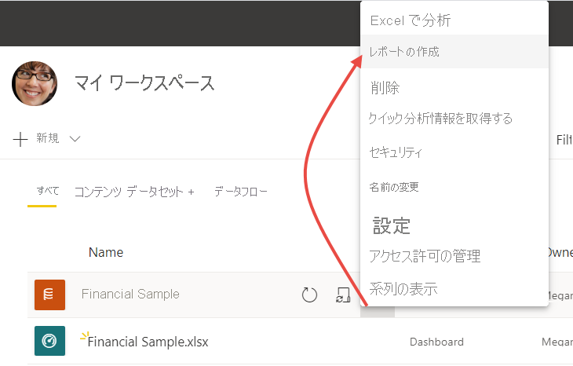
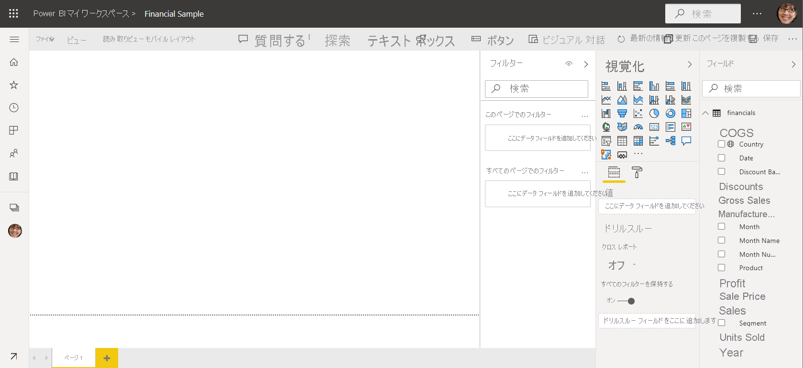
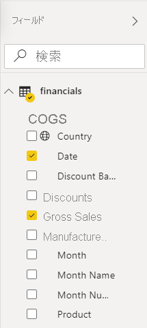
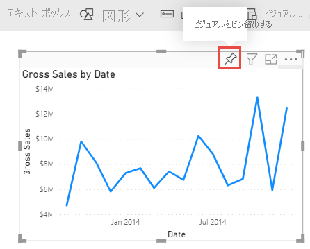
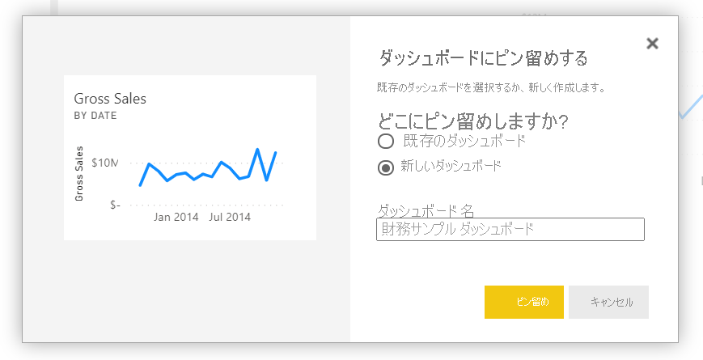
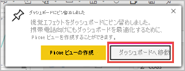
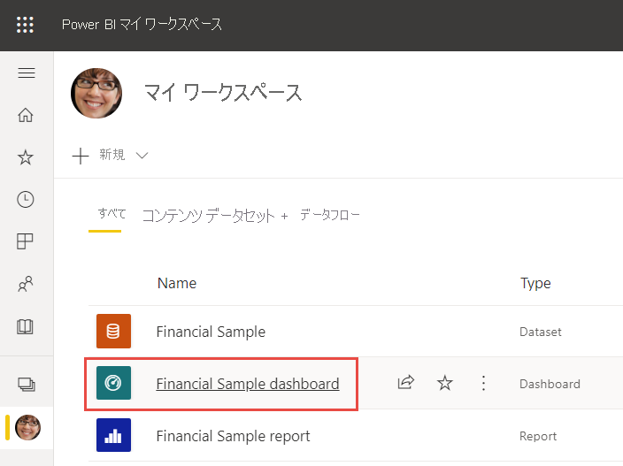
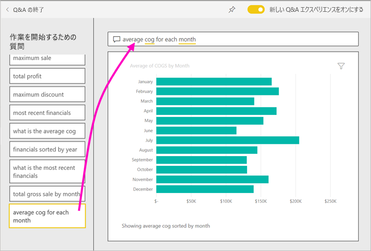
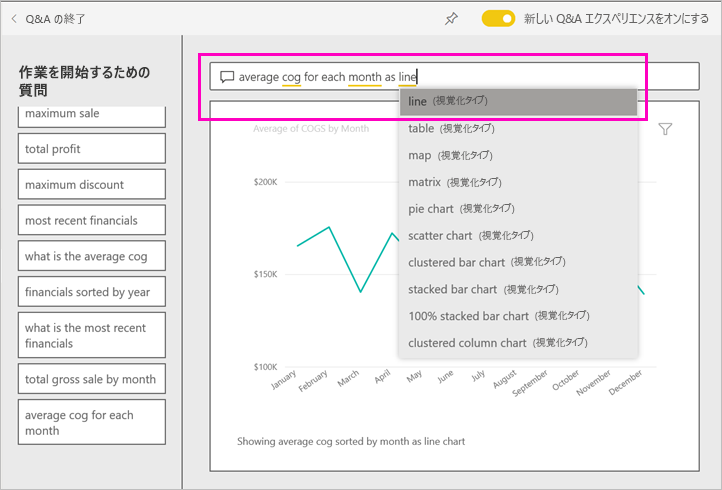
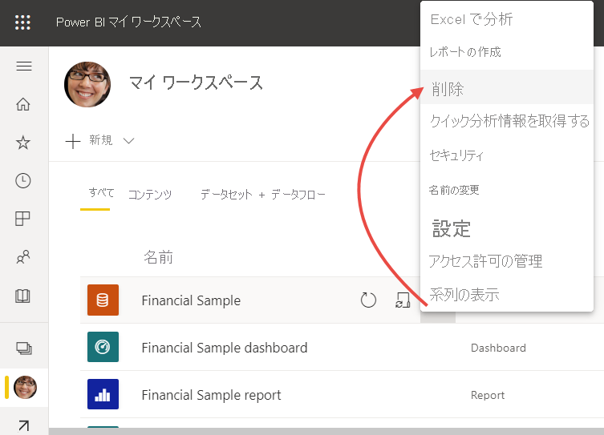

# チュートリアル:Power BI サービスの概要
このチュートリアルでは、*Power BI サービス*の一部の機能について説明します。 ここでは、データに接続し、レポートとダッシュボードを作成して、データに関する質問をします。 Power BI サービスでは、さらに多くのことを行うことができます。このチュートリアルは、単にみなさんの興味をかき立てることを目的としています。 Power BI サービスと他の Power BI 製品の関係を理解するため、「[Power BI とは?](power-bi-overview.md)」を読むことをお勧めします。

このチュートリアルでは、以下の手順を実行します。

> [!div class="checklist"]
> * Power BI オンライン アカウントにサインインするか、まだアカウントをお持ちでない場合はサインアップします。
> * Power BI サービスを開きます。
> * データをいくつか取得し、それをレポート ビューで開きます。
> * そのデータを使用して視覚化を作成し、レポートとして保存します。
> * レポートからタイルをピン留めし、ダッシュボードを作成します。
> * Q&A 自然言語ツールを利用して、他の視覚エフェクトをダッシュボードに追加します。
> * ダッシュボード上のタイルのサイズ変更、再配置、および操作を行います。
> * データセット、レポート、ダッシュボードを削除してリソースをクリーンアップします。

> [!TIP]
> 自分のペースで進められる無料のトレーニング コースを代わりに選択しますか? [EdX の Analyzing and Visualizing Data (データの分析と視覚化) コースに登録](https://aka.ms/edxpbi)してください。

## Power BI サービスにサインアップする
Power BI アカウントがない場合は、始める前に[無料の Power BI Pro 試用版にサインアップ](https://app.powerbi.com/signupredirect?pbi_source=web)してください。

アカウントを作成した後、ブラウザーに「*app.powerbi.com*」と入力して Power BI サービスを開きます。 

## 手順 1:データを取得

Power BI レポートを作成するときには、多くの場合、Power BI Desktop から開始します。 今回は、Power BI サービスでレポートの作成を最初から開始します。

このチュートリアルでは、CSV ファイルからデータを取得します。 どうしたらよいでしょうか? [財務サンプル CSV ファイルのダウンロード](https://go.microsoft.com/fwlink/?LinkID=521962)

1. [Power BI にサインイン](https://www.powerbi.com/)します。 アカウントをお持ちではありませんか。 心配はご無用です。無料の試用版にご登録いただけます。
2. Power BI がブラウザーで開きます。 ナビ ペインの下部にある **[データの取得]** を選択します。

    **[データの取得]** ページが開きます。   

3. **[新しいコンテンツの作成]** セクションで、 **[ファイル]** を選択します。 
   
   
4.  **[ローカル ファイル]** を選択します。
   
    ![[データの取得] > [ファイル] 画面](media/service-get-started/power-bi-service-get-data-local-file.png)

5. コンピューター上のファイルに移動し、 **[開く]** を選びます。

5. このチュートリアルでは、 **[インポート]** を選択し、レポートおよびダッシュボードの作成に使用できるデータセットとして、Excel ファイルを追加します。 **[アップロード]** を選択した場合は、Excel ブック全体が Power BI にアップロードされるので、それを Excel Online で開いて編集できます。
   
   ![[インポート] を選択する](media/service-get-started/power-bi-import.png)
6. データセットの準備ができたら、 **[データセット]** を選択し、データセット**財務サンプル**の横にある **[レポートの作成]** を選択して、レポート エディターを開きます。 

    

    レポート キャンバスは空白です。 右側に **[フィルター]** 、 **[視覚化]** 、 **[フィールド]** の各ウィンドウが表示されています。

    

7. 上部のナビ ペインに **[読み取りビュー]** のオプションがあることに注意してください。 このオプションがあるということは、現在編集ビューになっていることを意味します。 レポート エディターについて詳しく理解するには、[用意されているツアー](../create-reports/service-the-report-editor-take-a-tour.md)をご覧ください。

    ![[読み取りビュー] オプション](media/service-get-started/power-bi-service-reading-view.png)

    編集ビューが表示されるユーザーはレポートの "*所有者*" なのでレポートを編集できます。 つまり、ユーザーは "*作成者*" です。 同僚とレポートを共有している場合、同僚は読み取りビューでレポートを操作することだけができます。同僚は "*コンシューマー*" です。 詳しくは、[読み取りビューと編集ビュー](../consumer/end-user-reading-view.md)に関するトピックをご覧ください。

## 手順 2:レポートにグラフを作成する
データに接続したので、探索を開始します。  何か興味深いものを発見したときは、ダッシュボードを作成し、時間経過によってどのように変化するかを監視できます。 そのしくみを見てみましょう。
    
1. レポート エディターで、ページの右側にある **[フィールド]** ウィンドウで視覚エフェクトの作成を開始します。 **Gross Sales** と **Date** のチェック ボックスをオンにします。
   
   

    Power BI は、データを分析して視覚エフェクトを作成します。 最初に **Date** を選択した場合は、テーブルが表示されます。 最初に **[Gross Sales]\(総売上\)** を選択した場合は、縦棒グラフが表示されます。 

2. 別のデータ表示方法に切り替えます。 このデータを折れ線グラフにしてみます。 **[視覚化]** ウィンドウで折れ線グラフ アイコンを選択します。
   
   

3. 役に立ちそうなので、グラフをダッシュボードに "*ピン留め*" します。 視覚エフェクトをポイントし、ピン留めアイコンを選択します。 この視覚エフェクトをピン留めすると、最新の値がひとめでわかるようにダッシュボードに保存されて最新の様態に維持されます。
   
   

4. これは新しいレポートであるため、視覚エフェクトをダッシュボードにピン留めする前に、レポートを保存するよう要求されます。 レポートに名前を付け (たとえば、"*一定期間内の売上*" など)、 **[保存]** を選択します。 

5. **[新しいダッシュボード]** を選択し、"*チュートリアル用の財務サンプル*" という名前を付けます。 
   
   
   
6. **[Pin]** (ピン留め) を選択します。
   
    右上隅の近くに成功メッセージが表示されたら、視覚エフェクトがダッシュボードにタイルとして追加されたことがわかります。
   
    

7. **[ダッシュボードへ移動]** を選択すると、タイルとしてピン留めした折れ線グラフが表示された新しいダッシュボードが表示されます。 
   
   
   
8. ダッシュボード上の新しいタイルを選択すると、レポートに戻ることができます。 Power BI の表示が閲覧表示のレポートに戻ります。 

1. 編集表示に戻るには、上部のナビ ペインにある**その他のオプション** (...) を選択し、 **[編集]** を選択します。 編集表示に戻ると、タイルの探索とピン留めを続けることができます。

    ![[編集] を選択してレポートを編集する](media/service-get-started/power-bi-service-edit-report.png)

## 手順 3:Q&A で探索する

データのクイック探索については、Q&A の質問ボックスで質問してください。 Q&A により、データに関する自然言語のクエリが作成されます。 Q&A ボックスは、ダッシュボードでは一番上にあります (**データについて質問する**)。 レポートでは、上部のナビ ペインにあります (**質問する**)。

1. ダッシュボードに戻るには、黒い **Power BI** バーで **[マイ ワークスペース]** を選択します。

    

1. **[ダッシュボード]** タブで、ダッシュボードを選択します。

    

1. **[データについて質問する]** を選択します。 Q&A によっていくつかの提案が自動的に提供されます。

    

    > [!NOTE]
    > 提案が表示されない場合は、**新しい Q&A エクスペリエンス**をオンにします。

2. 提案によっては 1 つの値が返されます。 たとえば、 **[maximum sale]\(最大売上\)** を選択します。

    Q&A によって回答が検索され、*カード*視覚エフェクトの形式で表示されます。

    ![[maximum sale]\(最大売上\) カード](media/service-get-started/power-bi-service-qanda-maximum-sale.png)

3. ピン留めアイコン  を選択して、チュートリアル用の財務サンプル ダッシュボードにこの視覚エフェクトを表示します。

1. **[作業を開始するための質問]** リストを下にスクロールして、 **[average cog for each month]\(各月の平均売上原価\)** を選択します。 

    

1. 横棒グラフも、**チュートリアル用の財務サンプル** ダッシュボードにピン留めします。

1. [Q&A] ボックス内の「*by month*」の後にカーソルを置き、「*as line*」と入力します。 **[line (Visualization Type)]\(折れ線 (視覚エフェクトの種類)\)** を選択します。 

    

4. **[Q&A の終了]** を選択してダッシュボードに戻ると、作成した新しいタイルが表示されます。 

   

   グラフを折れ線グラフに変更した場合でも、タイルは横棒グラフのままになっています。これは、ピン留めしたときにそうなっていたためです。 

## 手順 4.タイルの位置変更

ダッシュボードは幅広です。 ダッシュボード領域をより効果的に使用できるように、タイルを再配置できます。

1. *Gross Sales (総売上)* 折れ線グラフ タイルの右下隅を上にドラッグして、売上タイルと同じ高さにスナップしたら、放します。

    

    これで、2 つのタイルの高さが同じになりました。

    

1. *Average of COGS (平均売上原価)* 横棒グラフ タイルを、*Gross Sales (総売上)* 折れ線グラフの下に収まるまでドラッグします。

    よくなりましたね。

    

## 手順 5.タイルを操作する

独自のダッシュボードとレポートを作成する前に、観察する最後の操作があります。 異なるタイルを選択すると、異なる結果が得られます。 

1. まず、レポートからピン留めした *Gross Sales (総売上)* 折れ線グラフ タイルを選択します。 

    Power BI でレポートが閲覧表示で開かれます。 

2. ブラウザーの戻るボタンを選択します。 

1. ここで、Q&A で作成した *Average of COGS (平均売上原価)* 横棒グラフ タイルを選択します。 

    Power BI ではレポートが開かれません。 このグラフは Q&A で作成したため、代わりに Q&A が開かれます。

## リソースをクリーンアップする
チュートリアルはこれで完了です。データセット、レポート、ダッシュボードは削除してかまいません。 

1. ナビ ペインで、 **[マイ ワークスペース]** が選択されていることを確認します。
2. **[データセット]** タブを選択し、このチュートリアルのためにインポートしたデータセットを検索します。  
3. **その他のオプション** (...) を選択し、 **[削除]** を選択します。

    

    データセットを削除すると、"**このデータセットのデータを含むレポートとダッシュボード タイルもすべて削除されます**" という警告が表示されます。

4. **[削除]** を選択します。

## 次の手順

視覚エフェクトのタイルをさらに追加し、[タイルの名前変更やサイズ変更、リンク、位置変更](../create-reports/service-dashboard-edit-tile.md)を行って、ダッシュボードの見栄えをよくします。
