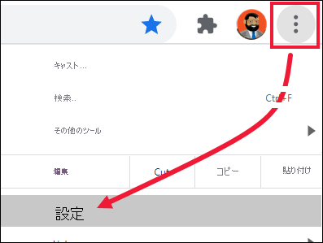
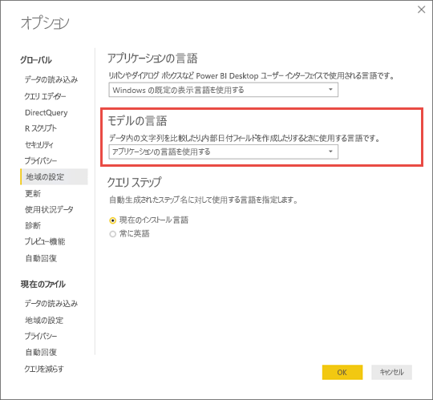

# Power BI でサポートされる言語と国または地域

この記事では、Power BI サービス、Power BI Desktop、Power BI ドキュメントでサポートされている言語と国/地域について扱います。

## Power BI が利用可能な国と地域
Power BI が利用可能な国と地域の一覧については、[ご利用いただける国と地域の一覧](https://products.office.com/business/international-availability)をご覧ください。 

## Power BI サービスの言語
ブラウザーでの Power BI サービスは、次の 44 の言語で提供されています。

* アラビア語
* バスク語 - Basque
* ブルガリア語 - Български
* カタルニア語 - català
* 簡体中国語 - 中文 (简体)
* 繁体中国語 - 中文 (繁體)
* クロアチア語 - hrvatski
* チェコ語 - čeština
* デンマーク語 - dansk
* オランダ語 - Nederlands
* 英語 - English
* エストニア語 - eesti
* フィンランド語 - suomi
* フランス語 - français
* ガリシア語 - galego
* ドイツ語 - Deutsch
* ギリシャ語 - Ελληνικά
* ヘブライ語
* ヒンディー語 - हिंदी
* ハンガリー語 - magyar
* インドネシア語 - Bahasa Indonesia
* イタリア語 - italiano
* 日本語 - 日本語
* カザフ語 - Қазақ
* 韓国語 - 한국어
* ラトビア語 - latviešu
* リトアニア語 - lietuvių
* マレー語 - Bahasa Melayu
* ノルウェー語ブークモール - norsk (bokmål)
* ポーランド語 - Polski
* ポルトガル語 (ブラジル) - Português
* ポルトガル語 (ポルトガル) - português
* ルーマニア語 - română
* ロシア語 - Русский
* セルビア語 (キリル) - српски
* セルビア語 (ラテン) - srpski
* スロバキア語 - slovenčina
* スロベニア語 - slovenski
* スペイン語 - español
* スウェーデン語 - svenska
* タイ語 - ไทย
* トルコ語 - Türkçe
* ウクライナ語 - українська
* ベトナム語 - Tiếng Việt

## Power BI Desktop の言語
Power BI Desktop は、ヘブライ語とアラビア語を除き、Power BI サービスと同じ言語で使用できます。 Desktop では、右から左に記述する言語はサポートされていません。

### 翻訳対象
Power BI では、メニュー、ボタン、メッセージ、その他の UI 要素がユーザーの言語に翻訳されます。 たとえば、Power BI は、自動的に生成されたタイトル、フィルター、ツールヒントなどのレポート コンテンツを翻訳します。 ただし、データは自動的には翻訳されません。 ヘブライ語など、右から左へ記述する言語を使用している場合、レポート内では、ビジュアルのレイアウトが変更されません。

現時点では、一部の機能は英語でのみ使用可能です。

* Microsoft Dynamics CRM、Google アナリティクス、Salesforce などのサービスに接続するとき、Power BI によって作成されるダッシュボードとレポート。 独自のダッシュボードとレポートは、ユーザーが自分の言語で作成できます。
* Q&A を使用したデータ探索。

追加の機能も他の言語に順次翻訳されています。時折ご確認ください。 

### Power BI サービスでの言語の選択
1. Power BI サービスで、 **[設定]** アイコン ![[設定] アイコンが表示された Power BI サービスのスクリーンショット。](media/supported-languages-countries-regions/pbi_settings_icon.png) >  **[設定]** の順に選択します。
2. **[全般]** タブで、 **[言語]** を選択します。
3. ブラウザーに対して既に設定されている言語を使用するか、Power BI サービス用に別の言語を選択します。  

### ブラウザーでの言語の選択
Power BI では、コンピューターの言語設定を基に言語を検出します。 これらの設定へのアクセス、および変更方法は、オペレーティング システムやブラウザーによって異なる場合があります。 次に、Microsoft Edge および Google Chrome から設定にアクセスする方法を示します。

#### Microsoft Edge
1. ブラウザー ウィンドウの右上隅にある **[設定など]** の省略記号 ([...]) を選択し、 **[設定]** を選択します。    
    ![[設定など] アイコンが表示されている Edge のスクリーンショット。](media/supported-languages-countries-regions/power-bi-setting-icon.png)

1. ブラウザー ウィンドウの左上隅にある **[設定]** アイコンを選択し、 **[言語]** を選択します。
   
   ![[設定] ボタンが表示されている Edge のスクリーンショット。](media/supported-languages-countries-regions/power-bi-languages.png)

1. 優先する言語を選択します。

#### Google Chrome (バージョン 87)
1. ブラウザー ウィンドウの右上隅にあるメニュー ボタンを選択し、 **[設定]** を選択します。
   
   
 
3. **[詳細設定]** を展開し、 **[言語]** を選択します。

    

4. 新しい言語を追加するには、 **[言語を追加]** を選択します。
   
   変更内容を表示するには、ブラウザーを閉じて再度開かなければならない場合があります。

## Power BI Desktop の言語またはロケールを選択する
Power BI Desktop を入手するには2 つがあります。スタンドアロン インストーラーとしてダウンロードする方法と、Windows ストアからインストールする方法です。 

* Windows ストアから Power BI Desktop をインストールすると、すべての言語 (現在 42 言語) がインストールされ、Windows の既定の言語に対応する言語が既定で表示されます。
* Power BI Desktop をスタンドアロン インストーラーとしてダウンロードする場合は、インストーラーを実行するときに既定の言語を選択します。 これは後で変更できます。
* 特定のレポートの[データをインポートするときに使うロケールを選択する](#choose-the-locale-for-importing-data-into-power-bi-desktop)こともできます。

> [!NOTE]
> Power BI Report Server 用に最適化されたバージョンの Power BI Desktop をインストールする場合は、ダウンロード時に言語を選択します。 詳細については、「[Install Power BI Desktop optimized for Power BI Report Server](../report-server/install-powerbi-desktop.md)」 (Power BI レポート サーバー向けに最適化された Power BI Desktop のインストール) を参照してください。

### Power BI Desktop の言語を選択する 
1. Power BI Desktop を [Windows ストアから](https://aka.ms/pbidesktopstore)インストールするか、[スタンドアロン インストーラー](https://aka.ms/pbiSingleInstaller)としてインストールします。
2. 言語を変更するには、Desktop を開き、左上隅から **[ファイル]**  >  **[オプションと設定]**  >  **[オプション]** の順に選択します。    

   ![[オプション] ボタンが表示されている Power BI Desktop のスクリーンショット。](media/supported-languages-countries-regions/power-bi-desktop-options.png)    

1. **[地域の設定]** を選択して、優先する言語を設定または変更します。

Power BI Desktop の言語サポートは、[アプリケーション言語] ドロップダウンに表示される言語に限定されます。

### Power BI Desktop の既定の数値と日付の書式設定を確認する

Power BI Desktop は、Windows の地域設定から既定の数値と日付の書式設定を取得します。 必要に応じて、これらの設定を確認または変更できます。

1. Windows メニューの **[設定]** を選択します

2. **[Windows の設定]** で、 **[時刻と言語]** を選択します。
   
     ![[Windows の設定] ダイアログ ボックスを表示している Power BI Desktop のスクリーンショット。](media/supported-languages-countries-regions/power-bi-service-windows-settings.png)

3. **[地域]**  >  **[日付、時刻、地域の追加設定]** を選択します。 このオプションが表示されない場合は、 **[Change data formats]\(データ形式の変更\)** を選択し、 **[関連設定]** を選択します。

    :::image type="content" source="media/supported-languages-countries-regions/power-bi-service-region-settings.png" alt-text="[日付、時刻、地域の追加設定]":::

4. **[時計と地域]** で、 **[日付、時刻、または数値の形式の変更]** を選択します。

    :::image type="content" source="media/supported-languages-countries-regions/power-bi-service-check-region-settings.png" alt-text="時計と地域の設定":::

5. **[Windows の表示言語と一致させます]** が選択されていることを確認します。または必要に応じて変更します。

    :::image type="content" source="media/supported-languages-countries-regions/power-bi-service-match-windows.png" alt-text="[Windows の表示言語と一致させます]":::

### Power BI Desktop にデータをインポートするためのロケールを選択する
Power BI Desktop をダウンロードした場合でも Windows ストアからインストールした場合でも、特定のレポートのロケールとして、Power BI Desktop のバージョンのロケールとは異なるものを選ぶことができます。 ロケールによって、データ ソースからデータがインポートされるときに、Power BI によってデータが解釈される方法が変わります。 たとえば、"3/4/2017" は、4 月 3 日または 3 月 4 日のどちらに解釈されるでしょうか。

1. Power BI Desktop で、 **[ファイル]**  >  **[オプションと設定]**  >  **[オプション]** の順に移動します。
2. **[現在のファイル]** の下にある **[地域の設定]** を選択します。
3. **[インポート用のロケール]** ボックスで、別のロケールを選びます。 
   
   ![[オプション] ダイアログ ボックスを表示している Power BI Desktop のスクリーンショット。](media/supported-languages-countries-regions/power-bi_supptdlangs-locale.png)
4. **[OK]** を選択します。

### Power BI Desktop のモデルの言語を選択する

Power BI Desktop アプリケーション用の言語を設定するだけでなく、モデルの言語を設定することもできます。 モデルの言語は、主に 2 つの部分に影響します。

- 文字列の比較や並べ替えの方法。 たとえば、トルコ語には文字 i が 2 種類あるので、データベースの照合順序によっては、並べ替えたときに異なる順序になる場合があります。 
- 日付フィールドから非表示の日付テーブルを作成するときに Power BI Desktop が使う言語。 たとえば、フィールドは Month/Monat/Mois などという名前になります。

> [!NOTE]
> Power BI モデルでは、現在、大文字と小文字を区別しない (またはひらがなとカタカナを区別しない) ロケールが使用されているため、"ABC" と "abc" は同等に扱われます。 "ABC" が最初にデータベースに読み込まれた場合、"Abc" のように大文字と小文字だけが異なる他の文字列は、別の値として読み込まれません。
> 
>

モデルの言語を設定する方法を次に示します。

1. Power BI Desktop で、 **[ファイル]**  >  **[オプションと設定]**  >  **[オプション]** の順に移動します。
2. **[グローバル]** で **[地域の設定]** を選びます。
3. **[モデルの言語]** ボックスで、別の言語を選びます。 

    

> [!NOTE]
> Power BI モデルの作成後に言語を変更することはできません。
> 
>

## ヘルプ ドキュメントの言語
ヘルプは、次の 10 の言語にローカライズされています。 

* 簡体中国語 - 中文 (简体)
* 繁体中国語 - 中文 (繁體)
* フランス語 - français
* ドイツ語 - Deutsch
* イタリア語 - italiano
* 日本語 - 日本語
* 韓国語 - 한국어
* ポルトガル語 (ブラジル) - Português
* ロシア語 - Русский
* スペイン語 - español

## 次の手順
* Power BI モバイル アプリを使っている場合、 詳しくは「[Power BI モバイル アプリでサポートされる言語](../consumer/mobile/mobile-apps-supported-languages.md)」をご覧ください。
* わからないことがある場合は、 [Power BI コミュニティ](https://community.powerbi.com/)で質問してみてください。
* それでも解決しない場合は、 [Power BI のサポート ページ](https://powerbi.microsoft.com/support/)をご覧ください。
