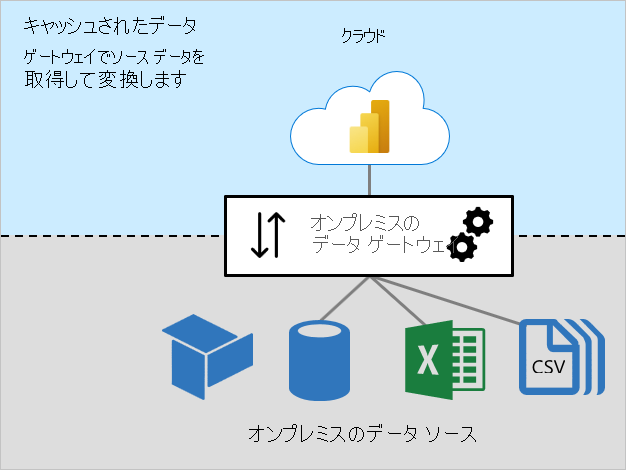
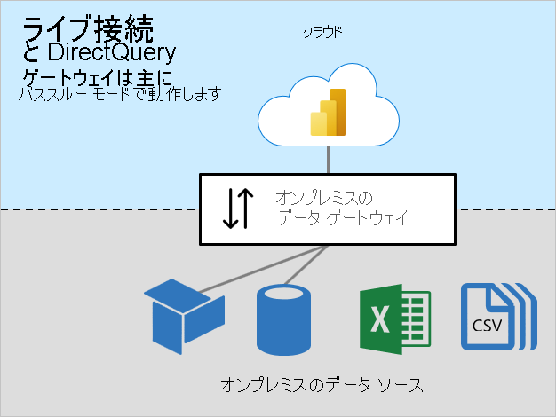

# オンプレミス データ ゲートウェイのサイズ設定

この記事は、[オンプレミス データ ゲートウェイ](../connect-data/service-gateway-onprem.md)をインストールおよび管理する必要がある Power BI 管理者を対象としています。

インターネット経由で直接アクセスできないデータに Power BI がアクセスする必要がある場合は常に、ゲートウェイが必要です。 オンプレミスのサーバー、または VM でホストされるサービスとしてのインフラストラクチャ (IaaS) にインストールできます。

## ゲートウェイのワークロード

オンプレミス データ ゲートウェイは、2 つのワークロードをサポートします。 ゲートウェイのサイズ設定と推奨事項について説明する前に、まずこれらのワークロードについて理解しておくことが重要です。

### キャッシュ データ ワークロード

"_キャッシュ データ_" ワークロードでは、Power BI データ セットに読み込むソース データが取得および変換されます。 これは、次の 3 つの手順で行います。

1. **接続**:ゲートウェイがソース データに接続します
1. **データの取得と変換**:データが取得され、必要に応じて変換されます。 可能な場合は常に、Power Query マッシュアップ エンジンからデータ ソースに変換ステップがプッシュされます。これは " _[クエリ フォールディング](power-query-folding.md)_ " と呼ばれます。 可能でない場合は、ゲートウェイで変換を処理する必要があります。 この場合、ゲートウェイの CPU とメモリ リソースの消費量が多くなります。
1. **転送**:データが Power BI サービスに転送されます。特に大規模なデータ ボリュームでは、信頼性が高く、高速なインターネット接続が重要です。

### ライブ接続および DirectQuery ワークロード

"_ライブ接続および DirectQuery_" ワークロードは、主にパススルー モードで動作します。 Power BI サービスからクエリが送信され、ゲートウェイからクエリの結果が返されます。 一般に、クエリ結果のサイズは軽量です。

- ライブ接続の詳細については、「[Power BI サービスのデータセット (外部でホストされるモデル)](../connect-data/service-datasets-understand.md#external-hosted-models)」を参照してください。
- DirectQuery の詳細については、「[Power BI サービスのデータセット (DirectQuery モード)](../connect-data/service-dataset-modes-understand.md#directquery-mode)」を参照してください。

このワークロードには、クエリとクエリ結果をルーティングするために CPU リソースが必要です。 通常、キャッシュ データ ワークロードに必要な CPU よりも、CPU の必要量ははるかに少なくなります。キャッシュのためにデータを変換する必要がある場合は特にそうです。

応答性の高いエクスペリエンスをレポート ユーザーに提供するには、信頼性が高く、高速で、一貫性のある接続が重要です。

## サイズ設定に関する考慮事項

ゲートウェイ マシンの適切なサイズ設定の判断は、次の可変要素によって変わる可能性があります。

- キャッシュ データのワークロードの場合:
  - 同時実行データセットの更新回数
  - データ ソースの種類 (リレーショナル データベース、分析データベース、データ フィード、またはファイル)
  - データ ソースから取得されるデータの量
  - Power Query マッシュアップ エンジンによって処理する必要がある変換
  - Power BI サービスに転送されるデータの量
- ライブ接続および DirectQuery ワークロードの場合:
  - 同時実行レポート ユーザーの数
  - レポート ページ上のビジュアルの数 (各ビジュアルから少なくとも 1 つのクエリが送信されます)
  - Power BI ダッシュボードのクエリ キャッシュの更新頻度
  - [[ページの自動更新]](../create-reports/desktop-automatic-page-refresh.md) 機能を使用するリアルタイム レポートの数
  - データセットで[行レベルのセキュリティ (RLS)](../create-reports/desktop-rls.md) が適用されるかどうか

一般に、ライブ接続および DirectQuery ワークロードには十分な CPU が必要ですが、キャッシュ データ ワークロードにはさらに多くの CPU とメモリが必要です。 どちらのワークロードも、Power BI サービスとの良好な接続とデータ ソースに左右されます。

> [!NOTE]
> Power BI の容量によって、モデル更新並列処理と、ライブ接続および DirectQuery のスループットに制限が課せられます。 ゲートウェイのサイズを Power BI サービスがサポートする値よりも高く設定しても意味がありません。 Premium SKU (および同等のサイズの SKU) の場合の制限は異なります。 詳細については、「[Power BI Premium とは (容量ノード)](../admin/service-premium-what-is.md#capacity-nodes)」を参照してください。

## 推奨事項

ゲートウェイのサイズ設定の推奨事項は、多くの可変要素によって変わります。 このセクションでは、考慮する必要がある一般的な推奨事項について説明します。

### 初期サイズ設定

適切なサイズを正確に見積もることが困難な場合があります。 少なくとも 8 個の CPU コア、8 GB の RAM、複数のギガビット ネットワーク アダプターを搭載したコンピューターから始めることをお勧めします。 次に、CPU とメモリのシステム カウンターをログに記録して、通常のゲートウェイのワークロードを測定することができます。 詳細については、「[オンプレミスデータゲートウェイのパフォーマンスの監視と最適化](/data-integration/gateway/service-gateway-performance)」を参照してください。

### 接続

Power BI サービスとゲートウェイ間と、ゲートウェイとデータ ソース間に可能な限り最適な接続を計画します。

- 信頼性、高速、短く一貫した待機時間を目指します
- ゲートウェイとデータ ソース間のマシンのホップをなくすか減らします
- ファイアウォール プロキシ レイヤーによって課される帯域幅調整をなくします。 Power BI エンドポイントの詳細については、「[Power BI URL を許可リストに追加する](../admin/power-bi-whitelist-urls.md)」をご覧ください。
- [Azure ExpressRoute](/azure/expressroute/expressroute-introduction) を構成して、Power BI に対して非公開の管理された接続を確立します
- Azure VM のデータ ソースの場合、必ず VM を [Power BI サービスと同じ場所に配置します](../admin/service-admin-where-is-my-tenant-located.md)
- 動的 RLS を含む SQL Server Analysis Services (SSAS) へのライブ接続ワークロードの場合、ゲートウェイ マシンとオンプレミスの Active Directory 間に良好な接続を確保します

### クラスタリング

大規模な展開では、クラスター インストールのゲートウェイを作成できます。 複数のクラスターによって単一障害点を回避し、ゲートウェイ全体でトラフィックを負荷分散することができます。 次の操作を実行できます。

- クラスターに 1 つ以上のゲートウェイをインストールする
- スタンドアロン ゲートウェイ、またはゲートウェイ サーバーのクラスターにワークロードを分離する

詳細については、「[オンプレミス データ ゲートウェイの高可用性クラスターと負荷分散の管理](/data-integration/gateway/service-gateway-high-availability-clusters)」を参照してください。

### データセットの設計と設定

データセットの設計とその設定は、ゲートウェイのワークロードに影響する可能性があります。 ゲートウェイのワークロードを減らすには、次の操作を検討します。

インポート データセットの場合:

- データの更新頻度を低くします
- 転送するデータの量を最小限に抑えるように[増分更新](../admin/service-premium-incremental-refresh.md)を構成します
- 可能な場合は常に[クエリ フォールディング](power-query-folding.md)を実行します
- 特に、大量のデータの場合や待機時間を短くする必要がある場合は、設計を DirectQuery または[複合](../connect-data/service-dataset-modes-understand.md#composite-mode)モデルに変換します

DirectQuery データセットの場合:

- データソース、モデル、レポートのデザインを最適化します。詳細については、「[Power BI Desktop の DirectQuery モデルのガイダンス](directquery-model-guidance.md)」を参照してください
- [集計](../transform-model/desktop-aggregations.md)を作成して高レベルの結果をキャッシュし、DirectQuery 要求の数を減らします
- レポートのデザインと容量設定で、[ページの自動更新](../create-reports/desktop-automatic-page-refresh.md)間隔を制限します
- 特に動的 RLS が適用される場合、ダッシュボードのキャッシュの更新頻度を制限します
- 特にデータ ボリュームが少ない場合、または非揮発性データの場合は、設計をインポートまたは[複合](../connect-data/service-dataset-modes-understand.md#composite-mode)モデルに変換します

ライブ接続データセットの場合:

- 特に動的 RLS が適用される場合、ダッシュボードのキャッシュの更新頻度を制限します

## 次の手順

この記事に関する詳細については、次のリソースを参照してください。

- [Power BI 用のデータ ゲートウェイのデプロイに関するガイダンス](../connect-data/service-gateway-deployment-guidance.md)
- [オンプレミス データ ゲートウェイのプロキシ設定を構成する](/data-integration/gateway/service-gateway-proxy)
- [オンプレミス データ ゲートウェイのパフォーマンスの監視と最適化](/data-integration/gateway/service-gateway-performance)
- [ゲートウェイのトラブルシューティング - Power BI](../connect-data/service-gateway-onprem-tshoot.md)
- [オンプレミス データ ゲートウェイのトラブルシューティング](/data-integration/gateway/service-gateway-tshoot)
- [クエリ フォールディングの重要性](power-query-folding.md)
- わからないことがある場合は、 [Power BI コミュニティで質問してみてください](https://community.powerbi.com/)。
- Power BI チームへのご提案は、 [Power BI を改善するためのアイデアをお寄せください](https://ideas.powerbi.com)
