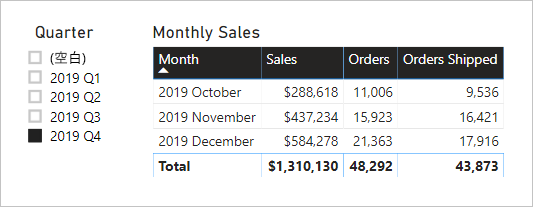

# <a name="active-vs-inactive-relationship-guidance"></a>アクティブなリレーションシップと非アクティブなリレーションシップのガイダンス

この記事は、Power BI Desktop を操作するデータ モデラーを対象としています。 アクティブまたは非アクティブなモデル リレーションシップを作成する条件についてのガイダンスを提供します。 既定では、アクティブなリレーションシップによってフィルターが他のテーブルに伝達されます。 しかし、非アクティブなリレーションシップでは、DAX 式によってリレーションシップがアクティブ化 (使用) された場合にのみフィルターが伝達されます。

[!INCLUDE [relationships-prerequisite-reading](includes/relationships-prerequisite-reading.md)]

## <a name="active-relationships"></a>アクティブなリレーションシップ

一般に、可能なときは常にアクティブなリレーションシップを定義することをお勧めします。 これによって、レポート作成者や Q&A を操作するユーザーによるモデルの使用方法の幅と可能性が広がります。

航空便の定時運航 (OTP) を分析するために設計されたインポート モデルの例を考えてみましょう。 このモデルには **Flight** テーブルがあります。これは、フライトごとに 1 行が格納されるファクトの種類のテーブルです。 各行には、フライトの日付、フライト番号、発着空港、遅延時間 (分単位) が記録されます。 また、**Airport** テーブルもあります。これは、空港ごとに 1 行が格納されるディメンションの種類のテーブルです。 各行には、空港コード、空港名、国が記録されています。

2 つのテーブルのモデル図の一部を次に示します。


**Flight** テーブルと **Airport** テーブルの間には、2 つのモデル リレーションシップがあります。 **Flight** テーブルでは、**DepartureAirport** 列と **ArrivalAirport** 列が **Airport** テーブルの **Airport** 列に関連付けられています。 スター スキーマ設計では、**Airport** テーブルは[多様ディメンション](star-schema.md#role-playing-dimensions)として説明されます。 このモデルの場合、2 つのロールは "_出発空港_" と "_到着空港_" です。

この設計は、リレーショナル スター スキーマ設計では適切に機能しますが、Power BI モデルには適していません。 モデル リレーションシップはフィルター伝達のパスであり、これらのパスは決定論的である必要があるためです。 このため、2 つのテーブル間に複数のアクティブなリレーションシップがあるモデルは使用できません。 したがって、この例で説明しているように、一方のリレーションシップはアクティブであり、(破線で表される) もう一方のリレーションシップは非アクティブです。 具体的には、**ArrivalAirport** 列へのリレーションシップがアクティブです。 つまり、**Airport** テーブルに適用されたフィルターは、自動的に **Flight** テーブルの **ArrivalAirport** 列に伝達されます。

このモデル設計では、データのレポート方法に厳しい制限が課せられます。 具体的には、**Airport** テーブルにフィルターを適用して、自動的に出発空港のフライトの詳細を分離することができません。 レポート要件には、出発空港と到着空港によって "_同時に_" フィルター処理 (またはグループ化) を行うことが含まれているため、2 つのアクティブなリレーションシップが必要になります。 この要件を Power BI モデル設計に変換するということは、モデルに 2 つの空港テーブルが必要になるということを意味します。

改善されたモデル設計を次に示します。


モデルには、2 つの空港テーブルが含まれるようになりました。**Departure Airport** と **Arrival Airport** です。 これらのテーブルと **Flight** テーブル間のモデル リレーションシップはアクティブです。 また、**Departure Airport** テーブルと **Arrival Airport** テーブルの列名には、先頭に _Departure_ または _Arrival_ という単語が付けられていることがわかります。

改善されたモデル設計では、次のようなレポート デザインの生成がサポートされます。


このレポート ページは、出発空港 Melbourne によってフィルター処理され、テーブル ビジュアルは到着空港によってグループ化されています。

> [!NOTE]
> インポート モデルの場合、追加のテーブルによってモデル サイズが増加し、更新時間が長くなります。 そのため、これは「[インポート モデリングのデータ削減手法](import-modeling-data-reduction.md)」の記事で説明されている推奨事項と矛盾しています。 ただし、この例では、アクティブなリレーションシップのみを使用する必要があるという要件がこれらの推奨事項に優先します。
>
> さらに、ディメンションの種類のテーブルに含まれる行数は、ファクトの種類のテーブルの行数に比べて少なくなるのが一般的です。 そのため、モデル サイズと更新時間の増大が極端に大きくなる可能性は低くなります。

### <a name="refactoring-methodology"></a>リファクタリング方法

単一の多様ディメンションの種類のテーブルから、"_ロールごとに 1 つのテーブル_" を使用する設計にモデルをリファクタリングする方法を、次に示します。

1. 非アクティブなリレーションシップをすべて削除します。
2. 多様ディメンションの種類のテーブルを、そのロールをより詳しく説明するような名前に変更することを検討します。 この例では、**Airport** テーブルは **Flight** テーブルの **ArrivalAirport** 列に関連付けられているので、**Arrival Airport** と名前が変更されています。
3. 多様テーブルのコピーを作成し、そのロールを反映する名前を指定します。 これがインポート テーブルである場合は、計算テーブルを定義することをお勧めします。 これが DirectQuery テーブルである場合は、Power Query クエリを複製できます。

    この例では、**Departure Airport** テーブルは次の計算テーブルの定義を使用して作成されました。

    ```dax
    Departure Airport = 'Arrival Airport'
    ```

4. 新しいテーブルを関連付けるアクティブなリレーションシップを作成します。
5. テーブル内の列の名前を、各自のロールを正確に反映するように変更することを検討します。 この例では、すべての列の先頭に _Departure_ または _Arrival_ という単語が付けられています。 このような名前により、既定では、レポートのビジュアルに自己言及的であいまいでないラベルが付けられることが保証されます。 また、Q&A のエクスペリエンスも向上し、ユーザーが簡単に質問を記述できるようになります。
6. 多様テーブルに説明を追加することを検討します。 ( **[フィールド]** ペインでは、レポート作成者がテーブルの上にカーソルを置くと、ツールヒントに説明が表示されます。)このようにして、さらなるフィルター伝達の詳細をレポート作成者に伝えることができます。

## <a name="inactive-relationships"></a>非アクティブなリレーションシップ

特定の状況では、非アクティブなリレーションシップを使って特別なレポートのニーズに対応することができます。

次は、異なるモデルとレポートの要件を考えてみましょう。

- 売上のモデルに、次の 2 つの日付列を含む **Sales** テーブルが含まれています:**OrderDate** および **ShipDate**
- **Sales** テーブルの各行には、1 つの注文が記録されます
- **OrderDate** 列にはほとんど常に日付フィルターが適用されます。この列には必ず有効な日付が格納されます
- 日付フィルターを **ShipDate** 列に伝達する必要があるメジャーは 1 つだけです。この列には空白を含めることができます (注文が出荷されるまで)
- 注文と出荷の日付の期間で "_同時に_" フィルター処理 (またはグループ化) を行う要件はありません

2 つのテーブルのモデル図の一部を次に示します。


**Sales** テーブルと **Date** テーブルの間には、2 つのモデル リレーションシップがあります。 **Sales** テーブルでは、**OrderDate** 列と **ShipDate** 列が **Date** テーブルの **Date** 列に関連付けられています。 このモデルの場合、**Date** テーブルの 2 つのロールは "_注文日_" と "_出荷日_" です。 **OrderDate** 列へのリレーションシップがアクティブです。

6 つのメジャー (1 つを除く) はすべて、**OrderDate** 列でフィルター処理する必要があります。 ただし、**Orders Shipped** メジャーは、**ShipDate** 列でフィルター処理する必要があります。

**Orders** メジャーの定義を次に示します。 これは、フィルター コンテキスト内の **Sales** テーブルの行数を単純にカウントするだけです。 **Date** テーブルに適用されるすべてのフィルターは、**OrderDate** 列に伝達されます。

```dax
Orders = COUNTROWS(Sales)
```

**Orders Shipped** メジャーの定義を次に示します。 [USERELATIONSHIP](/dax/userelationship-function-dax) DAX 関数が使用されています。これにより、式の評価中にのみ特定のリレーションシップに対してフィルターの伝達がアクティブになります。 この例では、**ShipDate** 列へのリレーションシップが使用されています。

```dax
Orders Shipped =
CALCULATE(
    COUNTROWS(Sales)
    ,USERELATIONSHIP('Date'[Date], Sales[ShipDate])
)
```

このモデル設計では、次のようなレポート デザインの生成がサポートされます。



このレポート ページは、2019 Q4 の四半期でフィルター処理されています。 テーブル ビジュアルは月別にグループ化され、さまざまな売上の統計情報が表示されています。 **Orders** メジャーと **Orders Shipped** メジャーでは、異なる結果が生成されます。 これらでは、それぞれ同じ要約ロジック (**Sales** テーブルの行数をカウントする) が使用されていますが、**Date** テーブルのフィルターの伝達が異なります。

四半期のスライサーには、空白の項目が含まれていることがわかります。 このスライサー項目は、[テーブルの展開](../desktop-relationships-understand.md#strong-relationships)の結果として表示されています。 **Sales** テーブルの各行には注文日が含まれていますが、一部の行は出荷日が空白になっています。これらの注文はまだ出荷されていません。 テーブルの展開においても、非アクティブなリレーションシップが考慮されます。そのため、リレーションシップの "多" 側の空白が原因で、またはデータの整合性の問題によって、空白が表示されることがあります。

## <a name="recommendations"></a>推奨事項

まとめると、可能なときは常にアクティブなリレーションシップを定義することをお勧めします。 これによって、レポート作成者や Q&A を操作するユーザーによるモデルの使用方法の幅と可能性が広がります。 これは、モデル内で多様ディメンションの種類のテーブルを複製する必要があることを意味します。

ただし、特定の状況では、多様ディメンションの種類のテーブルに対して 1 つ以上の非アクティブなリレーションシップを定義できます。 この設計を検討できるのは、次の場合です。

- レポートのビジュアルにおいて、異なるロールで同時にフィルター処理を行う必要がない
- USERELATIONSHIP DAX 関数を使用して、関連するモデルの計算のために特定のリレーションシップをアクティブにする

## <a name="next-steps"></a>次の手順

この記事に関する詳細については、次のリソースを参照してください。

- [Power BI Desktop でのモデル リレーションシップ](../desktop-relationships-understand.md)
- [Power BI のスター スキーマおよび重要性について](star-schema.md)
- [リレーションシップのトラブルシューティング ガイダンス](relationships-troubleshoot.md)
- わからないことがある場合は、 [Power BI コミュニティで質問してみてください](https://community.powerbi.com/)。
- Power BI チームへのご提案は、 [Power BI を改善するためのアイデアをお寄せください](https://ideas.powerbi.com/)
