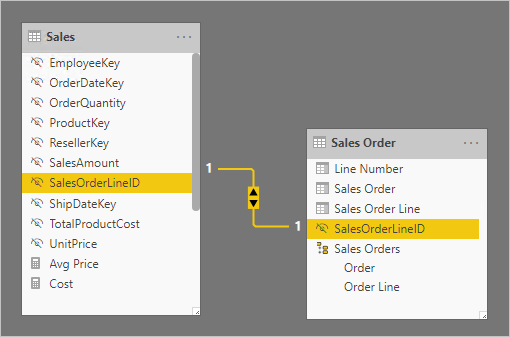

# 一対一のリレーションシップのガイダンス

この記事は、Power BI Desktop を操作するデータ モデラーを対象としています。 一対一のモデル リレーションシップを使用するためのガイダンスを提供します。 両方のテーブルそれぞれに共通の一意の値の列が含まれている場合は、一対一のリレーションシップを作成できます。

[!INCLUDE [relationships-prerequisite-reading](includes/relationships-prerequisite-reading.md)]

一対一のリレーションシップを使用する、2 つのシナリオがあります。

- [逆ディメンション](#degenerate-dimensions):ファクトの種類のテーブルから[逆ディメンション](star-schema.md#degenerate-dimensions)を派生させることができます。
- [行データが複数のテーブルにまたがる](#row-data-spans-across-tables):1 つのビジネス エンティティまたはサブジェクトが、2 つ (またはそれ以上) のモデル テーブルとして読み込まれる場合です。理由としては、そのデータのソースが異なるデータ ストアである場合などが考えられます。 このシナリオは、ディメンションの種類のテーブルに対してよく発生します。 たとえば、マスター製品の詳細が運用販売システムに格納され、補助製品の詳細が別のソースに格納される場合です。

    ただし、通常は、2 つのファクトの種類のテーブルを一対一のリレーションシップで関連付けることはありません。 これは、両方のファクトの種類のテーブルが同じディメンションと粒度を持つ必要があるためです。 また、それぞれのファクトの種類のテーブルに、モデル リレーションシップの作成を可能にするための一意の列が必要になります。

## 逆ディメンション

ファクトの種類のテーブルの列をフィルター処理またはグループ化に使用する場合は、それらを個別のテーブルとして使用できるようにすることを検討できます。 こうすることで、フィルター処理またはグループ化に使用する列を、ファクト行の要約に使用する列から分離させることができます。 この分離により次のことが可能になります。

- 記憶域スペースの削減
- モデルの計算の簡略化
- クエリ パフォーマンスの向上に寄与する
- より直感的な **[フィールド]** ペインのエクスペリエンスをレポート作成者に提供する

販売注文の詳細を 2 つの列に格納する、ソース売上テーブルについて考えてみましょう。

**OrderNumber** 列には注文番号が格納され、**OrderLineNumber** 列にはその注文内の一連の明細行が格納されます。

次のモデル図では、注文番号の列と注文明細行番号の列が **Sales** テーブルに読み込まれていないことがわかります。 代わりに、これらの値を使用して、**SalesOrderLineID** という名前の[代理キー](star-schema.md#surrogate-keys)列を作成しました。 (このキーの値は、注文番号を 1000 で乗算した後、注文明細行番号を加算することによって計算されます。)

**Sales Order** テーブルは、次の 3 つの列を使用してレポート作成者に充実したエクスペリエンスを提供します:**Sales Order**、**Sales Order Line**、**Line Number**。 また、階層も含まれています。 これらのテーブル リソースでは、注文と注文明細行のフィルター処理、グループ化、またはドリルダウンを行う必要があるレポート デザインがサポートされます。

**Sales Order** テーブルは売上データから派生しているため、各テーブルの行数は正確に同じである必要があります。 さらに、各 **SalesOrderLineID** 列の間に一致する値が存在している必要があります。

## 行データが複数のテーブルにまたがる

一対一で関連付けられた、次の 2 つのディメンションの種類のテーブルを使用する例を考えてみましょう:**Product**、**Product Category**。 各テーブルはインポートされたデータを表し、一意の値を含む **SKU** (在庫管理単位) 列を持ちます。

2 つのテーブルのモデル図の一部を次に示します。

最初のテーブルには **Product** という名前が付けられ、次の 3 つの列が含まれています:**Color**、**Product**、**SKU**。 2 番目のテーブルには **Product Category** という名前が付けられ、次の 2 つの列が含まれています:**Category**、**SKU**。 一対一のリレーションシップによって 2 つの **SKU** 列が関連付けられています。 このリレーションシップは両方向にフィルター処理されます。これは常に一対一のリレーションシップに当てはまります。

リレーションシップ フィルターの伝達のしくみを説明するのに役立つように、モデル図が変更されてテーブル行が表示されました。 この記事に含まれるすべての例は、このデータに基づいています。

> [!NOTE]
> Power BI Desktop モデル図にテーブル行を表示することはできません。 この記事では、わかりやすい例による説明をサポートするためにこのようにしています。

2 つのテーブルの行の詳細については、次の箇条書きで説明します。

- **Product** テーブルには、次の 3 つの行があります。
  - **SKU** CL-01、**Product** T シャツ、**Color** 緑
  - **SKU** CL-02、**Product** ジーンズ、**Color** 青
  - **SKU** AC-01、**Product** 帽子、**Color** 青
- **Product Category** テーブルには、次の 2 つの行があります。
  - **SKU** CL-01、**Category** 衣料
  - **SKU** AC-01、**Category** アクセサリ

**Product Category** テーブルには、製品 SKU CL-02 の行が含まれていないことがわかります。 この不足している行がもたらす結果については、この記事の後半で説明します。

レポート作成者は、 **[フィールド]** ペインで、次の 2 つのテーブルの製品関連フィールドを確認できます:**Product**、**Product Category**。

![[フィールド] ペインに展開された両方のテーブルが表示されています。列はフィールドとして表示されます。](media/relationships-one-to-one/product-to-product-category-fields-pane.png)

両方のテーブルのフィールドをテーブル ビジュアルに追加するとどうなるかを見てみましょう。 この例では、**SKU** 列のソースは **Product** テーブルです。

製品 SKU CL-02 に対する **Category** の値が空白になっていることがわかります。 これは、この製品の行が **Product Category** テーブル内に存在しないためです。

### 推奨事項

可能であれば、行データがモデル テーブル間にまたがる場合は一対一のモデル リレーションシップを作成しないようにすることをお勧めします。 その設計では次の可能性があるためです。

- 必要以上のテーブルが一覧表示され、 **[フィールド]** ペインが乱雑になる
- レポート作成者が関連フィールドを見つけるのが困難になる (複数のテーブルに分散しているため)
- 階層を作成する機能が制限される (そのレベルは "_同じテーブル_" の列に基づいている必要があるため)
- テーブル間で完全に一致する行が存在しない場合に、予期しない結果が生成される

具体的な推奨事項は、一対一のリレーションシップが "_アイランド内_" であるか、または "_アイランド間_" であるかによって異なります。 リレーションシップの評価について詳しくは、[Power BI Desktop でのモデル リレーションシップ (リレーションシップの評価)](../desktop-relationships-understand.md#relationship-evaluation) に関する記事をご覧ください。

### アイランド内の一対一のリレーションシップ

テーブル間に一対一の "_アイランド内_" のリレーションシップが存在する場合は、データを 1 つのモデル テーブルに統合することをお勧めします。 これは、Power Query クエリをマージすることで実行できます。

一対一で関連付けられたデータを統合してモデル化する方法を、以下の手順に示します。

1. **クエリをマージする**:[2 つのクエリを組み合わせる](../desktop-shape-and-combine-data.md#combine-queries)場合は、各クエリのデータの完全性を考慮してください。 1 つのクエリに行の完全なセット (マスター リストなど) が含まれている場合は、もう 1 つのクエリをそれとマージします。 既定の結合の種類である "_左外部結合_" を使用するように、マージ変換を構成します。 この結合の種類を使用すると、最初のクエリの行がすべて維持され、2 番目のクエリの一致する行でそれらが補完されます。 2 番目のクエリの必要なすべての列を、最初のクエリに展開します。
2. **クエリの読み込みの無効化**:必ず 2 番目のクエリの[読み込みの無効化](import-modeling-data-reduction.md#disable-power-query-query-load)を行います。 これにより、その結果がモデル テーブルとして読み込まれなくなります。 この構成により、データ モデルのストレージ サイズが削減され、 **[フィールド]** ペインの乱雑さを減らすことができます。

    この例では、レポート作成者は、 **[フィールド]** ペインで **Product** という名前の 1 つのテーブルを確認できるようになりました。 これには、すべての製品関連フィールドが含まれます。

    ![[フィールド] ペインに展開された両方のテーブルが表示されています。列はフィールドとして表示されます。](media/relationships-one-to-one/product-to-product-category-fields-pane-consolidated.png)
3. **欠損値の置換**:2 番目のクエリに一致しない行が含まれている場合、そこから導かれる列には NULL が表示されます。 必要に応じて、NULL をトークン値に置き換えることを検討してください。 欠損値の置換は、レポート作成者が列の値でフィルター処理またはグループ化を行う場合に特に重要になります。レポートのビジュアルに空白が表示される可能性があるためです。

    次のテーブル ビジュアルでは、製品 SKU CL-02 のカテゴリが _[Undefined]_ になっていることがわかります。 このクエリでは、null カテゴリがこのトークン テキスト値に置き換えられました。

    

4. **階層の作成**:統合したテーブルの "_列間に_" リレーションシップが存在する場合は、階層の作成を検討してください。 これにより、レポート作成者が、レポートのビジュアルをドリルダウンする機会をすばやく特定できます。

    この例では、レポート作成者は次の 2 つのレベルを持つ階層を使用できるようになりました:**Category**、**Product**。

    ![[フィールド] ペインに展開された両方のテーブルが表示されています。列はフィールドとして表示されます。](media/relationships-one-to-one/product-to-product-category-fields-pane-consolidated-with-hierarchy.png)

テーブルを分離することがフィールドの整理に役立つ場合でも、やはり 1 つのテーブルに統合することをお勧めします。 代わりに "_表示フォルダー_" を使用することで、引き続きフィールドを整理することができます。

この例では、レポート作成者は **Marketing** 表示フォルダー内の **Category** フィールドを見つけることができます。

![[フィールド] ペインで、Marketing という名前の表示フォルダー内に Category フィールドが表示されています。](media/relationships-one-to-one/product-to-product-category-fields-pane-consolidated-display-folder.png)

引き続きモデル内で一対一のアイランド内のリレーションシップを定義する必要がある場合は、可能であれば、関連テーブルに一致する行が存在していることを確認してください。 一対一のアイランド内のリレーションシップは[強いリレーションシップ](../desktop-relationships-understand.md#strong-relationships)として評価されるため、レポートのビジュアルにおいて、データ整合性の問題が空白として発生する可能性があります。 (この記事に記載されている最初のテーブル ビジュアルでは、空白のグループ化の例を確認できます。)

### アイランド間の一対一のリレーションシップ

テーブル間に一対一の "_アイランド間_" のリレーションシップが存在する場合は、データ ソースのデータを事前に統合しない限り、代替となるモデル設計は存在しません。 Power BI では、一対一のモデル リレーションシップは[弱いリレーションシップ](../desktop-relationships-understand.md#weak-relationships)として評価されます。 そのため、関連テーブル内に一致する行が存在するように注意してください。一致しない行はクエリ結果から削除されます。

両方のテーブルのフィールドをテーブル ビジュアルに追加するときに、テーブル間に弱いリレーションシップが存在するとどうなるかを見てみましょう。

テーブルには、2 つの行のみが表示されています。 製品 SKU CL-02 はありません。**Product Category** テーブル内に一致する行が存在しないためです。

## 次の手順

この記事に関する詳細については、次のリソースを参照してください。

- [Power BI Desktop でのモデル リレーションシップ](../desktop-relationships-understand.md)
- [Power BI のスター スキーマおよび重要性について](star-schema.md)
- [リレーションシップのトラブルシューティング ガイダンス](relationships-troubleshoot.md)
- わからないことがある場合は、 [Power BI コミュニティで質問してみてください](https://community.powerbi.com/)。
- Power BI チームへのご提案は、 [Power BI を改善するためのアイデアをお寄せください](https://ideas.powerbi.com/)
