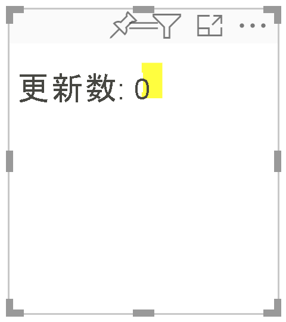
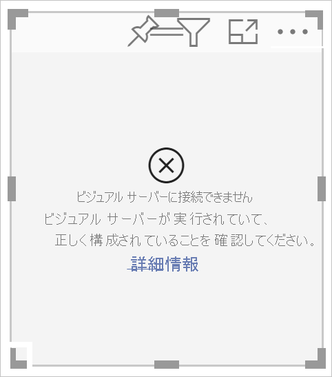
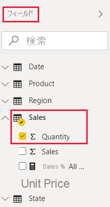
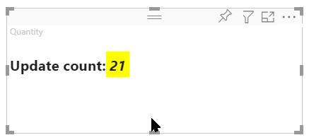

Power BI サービスで視覚化をテストするために、**US Sales Analysis** レポートを使用します。 このレポートを[ダウンロード](https://microsoft.github.io/PowerBI-visuals/docs/step-by-step-lab/images/US_Sales_Analysis.pbix)して、Power BI サービスにアップロードできます。

また、独自のレポートを使用して視覚化をテストすることもできます。

>[!NOTE]
>続ける前に、[視覚化開発者の設定を有効にしてある](../developer/visuals/environment-setup.md#set-up-power-bi-service-for-developing-a-visual)ことを確認してください。

1. [PowerBI.com](https://powerbi.microsoft.com/) にサインインし、**US Sales Analysis** レポートを開きます。

2. **[その他のオプション]**  >  **[編集]** を選択します。

    >[!div class="mx-imgBorder"]
    >![Power BI サービスでの [編集] オプションのスクリーンショット。](media/visual-tutorial-view/edit-report.png)

3. Power BI サービスのインターフェイスの下部にある **[新しいページ]** ボタンをクリックして、テスト用の新しいページを作成します。

    >[!div class="mx-imgBorder"]
    >![Power BI サービスでの [新しいページ] ボタンのスクリーンショット。](media/visual-tutorial-view/new-page.png)

4. **[視覚化]** ペインで、 **[開発者向けビジュアル]** を選択します。

    >[!div class="mx-imgBorder"]
    >![[視覚化] ペインの [開発者向けビジュアル] のスクリーンショット。](media/visual-tutorial-view/developer-visual.png)

    この視覚化は、コンピューターで実行しているカスタム視覚化を表わします。 [カスタム視覚化のデバッグ](../developer/visuals/environment-setup.md#set-up-power-bi-service-for-developing-a-visual)の設定が有効になっている場合にのみ使用できます。

5. 視覚化がレポート キャンバスに追加されたことを確認します。

    >[!div class="mx-imgBorder"]
    >

    これは、その update メソッドが呼び出された回数を表示する簡単な視覚化です。 この段階では、視覚化にはデータは取得されていません。

    >[!NOTE]
    >視覚化に接続エラー メッセージが表示される場合は、ブラウザーで新しいタブを開き、`https://localhost:8080/assets/status` に移動して、ブラウザーでこのアドレスを使用することを承認します。
    >
    >

6. 新しい視覚化が選択されている状態で、 **[フィールド]** ペインに移動し、**Sales** を選択して、**Quantity** を選択します。

    >[!div class="mx-imgBorder"]
    >

7. 視覚化がどのように応答するかをテストするには、そのサイズを変更し、視覚化のサイズを変更するたびに *Update count* の値が増えることを確認します。

    >[!div class="mx-imgBorder"]
    >