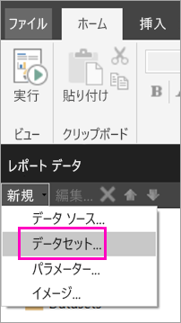
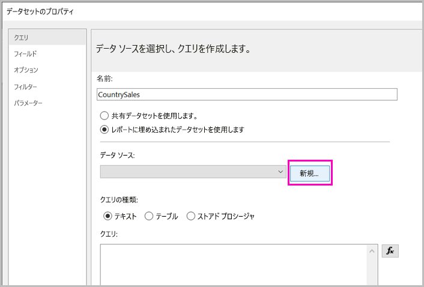
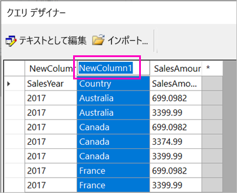
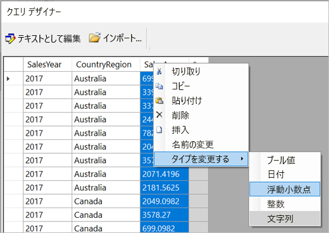
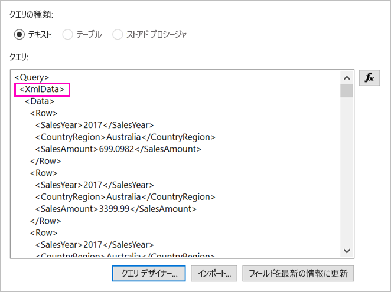

# <a name="enter-data-directly-in-a-paginated-report-in-report-builder---power-bi"></a>レポート ビルダーでページ分割されたレポートにデータを直接入力する - Power BI

[!INCLUDE [applies-to](../includes/applies-to.md)] [!INCLUDE [yes-service](../includes/yes-service.md)] [!INCLUDE [yes-paginated](../includes/yes-paginated.md)] [!INCLUDE [yes-premium](../includes/yes-premium.md)] [!INCLUDE [no-desktop](../includes/no-desktop.md)] 

この記事では、新しいバージョンの Microsoft Power BI レポート ビルダーに搭載された、埋め込みデータセットとして RDL レポートにデータを直接入力できる機能を紹介します。  この機能は Power BI Desktop によく似ています。 レポートのデータセットにデータを直接入力したり、Microsoft Excel など、別のプログラムから貼り付けたりできます。 データを入力してデータセットを作成したら、作成した他の埋め込みデータセットの場合と同じようにそれを利用できます。 また、複数のテーブルを追加したり、他のテーブルのフィルターとしてテーブルを利用したりできます。 この機能は特に、レポート パラメーターなど、レポートで場合によっては使用する必要がある、少量の固定データセットに便利です。
 
## <a name="prerequisites"></a>前提条件

- ページ分割されたレポートに直接データを入力するには、[Power BI レポート ビルダーをダウンロードしてインストール](https://aka.ms/pbireportbuilder)します。 
- ページ分割されたレポートを Power BI サービスに保存するには、[Power BI Pro アカウント](../fundamentals/service-self-service-signup-for-power-bi.md)または Premium Per User (PPU) ライセンス、および [Power BI Premium 容量](../admin/service-premium-what-is.md)のワークスペースへの書き込みアクセスが必要です。
- ページ分割されたレポートをレポート サーバーに保存するには、[RsReportServer.config ファイルを編集する](#upload-the-paginated-report-to-a-report-server)アクセス許可が必要です。

## <a name="create-a-data-source-and-dataset"></a>データ ソースとデータセットを作成する

レポート ビルダーをダウンロードし、インストールしたら、埋め込みのデータ ソースやデータセットをレポートに追加するときと同じワークフローを実行します。 次の手順で、 **[データ ソース]** の下に次の新しいオプションが表示されます: **[データの入力]** 。  このデータ ソースはレポートで 1 回だけ設定します。 その後、その 1 つのデータ ソースを使用し、入力したデータから複数のテーブルを個々のデータセットとして作成できます。

1. **[レポート データ]** ペインで、 **[新規作成]**  >  **[データセット]** を選択します。

    

1. **[データセットのプロパティ]** ダイアログ ボックスで **[レポートに埋め込まれたデータセットを使用する]** を選択します。

1. **[データ ソース]** の隣にある **[新規作成]** を選択します。

    

1. **[データ ソースのプロパティ]** ダイアログ ボックスで **[レポートに埋め込まれた接続を使用する]** を選択します。
2. **[接続の種類の選択]** ボックスで **[データの入力]**  >  **[OK]** の順に選択します。

    ![データ ソースの [データの入力] のスクリーンショット。](media/paginated-reports-enter-data/paginated-data-source-properties-enter-data.png)

1. **[データセットのプロパティ]** ダイアログ ボックスに戻り、 **[クエリ デザイナー]** を選択します。
2. **[クエリ デザイナー]** ウィンドウで右クリックし、テーブルにデータを貼り付けます。

    ![クエリ デザイナーの [データの入力] のスクリーンショット。](media/paginated-reports-enter-data/paginated-enter-data.png)

1. 列名を設定するには、各 **NewColumn** をダブルクリックし、列名を入力します。

    

1. 元のデータからの列見出しが最初の行に含まれる場合、右クリックして削除します。
    
9. 既定では、各列のデータ型は文字列です。 データ型を変更するには、列ヘッダーを右クリックして **[型の変更]** を選択し、日付や浮動小数点など、別のデータ型に設定します。

    

1. テーブルの作成が完了したら、 **[OK]** を選択します。  

    生成されたクエリは、XML データ ソースの場合と同じになります。 実際には、データ プロバイダーとして XML を使用しています。  このシナリオも有効にするために転用しています。

    

12. **[データセットのプロパティ]** ダイアログ ボックスで、 **[OK]** を選択します。

13. **[レポート データ]** ウィンドウにデータ ソースやデータセットが表示されます。

    ![[レポート データ] ペインのデータセットのスクリーンショット。](media/paginated-reports-enter-data/paginated-report-data-pane.png)

レポートのデータ視覚化の基礎として自分のデータセットを使用できます。 別のデータセットを追加し、それに対して同じデータ ソースを使用することもできます。

## <a name="design-the-report"></a>レポートのデザイン

データ ソースとデータセットを用意できたら、レポートを作成する準備は完了です。 次の手順では、前のセクションのデータに基づいて簡単なレポートを作成します。

1. **[挿入]** メニューで **[テーブル]**  >  **[テーブル ウィザード]** の順に選択します。

    :::image type="content" source="media/paginated-reports-enter-data/paginated-table-wizard.png" alt-text="[テーブル ウィザード] オプションが選択されたスクリーンショット。":::

1. 作成したデータセット、 **[次へ]** の順に選択します。

    :::image type="content" source="media/paginated-reports-enter-data/paginated-choose-dataset.png" alt-text="[データセットの選択] ダイアログのスクリーンショット。":::

2.  [フィールドの配置] ページで、グループ化するフィールドを **[使用できるフィールド]** ボックスから **[行グループ]** ボックスにドラッグします。 この例は次のとおりです。

    - CountryRegion
    - SalesYear

3.  集計するフィールドを **[使用できるフィールド]** ボックスから **[値]** ボックスにドラッグします。 この例は次のとおりです。

    - SalesAmount

    レポート ビルダーの既定では、 **[値]** ボックスのフィールドの合計が計算されますが、別の集計を選択することもできます。

    :::image type="content" source="media/paginated-reports-enter-data/paginated-select-aggregation.png" alt-text="選択できるさまざまな集計のスクリーンショット。":::
 
1. **[次へ]** を選択します。
4.  **[レイアウトの選択]** ページでは、すべての設定を既定のままにしますが、 **[グループの展開/折りたたみ]** はオフにします。 一般にグループの展開と折りたたみは優れた機能ですが、今回はすべてのデータを表示します。

5.  **[次へ]**  >  **[完了]** の順に選択します。 テーブルがデザイン サーフェイスに表示されます。

    :::image type="content" source="media/paginated-reports-enter-data/paginated-design-view-matrix.png" alt-text="デザイン ビューのレポートのスクリーンショット。":::

### <a name="run-the-report"></a>レポートを実行する

実際の値を確認してレポートをプレビューするには、それを実行します。

1. **[ホーム]** リボンの **[実行]** を選択します。

    :::image type="content" source="media/paginated-reports-enter-data/paginated-run-report.png" alt-text="[ホーム] リボンの [実行] が選択されたスクリーンショット。":::

    これで、値が表示されるようになります。 マトリックスには、デザイン ビューで表示されていたものよりも多くの行があります。  ローカル コンピューターに保存したり、サービスに発行したりする前に、ページの書式を設定するか、既定の設定を使用することを決定できます。

1. レポートを印刷したときの外観を確認するには、 **[印刷レイアウト]** を選択します。

    :::image type="content" source="media/paginated-reports-enter-data/paginated-select-print.png" alt-text="[印刷レイアウト] が選択されたスクリーンショット。":::

    これで印刷ページの見た目を確認できます。

    :::image type="content" source="media/paginated-reports-enter-data/paginated-print-layout.png" alt-text="印刷レイアウト ビューのレポートのスクリーンショット。":::

## <a name="upload-the-paginated-report-to-the-power-bi-service"></a>ページ分割されたレポートを Power BI サービスにアップロードする

これで Power BI サービスでページ分割されたレポートがサポートされたので、自分のページ分割されたレポートを Premium 容量にアップロードできます。 詳細については、「[ページ分割されたレポートをアップロードする](paginated-reports-save-to-power-bi-service.md)」を参照してください。

## <a name="upload-the-paginated-report-to-a-report-server"></a>ページ分割されたレポートをレポート サーバーにアップロードする

ページ分割されたレポートは、Power BI Report Server や SQL Server Reporting Services 2016 または 2017 のレポート サーバーにアップロードすることもできます。 アップロードする前に、追加のデータ拡張機能として RsReportServer.config に次の項目を追加する必要があります。 問題が発生した場合に備え、変更前に RsReportServer.config ファイルのバックアップを作成してください。

```xml
<Extension Name="ENTERDATA" Type="Microsoft.ReportingServices.DataExtensions.XmlDPConnection,Microsoft.ReportingServices.DataExtensions">
    <Configuration>
        <ConfigName>ENTERDATA</ConfigName>
    </Configuration>
</Extension>
```

編集後、構成ファイルのデータ プロバイダー一覧は次のようになります。


作業はここまでです。これで、この新機能を使用するレポートをレポート サーバーに公開できます。

## <a name="next-steps"></a>次の手順

- [Power BI Premium のページ分割されたレポートとは](paginated-reports-report-builder-power-bi.md)
- [Power BI Report Server とは](../report-server/get-started.md)
